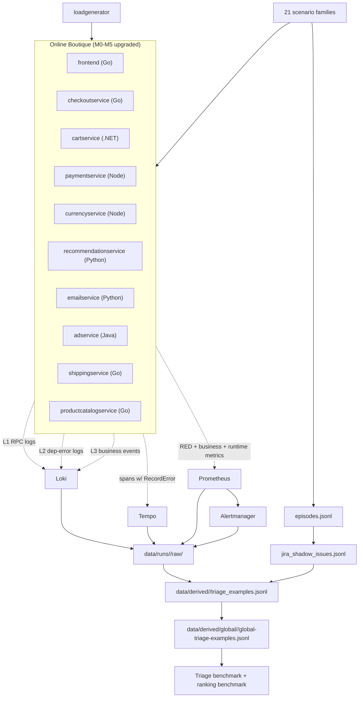

# Jira And Logs Research Lab

This repository builds a research-grade dataset and evaluation pipeline for
a Jira-aware observability product.

The short version:

> We run a realistic microservices application, create controlled incidents,
> collect logs, metrics, traces, and alerts, generate Jira-like incident
> records, then test whether a triage model can decide which telemetry windows
> represent real operational problems and rank the right historical Jira issue
> against them.

The product MVP is a **triage classifier** that answers, for any given
telemetry window: *should this be ticketed, is it borderline, or is it
noise?* — grounded by retrieval against a Jira memory corpus. Ranking
(matching telemetry episodes to a Jira query) is the secondary task.

If you are new to the project, start with:

```text
docs/research-project-onboarding-guide.md
```

---

## ⏱ Current state snapshot (2026-05-25)

| Item | Value |
| --- | --- |
| Active corpus | **`dataset-v5-large.json`** (100 runs, 21 scenario families) — staged, not yet collected |
| Previously collected | `dataset-v4-large` (40 runs, 13 families, ~3,700 windows) |
| Primary ML task | Triage classification (`ticket_worthy` / `borderline` / `noise`) |
| Secondary tasks | Jira memory retrieval, ranking, orphan-fault detection |
| Application | Online Boutique microservices on kind (12 services) |
| Telemetry layer | **M0–M5 upgraded** (L1 RPC logs, L2 dep-error logs, L3 business events, M3.1 span errors, M4 RED + business + runtime metrics) |
| Scenario families | 21 (13 v4 + 8 new D1) |
| Cluster status | jira-telemetry-lab kind cluster on this VM with all M0–M5 instrumented services live |
| Next run | Fresh VM v5-large per `docs/gcp-production-dataset-vm-runbook.md` |

---

## What changed recently (session log)

The most recent block of work upgraded the lab from "v4 telemetry, ranking
task" to "v5 telemetry, triage task" so the dataset is closer to what a
real on-call team sees and what a production triage product would need to
ingest.

**Telemetry layer rewrite (Phases M0–M5)**

| Phase | What it adds | Status |
| --- | --- | --- |
| M0 | Foundation decisions: shared interceptors per language, hard-fork of microservices-demo-google, image registry, OTel collector + Loki sizing, fidelity disclosure | ✅ done |
| M1 | OTel parity: cartservice (.NET), adservice (Java), shippingservice (Go) brought up to the same trace coverage as the other Go services | ✅ done |
| M2 | Structured logging: L1 (one JSON log per RPC), L2 (dep-error logs at every gRPC client + Redis boundary), L3 (4 business events: cart_size_changed, order_placed, payment_charged, recommendation_returned) | ✅ done |
| M3 | Trace enrichment: `RecordError`/`SetStatus(Error)` on every error path across 5 languages; manual child spans with semantic-convention attrs; sampling divergence documented | ✅ done |
| M4 | Metrics: `/metrics` endpoint on every service with RED metrics, per-dependency client metrics, 5 business counters, runtime gauges (.NET/Go/Python/Node) | ✅ done |
| M5 | Validation: M5.1 cartservice gate PASSED (3.0× lift in trace_error_count on cart-redis); M5.2a fleet rollout live; M5.2b 9-run pilot resumable; M5.2c–e validators passing on post-rollout data | mostly done |

Full per-task detail: `microservice-changes.md` (the *why*) and
`microservice-changes-todo.md` (the *what got done*).

**8 new scenario families (Phase D1)**

| Family | Label intent | Scenarios |
| --- | --- | --- |
| `post-deploy-churn` | noise | deploy-rolling-cart-graceful, deploy-rolling-frontend-graceful, deploy-canary-rollback-quick |
| `recovered-in-window` | borderline | redis-blip-30s-recovery, paymentservice-flake-recovers, currency-timeout-recovers |
| `single-pod-restart-healthy-replication` | noise | frontend-1-of-3-restart, cartservice-1-of-3-restart |
| `third-party-blip` | borderline | currency-api-blip-major, recommendation-model-blip-minor |
| `scheduled-job-spike` | noise | analytics-job-burst, cleanup-job-burst |
| `latency-near-miss-partial-recovery` | borderline | productcatalog-half-degraded, currency-partial-latency |
| `flapping-pod` | ticket_worthy | cartservice-flap-ticket-worthy, paymentservice-flap-ticket-worthy |
| `slow-leak-saturation` | ticket_worthy (long-running) | cartservice-memory-leak-ticket-worthy, paymentservice-connection-leak-ticket-worthy |

These bring v5-large from 13 families to **21 families** — the model now
has to learn the boundaries between superficially-similar shapes (e.g.
graceful deploy churn vs cartservice-restart-major).

**v5-large prep (production-readiness work)**

- **Kustomize image pins** added to `deploy/research-lab/online-boutique/kustomization.yaml` so an `apply -k` won't silently revert to upstream `v0.10.5` images (which lack all M0–M5 instrumentation).
- **`dataset-v5-large.json` corpus manifest** authored: 100 runs across 6 plans (8 control + 30 compact-a + 30 compact-b + 12 new-families-a + 12 new-families-b + 8 long-running).
- **3 new run plans** authored: `dataset-v5-new-families-a.json`, `dataset-v5-new-families-b.json`, `dataset-v5-long-running.json`.
- **Loki PVC** persisted at 50 GiB (binding target 120 GiB on a 1 TB VM); collector bumped to 2 replicas, 2 Gi memory limit, 16k batch size.
- **ServiceMonitor** for application-level `/metrics` scrape: `deploy/research-lab/observability/online-boutique-servicemonitor.yaml`.
- **Export-script timeout** bumped 45s → 180s to survive the cart-redis active_fault burst windows.
- **Runbook rewrite**: `docs/gcp-production-dataset-vm-runbook.md` is now end-to-end for a fresh-VM v5-large run including image build phase, ServiceMonitor application, smoke test, and resume-on-failure.
- **Validators added**: `validate_l1_l2_telemetry.py` (D13.14d cross-check), `validate_global_family_coverage.py` (D0.1 per-family minimum windows), `src/adjudication/` (D0.2 borderline review tooling).

**Smoke validation (2026-05-25)**: full `dataset-v5-new-families-a` plan ran
end-to-end against the upgraded telemetry — 12 episodes, 75 windows, 5 Jira
shadow issues, derived ranking dataset built with **recall@3 = 1.0** across
5 queries.

---

## Why this project exists

Modern engineering teams already collect a huge amount of telemetry:

- logs,
- metrics,
- distributed traces,
- alerts,
- Kubernetes metadata.

They also keep important operational knowledge in Jira:

- incidents,
- bugs,
- reliability tasks,
- affected services,
- priorities,
- investigation comments,
- fixes and resolution notes.

The problem is that these two worlds are usually not connected well.
Telemetry systems tell us what happened in the system. Jira tells us
what engineers later decided was important enough to track. If we can
link them, Jira history becomes useful supervision for ranking alerts,
reducing noise, and speeding up triage.

The research questions are:

> Can historical Jira-like issue data help us identify which telemetry
> patterns represent real operational problems?

> Can a triage model trained on lab telemetry + shadow Jira generalise
> to a real on-call queue?

The product question is:

> Can we build an internal/commercial application that decides
> ticket-worthy vs noise vs borderline, retrieves the most relevant
> historical Jira issue, and shows evidence in a way an engineering
> team can trust?

---

## What we are building

A Jira-aware observability **triage layer**.

For MVP v1, the system should:

1. Read telemetry evidence (logs, metrics, traces, alerts, Kubernetes state) for a given window.
2. Decide whether the window is `ticket_worthy`, `borderline`, or `noise`.
3. Retrieve the closest historical Jira issue(s) from a memory corpus to ground the decision.
4. Show enough evidence (which features fired, which Jira memories matched) to debug why the decision was right or wrong.
5. Report per-family and per-severity metrics so we can see where the model is strong and where it's weak.

Later phases can add:

- human-approved Jira issue creation,
- suggested Jira fields,
- engineer feedback buttons,
- orphan-fault detection (ticket-worthy windows with no matching memory),
- production integrations with real Jira Cloud and observability systems.

The historical ranking task (Jira issue → episode) is kept as a
secondary benchmark, not the primary product surface.

---

## Why we generate our own dataset

The dataset is the hardest part of this project.

Public Jira datasets usually contain issue text and metadata, but they
do not include the exact logs, metrics, traces, and alerts that caused
those issues.

Public log or observability datasets often contain telemetry, but they
do not include linked Jira issues written by engineers.

For this reason, we create a controlled lab dataset where both sides
exist:

- the telemetry side: logs, metrics, traces, alerts, and Kubernetes state,
- the Jira side: production-shaped shadow Jira issues linked to the telemetry.

This lets us test the product idea before needing private company Jira
data.

---

## Lab architecture

The lab runs Google's Online Boutique microservices demo on Kubernetes,
**heavily modified** with the M0–M5 telemetry upgrade.

Two Kubernetes namespaces:

| Namespace | Purpose |
| --- | --- |
| `online-boutique-research` | Online Boutique application (12 services) + load generator. Every modified service runs a `v5.0.0-otel-pilot*` image with M0–M5 instrumentation. |
| `observability` | Prometheus + Alertmanager + Loki (50 GiB PVC) + Tempo + Grafana + Alloy + OpenTelemetry Collector (2 replicas, 2 Gi memory). |



---

## Important terms

| Term | Meaning |
| --- | --- |
| Dataset run | One full collection pass with a stable `DATASET_RUN_ID`. |
| Scenario | A controlled behavior, e.g. `baseline-normal-traffic` or `cart-redis-degradation-critical`. |
| Scenario family | A semantic grouping of scenarios with the same fault shape — there are **21** in v5 (e.g. `cart-redis`, `post-deploy-churn`). |
| Incident episode | One labelled operational episode produced by running a scenario. |
| Telemetry window | A time window around an episode: `pre_fault_baseline`, `active_fault`, `recovery_window` for fault scenarios; `observation_window` for baselines. |
| Triage label | Per-window classification: `ticket_worthy`, `borderline`, or `noise`. |
| `is_hard_case` | Per-window flag for windows where reasonable engineers disagree (target: ≥15% of windows in v5). |
| Shadow Jira issue | A Jira-shaped JSON record generated for an incident episode. Not written to real Jira. |
| Jira memory corpus | The aggregate of all shadow Jira issues across all runs in a dataset, used for retrieval supervision. |
| Ranking example | One Jira issue paired with one candidate episode, labelled relevant or not. (Secondary task.) |
| Derived dataset | ML-ready CSV/JSONL files built from raw runs. |
| Aggregate evaluation | A combined evaluation across multiple derived runs. |
| L1 log | Per-RPC structured JSON log emitted by every service via the M2.1 shared interceptor. |
| L2 log | Structured `dep_error` log emitted at every dependency boundary (gRPC client call, Redis op) on failure. |
| L3 log | Generic business event (e.g. `order_placed`, `payment_charged`). |
| RED metrics | Rate / Errors / Duration metrics per RPC (`rpc_server_requests_total`, etc.). |
| Run plan | A JSON file under `deploy/research-lab/run-plans/` listing the scenarios for one dataset run. |
| Corpus manifest | A JSON file under `deploy/research-lab/corpora/` listing which run plans to repeat and how many times. |

---

## Dataset versions

| Version | Status | Runs | Families | Total windows | Notes |
| --- | --- | ---: | ---: | ---: | --- |
| v2 / v2.1 | superseded | 4 | ~10 | 312 | Original ranking-task era |
| v3 compact | superseded | 6 | 13 | 576 | First family-diverse corpus |
| **v4-large** | **collected** | **40** | **13** | **~3,700** | Canonical triage corpus, no M0–M5 telemetry |
| **v5-pilot** | partial | 9 | 13 | ~700 (target) | 9-run validator on M0–M5; paused mid-run, resumable |
| **v5-large** | **staged, not yet collected** | **100** | **21** | **~8,000 (projected)** | The "next" corpus — runs on M0–M5 telemetry with 8 new D1 families |

Older v2/v3 metric tables are preserved at the bottom of this README for
historical context. **For new work, treat v4-large as the baseline and
v5-large as the target.**

---

## M0–M5 telemetry upgrade (background)

The original Online Boutique demo emits minimal telemetry — basic
gRPC server spans on most services, no application-level metrics, no
structured logs, no error enrichment on spans. To bring it close to
what a real production deployment would emit (so the dataset is
actually useful for training a production triage model), we wrote a
5-phase upgrade. The phases are layered: M2 depends on M1, M3 depends
on M2, etc.

### M0 — Foundation decisions

Six binding decisions recorded in
`docs/telemetry-implementation-decisions.md`:

1. **Shared interceptor placement**: per-language libraries under `microservices-demo-google/src/_shared-<lang>/`.
2. **Upstream divergence policy**: hard-fork at `17YuvrajSehgal/microservices-demo-google`, quarterly cherry-pick from Google.
3. **Image registry**: kind-local for dev, Google Artifact Registry for cloud.
4. **OTel collector capacity**: 2 replicas, cpu=2/mem=2Gi limits, `send_batch_size=8192`.
5. **Loki sizing**: 50 GiB PVC (target 120 GiB on a 1 TB VM); 168h retention.
6. **Production fidelity disclosure**: 9 known divergences (100% sampling, single-cluster, no real PII, synthetic traffic, single fault per run, shadow Jira, no alert-fatigue baseline, no deploy correlation, no GPU services) — published as the v5 dataset README disclaimer.

### M1 — OTel parity for laggard services

Three services were missing or partial in trace coverage:

- **cartservice (.NET)** — added `OpenTelemetry.Extensions.Hosting` + `Instrumentation.AspNetCore` + `Instrumentation.GrpcNetClient` + `Instrumentation.StackExchangeRedis` (the highest-leverage single addition: it gives per-Redis-operation child spans).
- **adservice (Java)** — added the OpenTelemetry Java agent (zero application code changes).
- **shippingservice (Go)** — added `otelgrpc` server + client interceptors to match the other Go services.

M5.1 gate: collecting `cart-redis-degradation-critical` against the new
cartservice image showed **3.0× lift in `trace_error_count`** on
active_fault windows (was 91.0 mean, became 277.5 mean) — confirming
that the upgrade actually moves the dataset signal in the expected
direction.

### M2 — Structured logging (L1 + L2 + L3)

| Layer | What it logs | Where |
| --- | --- | --- |
| **L1** | One structured JSON log per RPC (server + client) with `{trace_id, span_id, method, peer_service, latency_ms, status_code, err_class, kind}`. | Shared interceptors per language under `src/_shared-{go,dotnet,node,python}/`. Wired into every modified service. |
| **L2** | Structured `dep_error` log on dependency-call failure with `{dep, op, err_class, retry_attempt, trace_id, span_id}`. | cartservice → Redis (3 ops); checkoutservice → 6 downstream gRPC; frontend → 10 downstream gRPC; recommendationservice → productcatalog. |
| **L3** | Generic business events: `cart_size_changed`, `order_placed`, `payment_charged`, `recommendation_returned`. | One per service at the natural code site. |

### M3 — Trace enrichment

- **M3.1** `RecordError` + `SetStatus(Error)` on every error-returning handler across 5 languages.
- **M3.2** Manual child spans for dependency calls with semantic-convention attributes (`db.system`, `db.operation`, `peer.service`, `rpc.method`, `app.order_item_count_bucket`).
- **M3.3** `span.AddEvent("catalog.reload")` at the one natural state-transition site (productcatalog hot-reload). Other retry/fallback/circuit-breaker events deferred — Online Boutique services don't use those patterns today.
- **M3.4** 100% sampling divergence documented in `docs/dataset-v4-plan.md` and the M0.6 disclosure.

### M4 — Metrics

| Sub-phase | What lands |
| --- | --- |
| **M4.1** | `/metrics` endpoint on every service (port 9100 for most, 9464 for adservice via OTel Java agent). |
| **M4.2** | RED metrics per RPC handler (`rpc_server_duration_seconds`, `rpc_server_requests_total`) via shared interceptors. |
| **M4.3** | Per-dependency client metrics (`rpc_client_duration_seconds`, `rpc_client_errors_total`). |
| **M4.4** | 5 business counters: `payments_total{card_type,result}`, `cart_operations_total{op,result}`, `orders_placed_total`, `recommendations_served_total`, `catalog_lookups_total{result}`. |
| **M4.5** | Runtime gauges: `go_*` + `process_*` (Go default), `process.runtime.dotnet.*` (.NET via `AddRuntimeInstrumentation`), `python_gc_*` + `process_*` (Python default), `process.runtime.nodejs.*` (Node via `@opentelemetry/host-metrics`), `process.runtime.jvm.*` (Java via OTel agent). |
| **M4.1f** | A `ServiceMonitor` in `deploy/research-lab/observability/online-boutique-servicemonitor.yaml` plus a headless `online-boutique-metrics` Service so Prometheus actually scrapes the above. |

### M5 — Validation

- **M5.1**: cartservice-only gate — PASSED.
- **M5.2a**: fleet rollout on local kind cluster — done.
- **M5.2b**: 9-run v5-pilot corpus — paused, resumable via the command in the runbook.
- **M5.2c**: collector + Loki sizing under load — collector HELD, Loki INSUFFICIENT pre-PVC, now resolved.
- **M5.2d**: L1/L2/Tempo cross-check — fleet L1 trace_id coverage 96.7%, cartservice 100%.
- **M5.2e**: leakage canary — PASS on r04-followup, 0 fails.

---

## Production-realism discipline (bias-avoidance)

The entire research story depends on lab-vs-production fidelity. The
non-negotiable rules from `microservice-changes.md`:

- **Don't** add log fields, span attributes, or metric labels that name our scenarios (`scenario.id`, `fault.injected`, `expected_severity`).
- **Don't** label metrics by anything from `scripts/research-lab/triage_labels.py` (no `scenario_family`, `fault_type`).
- **Don't** propagate `dataset_run_id` through application baggage.
- **Don't** include any field listed as eval-only in `docs/triage-task-contract.md` "Field Policy".
- **Do** add only what a real SaaS company in 2026 would emit anyway.

Every change in M0–M5 was checked against these rules. Violating them
would inflate model scores without representing real on-call
conditions.

---

## Triage task vs ranking task

There are now three benchmark tracks defined in
`deploy/research-lab/corpora/dataset-v5-large.json`:

| Track | Question | Status |
| --- | --- | --- |
| `triage_classification` (**primary**) | Classify each telemetry window as `ticket_worthy` / `borderline` / `noise`. | Active development |
| `triage_with_memory_retrieval` | Same classification, but grounded in retrieval against the Jira memory corpus. | Active development |
| `ranking_retrospective` | Given a Jira issue, rank candidate telemetry episodes. | Maintained as a legacy benchmark |
| `orphan_fault_detection` (Phase D12) | Detect ticket-worthy windows that have NO paired Jira shadow row. | Planned |
| `borderline_label_calibration` | Measure inter-rater reliability on borderline windows. | Planned |

The full contract for the triage task — label space, source policy,
metrics, splits — lives in `docs/triage-task-contract.md`.

---

## Dataset collection flow

Each dataset run follows the same five-step flow.

### 1. Start a dataset run

A run begins with a manifest at:

```text
data/runs/<DATASET_RUN_ID>/manifest.json
```

It records the run id, namespaces, cluster context, application
metadata, scenario metadata, git SHA, builder hashes, and timestamps.

### 2. Run traffic and scenarios

Each run executes a list of scenarios from a JSON run plan. The
mapping for v5-large:

| Plan | Scenarios per run | Used in v5-large |
| --- | ---: | ---: |
| `control-baseline-only.json` | 6 baselines | 8 runs |
| `dataset-v3-diverse-compact-a.json` | 10 (latency / outage / restart / Redis / config / near-miss) | 30 runs |
| `dataset-v3-diverse-compact-b.json` | 13 (service-diverse outages, frontend/Redis restarts, intermittent failure, noisy traffic) | 30 runs |
| `dataset-v5-new-families-a.json` (NEW) | 12 (D1.1 post-deploy-churn, D1.2 recovered-in-window, D1.3 single-pod-restart, D1.4 third-party-blip) | 12 runs |
| `dataset-v5-new-families-b.json` (NEW) | 8 (D1.5 scheduled-job-spike, D1.6 latency-partial-recovery, D1.7 flapping-pod) | 12 runs |
| `dataset-v5-long-running.json` (NEW) | 4 (D1.8 slow-leak-saturation, 10-min episodes) | 8 runs |

### 3. Create telemetry windows

Each scenario is split into labelled time windows:

- Fault scenarios: `pre_fault_baseline`, `active_fault`, `recovery_window`.
- Baseline scenarios: `observation_window`.

Each window is written to:

```text
data/runs/<DATASET_RUN_ID>/telemetry_windows.jsonl
```

### 4. Export raw telemetry

The exporter collects per-service evidence for every window:

| Evidence | Source | Output |
| --- | --- | --- |
| Logs | Loki (PVC-backed) | `raw/loki/*.json` |
| Metrics | Prometheus | `raw/prometheus/*.json` |
| Traces | Tempo | `raw/tempo/*.json` |
| Alerts | Alertmanager + Prometheus `ALERTS` query-range | `alerts.jsonl` |
| Kubernetes | Pod events, restart counts, rollout state, readiness | `raw/kubernetes/*.json` |

Raw evidence is immutable after validation; derived features can be
rebuilt.

### 5. Generate shadow Jira issues

For episodes where `jira_candidate=true`, the project creates
Jira-shaped JSON records in:

```text
data/runs/<DATASET_RUN_ID>/jira_shadow_issues.jsonl
```

Each record has summary, description, issue type, priority, components,
labels, lifecycle history, comments, linked telemetry windows, linked
alerts, linked traces.

---

## Raw dataset layout

```text
data/runs/<DATASET_RUN_ID>/
  manifest.json                 # run metadata + git SHA + tool versions
  episodes.jsonl                # one row per scenario invocation
  telemetry_windows.jsonl       # one row per labelled time window
  alerts.jsonl                  # Alertmanager + ALERTS history
  jira_shadow_issues.jsonl      # generated Jira-shaped rows
  raw/
    loki/                       # per-window per-service log exports + padded context
    prometheus/                 # metric scrapes
    tempo/                      # trace exports
    kubernetes/                 # pod / deployment / event snapshots
  summaries/
    run-summary.md
    data-quality-report.md
    feature-distribution.md
```

JSON schemas live under `schemas/`.

---

## From raw data to triage data

After a raw run is collected, `build-triage-dataset.ps1` produces:

```text
data/derived/<DATASET_RUN_ID>/
  triage_examples.jsonl         # one row per window with features + label
  triage_window_labels.jsonl    # label provenance (scenario_authored / derived / human_adjudicated)
  feature-distribution.md       # per-feature distribution sanity check
  manifest.json                 # builder version + raw file hashes
```

After all runs in a corpus complete, `build-global-triage-dataset.ps1`
combines them into:

```text
data/derived/global/<GLOBAL_DATASET_ID>/
  global-triage-examples.jsonl  # all windows across all runs
  jira-memory-corpus.jsonl      # all shadow Jira issues, deduped, time-ordered
  triage-split-manifest.json    # train/validation/test by scenario family
  benchmarks/<BENCHMARK_ID>/
    benchmark-report.md         # PR-AUC, ROC-AUC, ECE, P@FPR=1%/5%, per-family
```

The legacy ranking-dataset path is still maintained:

```text
data/derived/<DATASET_RUN_ID>/ranking_examples.jsonl
data/derived/global/<id>/global-ranking-examples.jsonl
```

For v5 work, the triage path is primary.

---

## How to rebuild the lab (quick reference)

For a full fresh-VM walkthrough see
**`docs/gcp-production-dataset-vm-runbook.md`** (the authoritative
runbook for v5-large collection).

For a local rebuild:

```bash
cd /path/to/JiraAndLogs

# 1. Pre-flight
pwsh -NoProfile -ExecutionPolicy Bypass -File scripts/research-lab/check-prereqs.ps1

# 2. kind cluster
pwsh -NoProfile -ExecutionPolicy Bypass -File scripts/research-lab/create-kind-cluster.ps1
kubectl config use-context kind-jira-telemetry-lab

# 3. Observability (Loki PVC + 2× OTel collector replicas applied automatically from values files)
pwsh -NoProfile -ExecutionPolicy Bypass -File scripts/research-lab/install-observability.ps1
kubectl wait --for=condition=Ready pods --all -n observability --timeout=900s

# 4. ServiceMonitor for app-level /metrics scrape (M4.1f)
kubectl apply -f deploy/research-lab/observability/online-boutique-servicemonitor.yaml

# 5. Build M0-M5 telemetry-upgraded images (~20-30 min on first build)
cd microservices-demo-google/src
docker build -t cartservice:v5.0.0-otel-pilot3 -f cartservice/src/Dockerfile .
docker build -t paymentservice:v5.0.0-otel-pilot2 -f paymentservice/Dockerfile .
docker build -t currencyservice:v5.0.0-otel-pilot2 -f currencyservice/Dockerfile .
docker build -t recommendationservice:v5.0.0-otel-pilot2 -f recommendationservice/Dockerfile .
docker build -t emailservice:v5.0.0-otel-pilot4 -f emailservice/Dockerfile .
docker build -t frontend:v5.0.0-otel-pilot -f frontend/Dockerfile .
docker build -t checkoutservice:v5.0.0-otel-pilot -f checkoutservice/Dockerfile .
docker build -t productcatalogservice:v5.0.0-otel-pilot -f productcatalogservice/Dockerfile .
docker build -t shippingservice:v5.0.0-otel-pilot -f shippingservice/Dockerfile .
docker build -t adservice:v5.0.0-otel-pilot -f adservice/Dockerfile .
cd ../..

# 6. Load into kind
for img in cartservice:v5.0.0-otel-pilot3 paymentservice:v5.0.0-otel-pilot2 \
           currencyservice:v5.0.0-otel-pilot2 recommendationservice:v5.0.0-otel-pilot2 \
           emailservice:v5.0.0-otel-pilot4 frontend:v5.0.0-otel-pilot \
           checkoutservice:v5.0.0-otel-pilot productcatalogservice:v5.0.0-otel-pilot \
           shippingservice:v5.0.0-otel-pilot adservice:v5.0.0-otel-pilot; do
    kind load docker-image "$img" --name jira-telemetry-lab
done

# 7. Deploy Online Boutique (kustomize pins the images above so apply -k won't revert to v0.10.5)
pwsh -NoProfile -ExecutionPolicy Bypass -File scripts/research-lab/apply-online-boutique.ps1
kubectl wait --for=condition=Ready pods --all -n online-boutique-research --timeout=900s
```

---

## How to run a dataset collection

**Smoke test against the new D1 families** (~60-90 min, validates the
upgraded telemetry end-to-end):

```bash
pwsh -NoProfile -ExecutionPolicy Bypass -File scripts/research-lab/collect-dataset-plan.ps1 \
  -DatasetRunId "smoke-$(date -u +%Y%m%dT%H%M%SZ)" \
  -PlanFile "deploy/research-lab/run-plans/dataset-v5-new-families-a.json" \
  -PythonExe python3 \
  -ForceNewRun \
  -BuildDerived \
  -PostWindowSeconds 30
```

Expected outcome: 12 episodes, 75 windows, 5 Jira shadow issues,
derived ranking dataset recall@3 = 1.0.

**Preview the v5-large corpus** (100 runs, ~4-5 days unattended):

```bash
pwsh -NoProfile -ExecutionPolicy Bypass -File scripts/research-lab/collect-dataset-corpus.ps1 \
  -CorpusFile "deploy/research-lab/corpora/dataset-v5-large.json" \
  -DatasetRunPrefix "2026-05-25-dataset-v5-large" \
  -PythonExe python3 \
  -PlanOnly
```

**Launch the v5-large collection** (use a fresh VM per the runbook; do
NOT run on a developer laptop):

```bash
tmux new -s v5-large
pwsh -NoProfile -ExecutionPolicy Bypass -File scripts/research-lab/collect-dataset-corpus.ps1 \
  -CorpusFile "deploy/research-lab/corpora/dataset-v5-large.json" \
  -DatasetRunPrefix "2026-05-25-dataset-v5-large" \
  -GlobalDatasetId "2026-05-25-dataset-v5-large-global" \
  -PythonExe python3 \
  -Quick \
  -BuildTriage \
  -HaltOnValidationFail \
  -SkipDerivedBuild \
  -SkipAggregateBuild \
  2>&1 | tee logs/2026-05-25-dataset-v5-large-corpus.log
```

Resume after interruption: re-run the exact same command (completed
runs are detected by `manifest.json` and skipped automatically).

**Collect v4-large instead** (40 runs, ~24-30 hours, no M0–M5 needed):

```bash
pwsh -NoProfile -ExecutionPolicy Bypass -File scripts/research-lab/collect-dataset-corpus.ps1 \
  -CorpusFile "deploy/research-lab/corpora/dataset-v4-large.json" \
  -DatasetRunPrefix "2026-05-22-dataset-v4-large" \
  -GlobalDatasetId "2026-05-22-dataset-v4-large-global" \
  -PythonExe python3 \
  -Quick -BuildTriage -HaltOnValidationFail \
  -SkipDerivedBuild -SkipAggregateBuild \
  2>&1 | tee logs/2026-05-22-dataset-v4-large-corpus.log
```

---

## How to run the triage benchmark

After the global triage dataset is built:

```bash
pwsh -NoProfile -ExecutionPolicy Bypass -File scripts/research-lab/run-triage-benchmark.ps1 \
  -GlobalDatasetId "2026-05-25-dataset-v5-large-global" \
  -BenchmarkId "triage-v5-baseline" \
  -PythonExe python3 \
  -Force
```

Reports headline PR-AUC, ROC-AUC, ECE, per-family stratified metrics,
leave-one-family-out macro metrics, P@FPR=1%/5% operating points, and
feature weights for inspection.

The legacy ranking benchmark (kept for backward compatibility):

```bash
pwsh -NoProfile -ExecutionPolicy Bypass -File scripts/research-lab/run-global-pipeline-benchmark.ps1 \
  -GlobalDatasetId "2026-05-25-dataset-v5-large-global" \
  -BenchmarkId "ranking-v5-baseline" \
  -Force
```

---

## Repository map

| Path | Purpose |
| --- | --- |
| `microservice-changes.md` | The *why* of the M0–M5 telemetry upgrade |
| `microservice-changes-todo.md` | The *what got done* — per-task status with file:line evidence |
| `dataset-todo.md` | Dataset expansion plan (v5 phases + D13 telemetry integration) |
| `todo.md` | ML/AI pipeline roadmap |
| `docs/triage-task-contract.md` | Canonical contract for the triage task (label space, metrics, splits) |
| `docs/dataset-v4-plan.md` | v4-large dataset specification |
| `docs/telemetry-implementation-decisions.md` | M0 binding decisions for the telemetry upgrade |
| `docs/gcp-production-dataset-vm-runbook.md` | **End-to-end runbook for fresh-VM v5-large collection** |
| `docs/instrumentation-gaps-and-next-steps.md` | What still needs improvement after M0–M5 |
| `docs/research-project-onboarding-guide.md` | Plain-language onboarding for new contributors |
| `docs/jira-shadow-issue-contract.md` | Shape of generated Jira records |
| `docs/research-lab-deployment.md` | Kubernetes deployment details |
| `docs/dataset-acquisition-plan.md` | How raw runs are collected |
| `docs/ml-ai-pipeline-benchmark-plan.md` | ML/NLP/LLM benchmark contract |
| `deploy/research-lab/corpora/` | Corpus manifests (v3/v4/v5 large, v5-pilot) |
| `deploy/research-lab/run-plans/` | Run plans (one per scenario set) |
| `deploy/research-lab/scenarios/` | Scenario YAMLs — `baselines/` and `faults/` (41 files total) |
| `deploy/research-lab/observability/` | Helm values for Loki/Prom/Tempo/Grafana/Alloy/OTel collector + ServiceMonitor |
| `deploy/research-lab/online-boutique/` | kustomize overlay with M0–M5 image pins |
| `scripts/research-lab/` | PowerShell + Python collection / build / validation scripts |
| `microservices-demo-google/` | The user's fork of Online Boutique with M0–M5 instrumentation |
| `schemas/` | JSON schemas for run / episode / window / alert / Jira records |
| `src/loganalyzer/` | Log-analyzer pipeline (Drain-lite + per-window template counts) |
| `src/jira_features/` | Jira-feature extractor (BM25 + time-ordered memory) |
| `src/logsense/` | Anomalous-template surfacing pipeline |
| `src/comparison/` | Multi-pipeline comparison + stratified splits |
| `src/adjudication/` | D0.2 borderline/hard-case adjudication tooling |
| `data/runs/` | Raw collected dataset runs (gitignored) |
| `data/derived/` | Derived datasets + benchmarks (gitignored) |

---

## Key scripts

| Script | Purpose |
| --- | --- |
| `check-prereqs.ps1` | Check Docker, Kubernetes, Helm, PowerShell |
| `create-kind-cluster.ps1` | Create the local kind cluster (1 control + 2 workers) |
| `install-observability.ps1` | Install Prometheus + Loki + Tempo + Grafana + Alloy + OTel collector via Helm |
| `render-online-boutique.ps1` / `apply-online-boutique.ps1` | Render kustomize overlay / deploy Online Boutique |
| `start-dataset-run.ps1` | Scaffold one run id (manifest, configmaps) |
| `run-scenario.ps1` | Execute one scenario (RecordOnly / SetEnv / RestartPods / ScaleDeployment) |
| `export-telemetry-window.ps1` | Pull Loki + Tempo + Prom + k8s evidence per window (180s timeout per query) |
| `generate-shadow-jira-issues.ps1` | Create Jira-shaped records for ticket-worthy episodes |
| `collect-dataset-run.ps1` | Single-run end-to-end (legacy hard-coded scenario list) |
| `collect-dataset-plan.ps1` | Single-run end-to-end driven by a JSON run plan (use this for v5) |
| `collect-dataset-corpus.ps1` | Multi-plan, resumable corpus collection (the v5-large entry point) |
| `validate-dataset-run.ps1` | Per-run completeness + quality gate |
| `validate-run-feature-distribution.ps1` | Leakage canary + per-feature distribution sanity |
| `validate_l1_l2_telemetry.py` | D13.14d L1/L2/Tempo cross-check on raw runs |
| `validate_global_family_coverage.py` | D0.1 per-family minimum-window check |
| `build-triage-dataset.ps1` | Per-run triage examples + labels |
| `build-jira-memory-corpus.ps1` | Per-prefix Jira memory corpus |
| `build-window-memory-matchings.ps1` | Per-run window→memory matchings |
| `build-global-triage-dataset.ps1` | Combine derived runs into global triage examples + split manifest |
| `run-triage-benchmark.ps1` | Train + evaluate rule + logistic baselines on the global triage dataset |
| `build-ranking-dataset.ps1` | Per-run derived ranking dataset (legacy) |
| `build-cross-run-evaluation.ps1` | Aggregate ranking evaluation (legacy) |
| `build-run-aware-holdout-evaluation.ps1` | One-held-out-run-per-fold ranking evaluation (legacy) |
| `build-global-hard-negative-dataset.ps1` | Global candidate-pool dataset for ranking (legacy) |
| `run-global-pipeline-benchmark.ps1` | BM25/TF-IDF/hybrid ranking benchmark (legacy) |
| `run-global-embedding-pipeline-benchmark.ps1` | Hashing + sentence-transformer embedding ranking (legacy) |

---

## Current limitations

This is a strong research corpus, but it is not yet a production-scale
benchmark.

**Known limitations:**

- v5-large is staged but not yet collected. Most published metrics still reflect v2/v3/v4 results.
- All runs are same-cluster, single-region. No cross-region failures.
- Shadow Jira issues are generated, not engineer-written.
- Trace sampling is 100% (`AlwaysSample`); production typically samples 1–10% — models trained on this dataset may over-rely on span fan-out features.
- Some scenario families use simulated harness actions where the production-realistic shape would need chaos-mesh (D11):
  - **D1.3 single-pod restart** uses RestartPods which recycles all matching pods.
  - **D1.6 latency-near-miss-partial-recovery** uses brief ScaleDeployment instead of true latency injection.
  - **D1.7 flapping-pod** fires a single restart, not a true flap pattern.
  - **D1.8 slow-leak-saturation** uses long ScaleDeployment instead of an actual memory/connection leak.
  - **D1.5 scheduled-job-spike** uses loadgenerator restart instead of a CronJob.
  Each scenario YAML's description documents the gap.
- Phase D11 (system-level faults via chaos-mesh) and Phase D12 (orphan-fault detection) are planned but not implemented.
- Cross-app generalization (Phase D6: Sock Shop / TrainTicket / Hotel Reservation) is unimplemented.
- The current trained baselines are deterministic rule + small logistic regressors, not modern ML claims.

**Before making external research claims, we should add:**

- v5-large collected end-to-end with all 21 families,
- D11 chaos-mesh tooling so the harness-simulated families become real,
- D12 orphan-fault collection (200+ ticket-worthy windows with no paired Jira),
- D6 second microservices app for cross-app generalization,
- D0.2 human adjudication of borderline/hard-case labels,
- a learned ranker / neural retrieval / language-model reranking on the global triage dataset.

---

## Where to read more

Project plans + contracts (start here for project-level understanding):

- `docs/research-project-onboarding-guide.md` — plain-language explanation of the full workflow.
- `docs/triage-task-contract.md` — canonical contract for the triage task (label space + metrics + splits).
- `docs/dataset-v4-plan.md` — v4-large dataset specification + sizing.
- `microservice-changes.md` — the *why* of the M0–M5 telemetry upgrade.
- `microservice-changes-todo.md` — per-task status of M0–M5 with file:line evidence.
- `docs/telemetry-implementation-decisions.md` — M0 binding decisions.
- `dataset-todo.md` — dataset expansion plan (Phases D0–D13).

Operational runbooks:

- `docs/gcp-production-dataset-vm-runbook.md` — **the** end-to-end runbook for fresh-VM v5-large.
- `docs/research-lab-deployment.md` — Kubernetes deployment details.
- `docs/dataset-acquisition-plan.md` — how raw runs are collected.
- `docs/instrumentation-gaps-and-next-steps.md` — what still needs improvement.

Reference contracts:

- `docs/jira-shadow-issue-contract.md` — shape of generated Jira records.
- `docs/ml-ai-pipeline-benchmark-plan.md` — ML/NLP/LLM benchmark contract.

Historical (kept for backward compatibility):

- `docs/production-corpus-dataset-plan.md` — Dataset v3 compact corpus plan.
- `docs/mvp-evaluation-dataset.md` — original 3-run MVP dataset.
- `docs/dataset-v2-realism-plan.md` / `docs/dataset-v2.1-realism-plan.md` — v2 realism iterations.

---

## Mental model for new team members

Think of the repository as a factory with **four layers**:

1. **Telemetry layer (M0–M5)**: instrument every Online Boutique service so it emits production-quality logs, traces, metrics. (Decoupled from anything else — the goal is realism, not making our benchmarks look good.)

2. **Lab layer**: run Online Boutique with controlled scenarios on a kind cluster, collect raw telemetry windows. (21 scenario families, ~12 episodes per run.)

3. **Dataset layer**: convert raw telemetry + shadow Jira into stable ML-ready triage examples and ranking examples. (Per-run derived + cross-run aggregate + global hard negatives.)

4. **Product layer**: test whether models can decide ticket-worthy vs noise vs borderline (primary) and rank the right historical Jira against a new window (secondary).

The current research goal is to prove, with reproducible data and
honest baselines, that **Jira-aware triage** can become better than
telemetry-only heuristics — without leaking lab-only signals into the
production-realistic features.

---

## Appendix: Historical v2 / v3 / Original MVP metrics

Preserved for backward compatibility. **For new work, use the v5-large
benchmark instead.**

**Original MVP final results** (3-run dataset, ranking task):

| Profile | MRR | Recall@1 | Recall@3 | F1@1 | F1@3 | nDCG@3 |
| --- | ---: | ---: | ---: | ---: | ---: | ---: |
| `label_aware_baseline` | 1.0 | 1.0 | 1.0 | 1.0 | 0.5 | 1.0 |
| `raw_telemetry` | 0.778 | 0.667 | 1.0 | 0.667 | 0.5 | 0.833 |

**Dataset v2 final production** (4 runs, 200 ranking examples):

| Profile | MRR | Recall@1 | Recall@3 | F1@1 | F1@3 | nDCG@3 |
| --- | ---: | ---: | ---: | ---: | ---: | ---: |
| `label_aware_baseline` | 1.0 | 1.0 | 1.0 | 1.0 | 0.5 | 1.0 |
| `raw_telemetry` | 0.975 | 0.95 | 1.0 | 0.95 | 0.5 | 0.982 |

**Dataset v3 compact** (6 runs, 69 episodes, 39 Jira-linked queries) —
first family-diverse corpus with global hard-negative benchmark. See
`docs/production-corpus-dataset-plan.md` for the full breakdown.
