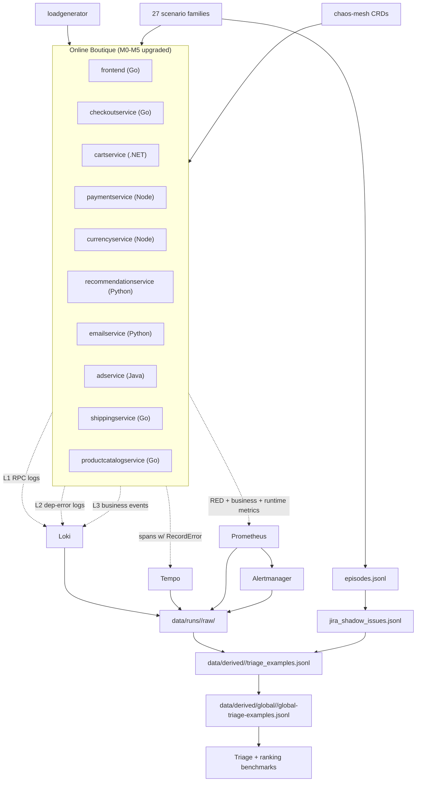

# Jira And Logs Research Lab — Consolidated Guide

This file is the single, authoritative reference for the current state of the
project. It replaces the need to read `README.md`, `RESEARCH-PLAN.md`,
`RESEARCH-DATA-IDEA.md`, `microservice-changes.md`, `microservice-changes-todo.md`,
`docs/gcp-production-dataset-vm-runbook.md`, `docs/ml-ai-pipeline-benchmark-plan.md`,
`docs/telemetry-implementation-decisions.md`, and
`docs/telemetry-implementation-build-notes.md` in order to understand the
project. Targeted contracts (triage task contract, Jira-shadow contract, JSON
schemas) are still cross-referenced but not duplicated here.

> The lab runs a realistic microservices application, creates controlled
> incidents on it, collects logs / metrics / traces / alerts, generates
> Jira-shaped shadow tickets, then trains and evaluates a **triage classifier**
> that decides — for any given telemetry window — *should this be ticketed,
> is it borderline, or is it noise?* — grounded by retrieval against a Jira
> memory corpus.

Ranking telemetry episodes against a Jira query is kept as a secondary
benchmark; orphan-fault detection and borderline calibration are additional
benchmark tracks defined by the active corpus.

---

## 1. Current state (2026-05-28)

| Item | Value |
| --- | --- |
| Active corpus | **`dataset-v5-large` — collected**: 100 runs, 27 families, **6,720 windows**, 932 incident episodes, 347 shadow Jira tickets, **79.4 GB raw on disk** |
| Collection window | 2026-05-25 08:45 → 2026-05-28 15:08 UTC (~3.3 days unattended on the GCP VM) |
| Global derived | `data/derived/global/2026-05-25-dataset-v5-large-global/` — global triage examples, Jira memory corpus, window-memory matchings, split manifest, **94-column feature catalog**: 33 `m05_*` (M0–M5 supplement) + 47 `delta_*` (pre-fault vs active) + 6 `trace_*` + 3 `log_*` + 3 `k8s_*` + 2 `metric_*` |
| Class balance | noise 54.2% / borderline 24.8% / ticket_worthy 21.0% — meets the contract gates (≥20% noise, ≥5% borderline) |
| Hard-case coverage | 2,998 / 6,720 windows (44.6%) — well above the ≥15% target |
| Orphan ticket-worthy windows (D12) | 617 — well above the 192 target (planned 8 per orphan run × 24 orphan runs) |
| Splits | train 2,796 / validation 984 / test 2,940 (held out by scenario family) |
| Telemetry layer | **M0–M5 complete** (L1 RPC logs, L2 dep-error logs, L3 business events, RecordError fleet-wide, RED + business + runtime metrics) |
| Application | Online Boutique (12 services, hard-forked under `microservices-demo-google/`) |
| Chaos framework | chaos-mesh 2.7.2 in `chaos-testing` namespace (required by the system-faults plan) |
| Primary ML task | Triage classification (`ticket_worthy` / `borderline` / `noise`) |
| Secondary tasks | Memory retrieval, retrospective ranking, orphan-fault detection, borderline calibration |
| Collected on | GCP VM `e2-standard-8`, 1 TB `pd-balanced`, Ubuntu 24.04, `us-central1-a` |
| Git branch | `master-bigger-dataset` |

A machine-readable snapshot of all metadata in this section lives at
`data/derived/global/2026-05-25-dataset-v5-large-global/dataset-metadata.json`
(regeneratable via `python scripts/research-lab/dataset_metadata.py
--runs-prefix 2026-05-25-dataset-v5-large
--global-id 2026-05-25-dataset-v5-large-global`).

Earlier corpora (v2 / v3 / v4-large) are deliberately not discussed in this
file. Per-version detail lives in the historical sections of `README.md` if
needed.

---

## 2. Why this project exists

Modern engineering teams collect huge volumes of telemetry (logs, metrics,
traces, alerts, Kubernetes metadata) and keep important operational
knowledge in Jira (incidents, bugs, reliability tasks, affected services,
priorities, comments, fixes). The two worlds are rarely connected.

**Research question.** Can historical Jira-like issue data help us identify
which telemetry patterns represent real operational problems? Can a triage
model trained on lab telemetry + shadow Jira generalize to a real on-call
queue?

**Product question.** Can we build an internal/commercial application that
decides ticket-worthy vs noise vs borderline, retrieves the most relevant
historical Jira issue, and shows evidence in a way an engineering team can
trust?

The MVP is a **ranking-only triage layer**. Human-approved Jira issue
creation, suggested fields, feedback buttons, and live Jira-Cloud integration
are Phase 2.

### Why we generate our own dataset

Public Jira datasets carry issue text and metadata, but not the logs /
metrics / traces / alerts that caused those issues. Public observability
datasets carry telemetry but not the linked Jira issues. We need both sides,
linked at the episode level, with controlled ground truth — so we generate it.

---

## 3. Lab architecture

Two Kubernetes namespaces, one chaos namespace:

| Namespace | Purpose |
| --- | --- |
| `online-boutique-research` | Online Boutique application (12 services) + load generator. Every modified service runs a `v5.0.0-otel-pilot*` image with M0–M5 instrumentation. |
| `observability` | Prometheus + Alertmanager + Loki (50 GiB PVC, target 120 GiB on the GCP VM) + Tempo + Grafana + Alloy + OpenTelemetry Collector (2 replicas, 2 Gi memory). |
| `chaos-testing` | chaos-mesh controller-manager + chaos-daemon DaemonSet + chaos-dns-server (required for the D11 system-faults plan). |



Trace sampling is `AlwaysSample()` everywhere — explicitly traded for dataset
density; documented as a known production divergence (see §9).

---

## 4. The M0–M5 telemetry upgrade

The upstream Online Boutique demo emits minimal telemetry. To produce a
dataset close to what real production services emit, the fork in
`microservices-demo-google/` ships a 5-phase upgrade. All five phases are
complete and committed.

### M0 — Foundation decisions (`docs/telemetry-implementation-decisions.md`)

| ID | Decision |
| --- | --- |
| M0.1 | **Shared interceptor libraries per language** under `microservices-demo-google/src/_shared-<lang>/` (Go, .NET, Node, Python). Keeps RPC log shape and metric labels consistent across services. |
| M0.2 | **Hard-fork** at `17YuvrajSehgal/microservices-demo-google`, branch `main`. Upstream Google remote tracked for **quarterly** cherry-pick, not continuous rebase. |
| M0.3 | **kind-local registry** for dev; **Google Artifact Registry** (`us-central1-docker.pkg.dev/<project>/jiraandlogs-research/`) for cloud VM runs. |
| M0.4 | OTel collector capacity: **2 replicas, cpu=2 / mem=2 Gi limits, `send_batch_size=8192`, `send_batch_max_size=16384`, `timeout=200ms`**. |
| M0.5 | Loki PVC at **50 GiB** standard (target 120 GiB on the 1 TB GCP VM), 168 h retention. |
| M0.6 | **9-divergence production-fidelity disclosure** — see §9. Lifted verbatim into the v5 dataset README at publish time. |

### M1 — OTel parity for laggard services

| Service | Lang | Change |
| --- | --- | --- |
| cartservice | .NET | `OpenTelemetry.Extensions.Hosting` + `Instrumentation.AspNetCore` + `Instrumentation.GrpcNetClient` + **`Instrumentation.StackExchangeRedis`** (highest-leverage single addition: per-Redis-operation child spans). |
| adservice | Java | OpenTelemetry Java agent (zero application code changes). |
| shippingservice | Go | `otelgrpc` server + client interceptors to match the other Go services. |

**M5.1 gate (cartservice-first validation)**: collecting
`cart-redis-degradation-critical` against the upgraded cartservice image
showed **3.0× lift in `trace_error_count`** on active_fault windows (91.0 →
277.5 mean), 100% per-window nonzero coverage (was 50%), pilot min > baseline
max for nonzero windows. Gate decision: **PASS**.

### M2 — Structured logging (L1 + L2 + L3)

| Layer | What it logs | Where |
| --- | --- | --- |
| **L1** | One structured JSON log per RPC (server + client) with `{trace_id, span_id, method, peer_service, latency_ms, status_code, err_class, kind}`. | Shared interceptors under `src/_shared-{go,dotnet,node,python}/`. cartservice .NET uses `AddJsonConsole(IncludeScopes=true)` + a structured-logging message template so each named placeholder renders as a top-level JSON key (100% trace_id coverage after the JsonConsole fix). |
| **L2** | Structured `dep_error` log on dependency-call failure with `{dep, op, err_class, retry_attempt, trace_id, span_id}`. | cartservice → Redis (3 ops); checkoutservice → 6 downstream gRPC; frontend → 10 downstream gRPC; recommendationservice → productcatalog. |
| **L3** | Generic business events: `cart_size_changed`, `order_placed`, `payment_charged`, `recommendation_returned`. | One per service at the natural code site. |

Java/adservice L1 is **deferred** — the OTel Java agent already correlates
trace_id/span_id via MDC injection and adding a Logback interceptor would
double-emit.

### M3 — Trace enrichment

- **M3.1** `RecordError` + `SetStatus(Error)` on every error-returning handler across 5 languages.
- **M3.2** Manual child spans for dependency calls with semantic-convention attrs (`db.system`, `db.operation`, `peer.service`, `rpc.method`, bounded `app.order_item_count_bucket`).
- **M3.3** `span.AddEvent("catalog.reload")` at the productcatalog hot-reload site (the one natural state-transition point in the demo); other retry/fallback events deferred — Online Boutique doesn't use those patterns today.
- **M3.4** 100%-sampling divergence documented in `docs/dataset-v4-plan.md` and the M0.6 disclosure.

### M4 — Metrics

| Sub-phase | What lands |
| --- | --- |
| **M4.1** | `/metrics` endpoint on every service (port 9100 for most, 9464 for adservice via OTel Java agent). cartservice splits into two Kestrel endpoints — gRPC on 7070 (Http2) and metrics on 9100 (Http1) — so the Prom scrape doesn't conflict with HTTP/2. |
| **M4.2** | RED metrics per RPC handler (`rpc_server_duration_seconds`, `rpc_server_requests_total`) via shared interceptors. |
| **M4.3** | Per-dependency client metrics (`rpc_client_duration_seconds`, `rpc_client_errors_total`). |
| **M4.4** | 5 bounded business counters: `payments_total{card_type,result}`, `cart_operations_total{op,result}`, `orders_placed_total`, `recommendations_served_total`, `catalog_lookups_total{result}`. |
| **M4.5** | Runtime gauges: `go_*` + `process_*` (Go default), `process.runtime.dotnet.*` (.NET via `AddRuntimeInstrumentation`), `python_gc_*` + `process_*` (Python default), `process.runtime.nodejs.*` (Node via `@opentelemetry/host-metrics`), `process.runtime.jvm.*` (Java via OTel agent). |
| **M4.1f** | `ServiceMonitor` in `deploy/research-lab/observability/online-boutique-servicemonitor.yaml` plus a headless `online-boutique-metrics` Service so Prometheus actually scrapes the above. |

Verified live 2026-05-25: 9 of 10 expected app endpoints UP; only
emailservice is silent (never had metrics init code added — trivial fix,
low value).

### M5 — Validation

- **M5.1** cartservice-only gate — **PASS** (3.0× trace_error_count lift; see above).
- **M5.2a** Fleet rollout live on `jira-telemetry-lab` kind cluster.
- **M5.2b** v5-pilot.json 9-run corpus — paused, resumable (optional upgrade).
- **M5.2c** Sizing measured: **collector HELD** (0 restarts, M0.4 sizing correct); **Loki INSUFFICIENT** pre-PVC, resolved by the 50 GiB PVC + `export-telemetry-window.ps1` timeout bump to 180s.
- **M5.2d** L1/L2/Tempo cross-check: fleet L1 trace_id coverage **96.7%**; cartservice **100%** post-JsonConsole fix.
- **M5.2e** Leakage canary on r04-followup — **PASS** (30 rows, 0 fails, 4 warns; no feature column perfectly correlated with scenario_id/family/triage_label).

### Build-system requirements (`docs/telemetry-implementation-build-notes.md`)

The shared per-language interceptor libs require the Docker build context
to include sibling `_shared-<lang>/` directories. Specifically:

- **Go services**: `go mod vendor` before `go build` so the `replace github.com/GoogleCloudPlatform/microservices-demo/src/_shared-go/rpclog => ../_shared-go/rpclog` directive resolves.
- **cartservice .NET**: build context is `microservices-demo-google/src/` so `_shared-dotnet/` is copied into the image alongside `cartservice/src/`.
- **Node services** (paymentservice, currencyservice): build context is `microservices-demo-google/src/` so `npm install` can resolve `"@hipstershop/rpc-logging": "file:../_shared-node/rpc-logging"`.
- **Python services** (recommendationservice, emailservice): build context is `microservices-demo-google/src/`; Dockerfile runs `pip install -e ../_shared-python/rpc_logging` before `pip install -r requirements.txt`.
- **adservice Java**: unchanged — OTel Java agent only, no shared interceptor.

---

## 5. Production-realism discipline (non-negotiable)

The entire research story depends on lab-vs-production fidelity. The
non-negotiable rules from `microservice-changes.md`:

- **Don't** add log fields, span attributes, or metric labels that name our scenarios (`scenario.id`, `fault.injected`, `expected_severity`).
- **Don't** label metrics by anything from `scripts/research-lab/triage_labels.py` (no `scenario_family`, `fault_type`).
- **Don't** propagate `dataset_run_id` through application baggage.
- **Don't** include any field listed as eval-only in `docs/triage-task-contract.md` Field Policy.
- **Do** add only what a real SaaS company in 2026 would emit anyway.

Every change in M0–M5 was checked against these rules. Violating them would
inflate model scores without representing real on-call conditions.

---

## 6. Scenario families & the v5-large corpus

The v5-large corpus collected **100 dataset runs** against **27 scenario
families** and **51 distinct scenario IDs**, producing **6,720 telemetry
windows** across **932 incident episodes**. The full corpus manifest is
`deploy/research-lab/corpora/dataset-v5-large.json`.

### Actual per-family window counts (collected)

Top families by window count, from `dataset-metadata.json`:

| Family | Windows | Family | Windows |
| --- | ---: | --- | ---: |
| cart-redis | 918 | post-deploy-churn | 165 |
| baseline-normal | 696 | third-party-blip | 165 |
| productcatalog-latency | 426 | flapping-pod | 165 |
| payment-outage | 342 | slow-leak-saturation | 144 |
| currency-outage | 342 | scheduled-job-spike | 132 |
| shipping-outage | 342 | network-partition (D11) | 120 |
| recovered-in-window | 330 | single-pod-restart-healthy-replication | 99 |
| ad-outage | 300 | dns-outage (D11) | 90 |
| recommendation-outage | 252 | network-latency (D11) | 90 |
| productcatalog-outage | 252 | _2 more families_ | — |
| frontend-traffic-pressure | 252 | | |
| email-outage | 216 | | |
| frontend-restart | 198 | | |
| latency-near-miss-partial-recovery | 198 | | |
| checkout-restart | 168 | | |
| checkout-outage | 168 | | |

### Per-service window distribution

Window counts per affected service (collected):

| Service | Windows | Service | Windows |
| --- | ---: | --- | ---: |
| frontend | 2,332 | recommendationservice | 117 |
| checkoutservice | 1,837 | shippingservice | 114 |
| productcatalogservice | 673 | adservice | 114 |
| cartservice | 603 | emailservice | 72 |
| paymentservice | 288 | loadgenerator | 66 |
| redis-cart | 261 | | |
| currencyservice | 243 | | |

Window-type split: `pre_fault_baseline` 2,008 / `active_fault` 2,008 /
`recovery_window` 2,008 / `observation_window` 696.

### Plan composition

| Plan | Runs | Episodes/run | Covers |
| --- | ---: | ---: | --- |
| `control-baseline-only.json` | 8 | 6 | Anchors false-positive distribution; noise-class training data. |
| `dataset-v3-diverse-compact-a.json` | 14 | 10 | v4 family set: latency / dep outage / restart / Redis / config / near-miss. |
| `dataset-v3-diverse-compact-b.json` | 14 | 13 | v4 family set: service-diverse outages, frontend/Redis restarts, intermittent Redis, noisy traffic. |
| `dataset-v5-new-families-a.json` | 11 | 12 | D1.1–D1.4 new families. |
| `dataset-v5-new-families-b.json` | 11 | 8 | D1.5–D1.7 new families. |
| `dataset-v5-long-running.json` | 8 | 4 | D1.8 slow-leak-saturation (≥10-min episodes). |
| `dataset-v5-orphans.json` | 24 | 10 | Phase D12 — `produces_jira_ticket: false`, 8 orphan ticket_worthy windows / run → 192 total. |
| `dataset-v5-system-faults.json` | 10 | 7 | Phase D11 — chaos-mesh system-level faults (DNS / partition / packet-loss / latency / memory pressure). |

### 8 new D1 family shapes

| Family | Label intent | Scenarios |
| --- | --- | --- |
| `post-deploy-churn` | noise | deploy-rolling-cart-graceful, deploy-rolling-frontend-graceful, deploy-canary-rollback-quick |
| `recovered-in-window` | borderline | redis-blip-30s-recovery, paymentservice-flake-recovers, currency-timeout-recovers |
| `single-pod-restart-healthy-replication` | noise | frontend-1-of-3-restart, cartservice-1-of-3-restart |
| `third-party-blip` | borderline | currency-api-blip-major, recommendation-model-blip-minor |
| `scheduled-job-spike` | noise | analytics-job-burst, cleanup-job-burst |
| `latency-near-miss-partial-recovery` | borderline | productcatalog-half-degraded, currency-partial-latency |
| `flapping-pod` | ticket_worthy | cartservice-flap-ticket-worthy, paymentservice-flap-ticket-worthy |
| `slow-leak-saturation` | ticket_worthy (long-running) | cartservice-memory-leak-ticket-worthy, paymentservice-connection-leak-ticket-worthy |

### 5 D11 system-fault families (chaos-mesh)

`dns-block-cartservice-60s`, `network-partition-cart-redis`,
`packet-loss-frontend-30pct`, `network-latency-currency-500ms`,
`memory-pressure-cartservice-100mb`.

### 1 D12 orphan family

`email-outage` plus 8 scenarios with `produces_jira_ticket: false` (cart-redis,
adservice, currency, email, frontend, payment, productcatalog, shipping
twins).

### Raw telemetry inventory (collected)

| Stream | Files | Volume | Notes |
| --- | ---: | ---: | --- |
| Loki logs (`raw/loki/`) | 7,752 | 31.74 GB | **38.75 M log lines** (avg ~5,000 per per-window per-service dump). frontend (2,332 files) and checkoutservice (1,837) dominate by call fan-out. |
| Tempo traces (`raw/tempo/`) | 6,720 | 46.53 GB | **18,153,486 spans** across 9 services (`emailservice`, `loadgenerator`, and one other don't emit traces under the current config). ~2,701 spans per window average. |
| Prometheus base export (`raw/prometheus/`) | 6,720 | 136 MB | 740,865 sample points across **5 cluster-state queries per window** — `ALERTS`, `container_cpu_usage_seconds_total`, `container_memory_working_set_bytes`, `kube_pod_container_status_restarts_total`, `kube_pod_info`. These feed the legacy `triage_feature_*` k8s + container columns. |
| **Prometheus M0–M5 supplement (`raw/prometheus_supplement/`)** | 6,720 | **43.31 MB** | **33 RED + business + runtime queries per (window × service)** → **221,760 scalar values**. Written by `export_m05_supplement.py` after collection; these are what feed the **33 `triage_feature_m05_*` columns** in the global feature catalog (e.g. `m05_cart_get_error_per_sec`, `m05_orders_placed_per_sec`, `m05_payments_success_per_sec`, `m05_rpc_server_p95_ms`, `m05_catalog_lookups_miss_per_sec`). Without this stream the dataset would be a thin telemetry corpus; with it, this is the "production-grade RED + business signal" that makes v5-large worth collecting. |
| Total raw bytes | 21,192 raw files | **79.42 GB** | Plus alerts.jsonl, episodes.jsonl, telemetry_windows.jsonl, triage_window_labels.jsonl, and Kubernetes JSON dumps. |

### Jira memory corpus (collected)

| Stat | Value |
| --- | ---: |
| Issues | 347 |
| Summary words (mean / median) | 5.3 / 5 |
| Description words (mean / median) | 2,021 / 2,005 |
| Comments per ticket (mean) | 1.0 |
| Comments words (mean) | 50 |
| Earliest created | 2026-05-25T13:38 UTC |
| Latest created | 2026-05-28T15:18 UTC |
| Severity distribution | major 164 / critical 106 / minor 77 |

Top components carried on Jira tickets: `frontend` (326), `checkoutservice`
(325), `cartservice` (130), `productcatalogservice` (81), `paymentservice`
(61), `currencyservice` (57), `redis-cart` (35), `recommendationservice`
(25).

The 347 Jira issue count is **lower than the planned ~430** because the
D12 orphan plan (24 runs) deliberately sets `produces_jira_ticket: false`
— those runs contribute orphan ticket-worthy windows (617 in total) but
no Jira memory entries. This is the intended design, not under-collection.

### Benchmark tracks defined by the corpus

| Track | Question |
| --- | --- |
| `triage_classification` (**primary**) | Classify each window as `ticket_worthy` / `borderline` / `noise`. |
| `triage_with_memory_retrieval` | Same classification, grounded in retrieval against the Jira memory corpus. |
| `ranking_retrospective` | Given a Jira issue, rank candidate telemetry episodes (legacy). |
| `orphan_fault_detection` | Detect ticket-worthy windows with NO paired Jira shadow row. |
| `borderline_label_calibration` | Measure inter-rater reliability on borderline windows. |

### Promotion gates baked into the corpus manifest

- Every collected run must pass `validate-dataset-run.ps1` (0 errors) and `validate-run-feature-distribution.py` (0 anomalies).
- Per-run `triage_examples.jsonl` must populate all `FEATURE_COLUMNS` with ≥1 non-zero value across the run; label distribution must include all three labels (control + long-running runs exempt for unused labels).
- Global triage dataset must include all 27 families; new M0–M5 feature columns must populate on ≥80% of windows; no feature column may be perfectly correlated with scenario_id / scenario_family / triage_label (leakage canary).

---

## 7. The triage task (primary product task)

Full contract: `docs/triage-task-contract.md`. Summary:

### Label space

| Label | Meaning |
| --- | --- |
| `ticket_worthy` | A senior engineer would file a Jira ticket if they saw this. |
| `borderline` | Reasonable engineers would disagree. Recovered before user impact, or impact is small enough that filing is judgement-dependent. |
| `noise` | A senior engineer would not file a Jira ticket. Normal behavior or near-miss patterns. |

Three classes (not two) are intentional. `borderline` lets us measure how a
model handles uncertainty without penalizing it for refusing to commit on
genuinely ambiguous windows.

### Per-window fields

| Field | Meaning |
| --- | --- |
| `triage_severity` | `minor` / `major` / `critical` (when `ticket_worthy`). |
| `triage_components` | Jira components the ticket would carry. |
| `triage_reason_class` | `outage` / `latency_regression` / `restart_with_impact` / `bad_config` / `capacity` / `dependency_failure` / `data_consistency`. |
| `is_hard_case` | True when designed to confuse simple models (restart vs outage, near-miss vs real, root-cause vs downstream symptom). Eval-only — must NOT be used as a model input. |
| `source` | `scenario_authored` / `human_adjudicated` / `derived`. |

### Jira-as-memory architecture

The dataset is structured around the idea that **past Jira issues are the
system memory**. At decision time, for a new telemetry window, the product:

1. retrieves matching past Jira issues from a time-ordered memory corpus,
2. uses the matches as evidence for the triage decision,
3. when it decides ticket-worthy, cites the matches the engineer can review,
4. when nothing matches but it still decides ticket-worthy, flags the window as a novel incident.

This requires three things on top of standard triage labels:

- a **time-ordered Jira memory corpus** with `available_as_memory_from` timestamps,
- per-window **ground-truth memory-match labels** (`matched_memory_issue_ids` + `is_novel`),
- evaluation metrics for both classification quality and retrieval quality.

The retrieval is the **architecture**, not the task. Architecture-free
classifiers (no retrieval, just features) are valid baselines and must be
reported as such.

### Split rules

The triage benchmark holds out **scenario families**, not runs:

- train on at least three families,
- validation on one held-out family,
- test on one held-out family,
- additionally report leave-one-family-out macro metrics for every family.

Per-run holdout is insufficient — fault signatures repeat across runs of the
same family. Threshold selection happens on validation only; applying a
threshold tuned on test back to test is a leak.

### Required metrics

| Metric | Why |
| --- | --- |
| Precision@FPR=1% | Headline. Low-alert-fatigue operating point. |
| Recall@FPR=1% | What fraction of real tickets we catch at the headline point. |
| Precision@FPR=5% | Secondary operating point. |
| PR-AUC | Threshold-free, robust to class imbalance. |
| ROC-AUC | Comparable across base rates. |
| Reliability curve + Expected Calibration Error | Required for probabilities to be usable downstream. |
| Cost-weighted F-beta (β=2) | Penalizes missed incidents more than false alarms. |

Plus stratified metrics by scenario family, `is_hard_case`,
`triage_reason_class`, affected service, and window type — and the D12
**orphan-detection recall gap**: `recall_reported` vs `recall_orphan` vs
`gap_pts` per pipeline (verdict bucket: `signal_learning` < 10 pts,
`borderline` 10–20, `pattern_matching` > 20).

Both borderline-handling variants are required, strict is headline (borderline
counted as negative; precision computed against `ticket_worthy` only).

### Pipeline tracks

Rule-based baseline → classical ML (logistic / GBT / calibrated RF over
`triage_feature_*`) → lexical (BM25 / TF-IDF over `triage_evidence_text`) →
neural (bi-encoder + classification head, cross-encoder for hard cases) →
language model (zero-/few-shot with rationale, temperature-scaled on val) →
hybrid (stacking / weighted log-odds blend of the above).

The retrospective ranking task — given a Jira issue, rank candidate telemetry
episodes — is documented in `docs/ml-ai-pipeline-benchmark-plan.md`. It runs
on the same global dataset with stricter leakage rules (split by query run;
candidate severity / incident type / scenario id are forbidden features).

---

## 8. Dataset collection flow

Each dataset run follows the same 5-step flow.

### Step 1 — Start the run

Creates `data/runs/<DATASET_RUN_ID>/manifest.json` with run id, namespaces,
cluster context, application metadata, scenario metadata, git SHA, builder
hashes, timestamps.

### Step 2 — Run traffic and scenarios

Executes a list of scenarios from a JSON run plan under
`deploy/research-lab/run-plans/`. The `loadgenerator` deployment provides the
synthetic user traffic; scenarios inject faults via harness actions
(`RecordOnly` / `SetEnv` / `RestartPods` / `ScaleDeployment` /
`ChaosMeshChaos`).

### Step 3 — Create telemetry windows

Each scenario is split into labelled time windows:

- Fault scenarios: `pre_fault_baseline`, `active_fault`, `recovery_window`.
- Baseline scenarios: `observation_window`.

Each window is written to `data/runs/<DATASET_RUN_ID>/telemetry_windows.jsonl`.

### Step 4 — Export raw telemetry

Per-window, per-service evidence collected by `export-telemetry-window.ps1`
(180 s HttpClient timeout per query — bumped from 45 s to survive cart-redis
active-fault burst windows):

| Evidence | Source | Output |
| --- | --- | --- |
| Logs | Loki (PVC-backed) | `raw/loki/*.json` |
| Metrics | Prometheus | `raw/prometheus/*.json` |
| Traces | Tempo | `raw/tempo/*.json` |
| Alerts | Alertmanager + Prometheus `ALERTS` query-range | `alerts.jsonl` |
| Kubernetes | Pod events, restart counts, rollout state, readiness | `raw/kubernetes/*.json` |

Raw evidence is immutable after validation; derived features can be rebuilt.

### Step 5 — Generate shadow Jira issues

For episodes where `jira_candidate=true` AND `produces_jira_ticket != false`
(orphan scenarios skip this step), `generate-shadow-jira-issues.ps1` writes
Jira-shaped JSON records to `data/runs/<DATASET_RUN_ID>/jira_shadow_issues.jsonl`,
each with summary, description, issue type, priority, components, labels,
lifecycle history, comments, linked telemetry windows, linked alerts, linked
traces. Schema: `schemas/jira_shadow_issue.schema.json`.

### Raw dataset layout

```text
data/runs/<DATASET_RUN_ID>/
  manifest.json                 # run metadata + git SHA + tool versions
  episodes.jsonl                # one row per scenario invocation
  telemetry_windows.jsonl       # one row per labelled time window
  alerts.jsonl                  # Alertmanager + ALERTS history
  jira_shadow_issues.jsonl      # generated Jira-shaped rows
  triage_window_labels.jsonl    # per-window label provenance
  raw/
    loki/                       # per-window per-service log exports + padded context
    prometheus/                 # metric scrapes
    tempo/                      # trace exports
    kubernetes/                 # pod / deployment / event snapshots
  summaries/
    run-summary.md
    data-quality-report.md
    feature-distribution.md
```

### Derived layout

```text
data/derived/<DATASET_RUN_ID>/
  triage_examples.jsonl         # one row per window with features + label
  triage_window_labels.jsonl    # label provenance (scenario_authored / derived / human_adjudicated)
  window_memory_matchings.jsonl # ground-truth memory-match labels (matched_memory_issue_ids + is_novel)
  feature-distribution.md       # per-feature distribution sanity check
  manifest.json                 # builder version + raw file hashes

data/derived/global/<GLOBAL_DATASET_ID>/
  global-triage-examples.jsonl  # all windows across all runs
  jira-memory-corpus.jsonl      # all shadow Jira issues, deduped, time-ordered
  window-memory-matchings.jsonl # all memory-match labels across runs
  triage-split-manifest.json    # train/validation/test by scenario family
  benchmarks/<BENCHMARK_ID>/
    benchmark-report.md         # PR-AUC, ROC-AUC, ECE, P@FPR=1%/5%, per-family,
                                # orphan recall gap, leave-one-family-out macros
```

The legacy ranking-dataset path
(`data/derived/<id>/ranking_examples.jsonl` and
`data/derived/global/<id>/global-ranking-examples.jsonl`) is still maintained
for the secondary task.

---

## 9. Production-fidelity disclosure (9 known divergences)

Will be lifted verbatim into the v5 dataset README at publish time. Source of
truth: `docs/telemetry-implementation-decisions.md` §M0.6.

1. **Trace sampling is 100% (`AlwaysSample`)** — production typically 1–10% head-sampled or tail-sampled on errors/latency. Dataset density traded against sampling realism; models trained on this may over-rely on span fan-out features.
2. **Single-cluster, single-region.** All services run in one kind cluster (dev) or one GKE cluster in one region (cloud). No cross-region failures, no inter-cluster partitions, no multi-AZ failover.
3. **No real customer PII.** loadgenerator emits synthetic users; paymentservice's `simple-card-validator` matches `visa`/`mastercard` patterns only.
4. **Synthetic traffic patterns.** No diurnal cycle, no weekly cycle, no business-hour effect (Phase D8 will address in v5.1 or v6).
5. **Single fault per run.** Real incidents often have multiple correlated faults. Cascade scenarios (Phase D5) partly address this; full multi-fault correlation is out of scope for v5.
6. **Shadow Jira issues, not engineer-written.** All Jira rows are generated from scenario YAML templates by `generate-shadow-jira-issues.ps1`. Real tickets carry inconsistencies, typos, and out-of-band signals (Slack, postmortems, manager pressure) that synthetic issues don't.
7. **No alert-fatigue baseline.** Real on-call queues have a background level of false positives. v5's `post-deploy-churn` family partly addresses this.
8. **No deploy event correlation in v4/v5.** Phase D8 will add synthetic deploy events with correlated logs/metrics in v5.1 or v6.
9. **No GPU-served services.** Recommendation/ad/fraud often use GPU-backed inference in real e-commerce; Online Boutique's `recommendationservice` uses a Python sort-by-popularity proxy. Affects which failure modes are realistic (no CUDA OOM, no model-serving cold-start, no quota throttling).

---

## 10. Operational runbook (fresh GCP VM, v5-large)

Full runbook: `docs/gcp-production-dataset-vm-runbook.md`. This is the
condensed checklist.

### Cost & sizing

- VM: `e2-standard-8` (8 vCPU, 32 GB RAM), `us-central1-a`, STANDARD provisioning (NOT Spot — 5-day unattended run).
- Disk: **1 TB `pd-balanced`** boot disk. Alternative: 250 GB root + 1 TB attached `pd-balanced` at `/data` (then move Docker `data-root` and JiraAndLogs `data/`/`logs/` to `/data`).
- OS: Ubuntu 24.04 LTS x86_64.
- Estimated cost: ~$55 for the 5-day compute + disk (plus ~50 GB egress on download).
- Kubernetes: kind cluster, 1 control-plane + 2 workers (NOT GKE — single VM with kind is cheaper, simpler, matches local research setup).

### Required `sysctl` bumps (chaos-mesh prerequisite)

```bash
sudo tee /etc/sysctl.d/99-jira-logs-inotify.conf >/dev/null <<'EOF'
fs.inotify.max_user_watches = 1048576
fs.inotify.max_user_instances = 16384
fs.inotify.max_queued_events = 32768
EOF
sudo sysctl --system | grep inotify
```

Without `max_user_instances = 16384` (default 128), chaos-mesh's 22 CRD
informers can't start — every controller-manager pod CrashLoopBackOffs with
"too many open files" the moment NetworkChaos / IOChaos / StressChaos
resources are referenced.

### High-level order

1. **Local laptop**: push `JiraAndLogs@master-bigger-dataset` and `microservices-demo-google@main` to GitHub (fresh VM clones from there).
2. Create the VM with the gcloud command in the runbook; SSH in.
3. Install Docker (with `/etc/docker/daemon.json` log rotation + optional `data-root: /data/docker` for the attached-disk variant), kubectl, kind, Helm, PowerShell.
4. Clone both repos from the **forks** (`17YuvrajSehgal/JiraAndLogs` and `17YuvrajSehgal/microservices-demo-google`) — upstream Google clones will lack all M0–M5 instrumentation. Create the Python venv, `pip install -r scripts/research-lab/requirements.txt`.
5. `pwsh scripts/research-lab/create-kind-cluster.ps1` → expect 1 control-plane + 2 workers Ready.
6. `pwsh scripts/research-lab/install-observability.ps1` then `kubectl apply -f deploy/research-lab/observability/online-boutique-servicemonitor.yaml`. Verify `pvc storage-loki-0` is Bound at 50 Gi (or 120 Gi if `loki-values.yaml singleBinary.persistence.size` was bumped); verify collector at 2 replicas.
7. `helm install chaos-mesh chaos-mesh/chaos-mesh --version 2.7.2 --namespace chaos-testing --set chaosDaemon.runtime=containerd --set chaosDaemon.socketPath=/run/containerd/containerd.sock --set dashboard.create=false`. Smoke-test by applying a NetworkChaos with a label selector that matches nothing, then `patch ... '{"metadata":{"finalizers":[]}}'` + `delete --force` to clean up.
8. Build the 10 M0–M5 images locally from `microservices-demo-google/src/`. Build context is `src/` for **nine** services (needed because each Dockerfile copies sibling `_shared-<lang>/` deps) — but **adservice must be built from `src/adservice/`** because its Dockerfile expects `gradle/` relative to its own directory and it has no sibling shared lib. Expect ~20–30 min total on `e2-standard-8`; cartservice and adservice are the longest at ~5–7 min each.
9. `kind load docker-image <tag> --name jira-telemetry-lab` for all 10 images.
10. Verify `deploy/research-lab/online-boutique/kustomization.yaml` has 10 image pins (`grep -c v5.0.0-otel-pilot` → 10). Apply via `pwsh scripts/research-lab/apply-online-boutique.ps1`. Verify every running pod is on a `v5.0.0-otel-pilot*` tag (NOT upstream `:v0.10.5`).
11. **Mandatory smoke tests** — three short runs (~45–90 min each) to validate the new code paths before launching the 5-day collection:
    - **Smoke 1 (D1 new families)**: `dataset-v5-new-families-a.json` → expect 12 episodes, 75 windows, 5 Jira shadow issues, recall@3 = 1.0.
    - **Smoke 2 (D12 orphan-fault gate)**: `dataset-v5-orphans.json` → expect 10 episodes, **0 Jira shadow issues** (critical invariant), every ticket-worthy window with `expected_in_memory: false` + `is_novel: true`.
    - **Smoke 3 (D11 chaos-mesh)**: `dataset-v5-system-faults.json` → expect 7 episodes, 50 windows, 5 Jira shadow issues, and `kubectl -n chaos-testing get networkchaos,dnschaos,stresschaos` returns empty after the run (bounded delete + finalizer fallback works).
12. Launch the corpus in tmux:

```bash
tmux new -s v5-large
export RUN_PREFIX="2026-05-25-dataset-v5-large"
export GLOBAL_DATASET_ID="2026-05-25-dataset-v5-large-global"
export BENCHMARK_ID="triage-v5-baseline"

pwsh -NoProfile -ExecutionPolicy Bypass \
  -File scripts/research-lab/collect-dataset-corpus.ps1 \
  -CorpusFile "deploy/research-lab/corpora/dataset-v5-large.json" \
  -DatasetRunPrefix "$RUN_PREFIX" \
  -GlobalDatasetId "$GLOBAL_DATASET_ID" \
  -PythonExe python3 \
  -Quick -BuildTriage -HaltOnValidationFail \
  -SkipDerivedBuild -SkipAggregateBuild \
  2>&1 | tee "logs/${RUN_PREFIX}-corpus.log"
```

`Ctrl-b d` to detach; `tmux attach -t v5-large` to resume.

13. **Resume after interruption**: re-run the same command — completed runs are detected by `manifest.json` and skipped automatically. **Never add `-ForceNewRun`** — that discards completed runs.
14. After collection finishes, run the triage benchmark:

```bash
pwsh -NoProfile -ExecutionPolicy Bypass \
  -File scripts/research-lab/run-triage-benchmark.ps1 \
  -GlobalDatasetId "$GLOBAL_DATASET_ID" \
  -BenchmarkId "$BENCHMARK_ID" \
  -PythonExe python3 -Force
```

Output: `data/derived/global/$GLOBAL_DATASET_ID/benchmarks/$BENCHMARK_ID/benchmark-report.md`.

### What "complete v5-large" actually delivered

Live numbers from `dataset-metadata.json`. Where the actual differs from
the original target, the delta is explained in the right column.

| Asset | Target | Actual | Notes |
| --- | ---: | ---: | --- |
| Corpus runs with `status: completed` | 100 | **100** | ✓ |
| Total incident episodes | — | **932** | ≈9.32 episodes per run, varies by plan |
| Rows in `global-triage-examples.jsonl` | ~7,400 | **6,720** | Below target because per-episode window count averaged 7.2 not 7.5; plan-level baseline runs contribute 1 window each (observation_window). Class balance still meets the contract. |
| Entries in `jira-memory-corpus.jsonl` | ~430 | **347** | Deficit (≈83) matches the D12 orphan plan: 24 runs × ~3.5 ticket-worthy episodes/run produce no shadow Jira by design. Not an under-collection. |
| Scenario families in the split manifest | 27 | **27** | ✓ |
| Distinct scenario IDs (leaves) | — | **51** | |
| Services covered | 12 | **12** | ✓ |
| **Orphan ticket_worthy windows (D12)** | 192 | **617** | Far above target — the orphan plan generated more ticket-worthy windows per run than the manifest projected. |
| **Chaos-mesh windows (D11)** | ≥40 ticket-worthy | network-partition 120 / dns-outage 90 / network-latency 90 → 300 chaos windows total, label mix per family | Need to break out the per-window labels from the global examples to confirm the ticket-worthy split. |
| Hard-case windows | ≥15% target | **44.6% (2,998)** | Far above target — likely from the D11 + D1 family additions which were specifically engineered to be confusing. |
| Class balance (noise / borderline / ticket_worthy) | each ≥5%, noise ≥20% | **54.2% / 24.8% / 21.0%** | ✓ |
| Wall time | ~4–5 days unattended | **~3.3 days** | Faster than planned (no major resume cycles, no chaos-mesh cleanup hangs). |
| Total raw bytes | not predicted | **79.4 GB** | Loki 31.7 GB + Tempo 46.5 GB + Prom-base 136 MB + Prom-supplement 43 MB + manifests/episodes/etc ≈1 GB. |
| **M0–M5 Prometheus supplement** | needed for ML | **6,720 files, 33 m05 queries, 221,760 scalar values, 43.3 MB** | `raw/prometheus_supplement/` populated by `export_m05_supplement.py` post-collection. Feeds the **33 `triage_feature_m05_*`** columns in the 94-column feature catalog. Without this, the dataset would have only the 28 base features. |
| `"passed": false` data-quality reports | 0 | **0** (100/100 PASS) | Verified 2026-05-28 via per-run `validate-dataset-run.ps1` loop. Summary at `data/derived/global/2026-05-25-dataset-v5-large-global/validate-dataset-run-summary.json`. |
| Leakage canary fails | 0 | **0** (100/100 PASS) | Verified 2026-05-28 via per-run `validate_run_feature_distribution.py` loop. Summary at `data/derived/global/2026-05-25-dataset-v5-large-global/leakage-canary-summary.json`. |
| Per-family minimum windows | ≥30 per (split, family) cell | **PASS** (smallest cell 60) | Verified 2026-05-28 via `validate_global_family_coverage.py`. Matrix at `data/derived/global/2026-05-25-dataset-v5-large-global/family-coverage.json`. Family split: 14 train families (smallest `network-packet-loss` 60) / 6 validation families (smallest `resource-saturation` 90) / 7 test families (smallest `network-latency` 90). |
| Lingering chaos resources | empty | _check on VM_ | `kubectl -n chaos-testing get networkchaos,dnschaos,stresschaos`. Not VM-accessible from this machine. |

### Local-machine rebuild (developer kind cluster)

```powershell
Set-Location C:\workplace\JiraAndLogs

# 1. Pre-flight
pwsh -NoProfile -ExecutionPolicy Bypass -File scripts/research-lab/check-prereqs.ps1

# 2. kind cluster
pwsh -NoProfile -ExecutionPolicy Bypass -File scripts/research-lab/create-kind-cluster.ps1
kubectl config use-context kind-jira-telemetry-lab

# 3. Observability
pwsh -NoProfile -ExecutionPolicy Bypass -File scripts/research-lab/install-observability.ps1
kubectl wait --for=condition=Ready pods --all -n observability --timeout=900s

# 4. ServiceMonitor for /metrics
kubectl apply -f deploy/research-lab/observability/online-boutique-servicemonitor.yaml

# 5. (Optional) chaos-mesh — only needed if you'll exercise the system-faults plan locally.

# 6. Build the M0-M5 images from microservices-demo-google/src/, then `kind load docker-image <tag> --name jira-telemetry-lab` for all 10.

# 7. Deploy Online Boutique
pwsh -NoProfile -ExecutionPolicy Bypass -File scripts/research-lab/apply-online-boutique.ps1
kubectl wait --for=condition=Ready pods --all -n online-boutique-research --timeout=900s
```

### Local smoke run (~60–90 min)

```powershell
pwsh -NoProfile -ExecutionPolicy Bypass -File scripts/research-lab/collect-dataset-plan.ps1 `
  -DatasetRunId "smoke-$(Get-Date -UFormat %Y%m%dT%H%M%SZ)" `
  -PlanFile "deploy/research-lab/run-plans/dataset-v5-new-families-a.json" `
  -PythonExe python3 -ForceNewRun -BuildDerived -PostWindowSeconds 30
```

---

## 11. Important terms

| Term | Meaning |
| --- | --- |
| Dataset run | One full collection pass with a stable `DATASET_RUN_ID`. |
| Scenario | One controlled behavior (e.g. `baseline-normal-traffic`, `cart-redis-degradation-critical`). |
| Scenario family | A semantic grouping of scenarios with the same fault shape. **27** in v5-large. |
| Incident episode | One labelled operational episode produced by running a scenario. |
| Telemetry window | A time window around an episode: `pre_fault_baseline`, `active_fault`, `recovery_window` for fault scenarios; `observation_window` for baselines. |
| Triage label | Per-window classification: `ticket_worthy` / `borderline` / `noise`. |
| `is_hard_case` | Per-window flag for windows where reasonable engineers disagree (target ≥15% of windows). Eval-only — NOT a model input. |
| `produces_jira_ticket` | Scenario flag; `false` for D12 orphan scenarios (no shadow Jira generated). |
| `expected_in_memory` | Per-window flag: whether ground truth says a matching Jira memory entry should exist. |
| `is_novel` | Per-window flag (matchings file): true if no memory entry matches the ground-truth episode. |
| Shadow Jira issue | A Jira-shaped JSON record generated for an incident episode. Not written to real Jira. |
| Jira memory corpus | Aggregate of all shadow Jira issues across all runs in a dataset, used for retrieval supervision. Time-ordered with `available_as_memory_from`. |
| L1 / L2 / L3 log | Per-RPC structured log / dep-boundary error log / business event (see §4 M2). |
| RED metrics | Rate / Errors / Duration metrics per RPC. |
| Run plan | JSON file under `deploy/research-lab/run-plans/`. |
| Corpus manifest | JSON file under `deploy/research-lab/corpora/`. |

---

## 12. Repository layout

| Path | Purpose |
| --- | --- |
| `README.md` | Full README (kept for context; this file consolidates it). |
| `README2.md` | **This file.** |
| `dataset-todo.md` | Phased dataset expansion plan (D0–D13). |
| `todo.md` | ML/AI pipeline roadmap. |
| `docs/triage-task-contract.md` | Canonical contract for the triage task. |
| `docs/dataset-v4-plan.md` | v4-large dataset specification (kept as the baseline contract; v5 inherits the structure). |
| `docs/research-project-onboarding-guide.md` | Plain-language onboarding for new contributors. |
| `docs/jira-shadow-issue-contract.md` | Shape of generated Jira records. |
| `docs/research-lab-deployment.md` | Local kind cluster deployment details. |
| `docs/dataset-acquisition-plan.md` | How raw runs are collected. |
| `docs/instrumentation-gaps-and-next-steps.md` | What still needs improvement after M0–M5. |
| `deploy/research-lab/corpora/dataset-v5-large.json` | Active corpus manifest. |
| `deploy/research-lab/run-plans/` | Run plans (one per scenario set). |
| `deploy/research-lab/scenarios/baselines/` | Baseline scenarios. |
| `deploy/research-lab/scenarios/faults/` | Application-level fault scenarios (54 YAMLs). |
| `deploy/research-lab/scenarios/chaos/` | chaos-mesh manifests for D11 system-level faults. |
| `deploy/research-lab/observability/` | Helm values for Loki/Prom/Tempo/Grafana/Alloy/OTel + ServiceMonitor. |
| `deploy/research-lab/online-boutique/` | kustomize overlay with M0–M5 image pins. |
| `scripts/research-lab/` | PowerShell + Python collection / build / validation scripts. |
| `microservices-demo-google/` | Hard-fork of Online Boutique with M0–M5 instrumentation. Branch `main`. |
| `microservices-demo-google/src/_shared-{go,dotnet,node,python}/` | Per-language shared interceptor libs (M2.1). |
| `schemas/` | JSON schemas for run / episode / window / alert / Jira records. |
| `src/loganalyzer/` | Aggregate-feature loganalyzer pipeline (Drain-lite + per-window template counts). |
| `src/jira_features/` | Jira-feature extractor (BM25 + time-ordered memory). |
| `src/logsense/` | Anomalous-template surfacing pipeline. |
| `src/comparison/` | Multi-pipeline comparison + stratified splits. |
| `src/adjudication/` | D0.2 borderline/hard-case adjudication tooling. |
| `data/runs/` | Raw collected dataset runs (gitignored). |
| `data/derived/` | Derived datasets + benchmarks (gitignored). |

### Key JSON schemas

`schemas/dataset_run.schema.json`, `schemas/incident_episode.schema.json`,
`schemas/telemetry_window.schema.json`, `schemas/alert_event.schema.json`,
`schemas/jira_shadow_issue.schema.json`, `schemas/triage_window_label.schema.json`.

---

## 13. Key scripts (under `scripts/research-lab/`)

| Script | Purpose |
| --- | --- |
| `check-prereqs.ps1` | Check Docker, Kubernetes, Helm, PowerShell. |
| `create-kind-cluster.ps1` | Create the local kind cluster (1 control + 2 workers). |
| `install-observability.ps1` | Install Prom + Loki + Tempo + Grafana + Alloy + OTel collector via Helm. |
| `render-online-boutique.ps1` / `apply-online-boutique.ps1` | Render / deploy kustomize overlay. |
| `start-dataset-run.ps1` | Scaffold one run id (manifest, configmaps). |
| `run-scenario.ps1` | Execute one scenario (`RecordOnly` / `SetEnv` / `RestartPods` / `ScaleDeployment` / `ChaosMeshChaos`). |
| `export-telemetry-window.ps1` | Pull Loki + Tempo + Prom + k8s evidence per window (180 s timeout per query). |
| `generate-shadow-jira-issues.ps1` | Create Jira-shaped records for ticket-worthy episodes (skipped when `produces_jira_ticket: false`). |
| `collect-dataset-plan.ps1` | Single-run end-to-end driven by a JSON run plan. |
| `collect-dataset-corpus.ps1` | Multi-plan, resumable corpus collection — **the v5-large entry point**. |
| `validate-dataset-run.ps1` | Per-run completeness + quality gate. |
| `validate-run-feature-distribution.ps1` | Leakage canary + per-feature distribution sanity. |
| `validate_l1_l2_telemetry.py` | D13.14d L1/L2/Tempo cross-check. |
| `validate_global_family_coverage.py` | D0.1 per-family minimum-window check. |
| `validate-cartservice-telemetry-upgrade.ps1` | M5.1 gate. |
| `build-triage-dataset.ps1` | Per-run triage examples + labels. |
| `build-jira-memory-corpus.ps1` | Per-prefix Jira memory corpus. |
| `build-window-memory-matchings.ps1` | Per-run window→memory matchings. |
| `build-global-triage-dataset.ps1` | Combine derived runs into global triage examples + split manifest. |
| `run-triage-benchmark.ps1` | Train + evaluate rule + logistic baselines on the global triage dataset. |
| `run-global-pipeline-benchmark.ps1` | BM25 / TF-IDF / hybrid ranking benchmark (legacy). |
| `run-global-embedding-pipeline-benchmark.ps1` | Hashing + sentence-transformer embedding ranking (legacy). |

---

## 14. Current limitations (what would still need to land before external research claims)

- **v5-large is collected AND validated (verified 2026-05-28).** All three post-collection validation passes return PASS on every run: `validate-dataset-run.ps1` 100/100, `validate_run_feature_distribution.py` (leakage canary) 100/100, `validate_global_family_coverage.py` PASS. The only remaining check is `kubectl -n chaos-testing get networkchaos,dnschaos,stresschaos` on the GCP VM to confirm no lingering chaos resources — not runnable from the analysis workstation.
- All runs are same-cluster, single-region. No cross-region failures.
- Shadow Jira issues are generated, not engineer-written.
- Trace sampling is 100%; models trained on this may over-rely on span fan-out features.
- Some D1 families use harness-simulated actions instead of true production-realistic shapes:
  - D1.3 `single-pod-restart-healthy-replication` uses `RestartPods` which recycles all matching pods (true 1-of-N needs a chaos-mesh `PodChaos` with `one=true`).
  - D1.6 `latency-near-miss-partial-recovery` uses brief `ScaleDeployment 0` instead of true latency injection.
  - D1.7 `flapping-pod` fires a single restart instead of a true flap pattern (a `flap-pods.ps1` wrapper is planned to call `RestartPods` 3–5 times with configurable frequency).
  - D1.8 `slow-leak-saturation` uses long `ScaleDeployment 0` instead of an actual memory/connection leak.
  - D1.5 `scheduled-job-spike` uses loadgenerator restart instead of a real CronJob + resource ballast.
  Each scenario YAML's description field documents the gap.
- D11 chaos-mesh covers only 5 of the 7+ scenarios from the dataset-todo D11 catalog — IOChaos (disk latency), TimeChaos (clock skew), and disk-fill are deferred to v5.1 because each needs additional cluster setup.
- D12 orphan coverage is 192 windows (target 200; v5.1 will top up).
- D6 cross-app generalization (Sock Shop / TrainTicket / Hotel Reservation) is unimplemented.
- D0.4 human adjudication of borderline/hard-case labels is unstarted (tool ready, 720 borderline + 1,312 hard windows to review).
- Current trained baselines are deterministic rule + small logistic regressors — not modern ML claims.

### Before making external research claims

1. v5-large collected end-to-end with all 27 families.
2. D11 expanded to ≥14 chaos-mesh scenarios / ≥200 windows.
3. D12 topped up to ≥200 orphan ticket-worthy windows.
4. D6 second microservices app integrated (TrainTicket scaffolding already exists locally; full 47-service collection deferred to GCP `e2-standard-16`).
5. D0.2 human adjudication completed on borderline + hard cases.
6. A learned ranker / neural retrieval / language-model reranking on the global triage dataset.

---

## 15. Mental model for new team members

Think of the repository as a factory with **four layers**:

1. **Telemetry layer (M0–M5)** — instrument every Online Boutique service so it emits production-quality logs, traces, metrics. Decoupled from anything else; the goal is realism, not making our benchmarks look good.
2. **Lab layer** — run Online Boutique with controlled scenarios on a kind cluster, collect raw telemetry windows. 27 scenario families, ~12 episodes per run.
3. **Dataset layer** — convert raw telemetry + shadow Jira into stable ML-ready triage examples and ranking examples. Per-run derived + cross-run aggregate + time-ordered Jira memory corpus.
4. **Product layer** — test whether models can decide ticket-worthy vs noise vs borderline (primary) and rank the right historical Jira against a new window (secondary).

The current research goal is to prove, with reproducible data and honest
baselines, that **Jira-aware triage** can become better than telemetry-only
heuristics — without leaking lab-only signals into the production-realistic
features.

---

## 16. Where to read more (still authoritative for their specific topics)

Targeted contracts that this consolidated guide intentionally does **not**
duplicate:

- `docs/triage-task-contract.md` — full triage label space + field policy + acceptance gates.
- `docs/jira-shadow-issue-contract.md` — full shape of generated Jira records.
- `docs/dataset-v4-plan.md` — the dataset specification v5-large inherits structurally.
- `docs/ml-ai-pipeline-benchmark-plan.md` — full ranking benchmark contract + pipeline catalog + embedding benchmark.
- `docs/instrumentation-gaps-and-next-steps.md` — what still needs improvement after M0–M5.
- `dataset-todo.md` — phased dataset expansion plan (D0–D13).
- `todo.md` — ML/AI pipeline roadmap.

The originals (`README.md`, `RESEARCH-PLAN.md`, `RESEARCH-DATA-IDEA.md`,
`microservice-changes.md`, `microservice-changes-todo.md`,
`docs/gcp-production-dataset-vm-runbook.md`,
`docs/telemetry-implementation-decisions.md`,
`docs/telemetry-implementation-build-notes.md`) are kept for the deeper
audit trail but can be removed once this file is adopted.
