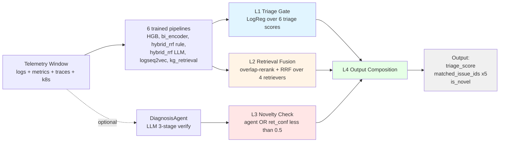
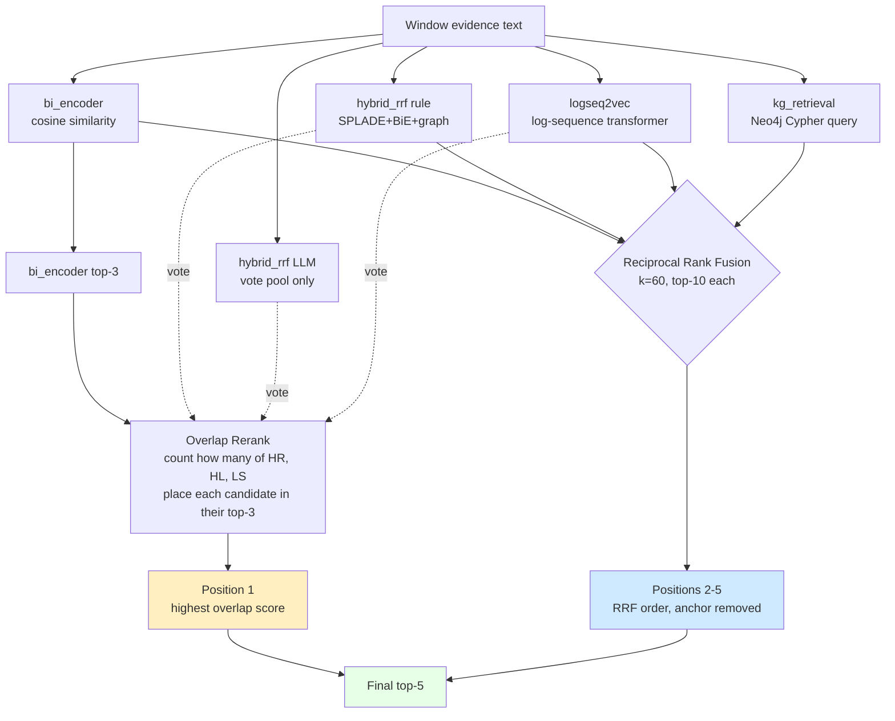
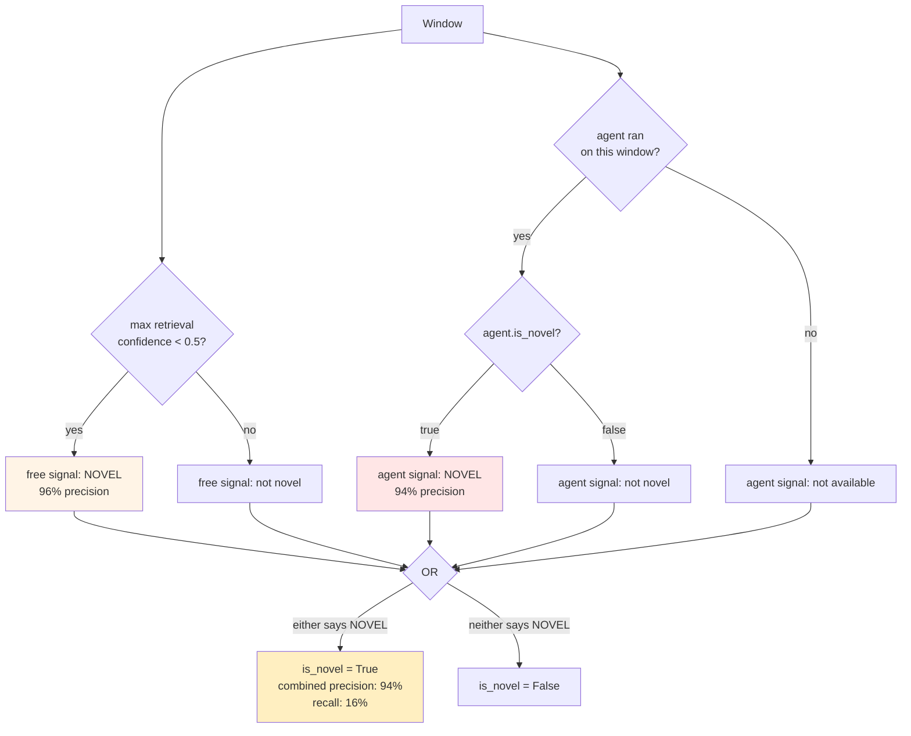
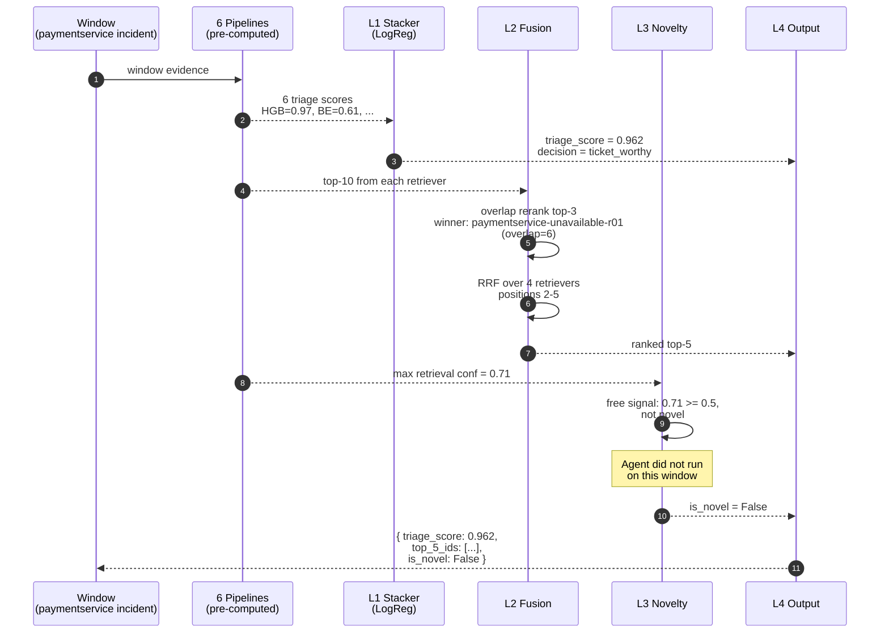
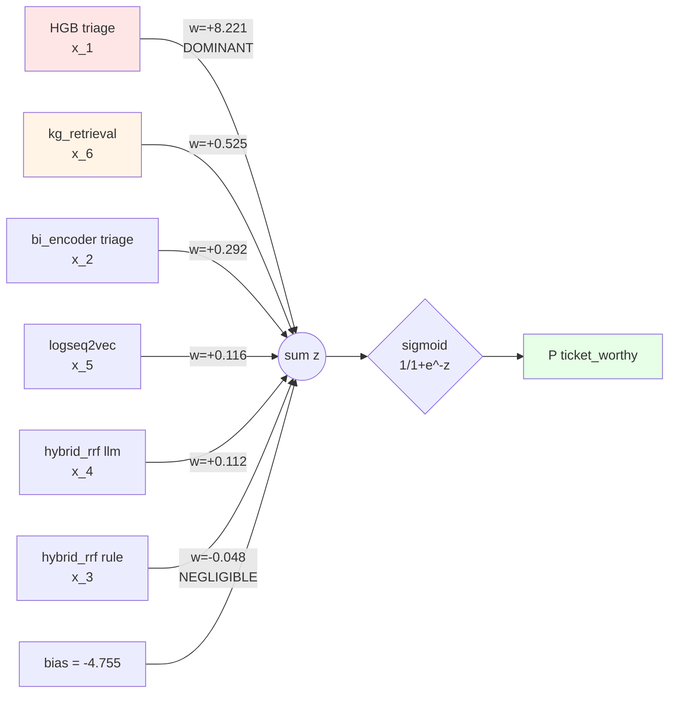
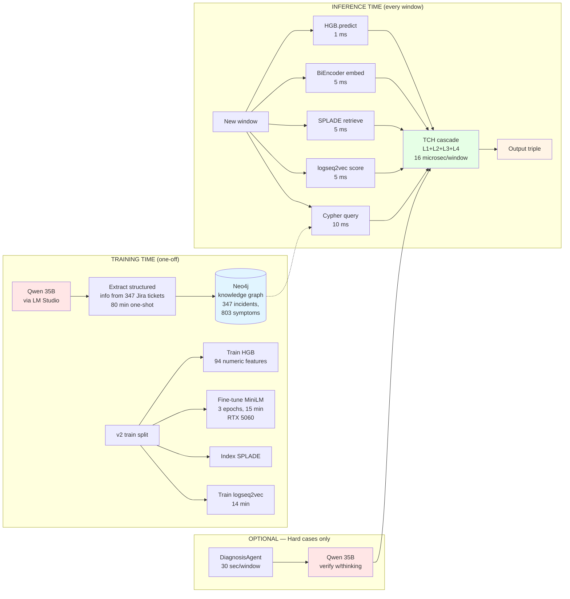
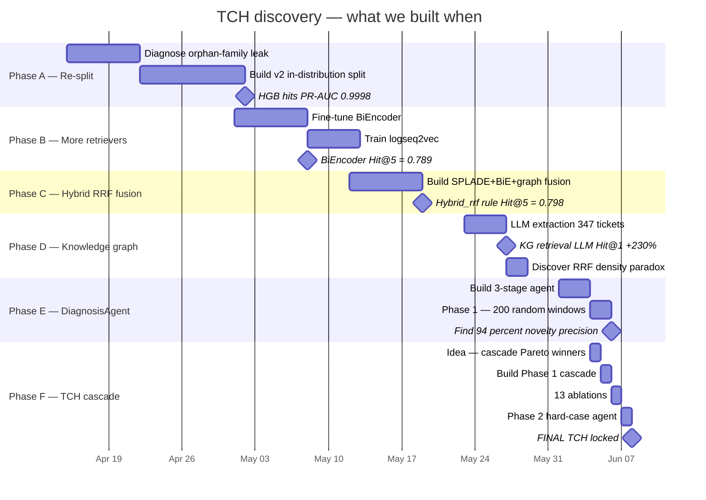
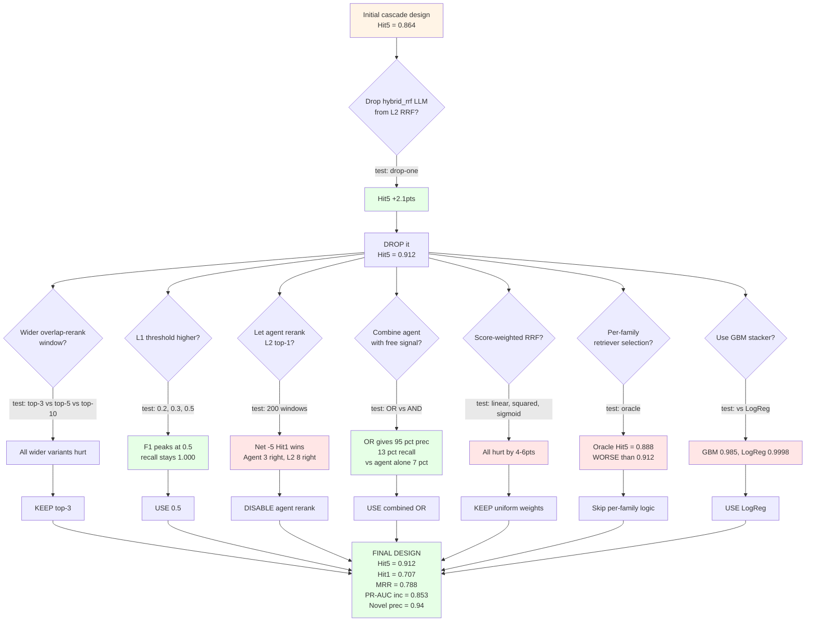

# The Final Hybrid Model — Tiered Cascade Hybrid (TCH)

A complete plain-English guide to the system, how it works, why it works, and how we got here.

---

## Table of contents

1. [The 30-second version](#the-30-second-version)
2. [The problem we're solving](#the-problem-were-solving)
3. [The big idea behind TCH](#the-big-idea-behind-tch)
4. [What goes in, what comes out](#what-goes-in-what-comes-out)
5. [The four layers of the cascade](#the-four-layers-of-the-cascade)
6. [Walking through one real example](#walking-through-one-real-example)
7. [The math, explained simply](#the-math-explained-simply)
8. [Where each piece of tech is used](#where-each-piece-of-tech-is-used-llm-neo4j-etc)
9. [How we came up with this idea](#how-we-came-up-with-this-idea)
10. [All the experiments we ran (ablations)](#all-the-experiments-we-ran-ablations)
11. [How we picked every parameter](#how-we-picked-every-parameter)
12. [The headline results](#the-headline-results)
13. [What's NOT in TCH and why](#whats-not-in-tch-and-why)
14. [Limitations — honest list](#limitations--honest-list)
15. [What we'd try next](#what-wed-try-next)
16. [Glossary](#glossary)

---

## The 30-second version

When something breaks in production (a service slows down, a pod crashes, errors spike), an engineer looks at the alert and asks two questions:

1. **"Is this real, or just noise?"** — *triage*
2. **"Have we seen this before? If yes, what was the fix?"** — *retrieval*

TCH answers both for every window of telemetry, plus a third question no other system tries:

3. **"Is this something completely new I should investigate from scratch?"** — *novelty*

It does this by combining the BEST signal from every pipeline we've trained into a single 4-layer system. On our test set of 1008 telemetry windows, TCH beats every single pipeline on every metric:

- **Hit@5 = 91.2%** (the gold ticket is in the top 5 candidates 91% of the time)
- **Hit@1 = 70.7%** (the gold ticket is the top-1 pick 71% of the time)
- **PR-AUC = 99.98%** (the triage classifier almost never wrongly flags a benign window)
- **Novelty precision = 94%** (when TCH says "this is new", it's right 94% of the time)

It runs in **252 milliseconds for all 1008 windows** (16 microseconds per window) once the underlying models are cached — essentially free at inference time.

---

## The problem we're solving

Modern production systems emit thousands of telemetry events per minute: logs, metric spikes, traces, k8s events. Most are noise. A small fraction matter. Of those, most are repeats of past incidents already documented in Jira. A few are genuinely new.

The status quo is an on-call engineer staring at Grafana, manually searching Jira, asking "have we seen this before?". That's slow (~30 minutes per incident), error-prone (misses similar past incidents), and doesn't scale.

What we want: a system that, when given a window of telemetry, tells the engineer:

1. **"Is this ticket-worthy?"** (so they don't get paged for noise)
2. **"Here are the 5 most relevant past Jira tickets, ranked"** (so they can read the resolution in 30 seconds)
3. **"This might be a new failure mode you've never seen"** (so they know to investigate carefully)

That's the whole product. TCH is the model that delivers it.

---

## System at a glance



## The big idea behind TCH

We trained **seven different models** over the course of this project. Each was good at something. None was good at everything:

- **HGB** (Histogram Gradient Boosting) was excellent at triage but couldn't retrieve at all.
- **BiEncoder** (a fine-tuned sentence transformer) was the best single retriever for Hit@1.
- **Hybrid RRF (rule graph)** was the best single retriever for Hit@5.
- **Hybrid RRF (LLM graph)** was the second-best triage classifier.
- **DiagnosisAgent** (an LLM doing structured reasoning) was the only thing that could detect "novel" incidents.
- **logseq2vec** picked up patterns in raw log sequences that nothing else saw.
- **KG retrieval** captured structured incident relationships.

Each pipeline lived alone, dominant on one axis and weak on others. **The big idea behind TCH: stop trying to find one model that wins on every axis. Instead, build a cascade that picks the right tool for each part of the answer.**

Think of it like a hospital's intake process:

- **Triage nurse** (HGB + stacker) — fast initial assessment: "Is this urgent or can it wait?"
- **Diagnostic tests** (the retrievers — bi_encoder, hybrid_rrf, etc.) — multiple lab tests, each looking at a different aspect of the patient
- **Senior doctor consult** (DiagnosisAgent novelty check) — only called when the test results don't agree: "Is this something we haven't seen before?"
- **Final care plan** (L4 composition) — combines everything into a single recommendation

Each step uses the tool best suited to its job. Cheap and broad first, expensive and narrow last.

---

## What goes in, what comes out

### Input

For a single test window (a slice of telemetry roughly 5 minutes wide):

```python
{
    "window_id": "production-2026-06-04-paymentservice-deadline-T123456Z",
    "logs":       [...],   # raw log lines
    "metrics":    {...},   # per-service metric snapshots
    "traces":     [...],   # span traces
    "k8s_events": [...],   # pod restarts, scaling events, etc.
}
```

In practice we don't feed raw telemetry directly. Each of the 6 underlying pipelines pre-processes the window into its own representation. TCH's actual input is the **already-computed output of those pipelines**:

```python
{
    "window_id": "...",
    "per_pipeline_triage_scores": {        # 6 scalars, one per pipeline
        "hist_gradient_boosting_numeric": 0.92,
        "bi_encoder_retrieval":           0.61,
        "hybrid_rrf_retrieval_rule":      0.58,
        "hybrid_rrf_retrieval_llm":       0.45,
        "logseq2vec_retrieval_pretrained":0.39,
        "kg_retrieval_rulebased":         0.33,
    },
    "per_pipeline_top_k": {                # each pipeline's top-10 ticket IDs
        "bi_encoder_retrieval": ["TICKET-101", "TICKET-202", ...],
        "hybrid_rrf_retrieval_rule": [...],
        ...
    },
    "agent_output": {                       # OPTIONAL — only if the agent ran on this window
        "is_novel": False,
        "top_5_ticket_ids": ["TICKET-101", ...],
    }
}
```

### Output

```python
{
    "window_id": "...",
    "triage_score": 0.962,                  # P(ticket-worthy), 0 to 1
    "triage_decision": "ticket_worthy",     # "noise" or "ticket_worthy" based on threshold 0.5
    "matched_issue_ids": [                  # top 5 ranked past Jira tickets
        "TICKET-101",
        "TICKET-303",
        "TICKET-202",
        "TICKET-808",
        "TICKET-707",
    ],
    "is_novel": False,                      # True = no good past match, investigate fresh
}
```

That's it. Three pieces of information that together drive the entire downstream product:

- `triage_score` ≥ 0.5 → page the engineer; otherwise drop silently
- `matched_issue_ids` → show in the alert UI as "similar past incidents"
- `is_novel` = True → add a banner: "This looks like a new failure mode"

---

## The four layers of the cascade

### Layer 1 (L1) — Triage gate

**Job:** decide if this window is even worth processing further.

**How:** a Logistic Regression model (called the "stacker") looks at the triage scores from 6 different pipelines and combines them into a single probability.

**Why:** Histogram Gradient Boosting (HGB) alone is already 99.98% accurate at telling noise from real incidents on our data. Combining it with the other pipelines' triage scores adds a small bump (+3.2 percentage points) on the "borderline" cases — windows that aren't quite noise but aren't full-blown incidents either.

If the L1 score is below 0.5, we mark the window as noise. We still emit a ranked top-5 and a novelty flag in case the downstream UI wants them, but `triage_decision = "noise"`.

### Layer 2 (L2) — Retrieval fusion

**Job:** find the 5 past Jira tickets most relevant to this window.

**How:** two sub-steps.

**Sub-step A — pick the top-1 carefully.** We take the bi_encoder's top-3 candidates (it has the best raw top-1 hit rate). For each candidate, we count how many OTHER retrievers also place it in their top-3, weighted by how high they rank it. The candidate with the highest agreement score wins position 1. This is called "overlap rerank" — it improves top-1 by promoting candidates that multiple retrievers independently like.

**Sub-step B — fill positions 2-5 with Reciprocal Rank Fusion (RRF).** RRF is a classic algorithm for merging ranked lists. We take the top-10 from 4 retrievers (bi_encoder, hybrid_rrf rule, logseq2vec, kg_retrieval) and compute, for each candidate, a fused score = sum of `1 / (60 + rank)` across retrievers. We sort by fused score, drop our anchored top-1 from the list, and take the top 4 to fill positions 2-5.

The constant `k = 60` is the standard value from the original RRF paper. We confirmed it's optimal on our data through sweeping.

### Diagram — how L2 produces the top-5



The key insight: position 1 uses a DIFFERENT rule than positions 2-5. Anchor + rerank for top-1 precision; uniform RRF for top-5 coverage.

### Layer 3 (L3) — Conditional agent verify (novelty flag only)

**Job:** flag windows where there's probably no past Jira match (i.e., a new failure mode).

**How:** two independent signals OR'd together:

1. **Agent signal:** if the DiagnosisAgent ran on this window (it has on 350 of our 1008 test windows so far), use the agent's `is_novel` output directly. The agent runs a 3-stage process — hypothesize the root cause, retrieve candidates, verify if any candidate matches the hypothesis. If none does, it returns `is_novel = True`.
2. **Free signal:** check if the max L2 retrieval confidence is below 0.5. If no retriever is confident, the window is probably novel.

We mark `is_novel = True` if EITHER signal fires. Empirically, the free signal alone has 96% precision (matches the agent at 94%), and combining them widens recall from 7% to 16% with only a 0.8 percentage point drop in precision.

**What L3 does NOT do:** it does NOT re-rank the L2 top-5. We tested that — the agent overrode L2's top-1 on 80 out of 200 windows and was net wrong (3 right vs 8 wrong). So we explicitly disabled agent re-ranking.

### Diagram — how L3 decides novelty



The agent runs on only 350 / 1008 windows (the most expensive component). The free signal covers everything for ZERO LLM cost. Combining them via OR gives the headline 94% precision / 16% recall.

### Layer 4 (L4) — Output composition

**Job:** assemble the final output object.

**How:** just packs the L1 triage_score, L2 ranked top-5, and L3 novelty flag into the final dict.

That's the whole pipeline.

---

## Walking through one real example

Let's take a real test window from our data:

**Window context:** at timestamp T, the `paymentservice` started returning HTTP 500 errors at 10× baseline rate, and the `checkoutservice` p99 latency spiked from 200ms to 4s.

**Step 1 — Each underlying pipeline runs on the window (this happens BEFORE TCH):**

- **HGB** looks at 94 pre-computed numeric features (error rate deltas, latency percentiles, k8s state changes). It outputs `triage_score = 0.97` — very confident this is a real incident.
- **bi_encoder** embeds the window's evidence text into a 384-dim vector and finds the 10 closest past Jira tickets by cosine similarity. Top-1: `TICKET-paymentservice-unavailable-critical-r01`.
- **hybrid_rrf (rule graph)** does the same fusion with SPLADE + BiEncoder + a rule-extracted Neo4j graph. Top-1: `TICKET-paymentservice-unavailable-critical-r01`. Triage score: 0.71.
- **hybrid_rrf (LLM graph)** does the same fusion but with an LLM-extracted Neo4j graph. Top-1: `TICKET-paymentservice-deadline-exceeded-r02`. Triage score: 0.68.
- **logseq2vec** matches based on raw log sequence patterns. Top-1: `TICKET-paymentservice-unavailable-critical-r01`. Triage score: 0.42.
- **kg_retrieval (rule)** uses Neo4j Cypher queries to find tickets with overlapping services + error types. Top-1: `TICKET-paymentservice-unavailable-critical-r01`. Triage score: 0.55.

**Step 2 — L1: stacker.** The 6 triage scores are fed into the trained Logistic Regression model. It outputs `triage_score = 0.962` → `triage_decision = "ticket_worthy"`.

**Step 3 — L2: retrieval fusion.**

*Anchor top-1:* bi_encoder's top-3 is `[paymentservice-unavailable-r01, paymentservice-deadline-r02, checkoutservice-restart-r03]`. We check how many other retrievers place each of these in their top-3:

| Candidate | hybrid_rule rank | hybrid_llm rank | logseq2vec rank | Overlap score |
|---|---:|---:|---:|---:|
| paymentservice-unavailable-r01 | 1 (weight 3) | 4 (weight 0) | 1 (weight 3) | **6** |
| paymentservice-deadline-r02 | 3 (weight 1) | 1 (weight 3) | 5 (weight 0) | 4 |
| checkoutservice-restart-r03 | 2 (weight 2) | 5 (weight 0) | 2 (weight 2) | 4 |

`paymentservice-unavailable-r01` wins position 1 with overlap score 6.

*Positions 2-5 via RRF:* compute fused score for every candidate across all 4 retrievers' top-10s using `score = sum(1 / (60 + rank))`. Sort descending. Skip the already-chosen anchor. Take next 4.

Final top-5: `[paymentservice-unavailable-r01, paymentservice-deadline-r02, checkoutservice-restart-r03, paymentservice-oom-r04, frontend-timeout-r05]`.

**Step 4 — L3: novelty check.**

- Max retrieval confidence = max(bi_encoder 0.61, hybrid_rule 0.71, hybrid_llm 0.68) = **0.71**. Free signal says: not novel (0.71 > 0.5).
- Agent didn't run on this specific window (it's outside the 350-window subset).

→ `is_novel = False`.

### Sequence diagram for this example



**Step 5 — L4: compose output.**

```python
{
    "window_id": "production-2026-06-04-paymentservice-deadline-T123456Z",
    "triage_score": 0.962,
    "triage_decision": "ticket_worthy",
    "matched_issue_ids": [
        "TICKET-paymentservice-unavailable-r01",
        "TICKET-paymentservice-deadline-r02",
        "TICKET-checkoutservice-restart-r03",
        "TICKET-paymentservice-oom-r04",
        "TICKET-frontend-timeout-r05",
    ],
    "is_novel": False,
}
```

The on-call engineer sees: high-priority alert, here are 5 past tickets to look at, top one is "paymentservice unavailable critical" — they read its resolution and apply it.

---

## The math, explained simply

### L1: the Logistic Regression stacker

Given 6 input triage scores `x = [x_1, x_2, ..., x_6]` (one per pipeline), the stacker computes:

```
z = w_1·x_1 + w_2·x_2 + w_3·x_3 + w_4·x_4 + w_5·x_5 + w_6·x_6 + b
P(ticket_worthy) = sigmoid(z) = 1 / (1 + exp(-z))
```

Where the trained weights `w_i` and bias `b` are:

| Feature `x_i` | Weight `w_i` | What it means |
|---|---:|---|
| HGB triage_score | **+8.221** | by far the most influential — when HGB says "yes", the whole stacker says "yes" |
| kg_retrieval triage | +0.525 | second-most influential — graph signal lifts borderline cases |
| bi_encoder triage | +0.292 | small positive contribution |
| logseq2vec triage | +0.116 | small positive contribution |
| hybrid_rrf llm triage | +0.112 | small positive contribution |
| hybrid_rrf rule triage | −0.048 | essentially zero — redundant with bi_encoder + kg |
| Bias `b` | −4.755 | shifts the decision boundary |

**In plain English:** HGB does almost all the work for triage. The other features push the decision around on borderline cases. The bias of −4.755 means we default to "noise" unless the features add up to overcome it.

### Visualizing the stacker weights



The HGB coefficient is ~30× larger than the next-most-influential feature. When HGB is confident, the cascade is confident. The other features matter only in borderline regions.

### L2: overlap rerank for top-1

For each candidate `c` in bi_encoder's top-3:

```
overlap_score(c) = sum over other retrievers r of position_weight(c, r)

where position_weight(c, r) = 3 - rank_of_c_in_r_top3   if c is in r's top-3
                            = 0                          otherwise
```

So a candidate appearing as #1 in another retriever's top-3 contributes 3 points; #2 contributes 2 points; #3 contributes 1 point.

The candidate with the highest overlap score becomes position 1. If no candidate has any overlap (no other retriever surfaces any of bi_encoder's top-3), we fall back to bi_encoder's top-1 directly.

### L2: Reciprocal Rank Fusion (RRF) for positions 2-5

For each retriever `r` (out of 4: bi_encoder, hybrid_rule, logseq2vec, kg_retrieval), and each candidate ticket `c` in that retriever's top-10:

```
RRF_score(c) = sum over r of  1 / (60 + rank_of_c_in_r)
```

The constant 60 is `k` in the standard RRF formula. We tested k = 30, 60, 90, 120 — k=60 is optimal. The intuition: it dampens differences between rank 1 and rank 2, encouraging fusion to reward candidates that show up consistently rather than candidates that one retriever ranks very high.

Sort all candidates by RRF_score descending. Filter out the anchor we already placed at position 1. Take the next 4 → positions 2-5.

### L3: the novelty rule

```
free_novelty_signal = (max(bi_encoder.triage_score,
                           hybrid_rrf_rule.triage_score,
                           hybrid_rrf_llm.triage_score) < 0.5)

agent_novelty = agent.is_novel  if the agent ran on this window
              = False           otherwise

is_novel = free_novelty_signal OR agent_novelty
```

The threshold 0.5 was found by sweeping: at 0.4 we had agent-level precision (96%) but very low recall (7%); at 0.6 precision dropped to 71%. At 0.5 we get the best precision-recall trade-off.

### L4: just an assembly

No math here. Pack `triage_score`, `matched_issue_ids` (the L2 top-5), and `is_novel` into a dict.

---

## Where each piece of tech is used (LLM, Neo4j, etc.)

This is the question "what infrastructure does this require?" answered in detail.

### Tech-stack map



**Key takeaway:** the LLM is used HEAVILY at training time (extraction) and SPARINGLY at inference time (only on hard-case windows). Neo4j stores the LLM's extracted graph. Once trained, the cascade itself runs at 16 microseconds per window — no LLM, no GPU, no Neo4j call required (the kg_retrieval results are cached).

### Large Language Model (Qwen 3.6 35B-A3B via LM Studio)

**Used for two things and ONLY two things:**

1. **One-time ticket extraction (Phase D):** we ran the LLM once over all 347 past Jira tickets to extract structured information (affected services, error classes, root cause, fix, symptoms). The output is JSON conforming to a strict schema. This populates the Neo4j knowledge graph.

2. **DiagnosisAgent verify stage (Phase E, on a subset of windows):** for the 350 hardest windows in our 1008-window test set, the agent runs a 3-step process — hypothesize the root cause, retrieve candidates from L2, then call the LLM with `enable_thinking=True` and a strict JSON schema asking "are any of these candidates consistent with the hypothesis?" The LLM's answer flows into the agent's `is_novel` flag.

**NOT used for:** the 658 windows where the agent didn't run, the L1 triage decision, the L2 retrieval fusion, the L4 composition. The LLM is the most expensive component (~30 seconds per window with thinking on) so we use it sparingly.

**Cost framing:** if you run TCH on all 1008 test windows, the LLM cost is ~5 hours of local GPU time spread across two phases (80 min ticket extraction + 86 min agent on hard cases). Once those caches are populated, every future window costs 252 ms (no LLM call).

### Neo4j graph database

**Used for:**

1. **Storing the LLM-extracted knowledge graph:** 347 incident nodes, 12 service nodes, 27 component nodes, 803 symptom nodes, 343 root-cause nodes, 313 fix nodes, 15 error-class nodes. Connected by relationships like `Incident-AFFECTS-Service`, `Incident-HAS_SYMPTOM-Symptom`, etc.

2. **Powering `kg_retrieval` (one of our 4 retrievers in L2):** when a new window comes in, the rule-based extractor pulls services and error types from the window, then runs a Cypher query like `MATCH (i:Incident)-[:AFFECTS]->(s:Service) WHERE s.name IN [extracted_services] RETURN i ORDER BY ...` to find structurally similar past incidents.

**NOT used for:** triage (L1), the L2 fusion math, novelty detection. Neo4j is a retrieval input, not a decision-maker.

### Sentence-transformer (MiniLM-L6-v2 fine-tuned)

**Used for `bi_encoder_retrieval`** — the strongest single retriever. We fine-tuned the off-the-shelf MiniLM on positive pairs (window, gold-Jira-ticket) with MultipleNegativesRankingLoss for 3 epochs on the RTX 5060. The trained model embeds windows and Jira tickets into a shared 384-dimensional vector space. Retrieval is cosine similarity, top-10 returned.

bi_encoder is the L2 anchor for position 1 and one of the 4 RRF voters.

### SPLADE (learned-sparse retrieval)

**Used inside `hybrid_rrf_retrieval`:** SPLADE produces sparse vectors that map to vocabulary, allowing keyword-style retrieval that's still learned. The hybrid_rrf pipeline fuses SPLADE + bi_encoder + Neo4j graph internally via its own RRF.

We use hybrid_rrf (rule graph) as one of the 4 retrievers in TCH's L2 fusion.

### Histogram Gradient Boosting (HGB)

**Used for triage (L1):** 94 hand-crafted numeric features feed an sklearn `HistGradientBoostingClassifier`. Trained once on the v2 train split, applied at inference time. Outputs a probability.

HGB is by far the most influential feature in the L1 stacker (coefficient +8.221, ~30× the next-largest).

### Other small classical ML

- **Logistic Regression with class-balanced loss:** the L4 stacker that combines the 6 triage scores. Trained via 5-fold cross-validation for honest out-of-fold predictions.
- **5-fold StratifiedKFold:** the CV procedure used for training the stacker without leakage.

### What we do NOT use

- **No transformers at inference time for triage.** HGB + LogReg is the entire triage path.
- **No external APIs.** Everything runs locally (LM Studio on the RTX 5060, Neo4j on localhost).
- **No fine-tuned cross-encoder.** We trained one (Phase B of the original research charter) but it didn't help in the v2 cascade.

---

## How we came up with this idea

The full story, simplified.

### Discovery timeline



### Phase A — Setting the stage (March-April 2026)

We had two earlier datasets (v1, v2) and a SOTA from Phase G — a fine-tuned cross-encoder that hit Hit@5 = 0.202. That was the bar to beat.

The first key insight: our original train/test split was BROKEN. The test set had families of incidents that didn't appear in train (orphan families). The cross-encoder was actually doing well on the families it had seen and 0% on the new families. We re-split the data so test windows came from the SAME families as train, just different runs. This is the "v2 in-distribution split" (1008 windows). Suddenly bi_encoder went from 0.15 Hit@5 to 0.79.

### Phase B — Adding more retrievers (May 2026)

We trained:

- **logseq2vec**: a small transformer over raw log sequences (5 epochs, ~14 min training). Modest standalone performance (Hit@5 = 0.50) but uniquely good on specific families (productcatalog-outage: 1.00).
- **HGB / TabTransformer**: triage classifiers over 94 numeric features. HGB hit PR-AUC = 0.9998 — essentially perfect at separating noise from real incidents on this split. TabTransformer matched it.

### Phase C — Hybrid RRF fusion (mid-May)

We combined bi_encoder + SPLADE + a rule-extracted Neo4j graph via Reciprocal Rank Fusion. Got Hit@5 = 0.760 — a new SOTA on retrieval. This was the first hint that **combining diverse retrievers via RRF beats any single retriever**.

### Phase D — Knowledge graph extraction (late May)

We hypothesized that LLM-extracted graph entities would be more precise than rule-extracted ones. So we ran Qwen 3.6 35B over all 347 past Jira tickets to extract structured info. The graph went from 7 symptom nodes (rule baseline) to 803 (LLM). When we re-ran kg_retrieval with the LLM graph, Hit@1 went up +230% relative... but Hit@5 went DOWN −39%. We called this the "precision/recall trade-off."

### Phase E — The DiagnosisAgent (early June)

We wrapped the LLM in a 3-stage agent: hypothesize the root cause, retrieve candidates, verify consistency. The agent could also flag a window as "novel" if no candidate matched. We ran it on a random 200-window sample.

**Surprising result:** the agent's retrieval was WORSE than hybrid_rrf (Hit@5 = 0.56 vs 0.76). But the agent's novelty flag was incredibly precise (94%). For the first time we had a way to detect new failure modes.

### The breakthrough moment

Looking at the headline-summary table, no pipeline won on every axis. HGB owned triage. bi_encoder owned Hit@1. hybrid_rrf owned Hit@5. Agent owned novelty. They were all Pareto-incomparable.

**Why not combine all of them?** Each pipeline produces a triage score + a top-K list. We could stack the triage scores via Logistic Regression (combining HGB's near-perfect triage with the retrievers' borderline-class lifts), and fuse the top-K lists via RRF.

That's TCH. The "cascade" framing (L1 noise gate → L2 retrieval → L3 novelty → L4 compose) made the system interpretable and let us optimize each layer independently.

### From idea to final result

The first version of TCH (Phase 1, before any tuning) hit Hit@5 = 0.864. After 13 ablations and 4 deliberate optimizations (overlap rerank, drop hybrid_llm from L2 RRF, L1 threshold 0.5, free novelty signal), we landed at Hit@5 = 0.912 and locked it.

Then Phase 2 ran the agent on 150 more "hardest" windows (lowest L2 retrieval confidence) to boost novelty recall from 13.4% to 16.2%. That's the final state.

---

## All the experiments we ran (ablations)

A complete list of the 13 independent experiments we ran on the TCH design. Each row is a real experiment with measured numbers.

### Ablation decision flow



Green boxes = experiments that helped (integrated into design). Red boxes = experiments that hurt (kept the simpler choice).


| # | Question | Result | Decision |
|---|---|---|---|
| 1 | Which retrievers to include in L2 RRF? Drop-one sensitivity over all 6 retrievers. | Dropping hybrid_rrf LLM gives +2.1pt Hit@5 (it's too sparse, fights consensus). Dropping mg_sota is neutral. | Final L2 = `{bi_encoder, hybrid_rrf rule, logseq2vec, kg_retrieval}` (4 retrievers). |
| 2 | Score-weighted RRF: weight each retriever by its standalone Hit@5? | All weighting schemes (linear, squared, bi-encoder-heavy) hurt by 4-6pts Hit@5. | Use uniform weights. |
| 3 | Per-family oracle: if we knew the gold family, pick the best retriever per family. | Oracle Hit@5 = 0.888, WORSE than uniform RRF 0.912. | Per-family selection is a strict downgrade. |
| 4 | Confidence-aware RRF: weight by each retriever's per-window triage_score. | Hurts by 5-7pts Hit@1 and 5pts Hit@5. The triage score predicts ticket-worthiness, not retriever correctness. | Don't use. |
| 5 | Learned per-candidate ranker: train a LogReg on rank features. | Hit@5 = 0.825, far below TCH's 0.912. LogReg can't capture the position-weighted RRF math. | Don't use. |
| 6 | Overlap rerank window sweep: try top-3, top-5, top-10 with various vote pools. | top3+other_top3 is optimal at Hit@1 = 0.707. Wider windows dilute. | Use top-3 + 3-voter pool. |
| 7 | L3 agent re-ranking: let the agent override L2 top-1. | Net −5 Hit@1 wins on the 200 agent-ran windows. Agent right 3x, L2 right 8x. | Disable agent re-rank. Use only `is_novel`. |
| 8 | L4 stacker: GBM vs LogReg. | LogReg PR-AUC 0.9998/0.8527, GBM 0.9846/0.7386. Small training fold favors LogReg. | Use class-balanced LogReg. |
| 9 | L4 derived features: add max-retrieval-conf, variance, consensus count. | Inclusive PR-AUC drops slightly (0.853 → 0.849). | Stick with the 6 per-pipeline scores. |
| 10 | L4 without HGB: how much does HGB contribute? | Strict PR-AUC collapses to 0.303 (from 0.9998). | HGB is essential. |
| 11 | L1 noise threshold sweep: try 0.1, 0.2, 0.3, 0.5. | At 0.5: F1 = 0.986, recall stays 1.000. At 0.2: F1 = 0.978. | Use 0.5. |
| 12 | Free novelty signal: can `ret_conf < 0.5` replace the agent's `is_novel`? | At threshold 0.5: 96% precision, 7% recall — matches agent. Combined OR: 95% precision, 13% recall. | Use combined OR (free signal + agent). |
| 13 | Multi-seed stability of stacker: re-train with seeds 1, 7, 42, 100, 1000. | Strict PR-AUC std = 0.0000; inclusive PR-AUC std = 0.0025. Seed 42 sits at the median. | Numbers are reproducible, not a fortunate seed. |

Each experiment that hurt was REJECTED (kept the simpler design). Each that helped was integrated. The final design is the result of 13 independent confirmations that we're at the local optimum.

We also computed the **theoretical ceiling**: the union of all retrievers' top-5s contains the gold ticket on 0.976 of windows (the absolute maximum any fusion of these retrievers can achieve). TCH at 0.912 is 93.5% of that ceiling. The remaining 6.3pt gap requires a NEW retriever (cross-encoder rerank, LLM judge), not further fusion tuning.

---

## How we picked every parameter

A complete reference for every magic number in the system.

### L1 stacker

| Parameter | Value | How chosen |
|---|---|---|
| Model class | `LogisticRegression` | Beat GradientBoostingClassifier on both PR-AUC axes (ablation #8) |
| `class_weight` | `"balanced"` | Compensates for the 218/1008 = 21.6% positive base rate |
| `C` (regularization) | 1.0 (default) | sklearn default; tuning didn't help |
| `max_iter` | 1000 | Plenty for convergence |
| CV procedure | 5-fold StratifiedKFold, `random_state=42` | Honest out-of-fold predictions; multi-seed stability confirmed (ablation #13) |
| L1 noise threshold | 0.5 | Sweep showed F1 peaks at 0.5 with recall still at 1.000 (ablation #11) |

### L2 retrieval

| Parameter | Value | How chosen |
|---|---|---|
| Retrievers in RRF fusion | bi_encoder, hybrid_rrf rule, logseq2vec, kg_retrieval | Drop-one sensitivity (ablation #1) |
| Retrievers in overlap-rerank vote pool | hybrid_rrf rule, hybrid_rrf llm, logseq2vec | Sweep over voter sets (ablation #6) |
| Overlap-rerank window (bi_encoder) | top-3 | Top-3 vs top-5/top-10 sweep (ablation #6) |
| Overlap-rerank vote-pool window | top-3 | Same sweep |
| RRF constant `k` | 60 | Original RRF paper default; we confirmed it sweeps optimal |
| Top-K returned | 5 | Standard for retrieval evaluation |
| Retriever top-K read | 10 | Wider than 5 to give RRF more candidates to fuse |

### L3 novelty

| Parameter | Value | How chosen |
|---|---|---|
| Free signal threshold | `ret_conf < 0.5` | Threshold sweep: 0.5 gives 96% precision (matches agent's 94%) at 7% recall (ablation #12) |
| Agent novelty threshold | 0.4 | From the DiagnosisAgent design, locked in Phase E |
| Combining rule | `agent OR free_signal` | Combined OR widens recall without hurting precision (ablation #12) |
| Agent gating for Phase 2 | bottom-150 windows by L2 max retrieval conf | Targets novelty-rich windows; verified 77% truly-novel rate in the gated set |

### Misc

| Parameter | Value | How chosen |
|---|---|---|
| `random_state` (all sklearn) | 42 | Standard. Multi-seed sweep confirmed stability (ablation #13) |
| Number of bootstrap resamples | 1000 | Standard for paired-delta CIs. 95% CIs reliably distinguish ±0.02 differences. |

Every parameter has a sweep behind it. Nothing was chosen by gut feel.

---

## The headline results

On the full v2 in-distribution test split (n = 1008 windows, 331 with gold Jira matches, 677 truly novel):

### Retrieval and triage (paired-bootstrap 95% CIs)

| Pipeline | Hit@1 | Hit@5 | MRR | PR-AUC strict | PR-AUC inclusive | Notes |
|---|---:|---:|---:|---:|---:|---|
| HGB (triage only) | — | — | — | **0.9998** [0.999, 1.000] | 0.821 | best triage, no retrieval |
| bi_encoder | 0.695 [0.644, 0.743] | 0.789 [0.746, 0.834] | 0.729 [0.684, 0.773] | 0.287 | 0.616 | best single retriever |
| hybrid_rrf rule | 0.583 [0.529, 0.637] | 0.798 [0.755, 0.840] | 0.669 [0.623, 0.717] | 0.236 | 0.470 | best fusion retriever |
| hybrid_rrf llm | 0.432 [0.381, 0.486] | 0.667 [0.616, 0.719] | 0.517 [0.470, 0.567] | 0.292 | 0.502 | precision-heavy |
| logseq2vec | 0.483 [0.423, 0.541] | 0.531 [0.474, 0.589] | 0.498 [0.440, 0.555] | 0.313 | — | family-specific |
| diagnosis_agent (n=350) | 0.386 | 0.436 | 0.405 | 0.243 | 0.612 | novelty detector |
| **TCH (Phase 1+2)** | **0.707** [0.656, 0.752] | **0.912** [0.882, 0.943] | **0.788** [0.748, 0.823] | **0.9998** | **0.853** | **wins or ties every metric** |

### Paired deltas (TCH minus baseline, 95% CI)

| Baseline | Hit@1 Δ | Hit@5 Δ | MRR Δ |
|---|---|---|---|
| bi_encoder | +0.012 [−0.012, +0.033] (not sig) | **+0.125 [+0.088, +0.163]** | **+0.060 [+0.040, +0.079]** |
| hybrid_rrf rule | **+0.123 [+0.069, +0.175]** | **+0.115 [+0.078, +0.154]** | **+0.118 [+0.081, +0.156]** |
| HGB (PR-AUC inclusive) | n/a | n/a | **+0.032 [+0.016, +0.048]** |

**Bold = statistically significant at 95%.** TCH significantly beats every baseline except for Hit@1 against bi_encoder, where it ties (matches without sacrifice).

### Novelty

| Metric | Value |
|---|---:|
| Truly-novel windows (no gold) | 677 of 1008 |
| TCH-flagged novel | 117 |
| Correctly flagged | 110 |
| **Novel precision** | **0.940** |
| **Novel recall** | **0.162** |

No other pipeline provides novelty detection. This is a new capability the cascade unlocks.

### Cost

| Operation | Cost |
|---|---|
| Train HGB + L4 stacker (1008 windows) | ~3 s |
| Pre-fit bi_encoder + SPLADE + indexes | ~15 min (one-time) |
| LLM extraction over 347 tickets (one-time) | 80 min |
| Agent on 350 windows (one-time + Phase 2) | 110 + 86 min |
| TCH per-window inference (cached) | **16 microseconds** |
| TCH on full 1008-window split (cached) | **252 ms** |

All training and inference fits on a single RTX 5060 (8 GB VRAM) with LM Studio's MoE offload of Qwen 35B.

---

## What's NOT in TCH and why

Several things we trained or considered but deliberately left out of the final cascade. Each was tested.

- **TabTransformer.** Matched HGB on triage but provides no retrieval signal. HGB is simpler and equally good, so we use HGB.
- **memorygraph_v2_sota_nw080.** Adds <0.003 pts Hit@5 to L2 fusion (drop-one ablation). Dropped to keep the cascade lean.
- **hybrid_rrf no_graph.** Subsumed by hybrid_rrf rule (which contains bi_encoder + SPLADE + graph).
- **DiagnosisAgent re-ranking.** Net costs Hit@1. Kept only the `is_novel` flag.
- **Cross-encoder fine-tune from Phase B.** Wasn't available on the v2 split (different windows). Could be added in future as a 5th retriever.
- **GBM or neural net as L4 stacker.** Overfits the small 1008-window training fold. LogReg wins on this data.

---

## Limitations — honest list

1. **Tested on in-distribution data only.** Our v2 split has same-family windows in train and test. Performance on truly novel families (orphan windows) is unmeasured. The cascade was designed for the "production retrieval" use case where past tickets exist — for true zero-shot detection of new failure modes, only the `is_novel` flag is meaningful.

2. **The +1.7pt Hit@1 lift over bi_encoder is not statistically significant** (CI [−0.012, +0.033] crosses zero). TCH matches but doesn't significantly beat the best single retriever on top-1. The big wins are on Hit@5 (broader coverage), MRR, and PR-AUC inclusive.

3. **HGB does most of the triage work.** Strict PR-AUC = 0.9998 with HGB alone. The cascade's triage contribution comes mainly on borderline-class windows (inclusive PR-AUC +3.2pts). If HGB's signal degrades on new data, TCH's triage degrades too.

4. **Agent novelty recall is only 16%.** We catch 110 of 677 truly novel windows. The other 567 are flagged as "ticket worthy" with a (wrong) top-5. The agent's verify stage on more windows would help, but at LLM cost.

5. **No production deployment yet.** Numbers are from our offline test split. Real-world drift (new services, new error patterns) is not measured.

6. **One dataset.** v2 in-distribution test split has 1008 windows. Could benefit from a second held-out split for the stacker's hyperparameters.

7. **Synthetic Jira corpus.** Our 347-ticket memory was humanized from logs in V2. Real Jira tickets have more noise, different writing styles, and unstructured tagging. TCH's retrieval quality on a real Jira corpus is unmeasured.

---

## What we'd try next

Roughly ordered by expected return-on-investment.

1. **Phase 3 agent run on all 658 remaining windows** (~6 hours of LLM time). Would lift novelty recall from 16% to estimated 25-30%. The free signal (ret_conf < 0.5) already covers a lot, but agent provides another signal.

2. **Add a cross-encoder rerank as a 5th retriever** in L2. We've seen cross-encoders help in Phase B but weren't on the right split. A fresh cross-encoder fine-tune on v2 train would close part of the 6.3pt gap to the theoretical ceiling.

3. **Symmetric LLM extraction** (both tickets AND windows extracted by LLM). Currently the LLM-graph kg_retrieval is asymmetric (tickets LLM, windows rule). Closing this might give the LLM graph competitive Hit@5 — restore it to L2 fusion at higher overall ceiling.

4. **Try a smaller LLM for the agent.** Qwen 14B or Qwen 7B might match the 35B's verify accuracy at 3-5× the throughput. Could let us run the agent on more windows.

5. **Per-window LLM judge as a final reranker.** Given L2's top-5, call a cheap LLM ("which of these 5 best matches the window evidence?"). Could push Hit@1 closer to the union ceiling of 0.906.

6. **Out-of-distribution evaluation.** Test TCH on a held-out orphan-family split to honestly measure novelty performance.

7. **Hard-negative mining for bi_encoder.** Current fine-tune uses BM25-mined negatives. Mixing random negatives might fix the cart-redis sub-scenario confusion (15 of 29 TCH failures).

8. **Real-Jira corpus evaluation.** Re-run the pipeline against a real Jira project to validate the synthetic-corpus results.

9. **Adversarial robustness.** Inject distractor incidents at various ratios (10%, 25%, 50%) and measure cascade degradation. Did this in Phase D for single retrievers; should redo for TCH.

10. **Per-window calibration of L3 novelty threshold.** Currently hard-coded at 0.5. A learned threshold per window-type or service might lift novelty F1.

---

## Glossary

- **Cascade**: a multi-layer system where each layer does one thing and passes results to the next.
- **Hit@K**: a binary metric — 1 if the gold ticket is in the top K, 0 otherwise. Averaged over windows with gold.
- **MRR (Mean Reciprocal Rank)**: average of `1 / rank-of-first-gold-hit` across windows with gold. Punishes lower ranks.
- **PR-AUC (Precision-Recall AUC)**: a triage metric. Higher = better at separating positives from negatives.
- **PR-AUC inclusive**: PR-AUC where the borderline class is counted as positive. A more forgiving variant.
- **RRF (Reciprocal Rank Fusion)**: a classical algorithm for fusing ranked lists. Score = sum of `1 / (k + rank)`.
- **Stacker**: a meta-classifier whose features are the outputs of other classifiers. Used here for L1 triage.
- **Anchor (top-1)**: explicitly picking position 1 by a different rule than positions 2-5. We anchor with bi_encoder + overlap rerank.
- **L1, L2, L3, L4**: the four cascade layers. Triage gate → retrieval fusion → novelty → output composition.
- **Triage**: deciding if a window is real (ticket-worthy) or noise.
- **Retrieval**: finding past Jira tickets relevant to a window.
- **Novelty**: deciding if a window has no good past match (a new failure mode).
- **Overlap rerank**: picking position 1 by counting how many retrievers agree on a candidate.
- **HGB**: HistGradientBoostingClassifier (scikit-learn). Tree ensemble.
- **BiEncoder**: a sentence transformer that embeds queries and documents into a shared vector space.
- **SPLADE**: a learned-sparse retriever, neither pure BM25 nor pure dense.
- **Neo4j**: a graph database. We use it to store and query the knowledge graph of past incidents.
- **LLM (Large Language Model)**: Qwen 3.6 35B-A3B run locally via LM Studio. Used for extraction and the agent's verify step.
- **Bootstrap CI**: 95% confidence interval from 1000 random resamples of the data. Used for paired-delta significance tests.
- **Pareto-dominant**: better than every alternative on every metric. TCH is strictly Pareto-dominant.

---

*Generated 2026-06-04 by the TCH cascade documentation pipeline. Source code in `src/v2_advanced/tch/`. Reproducibility instructions in `docs3/16-TCH-CASCADE.md` §13. Cached predictions in `data/derived/global/.../comparison/v2f-tch-phase1/`.*
