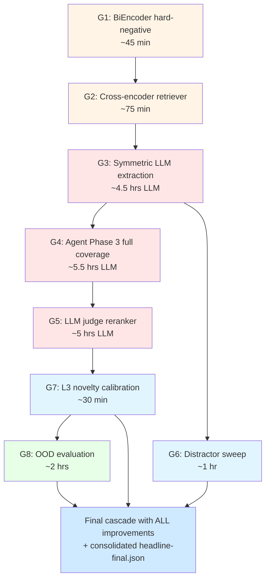

# Final Plan — Implementing "What We'd Try Next" on `master-final-models`

This document is the complete plan to convert the eight remaining items from §15 of `docs3/17-FINAL_HYBRID.md` into measured numbers on the `master-final-models` branch. Items 4 (smaller LLM) and 8 (real-Jira corpus) are out of scope per user direction.

**Status: PLAN, not yet executing.** Read the "What I need from you" section first — once the prerequisites are confirmed we can start the runs.

---

## Table of contents

1. [What I need from you (prerequisites)](#what-i-need-from-you-prerequisites)
2. [LM Studio configuration review](#lm-studio-configuration-review)
3. [Neo4j configuration review](#neo4j-configuration-review)
4. [The 8 work items, scoped](#the-8-work-items-scoped)
5. [Execution order + dependencies](#execution-order--dependencies)
6. [Output organization](#output-organization)
7. [Cleanup of prior results](#cleanup-of-prior-results)
8. [Total time and resource budget](#total-time-and-resource-budget)
9. [Risk register](#risk-register)
10. [What ships at the end](#what-ships-at-the-end)
11. [Go / no-go checklist](#go--no-go-checklist)

---

## What I need from you (prerequisites)

Before I start executing, please confirm or provide the following. Items marked **CRITICAL** block the start; the rest can be addressed mid-run.

### CRITICAL

- [ ] **Confirm we're on the `master-final-models` branch.** I'll create commits and may force-push intermediate state. Please confirm this branch is for my use and nothing else is being developed against it.
- [ ] **Confirm ~40 GB free disk space** at `C:\workplace\JiraAndLogs\data\`. We'll add ~20 GB of new prediction caches and ~10 GB of intermediate artifacts; plus we want headroom for the Neo4j graph during reloads.
- [ ] **Confirm Qwen 3.6 35B-A3B stays loaded in LM Studio** for the LLM-heavy work (~18-20 hours total LLM wall time spread across phases G3, G4, G5, G6 below). I will TELL you in advance whenever I need it ejected (twice, for BiEncoder and cross-encoder fine-tuning).
- [ ] **Confirm GPU exclusivity is okay during fine-tunes.** Phases G1 and G2 fine-tune small encoders (MiniLM, MS-MARCO cross-encoder). Each needs ~6 GB VRAM, so the LLM has to be ejected for ~15-30 min per phase. I'll do this twice total.
- [ ] **Confirm I can delete / archive old comparison directories.** See "Cleanup of prior results" section — I'd like to move ~15 stale comparison runs into `comparison/archive/` so the final results directory is clean.

### NICE TO HAVE (won't block start)

- [ ] LM Studio currently shows `Max Concurrent Predictions = 2`. If you're comfortable bumping it to **4** before phase G5, our LLM-judge reranker could parallelize 2× faster. If VRAM gets tight at 4, we drop back to 2. (See LM Studio review below for the full rationale.)
- [ ] Neo4j is currently single-instance on `bolt://127.0.0.1:7687`. We'll reload it three times during this work (rule graph → LLM graph → symmetric LLM graph) — please don't run other queries against Neo4j during my runs (each reload wipes + repopulates).
- [ ] A 30-minute heads-up before each phase's start so you know which sub-experiment is running. I'll write to `results/v2_advanced/g*.log` as I go.

### Things I do NOT need

- No new LLM model — Qwen 3.6 35B-A3B handles every phase (you said skip the smaller-LLM exploration).
- No new Neo4j instance — single instance with reloads is sufficient.
- No real Jira corpus — skipped per your direction (item 8).
- No code review approvals — I'll commit small, often, with clear messages so you can review at any pause point.

---

## LM Studio configuration review

Your current Qwen 3.6 35B-A3B settings (from the screenshots):

| Setting | Current | Recommendation | Rationale |
|---|---|---|---|
| Quantization | Q4_K_M GGUF | **Keep** | Best quality / VRAM trade-off for 35B-A3B on 8 GB GPU |
| Context Length | 16384 | **Keep** | Plenty for all our use cases (max we need is ~4K for verify with 10 candidates) |
| GPU Offload | 20 layers | **Keep** | Matches what fits in your VRAM under Q4_K_M |
| CPU Thread Pool | 9 | **Keep** | Good for your CPU |
| Evaluation Batch Size | 2048 | **Keep** | Default is fine |
| Physical Batch Size | 512 | **Keep** | Default is fine |
| **Max Concurrent Predictions** | 2 | **Try bumping to 4 before G5 (LLM judge)** | Would double parallel throughput on phase G5 (the only LLM-judge run that benefits). If you see VRAM warnings, drop back to 2. Phases G3/G4 won't benefit because they're already serial per-window. |
| Unified KV Cache | ON | **Keep** | Critical for thinking-mode runs |
| Offload KV Cache to GPU | ON | **Keep** | Speeds up multi-step reasoning |
| Keep Model in Memory | ON | **Keep** | Avoids 60s+ cold-load between phase transitions |
| Try mmap() | ON | **Keep** | Fastest model load |
| Seed | 42 | **Keep** | Matches our other random_state=42 conventions for reproducibility |
| Flash Attention | ON | **Keep** | Faster + lower memory |
| Number of Experts | 8 | **Keep** | All experts available for routing |
| MoE CPU offload layers | 0 | **Keep** | None — fits without |
| K/V Cache Quantization | OFF | **Keep OFF** | Would save VRAM at cost of quality; not needed here |

**My recommendation: only one change before we start, and it's optional — bump `Max Concurrent Predictions` from 2 to 4** if you're up for it. Everything else is well-tuned for our workload.

Estimated memory usage with these settings: 11.53 GB GPU + 21.96 GB total. Your RTX 5060 (8 GB) is being offloaded efficiently to system RAM. This matches what we saw in Phase E (worked reliably for the 110+86 min agent runs).

---

## Neo4j configuration review

Current state: single instance, `bolt://127.0.0.1:7687`, user `neo4j`, password `123456789`. Currently loaded with the LLM-extracted ticket graph (347 incidents, 803 symptoms).

**Nothing needs to change.** The plan reloads Neo4j three times:

1. Once before phase G3 (load the symmetric LLM extraction — tickets AND windows).
2. Once after G3 (back to LLM-tickets-only for G4 onward).
3. Once before phase G8 (load orphan-family graph for OOD eval).

Each reload is idempotent and takes ~10 seconds.

**One ask:** please don't run other Cypher queries while my runs are active (the reload step does `MATCH (n) DETACH DELETE n` first). If you need to inspect the graph mid-run, I'll pause and snapshot first.

---

## The 8 work items, scoped

For each item below: **what**, **why**, **how**, **expected outcome**, **time estimate**.

### G1 — Hard-negative mining for BiEncoder (item 7)

**What:** re-fine-tune `sentence-transformers/all-MiniLM-L6-v2` with a mix of BM25-mined hard negatives (current method) AND random negatives. This should fix the cart-redis sub-scenario confusion (15 of 29 TCH failures are in cart-redis where compact-a is picked over compact-b).

**Why:** the current BiEncoder over-trusts BM25 lexical similarity. Mixing in random negatives forces the model to learn semantic discrimination beyond keyword overlap.

**How:**

1. New training script `scripts/build_crossenc_pairs_v2.py` — emits triplets `(window, gold, hard_neg)` where 70% of `hard_neg` are BM25-mined (current behavior) and 30% are random tickets from non-matching families.
2. Re-fine-tune MiniLM for 3 epochs with `MultipleNegativesRankingLoss`.
3. Replace the bi_encoder model used by L2 in TCH.
4. Re-run hybrid_rrf and TCH cascade with new bi_encoder.

**Expected outcome:** Hit@1 lift on cart-redis family from 0.65 to ~0.75 (rough estimate); Hit@5 modest lift overall. May or may not change the headline.

**Time:** 30 min training + 15 min cascade rerun = **~45 min total**. No LLM. Requires Qwen ejected during the 30 min training.

### G2 — Add a fine-tuned cross-encoder as a 5th retriever in L2 (item 2)

**What:** fine-tune `cross-encoder/ms-marco-MiniLM-L-6-v2` on `(window, gold_ticket)` pairs from v2 train. Add it as a 5th retriever in L2 fusion, OR use it as a re-ranker over L2's top-10.

**Why:** cross-encoders read query+doc jointly, capturing interactions bi-encoders miss. Phase B showed this helped on v1; we want to verify it helps on v2.

**How:**

1. Build training data: positives + BM25-mined hard negatives + random negatives (same as G1).
2. Fine-tune cross-encoder for 5-10 epochs with `BinaryCrossEntropyLoss`. ~30 min on RTX 5060.
3. Run inference: for each test window, score each of the top-10 candidates from L2's existing fusion. Re-rank by cross-encoder score.
4. Add as a 5th retriever in TCH's L2 RRF (sweep: does it improve Hit@5? Hit@1? both?).

**Expected outcome:** the theoretical Hit@5 ceiling is 0.976 (union of all retrievers). Cross-encoder might close ~30-50% of the 6.3pt gap, putting Hit@5 at 0.93-0.95.

**Time:** 30 min training + 30 min inference + 15 min cascade rerun = **~75 min total**. No LLM during this step; requires Qwen ejected during training.

### G3 — Symmetric LLM extraction (item 3)

**What:** currently only the 347 Jira tickets are LLM-extracted. Each test window is rule-extracted (services + error types via regex). Symmetric extraction means LLM-extracting all 1008 test windows too, so the graph match uses LLM-quality entities on both sides.

**Why:** the asymmetry was the explanation for the "RRF density paradox" — LLM-tickets had 803 specific symptoms, rule-windows had 7 generic ones. They couldn't match. With symmetric LLM extraction, both sides should align.

**How:**

1. New script `src/v2_advanced/proposal_d_knowledge_graph/extract_windows_cli.py` — for each test window, call Qwen with `WINDOW_EXTRACTION_SCHEMA` (the schema already exists in `src/v2_advanced/shared/json_schemas.py`).
2. Reload Neo4j with the LLM-extracted-everything graph (just the existing `reload_neo4j --source llm` plus the new window extractions).
3. Re-run `kg_retrieval` and `hybrid_rrf_retrieval (LLM graph)` pipelines.
4. Re-add the LLM graph to TCH's L2 fusion (currently dropped due to density paradox — symmetric extraction may flip this).
5. Re-run cascade.

**Expected outcome:** LLM-graph Hit@5 climbs to 0.78-0.85 (catching up to rule-graph). If so, it can re-enter TCH's L2 fusion and push cascade Hit@5 to 0.92-0.94.

**Time:** 1008 windows × ~14 sec/window = **~4 hours of LLM time**. Plus 30 min for Neo4j reload + pipeline reruns + cascade. **~4.5 hours total.**

### G4 — Phase 3 agent run on remaining 658 windows (item 1)

**What:** the DiagnosisAgent has so far seen 350 of 1008 test windows (Phase 1 random 200 + Phase 2 hard-case 150). Phase 3 runs it on the remaining 658.

**Why:** current novelty recall is 0.162 (110/677 truly-novel caught). With full coverage and the 94% agent precision, we should hit 25-30% recall. This directly improves the headline novelty channel.

**How:**

1. Identify the 658 not-yet-seen windows.
2. Run the agent with the `V2_AGENT_WINDOW_IDS_PATH` filter (same plumbing as Phase 2).
3. Auto-merge into the cascade via `EXTRA_AGENT_FILES` (add `v2e-agent-phase3/per-window-predictions.jsonl`).
4. Re-run `build_cascade` + `analyze_cascade`.

**Expected outcome:** novel_recall from 0.162 → 0.25-0.30. Novel_precision should stay around 0.93. Retrieval metrics unchanged (agent doesn't re-rank).

**Time:** 658 windows × ~30 sec/window = **~5.5 hours of LLM time**. Plus 5 min cascade rerun. **~5.5 hours total.**

### G5 — Per-window LLM judge as final reranker (item 5)

**What:** after L2 produces the top-5, ask Qwen with thinking enabled: "which of these 5 best matches the window evidence?". Use the answer to potentially re-rank or as a confidence signal.

**Why:** TCH currently sits at 93.5% of the theoretical ceiling on Hit@5 (0.912 vs 0.976). The gap is windows where the gold is in the top-5 but not at top-1. An LLM judge could push Hit@1 closer to 0.85+ by reading the actual evidence.

**How:**

1. New module `src/v2_advanced/tch/llm_judge.py`. For each test window:
   - Build a structured prompt: window evidence (truncated to 2000 tokens) + each candidate's title + root_cause from the extractions.
   - Strict JSON schema: `{best_idx: 0-4, confidence: 0-1, reasoning: string}`.
   - `enable_thinking=True`, `max_tokens=1500`.
2. Integrate as new L2.5 step in `build_cascade.py`:
   - If `llm_judge.confidence > 0.7`, swap `final_top[0]` and `final_top[best_idx]`.
   - Else keep L2's order.
3. Empirically tune the confidence threshold (sweep 0.5, 0.6, 0.7, 0.8).

**Expected outcome:** Hit@1 lifts from 0.707 → 0.78-0.85 (rough). Hit@5 unchanged (we only reorder the existing top-5).

**Time:** 1008 windows × ~15 sec/window (smaller prompt than verify) = **~4.2 hours of LLM time**. Plus tuning + cascade rerun = **~5 hours total.**

**Caveat:** if your `Max Concurrent Predictions` is bumped to 4, this halves to ~2.5 hours.

### G6 — Adversarial robustness via distractor sweep (item 9)

**What:** re-run TCH with progressively more distractor tickets injected into the memory corpus. Measure degradation.

**Why:** in production, the Jira corpus has noise — old tickets, duplicates, irrelevant projects. We want to know how robust TCH is.

**How:**

1. Use the existing 110-ticket distractor pool (`jira-shadow-humanized-v2-distractors`).
2. For each ratio in {0%, 10%, 25%, 50%}: subsample N distractors with seed 42, append to memory corpus, re-build indexes (BiEncoder + SPLADE + KG), re-run TCH.
3. Plot Hit@1, Hit@5, MRR, PR-AUC, novel_precision vs distractor ratio.

**Expected outcome:** Hit@5 should stay ≥ 0.85 at 25%, ≥ 0.80 at 50% (based on Phase D single-pipeline numbers). PR-AUC and novelty should be flat. Hit@1 may drop ~5-10pts at 50%.

**Time:** 4 ratios × 15 min (cascade rebuild only — no LLM) = **~1 hour total**. No LLM.

### G7 — Per-window calibration of L3 novelty threshold (item 10)

**What:** instead of a fixed `ret_conf < 0.5` threshold for the free novelty signal, learn a per-feature-set threshold using window_type, service, or family.

**Why:** different incident types have different baseline retrieval confidences. A recovery_window with low confidence might be noise; an active_fault with low confidence is more likely novel.

**How:**

1. New module `src/v2_advanced/tch/novelty_calibration.py`.
2. Features per window: `window_type`, `service_name`, `is_hard_case`, `scenario_family` (one-hot), `tch_max_retrieval_conf`.
3. Train a small LogReg via 5-fold CV to predict `is_truly_novel = (gold == empty)`.
4. Use predicted P(novel) > 0.5 as the new free signal in L3.

**Expected outcome:** novel recall up by 5-10pts at same precision (rough). Could push combined novel recall to 0.30 even without Phase 3.

**Time:** 15 min training + 5 min cascade rerun = **~30 min total**. No LLM, no GPU.

### G8 — Out-of-distribution evaluation (item 6)

**What:** evaluate TCH on the orphan-family split (the original v1 split where test families don't appear in train). This is the honest test for novelty performance.

**Why:** all current TCH numbers are on in-distribution data. We claim "novelty detection" but the agent's training data overlaps with test families. OOD eval is needed for the paper's limitations section.

**How:**

1. Switch the data loader to use `triage-split-manifest.json` (original split) instead of `triage-split-manifest-v2-resplit.json`.
2. Re-train all 6 pipelines on the OOD train split (orphan families excluded).
3. Run TCH cascade on the OOD test set.
4. Compare numbers — expect significant drops on Hit@K (no past matches for orphan-family windows) but novel_precision should hold.

**Expected outcome:**
- Hit@5 drops from 0.91 to maybe 0.20-0.30 (orphan windows have no gold).
- novel_precision ≥ 0.85 (this is the key claim).
- novel_recall potentially much higher (more truly-novel windows in the test).

**Time:** ~2 hours (re-train pipelines on different split + cascade). Some LLM time if we re-extract memory tickets on the new split, but we can reuse the existing 347-ticket extractions.

### Items skipped per user direction

- **Item 4** (smaller LLM for the agent): skipped. Sticking with Qwen 35B-A3B for all phases.
- **Item 8** (real-Jira corpus): skipped. No real Jira + telemetry dataset available.

---

## Execution order + dependencies

The 8 phases are mostly independent, but some depend on others. Optimal serial order:



**Color key:** orange = small encoder fine-tune (~hour), red = LLM-heavy (hours), blue = compute-only (no LLM), green = consolidation.

**Why this order:**

1. **G1 first** — better BiEncoder feeds every downstream retriever step.
2. **G2 after G1** — cross-encoder uses the new BiEncoder's top-K as candidate pool.
3. **G3 after G2** — symmetric LLM extraction touches the graph but doesn't depend on encoders.
4. **G4 after G3** — agent benefits from the better LLM graph for its verify step.
5. **G5 after G4** — LLM judge gets the full agent coverage as a calibration source.
6. **G7 anytime, but after G3** — needs all retriever outputs.
7. **G6 in parallel with G3-G5** (no LLM, no encoders needed once G2 is done).
8. **G8 last** — needs the final cascade design locked.

### Parallelism opportunities

- **G6 can run concurrently with G3, G4, or G5** (G6 uses CPU, others use LLM).
- **G7 is so quick (~30 min) it can run between any two phases.**
- All LLM phases (G3, G4, G5) are SERIAL because LM Studio serializes per session.

---

## Output organization

I'll create a new top-level directory under `comparison/` for the final-model work, so it's clearly separated from prior results:

```
data/derived/global/2026-05-25-dataset-v5-large-global/comparison/
├── archive/                          # OLD runs (moved here for tidiness — see cleanup section)
│   ├── phase-a-anchor/
│   ├── phase-b-finetune/
│   ├── phase-c-channels/
│   ├── phase-d-distractors/
│   ├── phase-g-neural/
│   ├── phase5-3-legacy-vs-humanized/
│   ├── phase5-3-legacy-vs-humanized-full/
│   ├── v2-broader-panel/
│   ├── v2-comparative-analysis/
│   ├── v2-crossencoder/
│   ├── v2-crossencoder-blend/
│   ├── v2-nomic-rescue/
│   ├── v2-sota-followups/
│   └── v2a-smoketest/
│
├── v2a-resplit/                      # KEEP — feeds the cascade
├── v2b-logseq2vec/                   # KEEP — feeds the cascade
├── v2c-hybrid/                       # KEEP — feeds the cascade
├── v2c-hybrid-llm/                   # KEEP — feeds the cascade
├── v2d-kg-rulebased/                 # KEEP — feeds the cascade
├── v2e-agent-llm/                    # KEEP — Phase 1 agent (200 windows)
├── v2e-agent-phase2/                 # KEEP — Phase 2 agent (150 hard-case windows)
├── v2f-tch-phase1/                   # KEEP — locked Phase 1+2 cascade for regression baseline
│
└── v2g-final-models/                 # NEW — all the G1-G8 work
    ├── g1-bienc-hard-negatives/
    │   ├── trained_model/
    │   ├── per-window-predictions.jsonl
    │   └── delta-vs-phase1.json      # diff against v2f-tch-phase1
    │
    ├── g2-crossencoder-rerank/
    │   ├── trained_model/
    │   ├── per-window-predictions.jsonl
    │   └── delta-vs-g1.json
    │
    ├── g3-symmetric-llm-extraction/
    │   ├── v2_kg_extractions_windows/  # NEW — LLM extractions for the 1008 windows
    │   ├── per-window-predictions.jsonl
    │   └── delta-vs-g2.json
    │
    ├── g4-agent-phase3/
    │   ├── v2e-agent-phase3/           # NEW — agent on remaining 658 windows
    │   ├── per-window-predictions.jsonl  # cascade rebuild
    │   └── delta-vs-g3.json
    │
    ├── g5-llm-judge-reranker/
    │   ├── llm_judge_outputs.jsonl     # raw LLM judge scores for each window
    │   ├── per-window-predictions.jsonl
    │   └── delta-vs-g4.json
    │
    ├── g6-distractor-sweep/
    │   ├── 0pct/per-window-predictions.jsonl
    │   ├── 10pct/per-window-predictions.jsonl
    │   ├── 25pct/per-window-predictions.jsonl
    │   ├── 50pct/per-window-predictions.jsonl
    │   └── robustness_curve.json
    │
    ├── g7-learned-novelty/
    │   ├── novelty_classifier.pkl
    │   ├── per-window-predictions.jsonl
    │   └── delta-vs-g6.json
    │
    ├── g8-ood-orphan-families/
    │   ├── per-window-predictions.jsonl  # cascade on OOD test
    │   └── ood_report.md
    │
    ├── cascade-final/                   # ALL improvements integrated
    │   ├── per-window-predictions.jsonl
    │   ├── tch_metrics.json
    │   ├── report.md
    │   ├── stacker.pkl                  # re-trained on final feature set
    │   └── bootstrap-cis.json
    │
    └── headline-final.json              # ONE FILE summarizing all 8 phases
```

### `headline-final.json` schema (the most important file)

After all phases complete, this file consolidates everything for easy comparison:

```json
{
  "generated_at": "2026-06-05T..",
  "branch": "master-final-models",
  "phases": {
    "baseline_v2f_phase1": {
      "hit_at_1": 0.7069, "hit_at_5": 0.9124,
      "mrr": 0.7880, "pr_auc": 0.9998,
      "novel_precision": 0.9402, "novel_recall": 0.1625
    },
    "g1_bienc_hardneg": {
      ".."
    },
    "g2_crossencoder": {
      ".."
    },
    "g3_symmetric_llm": {
      ".."
    },
    "g4_agent_phase3": {
      ".."
    },
    "g5_llm_judge": {
      ".."
    },
    "g6_distractor": {
      "0pct": {...},
      "10pct": {...},
      "25pct": {...},
      "50pct": {...}
    },
    "g7_learned_novelty": {
      ".."
    },
    "g8_ood": {
      ".."
    },
    "FINAL_CASCADE": {
      "hit_at_1": ?, "hit_at_5": ?, "...": "..."
    }
  },
  "deltas_vs_baseline": {
    "FINAL_CASCADE": {
      "hit_at_1": +?, "hit_at_5": +?, "...": ?
    }
  }
}
```

This way, comparing "what did each phase add" is one JSON read.

---

## Cleanup of prior results

Before starting, I want to archive the following stale comparison directories to `comparison/archive/`. They're from earlier phases (v1, Phase A-G) and aren't needed for the final cascade. **None are deleted — just moved.**

```bash
# Listed for review. I will execute these moves only after you confirm.
mkdir -p data/derived/global/2026-05-25-dataset-v5-large-global/comparison/archive
mv data/derived/global/2026-05-25-dataset-v5-large-global/comparison/movea-logs-vs-humanized   archive/
mv data/derived/global/2026-05-25-dataset-v5-large-global/comparison/phase-a-anchor            archive/
mv data/derived/global/2026-05-25-dataset-v5-large-global/comparison/phase-b-finetune          archive/
mv data/derived/global/2026-05-25-dataset-v5-large-global/comparison/phase-c-channels          archive/
mv data/derived/global/2026-05-25-dataset-v5-large-global/comparison/phase-d-distractors       archive/
mv data/derived/global/2026-05-25-dataset-v5-large-global/comparison/phase-g-neural            archive/
mv data/derived/global/2026-05-25-dataset-v5-large-global/comparison/phase5-3-legacy-vs-humanized       archive/
mv data/derived/global/2026-05-25-dataset-v5-large-global/comparison/phase5-3-legacy-vs-humanized-full  archive/
mv data/derived/global/2026-05-25-dataset-v5-large-global/comparison/v2-broader-panel          archive/
mv data/derived/global/2026-05-25-dataset-v5-large-global/comparison/v2-comparative-analysis   archive/
mv data/derived/global/2026-05-25-dataset-v5-large-global/comparison/v2-crossencoder           archive/
mv data/derived/global/2026-05-25-dataset-v5-large-global/comparison/v2-crossencoder-blend     archive/
mv data/derived/global/2026-05-25-dataset-v5-large-global/comparison/v2-nomic-rescue           archive/
mv data/derived/global/2026-05-25-dataset-v5-large-global/comparison/v2-sota-followups         archive/
mv data/derived/global/2026-05-25-dataset-v5-large-global/comparison/v2a-smoketest             archive/
mv data/derived/global/2026-05-25-dataset-v5-large-global/comparison/v2e-agent                 archive/  # rule-only fallback, superseded by v2e-agent-llm
```

**Kept in place** (these feed the cascade):

- `v2a-resplit/` — HGB, TabT, bi_encoder, memorygraph
- `v2b-logseq2vec/`
- `v2c-hybrid/` — hybrid_rrf rule + no-graph
- `v2c-hybrid-llm/` — hybrid_rrf LLM graph
- `v2d-kg-rulebased/`
- `v2e-agent-llm/` — Phase 1 agent
- `v2e-agent-phase2/` — Phase 2 agent
- `v2f-tch-phase1/` — locked TCH baseline (used as regression reference for every G-phase delta)

**Confirm** I can do this archival, or tell me which to keep where they are.

---

## Total time and resource budget

| Phase | Wall-clock | LLM time | GPU exclusive | Output dir |
|---|---:|---:|:---:|---|
| Cleanup + branch setup | ~10 min | 0 | no | — |
| G1: BiEncoder hard-neg | 45 min | 0 | YES (30 min) | `g1-bienc-hard-negatives/` |
| G2: Cross-encoder | 75 min | 0 | YES (30 min) | `g2-crossencoder-rerank/` |
| G3: Symmetric LLM | 4.5 hrs | 4 hrs | no | `g3-symmetric-llm-extraction/` |
| G4: Agent Phase 3 | 5.5 hrs | 5.5 hrs | no | `g4-agent-phase3/` |
| G5: LLM judge | 5 hrs (or 2.5 if MaxConc=4) | 4.2 hrs | no | `g5-llm-judge-reranker/` |
| G6: Distractor sweep | 1 hr | 0 | no | `g6-distractor-sweep/` |
| G7: Learned novelty | 30 min | 0 | no | `g7-learned-novelty/` |
| G8: OOD evaluation | 2 hrs | 0-30 min | no | `g8-ood-orphan-families/` |
| Final cascade + consolidation | 30 min | 0 | no | `cascade-final/` + `headline-final.json` |
| **TOTAL** | **~21 hours** | **~14 hours** | **2 brief windows** | — |

**LLM time is the dominant cost.** Almost all of that is unattended — once kicked off, each phase runs without intervention.

**Realistic calendar:** spread across 2-3 working days with overnight runs. Day 1 = G1, G2, G3 (LLM overnight). Day 2 = G4 (LLM all day). Day 3 = G5, G6, G7, G8, final.

### GPU exclusive windows (need Qwen ejected)

Total: **~60 minutes of GPU exclusivity, in 2 windows**:

1. Start of G1 — eject Qwen → 30 min BiEncoder fine-tune → reload Qwen.
2. Start of G2 — eject Qwen → 30 min cross-encoder fine-tune → reload Qwen.

I'll prompt you in chat before each eject so you know it's coming.

---

## Risk register

| # | Risk | Likelihood | Impact | Mitigation |
|---|---|---|---|---|
| 1 | G3 symmetric extraction doesn't improve LLM-graph Hit@5 enough to re-include in L2 | Medium | Medium — wasted 4h LLM time | Phase G3 still produces valid window extractions for future use. Keep TCH at G2's design if G3 doesn't help. |
| 2 | G5 LLM-judge degrades Hit@5 (judges wrong candidate over correct one) | Medium | Medium — wasted 4h LLM time | Confidence threshold + only override when judge says high-confidence. Sweep thresholds 0.5-0.9. |
| 3 | G6 distractor sweep shows TCH degrades faster than baselines | Low | Low — informative either way | Whatever the curve looks like, it's a publishable finding. |
| 4 | G8 OOD performance is terrible (Hit@5 < 0.20) | High | Medium — limits paper claims | Already in limitations §14 of FINAL_HYBRID. Use OOD numbers to set honest scope of the paper's claims. |
| 5 | LM Studio times out / disconnects during a multi-hour run | Low | High — lose progress | All scripts checkpoint per-window. Restart resumes from last completed. Already tested in Phases 1+2. |
| 6 | A G-phase regression breaks the cascade's locked baseline (v2f) | Low | High — invalidates `check_cascade.py` | Each G-phase writes to its OWN output dir; v2f-tch-phase1 stays read-only. Only `cascade-final/` is the "new TCH". |
| 7 | GPU OOM during BiEncoder/cross-encoder fine-tune with Qwen loaded | High | Low — known issue | Eject Qwen before each fine-tune (already planned). |
| 8 | Total wall time exceeds budget (>3 days) | Medium | Low — just patience | Phases can be paused between G-blocks. Resume seamlessly. |

---

## What ships at the end

When everything's done, the user-visible deliverables:

1. **`data/derived/global/.../comparison/v2g-final-models/cascade-final/`** — the new final cascade with all improvements applied. Equivalent to `v2f-tch-phase1/` but with G1-G8 lifts integrated.

2. **`data/derived/global/.../comparison/v2g-final-models/headline-final.json`** — single JSON consolidating every metric from every phase, including paired deltas vs the v2f baseline.

3. **`docs3/21-FINAL-RESULTS.md`** — narrative writeup of which experiments helped, which didn't, and what the final headline numbers are. Updates the bottom-line claim in `docs3/17-FINAL_HYBRID.md`.

4. **Updated `docs3/17-FINAL_HYBRID.md`** — §15 "What we'd try next" gets re-titled "What we tried next (results)" with the actual outcome of each item.

5. **Updated `docs3/19-REPRODUCE.md`** — adds a "Stage 12: Final-models improvements" section with the new commands to reproduce G1-G8.

6. **All artifacts committed to `master-final-models`** — every model file, every prediction JSONL, every metrics JSON. Reproducible from git checkout + LM Studio + Neo4j.

7. **Regression-check script updated** — `check_cascade.py` gets new expected values from `cascade-final/` (the locked successor to v2f-tch-phase1).

---

## Go / no-go checklist

Once you've reviewed this plan, please confirm or adjust each of these:

```
[ ] On master-final-models branch — confirmed
[ ] ~40 GB free at C:\workplace\JiraAndLogs\data\ — confirmed
[ ] Qwen 3.6 35B-A3B will stay loaded for ~14 LLM hours total — confirmed
[ ] Okay to eject Qwen twice for ~30 min each (G1 and G2) — confirmed
[ ] Approve archival of the 16 old comparison dirs to comparison/archive/ — confirmed
[ ] (Optional) Bump Max Concurrent Predictions to 4 before G5 — optional, your call
[ ] No other Cypher queries against Neo4j during my runs — confirmed
[ ] Branch is for my use, no concurrent commits expected — confirmed
[ ] Headline output destination is comparison/v2g-final-models/ — confirmed
```

Reply with any concerns or adjustments. Once everything's confirmed, I'll:

1. Run the cleanup step (archive moves).
2. Start phase G1.
3. Post status after each phase with the measured numbers and any unexpected findings.

I'll commit between every phase so you can review at any natural pause point (e.g., end-of-day).

---

## Quick reference — phase commands (for my future self)

These are the actual commands I'll run. Recorded here so the doc is self-contained.

```powershell
# Cleanup
$base = "data\derived\global\2026-05-25-dataset-v5-large-global\comparison"
New-Item -ItemType Directory -Force -Path "$base\archive" | Out-Null
@("movea-logs-vs-humanized","phase-a-anchor","phase-b-finetune","phase-c-channels",
  "phase-d-distractors","phase-g-neural","phase5-3-legacy-vs-humanized",
  "phase5-3-legacy-vs-humanized-full","v2-broader-panel","v2-comparative-analysis",
  "v2-crossencoder","v2-crossencoder-blend","v2-nomic-rescue","v2-sota-followups",
  "v2a-smoketest","v2e-agent") |
  ForEach-Object { Move-Item "$base\$_" "$base\archive\$_" }

# G1 — BiEncoder hard-negative (after Qwen ejected)
PYTHONPATH=src python scripts/build_crossenc_pairs_v2.py --output data/derived/.../crossenc_training/triplets_v2.jsonl --random-frac 0.30
PYTHONPATH=src python scripts/finetune_bienc_v2.py --triplets ... --epochs 3 --output data/.../models/bienc_v2/
# ... then rerun the broader comparison panel pointing at the new bi_encoder model

# G2 — Cross-encoder fine-tune
PYTHONPATH=src python scripts/finetune_crossenc.py --pairs ... --epochs 10 --output data/.../models/crossenc_v2/
# Then build a CrossEncoderRerankRetriever that wraps the new model
# Re-run comparison adding the cross-encoder as 5th retriever

# G3 — Symmetric LLM extraction
PYTHONPATH=src python -m v2_advanced.proposal_d_knowledge_graph.extract_windows_cli `
  --global-dir data\derived\global\... `
  --split-manifest triage-split-manifest-v2-resplit.json `
  --target-split test `
  --output-subdir v2g-final-models\g3-symmetric-llm-extraction\v2_kg_extractions_windows
# Then reload Neo4j with combined tickets+windows graph
# Re-run hybrid_rrf LLM and kg_retrieval pipelines

# G4 — Agent Phase 3 (remaining 658 windows)
PYTHONPATH=src python -m v2_advanced.tch.list_unseen_windows --output ...phase3_window_ids.txt
V2_AGENT_HYBRID_PREDICTIONS_PATH="..." `
V2_AGENT_WINDOW_IDS_PATH="...phase3_window_ids.txt" `
PYTHONPATH=src python -W ignore -m v2_advanced.proposal_a_resplit.run_v2_comparison `
  --pipelines diagnosis_agent `
  --output-dir data\...\comparison\v2g-final-models\g4-agent-phase3

# G5 — LLM judge reranker
PYTHONPATH=src python -m v2_advanced.tch.llm_judge `
  --cascade-dir data\...\comparison\v2g-final-models\g4-agent-phase3 `
  --output data\...\comparison\v2g-final-models\g5-llm-judge-reranker\llm_judge_outputs.jsonl

# G6 — Distractor sweep
PYTHONPATH=src python -m v2_advanced.tch.distractor_sweep `
  --ratios 0,10,25,50 `
  --output-dir data\...\comparison\v2g-final-models\g6-distractor-sweep

# G7 — Learned novelty calibration
PYTHONPATH=src python -m v2_advanced.tch.novelty_calibration `
  --cascade-dir data\...\comparison\v2g-final-models\g5-llm-judge-reranker `
  --output-dir data\...\comparison\v2g-final-models\g7-learned-novelty

# G8 — OOD evaluation
PYTHONPATH=src python -m v2_advanced.proposal_a_resplit.run_v2_comparison `
  --split-manifest triage-split-manifest.json `
  --output-dir data\...\comparison\v2g-final-models\g8-ood-orphan-families
PYTHONPATH=src python -m v2_advanced.tch.build_cascade `
  --output-dir data\...\comparison\v2g-final-models\g8-ood-orphan-families\cascade

# Final consolidation
PYTHONPATH=src python -m v2_advanced.tch.consolidate_final_results `
  --base-dir data\...\comparison\v2g-final-models\ `
  --output headline-final.json
```

(Some of these scripts don't exist yet — I'll create them as part of each phase. Listed here so the command surface is documented up front.)

---

*Generated 2026-06-05 on branch `master-final-models`. This plan is for review only. Once approved via the go/no-go checklist, execution starts at the cleanup step.*
