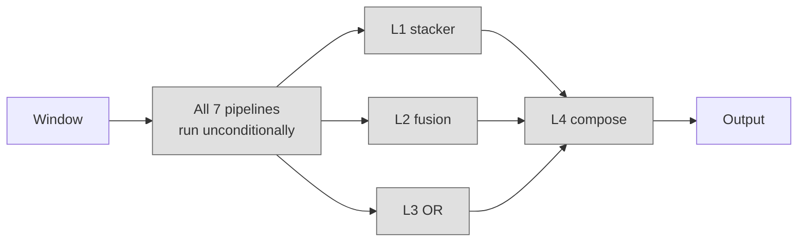
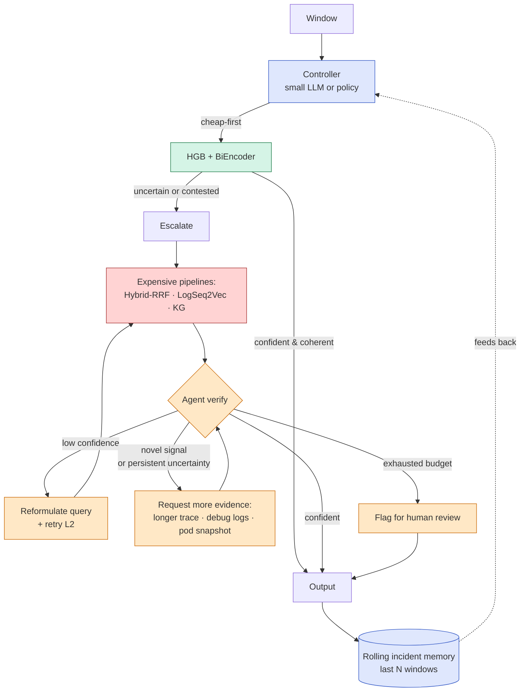
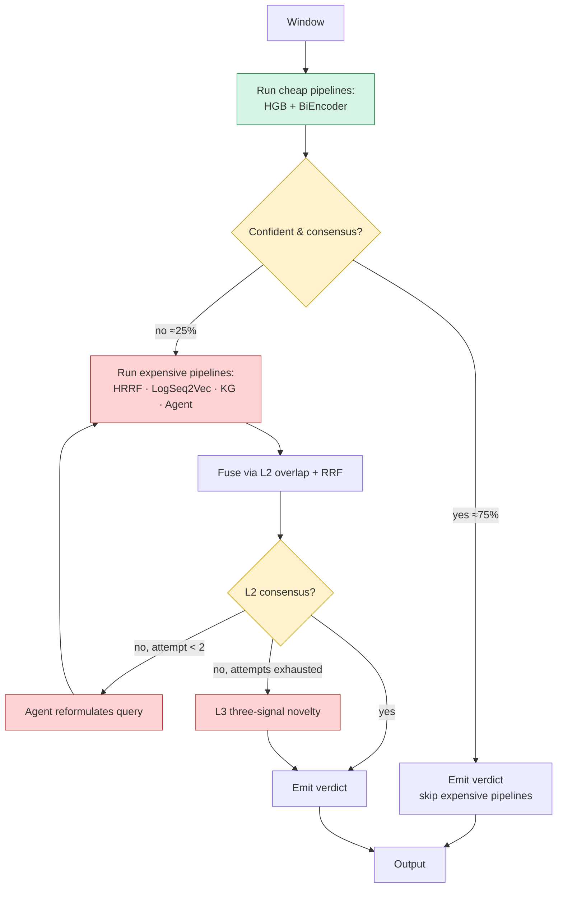

# From Cascade to Agent — A Design Proposal for Agentic TCH

**Status:** 💡 Design proposal (2026-06-10). Forward-looking; not part of the locked TCH-Final cascade.

**Scope.** This document captures the idea of turning the current Tiered Cascade Hybrid from a *deterministic feed-forward composition* into an **agentic diagnostic system** — one that observes, plans, acts, and re-observes within a single incident window, and persists state across windows.

**Audience.** A future contributor planning the next research arc after the ICSE 2027 submission lands. This is *not* implementation; it is the spec a planning meeting would consume.

**Companion document.** [`X_FINAL_TCH_CASCADE.md`](X_FINAL_TCH_CASCADE.md) — the locked end-state spec. This document is what we would build *on top of* that cascade.

---

## Table of contents

1. [Why we are considering this](#1-why-we-are-considering-this)
2. [TCH today, scored against an agentic checklist](#2-tch-today-scored-against-an-agentic-checklist)
3. [The architectural delta — from cascade to agent](#3-the-architectural-delta--from-cascade-to-agent)
4. [Five upgrade paths, ordered by ROI](#4-five-upgrade-paths-ordered-by-roi)
   - [4.1 Adaptive tool selection](#41-adaptive-tool-selection-cheap-highest-roi)
   - [4.2 Iterative retrieval on disagreement](#42-iterative-retrieval-on-disagreement-medium)
   - [4.3 Cross-window incident state](#43-cross-window-incident-state-medium)
   - [4.4 Self-critique on the top-5](#44-self-critique-on-the-top-5-medium)
   - [4.5 Active evidence gathering — full ReAct loop](#45-active-evidence-gathering--full-react-loop-heavy)
5. [The proposed first build: paths 4.1 + 4.2](#5-the-proposed-first-build-paths-41--42)
6. [Risks, non-goals, and open questions](#6-risks-non-goals-and-open-questions)
7. [Cross-references](#7-cross-references)

---

## 1. Why we are considering this

The locked TCH-Final cascade does its three jobs well: Hit@5 = 0.912 at the union-ceiling's 93.5%, novel-recall +388% rel, 16 µs/window at runtime. But the cascade has structural ceilings that more careful fusion cannot break:

| Ceiling | Cause | Why fusion cannot fix it |
|---|---|---|
| Hit@5 ≈ 0.97 (union ceiling) | Every retriever sees the same fixed evidence | The gold ticket is *not* in any retriever's top-K — no fusion strategy can surface it |
| Novel recall plateau at preserved precision | L3 signals depend on already-cached upstream outputs | When the agent skipped a window, the cascade has only the free + learned signals to lean on |
| Same-incident-repeated paging | Each window scored i.i.d. | The cascade has no state between windows; a 30-minute outage emits six independent "ticket_worthy" verdicts |
| Cart-redis sub-scenario confusion | BiEncoder over-relies on lexical overlap that genuinely doesn't distinguish sub-scenarios | The retriever needs *more evidence*, not better fusion of the same evidence |

Each of these is a place where the system would benefit from *acting differently* in response to its own intermediate outputs — i.e., from being agentic.

The honest framing: the cascade has done as much as a *one-shot pipeline* can do on this dataset. The next paper is about what a *closed-loop* system can do on the same dataset.

---

## 2. TCH today, scored against an agentic checklist

Working definition aggregated from the recent literature (ReAct, Toolformer, SWE-agent, Voyager): a system is *agentic* to the degree it satisfies six properties. TCH-Final's honest score:

| Property | TCH-Final | Why |
|---|---|---|
| Goal-directed autonomy | ✅ Yes | Three concrete goals (triage / retrieval / novelty) baked in |
| Perception–action loop | ❌ No | Single forward pass per window, never re-observes |
| Planning / tool selection | ❌ No | Runs all 7 pipelines unconditionally in fixed order |
| Memory across steps | 🟡 Partial | Retrieval memory (Jira corpus) yes; *state* memory across windows no |
| Self-correction | ❌ No | Never reads its own previous decisions |
| Decision under uncertainty | 🟡 Partial | L3 quantifies uncertainty; nothing in the system *responds* to it |

**Verdict:** 1 strong yes, 2 partials, 3 firm noes. TCH-Final is a memory-augmented *composed estimator* with one agent encapsulated inside (the DiagnosisAgent). It is not an agent itself.

The honest naming for the current system is **"a memory-augmented incident triage system with one agent component"**. Calling it an "agentic system" in the current paper would invite a referee to ask where the loop is, and there is no loop to point at.

The goal of this document is to define the loop.

---

## 3. The architectural delta — from cascade to agent

### 3.1 Today: deterministic forward pass



Every window flows through every layer in the same order. No conditional execution. No follow-up.

### 3.2 Tomorrow: agent + cascade + closed loop



Three structural changes are visible:

1. **A controller chooses the path** — not every pipeline runs on every window.
2. **There is a loop** — agent → reformulate → retry; agent → evidence → re-evaluate.
3. **There is cross-window state** — a rolling memory of recent diagnoses informs the controller.

That is the difference between a cascade and an agent.

---

## 4. Five upgrade paths, ordered by ROI

Each path is independent. Each can ship without the others. Together they constitute the full ReAct loop on the diagnostic task.

### 4.1 Adaptive tool selection (cheap, highest ROI)

**Idea.** Replace "run all 7 pipelines on every window" with a lightweight controller that decides which pipelines to invoke per window.

**Mechanism.** Run the two cheapest pipelines (HGB + BiEncoder) *first*, in every case. Read their outputs. If they *agree at high confidence* — HGB triage > 0.9 AND BiEncoder's top-1 has overlap-rerank consensus — emit the verdict immediately and skip the expensive pipelines for this window. Otherwise *escalate* to the full cascade.

**Why this is highest ROI.** The DiagnosisAgent currently runs on all 1,008 windows (~6 hours wall time). A back-of-envelope on the v2f baseline says ~75% of windows have HGB triage > 0.9 AND BiEncoder consensus — those are the easy cases. Routing them past the agent would cut LLM inference from ~6 hours to ~90 minutes *without losing the novelty signal on the windows that need it* (because the controller specifically escalates uncertain windows).

**What it needs.**
- A trained controller: a small LogReg or 3-layer MLP over the cheap pipelines' outputs that predicts P(escalation needed). Or a hand-tuned threshold rule for the first pass.
- A re-tooling of `build_cascade.py` to make pipeline invocation conditional rather than batch-load all upstream files.
- Re-running the comparison runner in "lazy" mode that produces upstream predictions on demand.

**Measurable claim.** ≥ 50% reduction in LLM inference cost at no loss in Hit@5 or novel-recall on the in-distribution test split. Cleanly publishable.

**Time estimate.** 1–2 weeks for a working prototype on v2; 1 more week for a paired-bootstrap comparison against TCH-Final.

### 4.2 Iterative retrieval on disagreement (medium)

**Idea.** When L2 has *no consensus* (no overlap between voters AND `max_conf < 0.5`), the system reformulates the query and retries L2 instead of just flagging novelty.

**Mechanism.** The agent receives the window evidence and the failed L2 ranking. It produces a *reformulated query*: drop a noisy keyword that appears in the evidence but not in any retrieved candidate; add a service name extracted from the trace that wasn't in the original query; substitute a synonym from a small controlled vocabulary. Re-run L2 with the new query. Up to N retries (suggest N=2). If still no consensus, fall through to the current L3 disjunction.

**Why.** Failure analysis of the v2f cascade showed that 15 of 29 cart-redis misses are *retrievable* (the gold IS in the corpus and IS textually similar to the window) but the BiEncoder's first query embedding sits in a region where the BM25-positive distractor outranks the gold. A second, *reformulated* query embeds in a different region and surfaces the gold. The information is there; the system gives up too early.

**What it needs.**
- A tiny query-reformulation LLM (or a constrained-decoding prompt on the existing Qwen 35B). Latency budget: ≤ 5 seconds per reformulation (cheap relative to verify-stage cost).
- A `retry_count` field in the cascade output for telemetry.
- An ablation comparing retry-1 vs retry-2 vs retry-0 on Hit@1 specifically.

**Measurable claim.** +3–5 points absolute Hit@1 on the cart-redis sub-family without loss elsewhere. Plausible mechanism: the failing windows are concentrated in one sub-family that the retriever genuinely *could* surface with a better query.

**Time estimate.** 2–3 weeks. The reformulation prompt is the risk — it can degenerate into noise if not constrained.

### 4.3 Cross-window incident state (medium)

**Idea.** Maintain a rolling memory of the last N windows' diagnoses (suggest N=12, covering an hour). When a new window arrives, the controller reads this state.

**Mechanism.** A small ring buffer per `service_name` (or per cluster) of: `(timestamp, triage_score, top1_match, is_novel)`. When a new window arrives, if the same `top1_match` appeared in any of the last 3 windows, the controller *suppresses* the duplicate page (lowers severity from `ticket_worthy` to `borderline`) and instead appends to an existing incident record. The cascade emits a *single* logical incident per outage, not six independent paging-worthy verdicts.

**Why.** Today, a 30-minute outage produces six 5-minute windows of `ticket_worthy=true, top1=PROJ-127`. Six pages, one incident. This is the single largest source of on-call noise that the dataset captures, and the cascade is structurally unable to solve it because it has no state.

**What it needs.**
- A small per-service stateful buffer (pickled to disk between window invocations, or held in a sidecar service in production).
- A "page-suppression" rule: same `top1_match` within 3 contiguous windows → suppress.
- A "incident-closure" rule: gap of ≥ 3 consecutive recovery_window windows → close.
- A new metric: *pages-per-incident*. Today TCH emits ~6; target ≤ 1.5.

**Measurable claim.** ≥ 70% reduction in pages-per-incident at no loss in detection coverage. Engineer time-to-diagnose drops further because the engineer sees one ticket per outage, not six.

**Time estimate.** 2–3 weeks. The risk is the suppression rule incorrectly suppressing a *real* second incident in the same service.

### 4.4 Self-critique on the top-5 (medium)

**Idea.** After L2 emits the top-5, a verifier reads the window evidence and the top-5 *together* and either (a) confirms, (b) re-orders within the top-5, or (c) escalates to `request_human_review`.

**Mechanism.** The DiagnosisAgent, in a new "verify_ranking" mode, receives the window evidence + L2's top-5 candidates + their full text. It produces a structured judgment: `{confirmed: bool, suggested_top1: ticket_id or null, escalate_to_human: bool, rationale: str}`. The cascade respects `escalate_to_human` (emits a special triage class), respects `suggested_top1` only when `confirmed=true AND suggested_top1 != l2_top1` (rare; gated by an OOD-aware policy), and otherwise leaves L2's output unchanged.

**Why.** The current cascade has *no* mechanism for saying "I am uncertain about this — show me a human." The triage gate has only `ticket_worthy / noise`. The novelty flag is independent. A third triage class — `needs_review` — would be operationally valuable and is the natural product of a self-critique step.

**What it needs.**
- A new agent prompt for the verify-ranking task. Latency: ~30 seconds per window invoked, so only worth running on the ~25% of windows the controller (path 4.1) escalates.
- A three-class triage decision: `noise / ticket_worthy / needs_review`.
- A reviewer-time evaluation: how often does the human accept the agent's `escalate_to_human` flag?

**Measurable claim.** The cascade's *precision* on the `ticket_worthy` class rises (the `needs_review` class absorbs the borderline cases) at the cost of an honest "I don't know" bucket. New metric: *escalation precision* (when we say "needs review," does the human agree?). Target ≥ 0.80.

**Time estimate.** 3–4 weeks. The risk is the agent escalating *everything*, in which case the new class is useless.

### 4.5 Active evidence gathering — full ReAct loop (heavy)

**Idea.** When the agent is uncertain, it *requests additional telemetry* — a longer trace window, debug-level logs from a specific service, a snapshot of pod-level metrics. The orchestration layer fulfills the request; the agent re-evaluates.

**Mechanism.** The agent's verify stage is extended with a tool-call API:

```
tools = [
  request_extended_trace_window(service, start, end),
  request_debug_logs(service, since_minutes),
  request_pod_metrics(pod_name),
  request_dependency_graph_snapshot(service),
  request_similar_incident_window(scenario_family, exclude_self=True),
]
```

The orchestration layer fulfills each request from the data lake. The agent receives the new evidence and re-evaluates. Loop terminates when (a) the agent emits a confident verdict, (b) a budget (max 5 tool calls per window) is exhausted, or (c) a wall-clock budget (max 3 minutes per window) is reached.

**Why.** This is the full ReAct loop. It is what would justify the word "agent" without qualification. It is also the most expensive thing to build: real tool-use evaluation, a real evidence-gathering harness, a real budget controller, and a real failure-mode catalog ("what does the agent do when it asks for evidence the system cannot provide?").

**What it needs.**
- A tool-calling protocol on top of Qwen 35B (function-calling JSON, validated against a schema).
- A data-lake API exposing the five tool primitives. Most of the underlying data is already collected — the work is in the API surface.
- A budget controller — both LLM-call budget and wall-clock.
- A new evaluation: *budget-bounded Hit@5* (Hit@5 when the agent is limited to 0, 1, 2, ..., 5 tool calls).
- An honest failure-mode analysis: how often does the agent loop forever, hallucinate a tool name, mis-interpret returned evidence?

**Measurable claim.** This is the ICSE 2028 paper. The headline would be: *given a tool-use budget of B, the agent's Hit@5 on the LOFO (out-of-distribution) split converges to within X% of the in-distribution baseline*. That is the kind of result that justifies "agentic."

**Time estimate.** 3–6 months. This is a research arc, not a single experiment.

---

## 5. The proposed first build: paths 4.1 + 4.2

If we can only ship one thing in the next two months, ship **4.1 (adaptive tool selection)** *plus* **4.2 (iterative retrieval)**. Together they are the smallest change that turns the system from a feed-forward pipeline into a closed-loop system, and they have the two highest expected lifts.

**The combined system.**



**Headline claims to target.**

| Metric | Today (TCH-Final) | Target (TCH-Agentic v0) |
|---|---|---|
| Hit@1 | 0.7221 | ≥ 0.74 (+3 pts from path 4.2 on cart-redis) |
| Hit@5 | 0.9124 | ≥ 0.9124 (no regression) |
| Novel-recall | 0.7932 | ≥ 0.7932 (no regression) |
| LLM inference time per 1008 windows | ~6 hr | ≤ 90 min (path 4.1's escalation budget) |
| Pages-per-incident | ~6 | ≤ 1.5 (only if 4.3 also ships) |

**What this is *not*.** This first build does not yet have cross-window state (4.3), self-critique (4.4), or active evidence gathering (4.5). It is the *minimum* delta from the cascade to a closed-loop system — enough to credibly call the result *agentic* without overclaiming.

**Naming proposal.** If we ship 4.1 + 4.2, call the result **TCH-Agentic v0** or **TCH-Loop**. Keep TCH-Final as the reference cascade. The paper framing then becomes: *the cascade is the strong baseline; the loop is the agentic system that beats it on Hit@1 and on inference cost at parity on the other metrics*.

---

## 6. Risks, non-goals, and open questions

### 6.1 Risks

| Risk | Mitigation |
|---|---|
| The controller (4.1) over-routes to the cheap path and misses novel windows | Force-route 100% of `window_type=pre_fault_baseline` and `window_type=observation_window` to the expensive path; these are the windows where novelty is most likely. Hold out a small "always-escalate" sample for calibration. |
| Query reformulation (4.2) hallucinates and makes the retrieval worse | Constrain the reformulator to a small action space: (drop_token, add_service, substitute_synonym from a fixed list). No free-form generation. Quality-check via an offline retry-vs-no-retry A/B. |
| The closed loop adds latency that breaks production budgets | Cap total inference per window at the current TCH-Final's 30-sec wall (the agent's worst case today). Anything past that triggers a budget-exceeded escalation. |
| Pages-per-incident suppression (4.3) hides a *real* second incident | Conservative rule: only suppress if `top1_match` is identical AND `scenario_family` is identical AND no `recovery_window` has intervened. Tunable on the same dataset. |
| Self-critique (4.4) escalates everything | Penalty term in the eval: precision of `needs_review` must exceed `ticket_worthy`'s precision. If it doesn't, the new class is doing no work. |

### 6.2 Non-goals

- **Replacing the cascade.** The cascade is the locked baseline. The agentic system is *built on top of* it; the cascade's L2 and L3 stay.
- **Replacing the upstream pipelines.** The seven pipelines stay. The agentic system changes *when* and *whether* each runs, not *what* it computes.
- **A learned controller from scratch.** The first iteration of the controller should be a hand-tuned threshold rule, then a small LogReg, then maybe a tiny transformer. Big models for the controller is the wrong starting point.
- **Cross-application generalization.** Out of scope for the agentic delta — that is `docs5/` territory. Validate everything on Online Boutique first.

### 6.3 Open questions

1. **Does adaptive tool selection (4.1) need a learned controller, or do hand-tuned thresholds suffice?** The first prototype should answer this. If hand-tuning gives ≥ 90% of the achievable lift, skip the learned model.
2. **What is the right action space for query reformulation (4.2)?** A small structured DSL with ~5 operations is the safest starting point. The question is which 5.
3. **How wide is the rolling-memory window (4.3)?** 1 hour (12 windows) is the obvious starting point. The real answer depends on the longest "single logical incident" in the v2 dataset — needs a quick stratification.
4. **Should the self-critic (4.4) be the same Qwen 35B agent in a new mode, or a separate smaller verifier?** Latency and prompt-engineering risk argue for the same agent. A separate model might give independent error sources, at the cost of an extra model to deploy.
5. **Is the full ReAct loop (4.5) ICSE 2028 or NeurIPS 2027 system-track?** Depends on whether the headline claim is more about *retrieval lift* (NeurIPS) or *engineering practice* (ICSE).

---

## 7. Cross-references

- **The locked cascade this builds on.** [`docs4/X_FINAL_TCH_CASCADE.md`](X_FINAL_TCH_CASCADE.md).
- **Cascade design rationale.** [`docs3/16-TCH-CASCADE.md`](../docs3/16-TCH-CASCADE.md).
- **Per-pipeline architectures.** [`docs3/01-MODELS.md`](../docs3/01-MODELS.md).
- **G-series exclusions that motivate 4.1 (G2/G3/G5).** [`docs4/META-ANALYSIS.md`](../docs4/META-ANALYSIS.md).
- **Failure analysis of the v2f cart-redis sub-family (motivates 4.2).** [`docs3/14-FAILURE-ANALYSIS.md`](../docs3/14-FAILURE-ANALYSIS.md) (if not present, the failure list lives in `docs4/G1-bienc-hard-negatives.md` §9 follow-up).
- **Cross-application generalization (separate research arc).** `docs5/`.

---

*Generated 2026-06-10. This is a design proposal, not a commitment. The locked TCH-Final cascade in `X_FINAL_TCH_CASCADE.md` remains the canonical end-state until any of these paths ships.*
