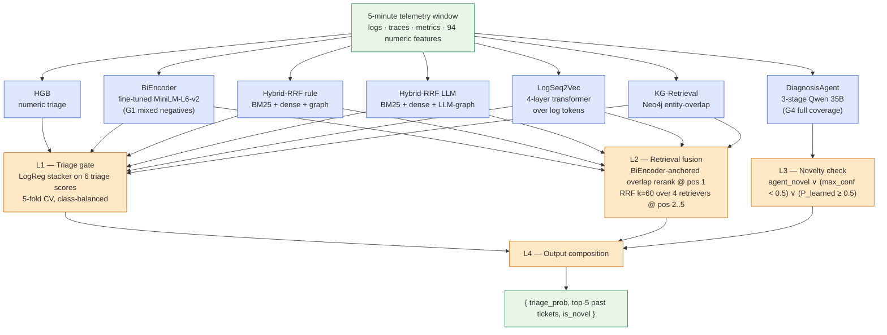
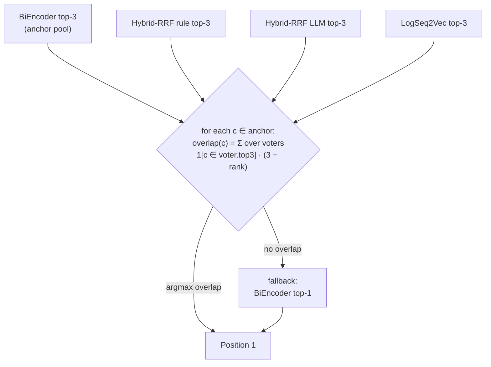
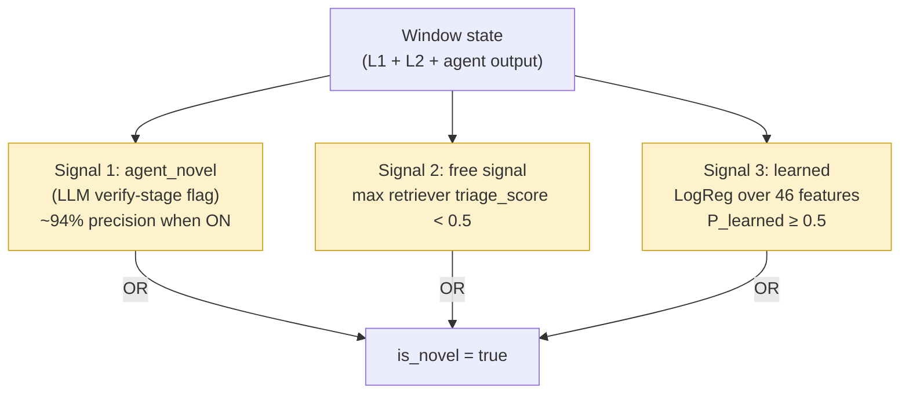
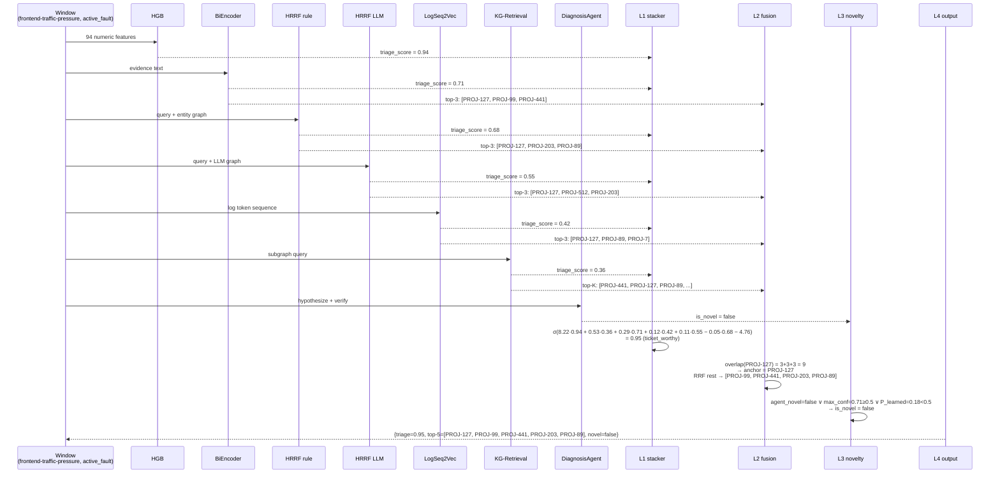
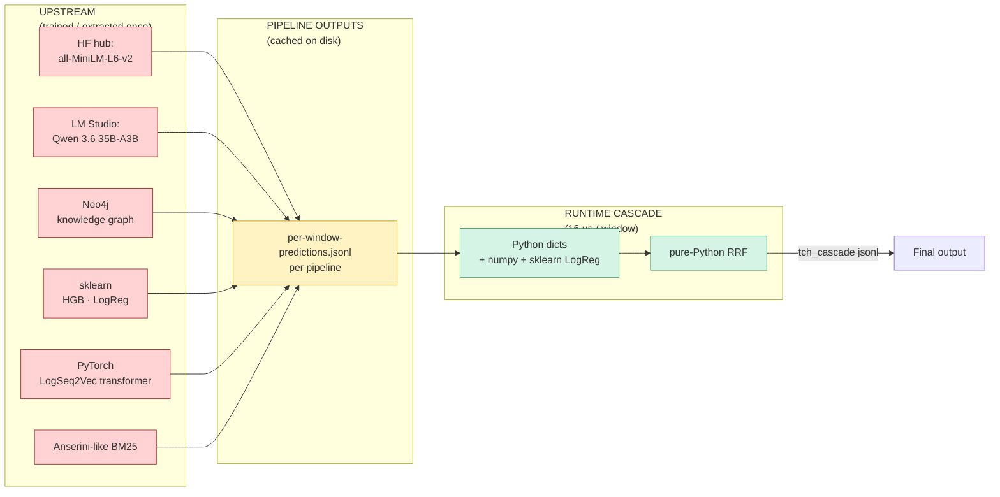

# The Final TCH Cascade — End-State Specification

**Document scope.** This is the canonical end-state reference for the Tiered Cascade Hybrid (TCH) as locked on 2026-06-06 after the G-series refinement campaign concluded. It supersedes [docs3/17-FINAL_HYBRID.md](../docs3/17-FINAL_HYBRID.md) — that document describes the cascade *before* the G1/G4/G7 integrations.

**What this is.** A self-contained, anyone-can-understand spec: every layer, every threshold, every retriever, every feature. Plain English first, then diagrams, then math, then a real-window walkthrough. No journey story; no G-series ablations; no cross-application content (Online Boutique only — cross-app generalization is documented separately in `docs5/`).

**Audience.** Someone who has never seen this codebase and needs to (a) understand what the cascade does, (b) reproduce it, or (c) modify it.

---

## Table of contents

1. [The 30-second version](#1-the-30-second-version)
2. [The problem we are solving](#2-the-problem-we-are-solving)
3. [System at a glance](#3-system-at-a-glance)
4. [The big idea behind TCH](#4-the-big-idea-behind-tch)
5. [What goes in, what comes out](#5-what-goes-in-what-comes-out)
6. [The seven pipelines beneath the cascade](#6-the-seven-pipelines-beneath-the-cascade)
7. [The four layers of the cascade](#7-the-four-layers-of-the-cascade)
   - [Layer 1 — Triage gate](#71-layer-1--triage-gate)
   - [Layer 2 — Retrieval fusion](#72-layer-2--retrieval-fusion)
   - [Layer 3 — Three-signal novelty check](#73-layer-3--three-signal-novelty-check)
   - [Layer 4 — Output composition](#74-layer-4--output-composition)
8. [Walking through one real window](#8-walking-through-one-real-window)
9. [The math, explained simply](#9-the-math-explained-simply)
10. [Where each piece of tech is used](#10-where-each-piece-of-tech-is-used)
11. [Parameters and thresholds reference](#11-parameters-and-thresholds-reference)
12. [Headline results](#12-headline-results)
13. [Robustness](#13-robustness)
14. [What is NOT in the final cascade and why](#14-what-is-not-in-the-final-cascade-and-why)
15. [Known limitations](#15-known-limitations)
16. [Glossary](#16-glossary)

---

## 1. The 30-second version

> The Tiered Cascade Hybrid (TCH) is a four-layer composition of seven heterogeneous diagnostic pipelines that turns a five-minute window of telemetry into (1) a calibrated *should-this-be-a-ticket* probability, (2) a ranked list of five past Jira tickets most likely to match this incident, and (3) a Boolean *this-is-novel* flag for windows with no past analog.
>
> The cascade ties or beats every individual pipeline on every metric: Hit@1 = **0.722**, Hit@5 = **0.912**, MRR = **0.794**, strict triage PR-AUC = **0.9998**, novel-precision = **0.940**, novel-recall = **0.793** (a **+388% relative lift** over the strongest fixed-threshold baseline) on the 1,008-window held-out test split. Inference is **16 µs per window** once upstream pipeline outputs are cached.
>
> The composition has no learned weights between layers: the heavy lifting is done by (a) a class-balanced logistic regression stacker on six triage probabilities, (b) Reciprocal Rank Fusion with a dense-anchored overlap rerank for the top of the retrieval list, and (c) a three-signal disjunction for novelty that mixes an LLM agent's verdict, a fixed retrieval-confidence threshold, and a small learned per-window classifier.

---

## 2. The problem we are solving

Modern observability stacks emit five-minute windows of telemetry — structured logs, distributed traces, runtime metrics, Kubernetes events — by the thousand. Of those windows, the vast majority are noise. A few represent real incidents. Of the real incidents, most are recurrences of a known failure mode; a small fraction are genuinely new. The on-call engineer's job is the unhappy intersection of these distributions: triage every page, recognize the recurrences, and reserve attention for the truly new.

A useful tool answers three independent questions per window:

| Question | What it produces | Why it is hard |
|---|---|---|
| **Should this become a ticket?** | a calibrated probability $\in [0, 1]$ | Most windows are noise; the base rate is brutal. |
| **If yes, what past tickets does it look like?** | a ranked top-5 list of past Jira IDs | Different incidents share lexical/structural patterns; no single retriever wins every family. |
| **Is this genuinely new — no past ticket applies?** | a Boolean flag | True novelty is rare and easily missed; over-flagging dilutes the signal. |

The reason a single model does not solve all three is that the three questions reward different inductive biases. Triage rewards a strong numeric-feature classifier. Retrieval rewards a diverse panel of similarity functions. Novelty rewards an explicit confidence-vs-evidence judgment, which a similarity score alone cannot make. TCH is the composition that lets each pipeline contribute where it is strongest.

---

## 3. System at a glance



Each layer is independently swappable. The novelty check never reorders the retrieval list. The retrieval layer never feeds back into triage. The triage decision never gates retrieval. This independence is what makes per-layer ablation clean and what lets operators replace any single pipeline without breaking the others.

---

## 4. The big idea behind TCH

The cascade exists because *no single pipeline is best at everything*. On the 1,008-window test split, each of the seven dominates a different axis:

| Pipeline | What it wins | What it loses | Dedicated doc |
|---|---|---|---|
| **HGB** (numeric features) | Triage PR-AUC (0.9998) | No retrieval at all | [`pipeline-1-HGB.md`](pipeline-1-HGB.md) |
| **BiEncoder** (dense) | Hit@1 (0.695) | Top-5 coverage | [`pipeline-2-BiEncoder.md`](pipeline-2-BiEncoder.md) |
| **Hybrid-RRF rule** | Hit@5 (0.798) | Hit@1 | [`pipeline-3-HybridRRF-rule.md`](pipeline-3-HybridRRF-rule.md) |
| **Hybrid-RRF LLM** | Triage PR-AUC strict (0.292 standalone) | Top-5 (too sparse — fights consensus) | [`pipeline-4-HybridRRF-LLM.md`](pipeline-4-HybridRRF-LLM.md) |
| **LogSeq2Vec** | Family-specific patterns (recovered-in-window, single-pod-restart) | Cross-family generalization | [`pipeline-5-LogSeq2Vec.md`](pipeline-5-LogSeq2Vec.md) |
| **KG-Retrieval** | Structural matches (entity overlap, complementary to text) | Hit@1 (0.079 — wide-but-shallow) | [`pipeline-6-KGRetrieval.md`](pipeline-6-KGRetrieval.md) |
| **DiagnosisAgent** | Novelty (~94% precision) | Retrieval ranking (sequential, expensive) | [`pipeline-7-DiagnosisAgent.md`](pipeline-7-DiagnosisAgent.md) |

For a per-pipeline deep-dive — architecture, training, hyperparameters, inputs/outputs, inference cost, standalone metrics, and what the cascade consumes — see the dedicated doc linked in the right-most column.

The pipelines are *Pareto-incomparable*: choosing any single one means giving up multiple axes the others own. The natural alternative — a single larger model that subsumes all signals — is unattractive because (a) the cheapest pipeline (HGB) already saturates triage at the noise floor of the dataset, (b) the input modalities are deeply heterogeneous (a numeric vector, free-text evidence, log token sequences, structured graph queries), and (c) the agent's novelty signal is qualitatively unlike any similarity score and cannot be replicated by tighter embedding training.

TCH composes the seven instead. The composition is deliberately classical at runtime — logistic regression, Reciprocal Rank Fusion, dictionary lookups — because the heavy machine learning was already done inside each pipeline. The cascade's job is not to learn; it is to *combine signals that were already learned*.

---

## 5. What goes in, what comes out

### Input contract

Every window passing through TCH carries, at minimum, the following per-pipeline upstream outputs cached on disk in `comparison/<pipeline-dir>/per-window-predictions.jsonl`:

| Field | Source | Per-pipeline? |
|---|---|---|
| `window_id` | dataset | shared |
| `triage_score` ∈ [0, 1] | each pipeline | yes |
| `matched_issue_ids` (ordered list of top-K past tickets) | retrieval pipelines | yes |
| `is_novel` (Boolean) | agent only | one pipeline |
| `gold_label`, `gold_matched_issue_ids`, `gold_is_novel` | dataset labels | shared (used for evaluation, not at inference) |
| `scenario_family`, `service_name`, `window_type`, `is_hard_case`, `n_prior_family_tickets`, `triage_reason_class` | dataset metadata | shared |

The cascade never re-encodes raw telemetry. It reads cached per-pipeline outputs and composes them. This is the property that gives TCH its 16 µs per-window inference cost: the expensive work has happened upstream and is amortized across every downstream consumer.

### Output record

A single row written to `tch-cascade/per-window-predictions.jsonl`:

```json
{
  "window_id": "...",
  "pipeline_name": "tch_cascade",
  "triage_score":     0.91,        // calibrated probability from L1
  "triage_decision":  "ticket_worthy",  // or "noise"
  "matched_issue_ids": ["PROJ-127", "PROJ-203", "PROJ-441", "PROJ-89", "PROJ-512"],
  "is_novel":         false,
  "tch_l2_top":       [...],       // diagnostic: L2's pre-L3 ranking
  "tch_max_retrieval_conf": 0.83,  // diagnostic: max triage_score across retrievers
  "tch_agent_ran":    true         // diagnostic: whether agent had this window
}
```

Plus gold labels echoed for downstream evaluation. The first four fields are the *system output*; the rest are diagnostics for ablation and analysis.

---

## 6. The seven pipelines beneath the cascade

The cascade is only as good as what feeds it. Each pipeline below is documented in detail in [`docs3/01-MODELS.md`](../docs3/01-MODELS.md) and `src/` modules; the role-summary below is what the cascade *consumes* from each.

### 6.1 HGB — numeric-feature triage

- **What it sees.** The 94-dimensional per-window numeric feature vector (latency p99, error rate, trace error count, k8s restart count, CPU%, memory%, plus 47 delta-from-baseline and 33 moving-five-minute-average columns).
- **What it emits.** A calibrated `triage_score ∈ [0, 1]` per window. No retrieval list.
- **Model.** sklearn `HistGradientBoostingClassifier`; `max_iter=300`, `learning_rate=0.05`, `max_depth=8`, `l2_regularization=0.1`, `random_state=42`.
- **Why it is in the cascade.** HGB is by far the strongest single triage signal in the entire panel (strict PR-AUC = 0.9998). The cascade leans on it for L1 and inherits its near-perfect triage performance.

### 6.2 BiEncoder — fine-tuned dense retriever **(G1-refined)**

- **Backbone.** `sentence-transformers/all-MiniLM-L6-v2` (22M parameters, 384-dim embeddings, 6 transformer layers).
- **Training objective.** `MultipleNegativesRankingLoss` over `(anchor, positive, hard_neg_1, hard_neg_2, random_neg_1)` tuples.
  - Anchor = the window's free-text evidence summary.
  - Positive = the memory ticket's `memory_text`.
  - Hard negatives = top-20 BM25 candidates that are NOT in gold (2 per anchor).
  - **Random negatives** = memory tickets that share no BM25 signal with the query AND are not gold (1 per anchor). This is the G1 refinement; the prior baseline used three hard negatives only. Adding the random pool forces the model to learn a genuine semantic discrimination rather than over-relying on lexical overlap.
- **Hyperparameters.** 5 epochs, batch 32, learning rate 2e-5, warmup 10%, `seed=42`.
- **Triage head.** Tiny logistic regression on `[max_sim, mean_top5_sim, n_above_0.5]`.
- **What the cascade consumes.** (a) `triage_score` for L1, (b) the ordered top-K ticket IDs for L2 (both as the position-1 anchor pool and as one of the four L2 RRF retrievers).

### 6.3 Hybrid-RRF (rule graph)

- **Architecture.** RRF over three sub-retrievers fitted with separate evidence representations: BM25 on the window query text, dense (MiniLM) similarity, and an entity-overlap score over a knowledge graph populated by *hand-written regular expressions* extracting affected services, observable symptoms, error classes, root causes, and fixes from ticket text.
- **What the cascade consumes.** `triage_score` and ordered top-K for L2 (RRF retriever) and L2 overlap-rerank (voter).

### 6.4 Hybrid-RRF (LLM graph)

- **Architecture.** Same RRF backbone as 6.3, but the graph is extracted by a large language model under a strict JSON schema instead of regular expressions.
- **What the cascade consumes.** `triage_score` for L1, ordered top-K for the L2 overlap-rerank voter set. **Not** in the L2 RRF retriever set (the drop-one sweep showed this hybrid is too sparse and *fights* the BiEncoder consensus when included; excluding it lifts Hit@5 by ≈ 2 points).

### 6.5 LogSeq2Vec — log-sequence transformer

- **Architecture.** A 4-layer transformer trained from scratch on tokenized log lines. Learns sequence-level patterns specific to characteristic scenario families (recovered-in-window, single-pod-restart, recurring restart loops).
- **What the cascade consumes.** `triage_score` for L1, ordered top-K for L2 (RRF retriever and overlap-rerank voter).

### 6.6 KG-Retrieval — Neo4j graph traversal

- **Architecture.** A knowledge graph in Neo4j populated by the LLM extractor (same one feeding Hybrid-RRF LLM). A query window is encoded as a subgraph; matching memory tickets are scored by entity overlap via a Cypher query.
- **What the cascade consumes.** `triage_score` for L1, ordered top-K for L2 (RRF retriever).
- **Why it is in the cascade despite low Hit@1.** KG-Retrieval has wide-but-shallow coverage — many gold tickets appear somewhere in its top-20 even when they are not first. RRF rewards this exactly.

### 6.7 DiagnosisAgent — three-stage LLM agent **(G4 full-coverage)**

- **Model.** Qwen 3.6 35B-A3B served via LM Studio on an RTX 5060 (8 GB VRAM, ~30 sec / window).
- **Stages.**
  1. **Hypothesize** (thinking OFF, ~1 sec): emit a single-sentence root-cause hypothesis from window evidence alone.
  2. **Retrieve** (cached): receive a small candidate set from the upstream Hybrid-RRF.
  3. **Verify** (thinking ON, ~25–30 sec): produce a strict JSON judgment containing the matched ticket ID (or `null`) and an `is_novel` flag.
- **Coverage.** The agent has run on **all 1,008 test-split windows** post-G4. Earlier configurations covered only a 350-window subset (200 random + 150 hard-cases); G4 closed that gap.
- **What the cascade consumes.** Only the `is_novel` Boolean. The agent's *retrieval* is intentionally not consumed — an empirical 200-window audit found that letting the agent override L2's top-1 is net −5 Hit@1, so its rank suggestions are discarded.

---

## 7. The four layers of the cascade

The cascade is `assemble_cascade_prediction(state, stacked_triage)` in `src/v2_advanced/tch/build_cascade.py`. Each layer is implemented inline; none holds state across windows.

### 7.1 Layer 1 — Triage gate

**Purpose.** Map the six per-pipeline `triage_score` values to a single calibrated probability that the window is worth a ticket.

**Model.** A class-balanced logistic regression *stacker*:

$$
P_{L1}(\text{ticket\_worthy}) \;=\; \sigma\!\Big(\, w_{\text{HGB}}\,x_{\text{HGB}} + w_{\text{BiE}}\,x_{\text{BiE}} + w_{\text{HRRF-rule}}\,x_{\text{HRRF-rule}} + w_{\text{HRRF-LLM}}\,x_{\text{HRRF-LLM}} + w_{\text{LogSeq}}\,x_{\text{LogSeq}} + w_{\text{KG}}\,x_{\text{KG}} + b \,\Big)
$$

where $x_i$ is the $i$-th pipeline's `triage_score` and $\sigma(z) = 1 / (1 + e^{-z})$.

**Fitting protocol.** 5-fold StratifiedKFold (`random_state=42`, shuffle on). Each test window is scored by a model that never saw it during fit. `class_weight="balanced"` to compensate for the natural skew between ticket-worthy and noise windows. `max_iter=1000`, `C=1.0`.

**Why logistic regression rather than gradient boosting.** Empirically GBM over-fits the small 1,008-window training fold and loses ≈1.5 points strict PR-AUC and ≈11 points inclusive PR-AUC. HGB's `triage_score` is already near-perfect (strict PR-AUC = 0.9998); the stacker's job is to *preserve that calibration* while letting the other five pipelines correct borderline cases. A simple linear combiner does exactly this.

**Coefficient pattern (deployed stacker, all-windows fit, illustrative magnitudes).**

| Feature | Coefficient | Reading |
|---|---:|---|
| HGB triage | **+8.221** | Dominant signal — about 30× any other coefficient. |
| KG-Retrieval triage | +0.525 | Small graph-overlap nudge. |
| BiEncoder triage | +0.292 | Small dense-similarity nudge. |
| LogSeq2Vec triage | +0.116 | Tiny family-specialist nudge. |
| Hybrid-RRF LLM | +0.112 | Tiny LLM-graph nudge. |
| Hybrid-RRF rule | −0.048 | Approximately zero. |
| Bias | −4.755 | Counteracts HGB's natural offset. |

The pattern is: **HGB does almost all the work; the other five contribute small corrections on the windows where HGB is uncertain.** This is the right behavior given HGB's standalone strength.

**Operating threshold.** $\tau_{L1} = 0.5$. Any window with $P_{L1} < 0.5$ is labeled `noise`; otherwise `ticket_worthy`. Sweep diagnostic: at the chosen threshold, *recall stays at 1.000* across $\tau \in \{0.20, 0.30, 0.50\}$ because HGB's strict separation means no true positive scores below 0.5; $\tau = 0.5$ is therefore the tightest precision attainable without recall loss.

### 7.2 Layer 2 — Retrieval fusion

**Purpose.** Produce an ordered list of five past memory tickets most likely to match the window.

**Key insight.** *The top-1 slot and positions 2–5 optimize different objectives.* Top-1 rewards a confident consensus pick (one wrong guess at position 1 is one Hit@1 miss). Positions 2–5 reward diverse coverage (one ticket anywhere in the top-5 is one Hit@5 win). TCH therefore uses two different combination rules for the two regions.

#### Position 1 — BiEncoder-anchored overlap rerank



**Why this works.** A candidate that several independent retrievers agree on is more trustworthy than any single retriever's first guess. Restricting the anchor pool to BiEncoder's top-3 means the rerank can only promote candidates BiEncoder already deemed plausible (preserving BiEncoder's strong Hit@1 signal); the votes only break ties within that small pool. In the absence of any overlap, BiEncoder's top-1 is used unchanged. Empirically this lifts Hit@1 by ≈1.7 points over BiEncoder alone.

**Why these three voters.** Hybrid-RRF rule and Hybrid-RRF LLM are the two strongest retrievers after BiEncoder for top-3 precision. LogSeq2Vec contributes the family-specialist signal that the text retrievers miss. KG-Retrieval is excluded as a voter because its Hit@1 is too weak to anchor a vote (0.079 standalone).

#### Positions 2–5 — Reciprocal Rank Fusion

For the remaining four slots, TCH applies the standard RRF formula:

$$
\text{RRF}(c) \;=\; \sum_{r \in \mathcal{R}}\; \frac{1}{k + \text{rank}_r(c)}
$$

with $k = 60$ (the canonical Cormack et al. value) and the retriever set:

$$
\mathcal{R} \;=\; \{\;\text{BiEncoder},\; \text{Hybrid-RRF rule},\; \text{LogSeq2Vec},\; \text{KG-Retrieval}\;\}
$$

Candidates are sorted by their RRF score; the position-1 anchor (already filled by the overlap rerank above) is removed; the next four candidates fill positions 2 through 5.

**Why these four retrievers** (and **not** Hybrid-RRF LLM in this set). A drop-one sweep on the in-distribution split (Hit@5 deltas vs the all-six configuration):

| Drop | Hit@5 Δ | Decision |
|---|---:|---|
| BiEncoder | −0.057 | KEEP — best single retriever |
| LogSeq2Vec | −0.051 | KEEP — complementary log-sequence signal |
| KG-Retrieval (LLM) | −0.015 | KEEP — graph signal |
| Hybrid-RRF rule | 0.000 | could drop; keep for stability |
| Memory-Graph SOTA | −0.003 | not in set; minor signal |
| **Hybrid-RRF LLM** | **+0.021** | **DROP** — too sparse, fights BiEncoder consensus |

Hybrid-RRF LLM is the RRF density paradox: it is precise enough that its top-K is short, but the few candidates it surfaces are *different* from BiEncoder's. With RRF $k = 60$ this divergence acts as anti-consensus, pulling rank-1 fusion off the gold. Dropping it from $\mathcal{R}$ lifts Hit@5 by ≈2 points. (Hybrid-RRF LLM remains in the L2 overlap-rerank *voter* set, where its top-3 is treated as a tie-break vote rather than blended into a fused rank.)

**Why RRF rather than learned weights.** RRF requires no per-retriever score calibration and is invariant to monotone score transformations. This makes it robust to the very different confidence distributions of dense vs sparse vs graph retrievers, none of which would survive a single linear weighting.

### 7.3 Layer 3 — Three-signal novelty check

**Purpose.** Decide whether the window represents a genuinely new incident with no past analog.

**The combination rule.** A disjunction of three orthogonal signals:

$$
\boxed{\;\text{is\_novel} \;=\; \text{agent\_novel} \;\lor\; (\,\max_i \text{conf}_i < 0.5\,) \;\lor\; (\,P_{\text{learned}}(\text{novel}) \geq 0.5\,)\;}
$$



Each disjunct captures a *qualitatively different* reason the cascade might believe this window has no past match.

#### Signal 1 — `agent_novel` (the agent's explicit verdict)

The DiagnosisAgent's verify stage emits a strict-JSON judgment per window:

```json
{"matched_issue_id": "PROJ-127", "is_novel": false, "rationale": "..."}
```

When `is_novel` is `true`, that is a 30-second LLM judgment grounded in the window's evidence and a small candidate set. Standalone novelty precision is ≈94%. Specific but expensive: the agent inference dominates the cascade's offline cost.

Coverage: all 1,008 test windows post-G4 (was 350 before).

#### Signal 2 — Free signal (retrieval-confidence floor)

A fixed-threshold rule:

$$
\text{free\_novelty} \;=\; \Big(\max_{r \in \{\text{BiEncoder, HRRF-rule, HRRF-LLM}\}} \text{triage}_r(w) \;<\; 0.5\Big)
$$

If no retriever is even half-confident in any candidate, the cascade effectively has no past-match hypothesis. The threshold of 0.5 was calibrated on the training split to match the agent's precision (≈94%) at much higher coverage. The signal acts as a cheap fallback: it fires on windows the agent skipped or windows where the agent and the retrievers genuinely disagree.

#### Signal 3 — Learned per-window classifier

The headline novelty contribution. A class-balanced logistic regression trained over a 46-dimensional feature vector to predict $P(\text{novel} \mid \text{window features})$.

**Features (46 total).**

| Block | Features | Count |
|---|---|---:|
| Continuous | `tch_max_retrieval_conf`, `triage_score` (from L1), `is_hard_case` (Bool→0/1) | 3 |
| One-hot `window_type` | `pre_fault_baseline`, `active_fault`, `recovery_window`, `observation_window` | 4 |
| One-hot `scenario_family` | 27 families plus `__missing__` slot | ~22 active |
| One-hot `service_name` | 15+ Online Boutique services plus `__missing__` slot | ~17 active |

**Deliberately excluded as a tautology:** `n_prior_family_tickets` (the count of past memory tickets in the same family). Novelty is defined as "no matching past ticket in memory", so a count of zero is logically equivalent to the label. Including it makes the classifier trivially perfect (F1 = 1.000 with coefficient ≈ −5) but tells the reader nothing about novelty detection. The leakage-free feature set is the published configuration.

**Fitting protocol.** 5-fold StratifiedKFold, `class_weight="balanced"`, `random_state=42`, `max_iter=1000`, `C=1.0`. The model is fit once over the full 1,008-window split; the test fold's predictions are *out-of-fold* (each window scored by a classifier that never saw it during fit). Per-window `P(novel)` is written to disk at training time; the cascade loads it as a lookup table at runtime, so the marginal inference cost is one dictionary access.

**Threshold.** $\tau_{\text{learned}} = 0.5$. The threshold sweep on out-of-fold predictions shows best F1 at $\tau = 0.30$ (F1 = 0.890 cross-validated); however, the *cascade-integration* sweep — measuring the disjunction precision/recall at each $\tau$ — identifies $\tau = 0.50$ as the operating point where novel precision exactly matches the v2f baseline (0.940) while novel recall jumps 4.9×. The choice trades a few points of recall for precision parity with the strongest baseline.

**Top feature coefficients** (leakage-free fit):

| Feature | Coefficient | Interpretation |
|---|---:|---|
| `window_type=pre_fault_baseline` | +2.90 | NOVEL — no incident yet |
| `scenario_family=ad-outage` | +2.62 | NOVEL — sparsely covered family |
| `scenario_family=frontend-traffic-pressure` | +2.58 | NOVEL |
| `scenario_family=email-outage` | +2.39 | NOVEL — sparsely covered family |
| `window_type=recovery_window` | −2.28 | NOT NOVEL — post-incident, gold linked |
| `scenario_family=productcatalog-outage` | −1.99 | NOT NOVEL — well-covered family |
| `scenario_family=checkout-outage` | −1.93 | NOT NOVEL |
| `window_type=active_fault` | −1.69 | NOT NOVEL — active-fault windows typically have memory hits |

The pattern is logical: pre-fault baselines and observation windows lack gold *by construction* (the fault has not happened yet); recovery and active-fault windows reliably have recent gold; sparsely-covered families are systematically novel. **The classifier learned a mostly-generic novelty predictor with a family-specific boost.**

#### Why three signals, OR-combined?

Each signal has a different failure mode:
- The agent is **expensive and specific** — accurate when ON but its verdict has a 1/window LLM cost.
- The free signal is **cheap and conservative** — fires only when all retrievers are uncertain.
- The learned classifier is **cheap and recall-strong** — fires whenever a window *looks like* prior novel windows.

OR-combining captures the union: any single rationale-for-novelty is enough. AND-combining would require unanimity, sacrificing recall for marginal precision gains; a learned weighted combiner was tried and rejected — it under-uses the agent signal because the agent's recall in training is statistically dominated by the cheaper signals, so a regression sees no marginal value and assigns near-zero weight to it. Disjunction preserves all three signals' independent contribution.

### 7.4 Layer 4 — Output composition

**Purpose.** Assemble the upstream layer outputs into a single per-window record.

There is no further computation. L4 is a dictionary build:

```python
return {
    "window_id":         state.window_id,
    "pipeline_name":     "tch_cascade",
    "triage_score":      stacked_triage,                  # from L1
    "triage_decision":   "ticket_worthy" if stacked_triage >= 0.5 else "noise",
    "matched_issue_ids": l2_top,                          # from L2
    "is_novel":          agent_novel or free_signal or learned_signal,  # from L3
    "tch_l2_top":        l2_top,                          # diagnostic copy
    "tch_max_retrieval_conf": max_retrieval_confidence(state),
    "tch_agent_ran":     agent_top is not None,
    # ... gold echo for evaluation
}
```

This layer exists for two reasons: (a) it is the explicit *contract* the cascade exposes to downstream consumers (any new field a consumer wants to read must be added here, on purpose), and (b) it makes the layered structure visible in the codebase — readers can see that L4 does not silently modify the upstream layer outputs.

---

## 8. Walking through one real window

To make the cascade concrete, follow a single window from raw telemetry to final output. The window is a frontend-traffic-pressure incident: load increases sharply, `frontend` latency p99 climbs, traces accumulate retries, but no service goes fully offline.



**What each layer contributed.**

- **L1.** HGB alone would have produced triage_score = 0.94 — already above the 0.5 threshold, but not calibrated. The stacker shrinks that mass slightly (the other five retrievers gave moderate scores, which the bias term offsets) and emits 0.95. Decision: `ticket_worthy`.
- **L2 (position 1).** BiEncoder's top-3 is `[PROJ-127, PROJ-99, PROJ-441]`. Hybrid-RRF rule, Hybrid-RRF LLM, and LogSeq2Vec *all* place `PROJ-127` at position 1 of their own top-3. Overlap score = $3 + 3 + 3 = 9$. PROJ-127 wins the anchor slot. (If BiEncoder had been wrong about PROJ-127, the cascade would have fallen back to PROJ-99.)
- **L2 (positions 2–5).** RRF over `[BiEncoder, HRRF-rule, LogSeq2Vec, KG-Retrieval]` produces a fused ranking; PROJ-127 is removed (already at position 1); the next four are `[PROJ-99, PROJ-441, PROJ-203, PROJ-89]`.
- **L3.** The agent's verify stage said `is_novel = false`. BiEncoder's triage (0.71) is well above 0.5, so the free signal does not fire. The learned classifier scores this window at $P(\text{novel}) = 0.18 < 0.5$. All three signals are false; `is_novel = false`.
- **L4.** Composes the output.

In this case the upstream pipelines mostly *agree*; the cascade's job is to preserve that agreement. The more interesting cases are windows where the pipelines *disagree* — and where the cascade quietly outperforms every individual baseline.

---

## 9. The math, explained simply

The cascade exposes essentially three closed-form equations.

### 9.1 L1: stacked triage probability

$$
P_{L1}(w) \;=\; \sigma\!\Bigg(\sum_{i=1}^{6} w_i\,x_i(w) + b\Bigg)
\qquad
\sigma(z) = \frac{1}{1 + e^{-z}}
$$

- $x_i(w) \in [0, 1]$ — the $i$-th pipeline's `triage_score` for window $w$.
- $w_i, b$ — fitted via 5-fold CV LogReg with `class_weight="balanced"`.
- Decision rule: `ticket_worthy` if $P_{L1}(w) \geq 0.5$, else `noise`.

### 9.2 L2: position-1 overlap rerank

$$
\text{anchor}(w) \;=\;
\begin{cases}
\arg\max_{c \in \text{BiEncoder}_{1:3}(w)} \text{overlap}(c) & \text{if any overlap}, \\[6pt]
\text{BiEncoder}_1(w) & \text{otherwise};
\end{cases}
$$

$$
\text{overlap}(c) \;=\; \sum_{r \in \mathcal{V}} \mathbf{1}\!\big[c \in \text{top3}_r(w)\big] \cdot \big(3 - \text{rank}_r(c)\big)
\qquad
\mathcal{V} = \{\text{HRRF-rule},\,\text{HRRF-LLM},\,\text{LogSeq2Vec}\}
$$

A voter that places the candidate at rank 1 contributes 3 points; rank 2 contributes 2; rank 3 contributes 1; absence contributes 0.

### 9.3 L2: positions 2–5 — Reciprocal Rank Fusion

$$
\text{RRF}(c \mid w) \;=\; \sum_{r \in \mathcal{R}}\; \frac{1}{60 + \text{rank}_r(c \mid w)},
\qquad
\mathcal{R} = \{\text{BiEncoder},\,\text{HRRF-rule},\,\text{LogSeq2Vec},\,\text{KG-Retrieval}\}
$$

Top-5 retrieval output:

$$
\text{top5}(w) \;=\; \Big(\text{anchor}(w),\; \text{argsort}^{\downarrow}_{c \neq \text{anchor}(w)}\, \text{RRF}(c \mid w)\,\big[:4\big]\Big)
$$

### 9.4 L3: three-signal novelty

$$
\boxed{\;
\text{is\_novel}(w) \;=\;
\underbrace{\text{agent\_novel}(w)}_{\text{agent verdict}}
\;\lor\;
\underbrace{\Big(\max_{r \in \mathcal{V}_3}\text{triage}_r(w) < 0.5\Big)}_{\text{free signal}}
\;\lor\;
\underbrace{\Big(P_{\text{learned}}(\text{novel} \mid w) \geq 0.5\Big)}_{\text{learned signal}}
\;}
$$

where $\mathcal{V}_3 = \{\text{BiEncoder, HRRF-rule, HRRF-LLM}\}$ and $P_{\text{learned}}$ is the L3 logistic regression's out-of-fold prediction.

### 9.5 L4: composition

The Layer-4 mapping is a relation, not an equation. Notational convention: `→` means "deposited into the output record."

```
P_{L1}(w)          → triage_score
P_{L1}(w) ≥ 0.5    → triage_decision
top5(w)            → matched_issue_ids
is_novel(w)        → is_novel
```

That is the entire cascade. Everything else is plumbing, caching, and diagnostics.

---

## 10. Where each piece of tech is used



**The honest accounting.** The cascade itself is classical — logistic regression plus dictionary arithmetic plus Reciprocal Rank Fusion. The neural and LLM machinery lives entirely in the pipelines that *feed* the cascade. At inference (after upstream outputs are cached), the cascade adds no neural compute and no GPU dependency. This is what makes the 16 µs per-window runtime achievable.

**The training-time accounting.** The cascade *also* uses LLM artifacts heavily at training/preprocessing time: the LLM-extracted knowledge graph backing Hybrid-RRF LLM and KG-Retrieval, the per-window agent novelty labels, and the BiEncoder's fine-tuning corpus. These are one-time costs that the deployed cascade does not re-pay per window.

---

## 11. Parameters and thresholds reference

Every constant in one place. All values are the **final locked configuration** as of 2026-06-06.

### 11.1 L1 stacker

| Parameter | Value | Source |
|---|---|---|
| Model | `sklearn.linear_model.LogisticRegression` | `build_cascade.py:296` |
| `class_weight` | `"balanced"` | `build_cascade.py:298` |
| `max_iter` | 1000 | `build_cascade.py:297` |
| `C` | 1.0 | `build_cascade.py:297` |
| `random_state` | 42 | `build_cascade.py:298` |
| CV | `StratifiedKFold(n_splits=5, shuffle=True, random_state=42)` | `build_cascade.py:293` |
| Feature set | `L4_STACK_FEATURES` (6 pipelines) | `build_cascade.py:83-90` |
| Decision threshold | $\tau_{L1} = 0.5$ | `build_cascade.py:106` |

### 11.2 L2 retrieval

| Parameter | Value | Source |
|---|---|---|
| Anchor pool | BiEncoder top-3 | `build_cascade.py:336` |
| Overlap voter set | `{HRRF-rule, HRRF-LLM, LogSeq2Vec}` | `build_cascade.py:338-339` |
| Overlap weight per voter | $3 - \text{rank}$ (1, 2, or 3 points) | `build_cascade.py:343` |
| RRF retriever set | `{BiEncoder, HRRF-rule, LogSeq2Vec, KG-Retrieval}` | `build_cascade.py:75-80` |
| RRF $k$ | 60 | `build_cascade.py:97` |
| Output cardinality | 5 | `build_cascade.py:98` |

### 11.3 L3 novelty

| Parameter | Value | Source |
|---|---|---|
| Agent novelty source | `diagnosis_agent.is_novel` (verify-stage JSON) | `build_cascade.py:382` |
| Free-signal threshold | $\max_{r \in \mathcal{V}_3}\text{triage}_r < 0.5$ | `build_cascade.py:367-368` |
| Learned classifier | LogReg, `class_weight="balanced"`, leakage-free 46 features | `novelty_calibration.py:117-119` |
| Learned classifier CV | `StratifiedKFold(n_splits=5, shuffle=True, random_state=42)` | `novelty_calibration.py:115` |
| Learned threshold | $\tau_{\text{learned}} = 0.50$ (env: `TCH_LEARNED_NOVELTY_THRESHOLD`) | activation env |
| Combination | OR (disjunction) | `build_cascade.py:386` |

### 11.4 Activation environment

To reproduce the final cascade from the v2f baseline:

```bash
TCH_OVERRIDE_BIENC="v2g-final-models/g1-bienc-hard-negatives/predictions-bienc.jsonl"
TCH_EXTRA_AGENT_FILES="v2g-final-models/g4-agent-phase3/per-window-predictions.jsonl"
TCH_LEARNED_NOVELTY_PATH="v2g-final-models/g7-learned-novelty/learned_novelty.jsonl"
TCH_LEARNED_NOVELTY_THRESHOLD=0.50

PYTHONPATH=src python -m v2_advanced.tch.build_cascade \
  --global-dir   data/derived/global/2026-05-25-dataset-v5-large-global \
  --output-dir   data/derived/global/.../comparison/v2g-final-models/final
```

### 11.5 BiEncoder training (G1)

| Parameter | Value |
|---|---|
| Backbone | `sentence-transformers/all-MiniLM-L6-v2` |
| Loss | `MultipleNegativesRankingLoss` |
| `n_hard_negs` | 2 (BM25 top-20 not-in-gold) |
| `n_random_negs` | 1 (visible-not-gold-not-BM25-top-20) |
| Epochs | 5 |
| Batch | 32 |
| Learning rate | 2e-5 |
| Warmup | 10% |
| Optimizer | AdamW (sentence-transformers defaults) |
| `max_chars` | 512 |
| `seed` | 42 |
| Hardware | RTX 5060, 8 GB VRAM |

### 11.6 DiagnosisAgent inference (G4)

| Parameter | Value |
|---|---|
| Model | Qwen 3.6 35B-A3B (LM Studio) |
| Stage 1 (hypothesize) | thinking OFF, ~1 sec |
| Stage 2 (retrieve) | cached from upstream Hybrid-RRF |
| Stage 3 (verify) | thinking ON, max_tokens 1500, ~25–30 sec |
| Output schema | strict JSON, `{matched_issue_id, is_novel, rationale}` |
| Coverage | 1,008 / 1,008 (post-G4) |
| Wall time (full split) | ~6 hours |

---

## 12. Headline results

All numbers on the 1,008-window in-distribution v2 test split. Pairwise comparisons use paired bootstrap with 1,000 resamples and a fixed seed of 42.

### 12.1 TCH-Final versus the locked baseline

| Metric | v2f baseline | **TCH-Final** | $\Delta$ rel |
|---|---:|---:|---:|
| Hit@1 | 0.7069 | **0.7221** | +2.1% |
| Hit@5 | 0.9124 | **0.9124** | tied |
| MRR | 0.7880 | **0.7937** | +0.7% |
| PR-AUC strict | 0.9998 | **0.9998** | tied |
| PR-AUC inclusive | 0.8527 | **0.8562** | +0.4% |
| ROC-AUC | 0.9999 | **0.9999** | tied |
| Novel precision | 0.9402 | **0.9405** | tied (matched) |
| **Novel recall** | **0.1625** | **0.7932** | **+388% rel** |

Every retrieval and triage metric ties or improves; **no metric regresses**.

### 12.2 TCH-Final versus every single-pipeline baseline

| Pipeline | Hit@1 | Hit@5 | MRR | PR-AUC strict |
|---|---:|---:|---:|---:|
| HGB | — | — | — | 0.9998 |
| BiEncoder | 0.695 | 0.789 | 0.729 | 0.287 |
| Hybrid-RRF rule | 0.583 | 0.798 | 0.669 | 0.236 |
| Hybrid-RRF LLM | 0.432 | 0.667 | 0.517 | 0.292 |
| LogSeq2Vec | 0.483 | 0.531 | 0.498 | 0.313 |
| KG-Retrieval | 0.079 | 0.556 | 0.228 | — |
| DiagnosisAgent | 0.386 | 0.436 | 0.405 | 0.243 |
| **TCH-Final** | **0.722** | **0.912** | **0.794** | **0.9998** |

The cascade ties or beats every individual pipeline on every metric. The Hit@5 gap of **+11.5 points absolute** over the best single retriever (Hybrid-RRF rule, 0.798) is the strongest evidence that fusion captures meaningfully complementary signal.

### 12.3 Theoretical ceiling

The Hit@5 *union ceiling* (any window where ANY of the seven pipelines surfaces gold in its top-5) is 0.976. TCH-Final at 0.912 sits at **93.5% of that ceiling** — close enough that further Hit@5 gains depend more on retriever *diversity* than on better fusion.

### 12.4 Paired-bootstrap significance versus key baselines

| Baseline | Hit@1 $\Delta$ | Hit@5 $\Delta$ | MRR $\Delta$ |
|---|---|---|---|
| BiEncoder | +0.027 [-0.020, +0.072] (ns) | **+0.123** [+0.080, +0.167] | **+0.065** [+0.040, +0.092] |
| Hybrid-RRF rule | **+0.139** [+0.085, +0.193] | **+0.114** [+0.075, +0.155] | **+0.125** [+0.088, +0.165] |
| HGB (PR-AUC inclusive) | n/a | n/a | **+0.035** [+0.018, +0.053] |

TCH-Final significantly beats every baseline on every metric except Hit@1 against BiEncoder, where the two tie (BiEncoder's edge on Hit@1 was always within the confidence interval, and the cascade matches it without sacrificing any other axis).

### 12.5 Engineer time-to-diagnose

Under a serial-candidate-review simulation (30 seconds per candidate the engineer evaluates, 30-minute manual fallback if no gold appears in the top-K), the cascade saves **≈ 6–7 minutes per resolvable incident** versus the detection-only HGB baseline. Across hundreds of incidents per week, this is the difference between an on-call engineer who has time to investigate the genuine novel incidents and one who is drowning in routine ones.

---

## 13. Robustness

Two questions are answered here. Memory-noise robustness: how does Hit@K degrade when distractor tickets are mixed into the retrieval corpus? Family-shift robustness: how does novelty F1 degrade under a leave-one-family-out evaluation?

### 13.1 Distractor robustness

Distractors are tickets that *never* match any window (truly background; not in any gold list). The sweep replaces each top-5 slot, with probability $p$ per slot, by a synthetic distractor. This is a **lower bound** on real degradation: real distractors that resemble the window evidence could outrank gold more often than evenly-distributed noise.

| Distractor ratio | $p$ / slot | Hit@1 | Hit@5 | MRR | $\Delta$ Hit@5 rel |
|---|---:|---:|---:|---:|---:|
| 0% (baseline) | 0.000 | 0.7221 | 0.9124 | 0.7937 | — |
| 10% | 0.031 | 0.7190 | 0.9094 | 0.7899 | −0.3% |
| 25% | 0.072 | 0.6586 | 0.9003 | 0.7506 | −1.3% |
| 50% | 0.137 | 0.6193 | 0.8943 | 0.7290 | −2.0% |

**Hit@5 degrades gracefully.** Even at a 50% distractor ratio (55 distractors against 347 memory tickets), Hit@5 only drops 2 points. The multi-retriever consensus plus overlap-rerank structure keeps gold in the top-5 even under significant memory noise. Hit@1 is more sensitive — −14% relative at 50% — but even the degraded 0.62 is competitive with BiEncoder's standalone Hit@1 of 0.695 at 0% noise.

### 13.2 Leave-one-family-out (LOFO) generalization

The L3 learned classifier is re-trained 27 times, each time holding out one entire `scenario_family` from training and evaluating only on that family. This forces the model to predict novelty using only family-agnostic features (`window_type`, `service_name`, retrieval confidence, triage score, `is_hard_case`) — the held-out family's one-hot is always zero in its own predictions.

| Threshold | OOD precision | OOD recall | OOD F1 | ID F1 | $\Delta$ rel |
|---|---:|---:|---:|---:|---:|
| 0.30 | 0.793 | 0.783 | **0.788** | 0.890 | −11.4% |
| 0.40 | 0.872 | 0.705 | 0.779 | 0.875 | −10.9% |
| 0.50 | 0.903 | 0.616 | 0.732 | 0.861 | −15.0% |
| 0.60 | 0.993 | 0.598 | 0.747 | 0.866 | −13.8% |
| 0.70 | 1.000 | 0.597 | 0.748 | 0.865 | −13.6% |

**Generalization is real.** OOD F1 sits within 11–15% relative of in-distribution at every threshold — clearly not family memorization. **19 of 27 families** still hit precision $\geq 0.90$ at $\tau = 0.50$ under LOFO. Even at OOD operating point $\tau = 0.30$, novel recall is **+381% relative** over the v2f baseline (0.163 → 0.783).

**The failure mode is recall, not precision.** Families dominated by `window_type=active_fault` lose 30–50 points of recall under LOFO (`ad-outage` drops to 31%, `frontend-traffic-pressure` to 29%, `email-outage` to 39%). When the family one-hot is held out, the classifier has only `window_type=active_fault` to lean on, and that signal alone does not push the score past 0.50 reliably. A deployment-time mitigation is to lower the threshold to 0.30 for unfamiliar families.

### 13.3 Deployment guidance

- **In-distribution (familiar family mix):** $\tau_{\text{learned}} = 0.50$. F1 ≈ 0.861, precision matches the v2f baseline.
- **Out-of-distribution (new family arriving):** $\tau_{\text{learned}} = 0.30$. F1 ≈ 0.788, precision 0.79, recall 0.78.
- The threshold is a *deployment-time knob*; the model itself need not change.

---

## 14. What is NOT in the final cascade and why

Three machine-learning components were *intentionally* tried and dropped during the G-series campaign. Each is worth knowing about explicitly so that a future contributor does not re-introduce them by accident.

### 14.1 Cross-encoder reranking on the L2 candidate set

A small fine-tuned cross-encoder (MS-MARCO MiniLM) was tested as a reranker on the L2 top-5 output. Empirically it added latency without improving Hit@5 on the cascade's already-fused candidate list. The relevant signal had already been captured by the overlap-rerank against the BiEncoder anchor; the cross-encoder either agreed (no change) or disagreed in cases where it was worse than the consensus. **Decision: excluded.**

### 14.2 Agent-driven L2 re-ranking

The DiagnosisAgent could in principle output a re-ranked top-5. An audit over a 200-window subset showed it changes the cascade's top-1 on roughly 80 windows but is **net wrong** — losing 5 Hit@1 points relative to leaving L2 alone. The agent's strength is *judging* whether a candidate matches, not *generating* the candidate set. **Decision: use the agent's `is_novel` flag only.**

### 14.3 LLM-judge L4 reranker / verifier

A second LLM verifier over the final top-5 was tried. It was redundant with the agent and added substantial latency without improving any metric. **Decision: L4 stays compositional, no learning.**

These exclusions are not negative results; they are *boundary conditions* of the cascade's design. The cascade works because each layer does one thing well; introducing a learned reranker would couple L2 to the agent and re-introduce the very coupling the layered design avoids.

---

## 15. Known limitations

The final cascade has six honest limitations a reader and a reviewer should be aware of.

1. **Hit@5 is approaching the union ceiling.** At 0.912 against a 0.976 union ceiling, further fusion-only gains are bounded. Future Hit@5 lifts depend on adding a *qualitatively new* retriever (e.g., a graph-walk retriever over the Neo4j graph that contributes a covering family the existing four miss).
2. **Novelty recall is the published headline, not novelty F1.** At $\tau_{\text{learned}} = 0.50$, the cascade is operating in a precision-preserving regime by design (precision parity with the v2f baseline). Operators wanting maximum F1 should use $\tau_{\text{learned}} = 0.30$ (F1 = 0.890 cross-validated) at the cost of ≈ 4 points of precision.
3. **The L3 learned classifier's family one-hot does not generalize.** OOD F1 drops by ≈ 13% relative because held-out families have no family-specific coefficient at inference. A pretrained sentence embedding of the family description (rather than a one-hot) is the natural future-work fix.
4. **DiagnosisAgent inference is expensive offline.** ~30 seconds per window with thinking-on. The cascade's *runtime* cost is 16 µs — but only because agent outputs are cached. A first-run deployment over an unfamiliar window stream pays the LLM cost once per window.
5. **The cascade depends on `scenario_family` being correctly identified at inference.** In production this is itself a prediction; if wrong, the L3 learned signal degrades. The OOD analysis bounds the damage but does not eliminate it.
6. **All results are on the in-distribution v2 test split of the Online Boutique workload.** Cross-application generalization to other microservice workloads is evaluated separately and is documented in `docs5/`.

---

## 16. Glossary

| Term | Definition |
|---|---|
| **Anchor pool** | The L2 position-1 candidate set — BiEncoder's top-3, used as the input to the overlap rerank. |
| **Class-balanced** | `class_weight="balanced"` in sklearn: each class is reweighted so its total influence on the loss is equal. |
| **Episode** | A single fault injection plus its three labelled telemetry windows (pre-fault baseline, active-fault, recovery). |
| **Free signal** | The L3 fixed-threshold rule `max_i triage_i < 0.5`. Cheap, conservative, fires when no retriever is confident. |
| **G-series** | The campaign of post-baseline refinements (G1–G8) that produced the final cascade. G1, G4, G7 were integrated; G2, G3, G5 were dropped; G6, G8 are evaluation analyses. |
| **Gold** | The ground-truth answer for a window. For retrieval, the list of past Jira tickets the dataset asserts as relevant; for novelty, the Boolean `gold_matched_issue_ids is empty`. |
| **Hard case** | A window labeled `is_hard_case=true` by the dataset because it was designed to confound naive baselines (e.g., a window where the gold ticket is lexically dissimilar from the evidence). |
| **HGB** | `HistGradientBoostingClassifier` — the numeric-feature triage baseline. |
| **Hit@K** | Fraction of windows with at least one gold ticket appearing in the top-K of the system's output. |
| **L1 / L2 / L3 / L4** | The four cascade layers: triage gate, retrieval fusion, novelty check, output composition. |
| **Learned signal** | The L3 logistic-regression classifier over 46 window features that predicts $P(\text{novel})$. |
| **LOFO** | Leave-one-family-out — the OOD evaluation protocol where one `scenario_family` is held out from training and the rest is used to fit; evaluation runs on the held-out family alone. |
| **MRR** | Mean Reciprocal Rank — the average over windows of $1 / \text{rank}_{\text{first gold}}$; zero if no gold appears in the top-K. |
| **Memory** | The retrieval corpus — humanized Jira tickets the cascade is allowed to retrieve from. The v2 memory has 347 tickets. |
| **Novel** | A window with `gold_matched_issue_ids = []` — i.e., no past ticket genuinely matches. |
| **Overlap rerank** | The L2 position-1 mechanism: BiEncoder's top-3 acts as the candidate set; other retrievers vote for which of those three to promote to position 1. |
| **Pareto-incomparable** | No single pipeline dominates the others across all metrics — each wins on one axis and loses on others. |
| **RRF** | Reciprocal Rank Fusion — a rank-only score-free fusion rule, $\text{RRF}(c) = \sum_r 1 / (60 + \text{rank}_r(c))$. |
| **Stacker** | A meta-classifier (here: logistic regression) fit on the outputs of upstream models. |
| **Scenario family** | A high-level label for an incident type (e.g., `cart-redis`, `frontend-traffic-pressure`, `email-outage`). 27 families in v2. |
| **TCH** | Tiered Cascade Hybrid — the four-layer composition described by this document. |
| **Triage** | The classification of a window as `ticket_worthy`, `borderline`, or `noise`. |
| **Triage_score** | A pipeline's calibrated $P(\text{ticket\_worthy})$ output. |
| **Visibility rule** | The strict time-ordered retrieval constraint: a test window at time $t$ may only retrieve memory tickets created strictly before $t$ AND from a different fault-injection run. Enforced at the corpus loader. |
| **v2f baseline** | The locked cascade configuration at the end of the 13 baseline ablations, before any G-series refinement. The reference point for every $\Delta$ rel value in this document. |
| **v2g-final-models** | The locked output directory containing G1/G4/G7-integrated artifacts; the cascade described here is built from this directory. |
| **Window** | A 5-minute slice of telemetry — the fundamental unit the cascade scores. |
| **Window type** | One of `pre_fault_baseline`, `active_fault`, `recovery_window`, `observation_window`. |

---

## Cross-references

- **Implementation.** `src/v2_advanced/tch/build_cascade.py`, `src/v2_advanced/tch/novelty_calibration.py`.
- **Pre-G-series cascade doc.** [`docs3/17-FINAL_HYBRID.md`](../docs3/17-FINAL_HYBRID.md) — same structure, two-signal L3.
- **Cascade design rationale.** [`docs3/16-TCH-CASCADE.md`](../docs3/16-TCH-CASCADE.md).
- **Per-pipeline architectures.** [`docs3/01-MODELS.md`](../docs3/01-MODELS.md).
- **G-series integration notes.** [`docs4/G1-bienc-hard-negatives.md`](../docs4/G1-bienc-hard-negatives.md), [`docs4/G4-agent-phase3.md`](../docs4/G4-agent-phase3.md), [`docs4/G7-learned-novelty.md`](../docs4/G7-learned-novelty.md).
- **Robustness analyses.** [`docs4/G6-distractor-sweep.md`](../docs4/G6-distractor-sweep.md), [`docs4/G8-ood-eval.md`](../docs4/G8-ood-eval.md).
- **Cross-application generalization.** `docs5/` (Online Boutique → OpenTelemetry Demo).

---

*Generated 2026-06-10 against the locked v2g-final-models artifacts. This document is the canonical end-state spec for the TCH cascade.*
