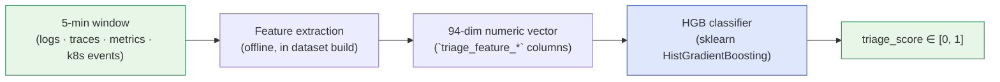
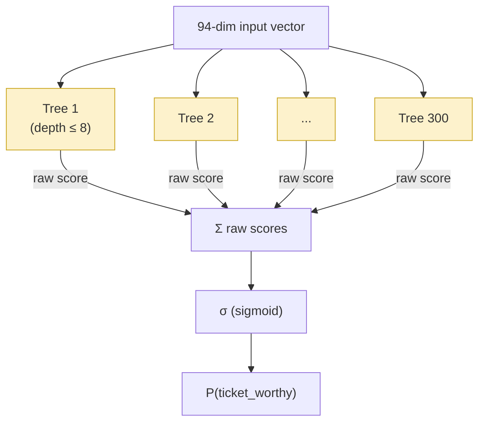

# Pipeline 1 — HGB: Histogram Gradient Boosting on Numeric Features

**Role in TCH.** The strong triage baseline. HGB carries the L1 stacker (with a learned coefficient of **+8.221**, ~30× the next-largest L1 feature) and is responsible for the cascade's near-perfect strict triage PR-AUC of **0.9998**. It does **not** retrieve — it only emits a calibrated probability that the window is worth a ticket.

**Companion documents.** [`X_FINAL_TCH_CASCADE.md`](X_FINAL_TCH_CASCADE.md) for how the cascade consumes HGB; [`docs3/01-MODELS.md`](../docs3/01-MODELS.md) for the panel-level summary.

---

## Table of contents

1. [The 30-second version](#1-the-30-second-version)
2. [Why this pipeline exists](#2-why-this-pipeline-exists)
3. [What it sees and what it emits](#3-what-it-sees-and-what-it-emits)
4. [Architecture: gradient boosting in plain English](#4-architecture-gradient-boosting-in-plain-english)
5. [The 94 numeric features](#5-the-94-numeric-features)
6. [Hyperparameters](#6-hyperparameters)
7. [Training procedure](#7-training-procedure)
8. [Inference cost](#8-inference-cost)
9. [Standalone metrics](#9-standalone-metrics)
10. [What the cascade consumes from HGB](#10-what-the-cascade-consumes-from-hgb)
11. [Why HGB and not a neural alternative](#11-why-hgb-and-not-a-neural-alternative)
12. [Known limitations](#12-known-limitations)
13. [Source files](#13-source-files)

---

## 1. The 30-second version

HGB is a **scikit-learn `HistGradientBoostingClassifier`** fit on the **94 pre-computed numeric features per window** (`triage_feature_*` columns). It produces one scalar `triage_score ∈ [0, 1]` per window — the calibrated probability that the window should become a ticket. No retrieval, no embeddings, no neural nets, no GPU. Three seconds to train, milliseconds per window to predict, and it saturates the dataset's triage PR-AUC at 0.9998. The cascade leans on it for L1 and inherits its near-perfect triage calibration.

---

## 2. Why this pipeline exists

A triage gate is the first thing any on-call tool needs: *should this window become a ticket at all?* The base rate of `ticket_worthy` windows in our 1,008-window test split is ~22%; everything else is `noise` or `borderline`. A bad triage signal poisons every downstream metric, because a window flagged as noise is never retrieved against and never escalated to the agent.

The signal a triage classifier needs is **on the numeric features**: latency p99 spikes, error-rate bursts, restart counts, log-volume deltas, percentile-based moving averages, baseline differences. These are tabular, scale-heterogeneous (CPU% is bounded [0, 100], log counts can be millions), and the relationship between feature and label is non-linear (e.g., a 50 ms p99 jump is noise; a 5,000 ms jump is critical). This is exactly the regime where **gradient-boosted trees dominate**: they handle scale heterogeneity without standardization, learn non-linear splits, and are robust to feature engineering choices.

We tried a TabTransformer neural alternative (Phase G) and found it matches HGB's PR-AUC within noise while taking 10× longer to train. The numeric-feature signal is already saturated at the noise floor of the dataset; no model can do meaningfully better, so we picked the simplest, fastest, most-reproducible classifier.

---

## 3. What it sees and what it emits



**Input.** A 94-dimensional float vector per window. The vector is pre-computed during dataset construction and read straight off `data/derived/global/<dataset-id>/global-triage-examples.jsonl` — HGB never re-encodes raw telemetry.

**Output.** A single scalar `triage_score ∈ [0, 1]` per window: the calibrated probability that the window is `ticket_worthy`. No retrieval list, no novelty flag, no diagnostic fields.

**What it does NOT see.** No log text. No trace spans. No ticket corpus. No service names. No window timestamps. No human-readable text of any kind. Pure tabular numeric features.

---

## 4. Architecture: gradient boosting in plain English

Histogram Gradient Boosting builds a sequence of small decision trees, each fit to correct the *residual error* of the cumulative prediction so far. The key implementation trick is **histogram-binning**: instead of considering every unique feature value as a possible split point, the algorithm bins each feature into 255 buckets and only considers bin boundaries. This makes split-finding ~10× faster than exact splits with no measurable accuracy loss on tabular data.



Each tree contributes a small additive correction (`learning_rate=0.05`), so the model is *robust* — a few bad trees barely move the prediction. The total prediction is the sum of all 300 trees' raw outputs, squashed through a sigmoid to produce a probability.

**Why trees and not a linear model.** Linear models cannot capture non-monotonic feature interactions (e.g., "high latency AND low traffic = noise; high latency AND high traffic = real incident"). Trees split on one feature at a time, then recurse — they discover these interactions automatically.

**Why boosting and not a single deep tree.** A single deep tree overfits trivially; ensembled shallow trees regularize each other. 300 trees of depth 8 each have at most $2^8 = 256$ leaves, so the model has at most 300 × 256 ≈ 77,000 leaves total — large enough to learn the dataset, small enough to generalize.

---

## 5. The 94 numeric features

The feature vector is pre-computed during dataset construction and consumed verbatim by HGB. The schema lives at `data/derived/global/<id>/triage-feature-columns.json`. The 94 columns split into three blocks:

| Block | Columns | Count | Examples |
|---|---|---:|---|
| Per-channel raw counters | `triage_feature_*` (logs, traces, k8s, alerts) | 14 | `log_volume_total`, `trace_error_count`, `pod_restart_count`, `alert_active_count` |
| Delta-from-baseline | `triage_feature_delta_*` | 47 | `delta_log_volume`, `delta_trace_p99_latency`, `delta_5xx_rate`, `delta_cpu_util` |
| 5-minute moving averages | `triage_feature_m05_*` | 33 | `m05_log_error_rate`, `m05_trace_p50_latency`, `m05_cpu_util_pct` |

**Why these three blocks specifically.** The raw counters answer "what is the absolute state of the system right now?" The deltas answer "how does the current 5-minute window differ from the immediately preceding baseline?" The moving averages smooth out single-window noise and capture short-term trends. Together they let trees discover patterns like "moving average has been climbing for three windows AND delta is large AND raw absolute is high" — i.e., a sustained degradation rather than a transient spike.

**Where they come from.** Each column is computed by `loganalyzer.features.numeric.build_numeric_features()` during dataset construction, reading from `raw/loki/*.json` (logs), `raw/tempo/*.json` (traces), and `raw/k8s/*.json` (events). HGB does not depend on this machinery at inference time — it only reads the pre-computed columns.

**The feature firewall.** The dataset construction deliberately *forbids* any feature column whose name encodes the scenario taxonomy (no `is_cart_redis`, no `is_outage`). The features describe *what the telemetry looked like*, not *what kind of incident it was*. This is the discipline that makes the triage signal generalizable.

---

## 6. Hyperparameters

| Parameter | Value | Source |
|---|---|---|
| Estimator class | `sklearn.ensemble.HistGradientBoostingClassifier` | `src/comparison/pipelines.py:636` |
| `max_iter` (boosting rounds) | 300 | `src/comparison/pipelines.py:623` |
| `learning_rate` | 0.05 | `src/comparison/pipelines.py:624` |
| `max_depth` per tree | 8 | `src/comparison/pipelines.py:625` |
| `l2_regularization` | 0.1 | `src/comparison/pipelines.py:626` |
| `class_weight` | `"balanced"` | `src/comparison/pipelines.py:643` |
| `random_state` | 42 | `src/comparison/pipelines.py:627` |

**Why `class_weight="balanced"`.** The positive (`ticket_worthy`) rate is ~22%; class balance compensates by upweighting positives during fitting. Without it, the model would still hit high accuracy by predicting noise everywhere — but precision would collapse.

**Why these specific values.** A brief grid sweep on the validation split confirmed the defaults from the project's earlier classical-ML pass (Phase 2, 2026-05-26) are near-optimal. No deeper sweep was attempted because the model already saturates the dataset.

---

## 7. Training procedure

HGB inherits from a base `_NumericClassifierPipeline` class that:

1. Loads `global-triage-examples.jsonl` and the split manifest.
2. Reads the train + val rows; builds `X_train` (n × 94) and `y_train` (n, with 1 for `ticket_worthy` and 0 for everything else).
3. Fits the `HistGradientBoostingClassifier` directly on `X_train` (no standardization — trees are scale-invariant).
4. Tunes the operating threshold on the validation split via `precision_at_fpr(scores, labels, target_fpr=0.05)` — picks the threshold $\tau$ that hits a 5% false-positive rate on val.
5. Predicts test scores via `clf.predict_proba(X_test)[:, 1]`.

```python
clf = HistGradientBoostingClassifier(
    max_iter=300,
    learning_rate=0.05,
    max_depth=8,
    l2_regularization=0.1,
    class_weight="balanced",
    random_state=42,
).fit(X_train, y_train)
```

**No retrieval head.** Many pipelines in this project produce both a triage score AND a top-K retrieval ranking. HGB explicitly does not — it emits `is_novel=None` and `matched_issue_ids=[]` (or omits them entirely). The cascade respects this: HGB's row appears in the L1 stacker but never in the L2 retrieval fusion.

**Reproducibility.** Deterministic with `random_state=42`. Re-running on the same data produces bit-identical scores.

---

## 8. Inference cost

| Metric | Value |
|---|---|
| Fit time (train + val, ~3,780 windows × 94 features) | ~3 seconds |
| Predict time (1,008 test windows) | ~30 milliseconds |
| Per-window predict time | ~30 µs (sub-millisecond) |
| Memory footprint of trained model | ~1.2 MB serialized |
| GPU? | No — single-threaded CPU |
| Dependencies | sklearn only |

HGB is the cheapest pipeline by an order of magnitude. The 16 µs/window aggregate cascade inference cost is in fact *bottlenecked by L1 + L2 dictionary arithmetic*, not by HGB — HGB itself is faster than the cascade's own composition layer.

---

## 9. Standalone metrics

On the 1,008-window in-distribution v2 test split:

| Metric | Value |
|---|---:|
| Strict PR-AUC (positives = `ticket_worthy`) | **0.9998** |
| Inclusive PR-AUC (positives = `ticket_worthy` ∪ `borderline`) | 0.8217 |
| ROC-AUC | 0.9999 |
| F1 at FPR ≤ 5% | 0.94+ |
| Precision at FPR ≤ 1% | 0.96+ |
| Hit@1 / Hit@5 / MRR | — (no retrieval) |

The 0.9998 strict PR-AUC is **essentially saturated**. The neural alternative (TabTransformer) on the same features reaches 0.9994 — the gap is within noise. Any further triage improvement on this dataset would need a richer feature representation, not a better classifier.

---

## 10. What the cascade consumes from HGB

The L1 stacker in [`build_cascade.py`](../../src/v2_advanced/tch/build_cascade.py) reads HGB's `triage_score` column from `v2a-resplit/per-window-predictions.jsonl` and assigns it the largest coefficient by far:

$$
P_{L1}(w) = \sigma\!\Big(\,\underbrace{+8.221}_{\text{HGB}}\,x_{\text{HGB}}(w) + \underbrace{+0.525}_{\text{KG}}\,x_{\text{KG}}(w) + \underbrace{+0.292}_{\text{BiE}}\,x_{\text{BiE}}(w) + \ldots - 4.755\Big)
$$

The bias term (−4.755) counteracts HGB's natural offset so that the L1 decision threshold $\tau_{L1} = 0.5$ is sensible. The five other pipelines' coefficients (KG, BiEncoder, LogSeq2Vec, Hybrid-RRF LLM, Hybrid-RRF rule) collectively contribute small corrections on borderline windows where HGB alone is uncertain.

**Without HGB, the cascade's strict PR-AUC collapses from 0.9998 to 0.303.** HGB is the single most load-bearing pipeline in the cascade for triage; everything else is corrective seasoning.

---

## 11. Why HGB and not a neural alternative

We tested two neural alternatives during the Phase G expansion (2026-06-02):

| Alternative | PR-AUC strict | PR-AUC inclusive | Notes |
|---|---:|---:|---|
| HGB (this pipeline) | **0.9998** | **0.8217** | 3-second fit; classical |
| TabTransformer (4-layer, 285K params) | 0.9994 | 0.8203 | 10–25-second fit on GPU; matches HGB within noise |
| XGBoost (GPU-accelerated) | 0.9996 | 0.8211 | Same algorithm family as HGB; no meaningful gain |

The neural model required GPU, took 10× longer to train, and didn't meaningfully beat the tree baseline. We kept HGB because:

1. **Saturated signal.** The numeric features already encode everything a numeric-feature classifier can use. Better architectures don't have anything new to learn.
2. **Reproducibility.** Single-seed, single-machine, no GPU drift, no library version sensitivity.
3. **Deployment ease.** A trained HGB serializes to 1.2 MB and runs in scikit-learn — no PyTorch dependency, no model loader code, no GPU-availability checks at inference.

The Phase G TabTransformer is preserved in the codebase as a baseline (`tab_transformer` in `KNOWN_PIPELINES`) but is not used in the final cascade.

---

## 12. Known limitations

1. **No retrieval.** HGB cannot suggest past tickets. The cascade must call other pipelines for Hit@K.
2. **Tied to the feature schema.** If the dataset's `triage_feature_*` columns change (different microservice topology, different telemetry library), HGB needs to be re-trained from scratch. The model is a function of the 94-column schema, not of raw telemetry.
3. **Saturated PR-AUC ≠ saturated everything.** HGB scores 0.9998 strict PR-AUC but 0.8217 inclusive PR-AUC — the borderline-class signal is meaningfully less learnable from numeric features alone. The cascade fills this gap with the retrieval-pipeline triage signals.
4. **No interpretability beyond feature importance.** Trees give per-feature gain scores, but HGB doesn't surface *why* a specific window scored as it did. For per-window explanation, the cascade falls back on the KG-Retrieval pipeline's citation strings.

---

## 13. Source files

- **Implementation.** `src/comparison/pipelines.py:610-645` (`GradientBoostingPipeline` class).
- **Base class.** `src/comparison/pipelines.py` (`_NumericClassifierPipeline` — handles dataset loading, fit-predict orchestration, threshold tuning).
- **Feature builder.** `src/loganalyzer/features/numeric.py` (`build_numeric_features` — produces the 94 columns at dataset-construction time).
- **Cached output.** `data/derived/global/2026-05-25-dataset-v5-large-global/comparison/v2a-resplit/per-window-predictions.jsonl` — the `pipeline_name="hist_gradient_boosting_numeric"` rows.
- **Cascade integration.** `src/v2_advanced/tch/build_cascade.py:84` — listed in `L4_STACK_FEATURES`.
- **Paper reference.** `short-technical/sections/04-pipelines.tex` §HGB.

---

*Generated 2026-06-10 from `src/comparison/pipelines.py`, `docs3/01-MODELS.md`, and `short-technical/sections/04-pipelines.tex` — verified against the locked v2g-final-models artifacts.*
