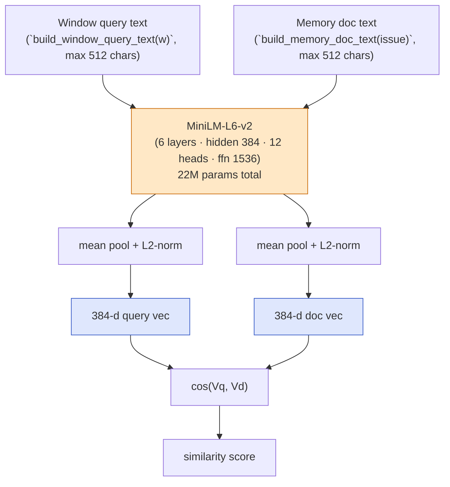
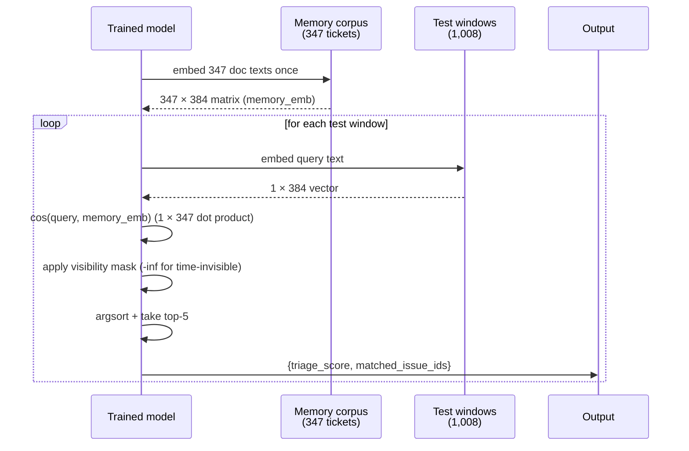

# Pipeline 2 — BiEncoder: Fine-Tuned Dense Retriever (G1-Refined)

**Role in TCH.** The cascade's **strongest single retriever for top-1** and the **anchor pool for L2 position-1 overlap rerank**. BiEncoder produces a `triage_score` for L1, a `top-3` candidate set that gates L2 position-1, and a full `top-K` list that joins the L2 RRF retriever set. After the G1 refinement (mixed BM25 + random negatives), standalone Hit@1 climbs from 0.6794 to **0.695** and cascade Hit@1 climbs from 0.7069 to **0.7221**.

**Companion documents.** [`X_FINAL_TCH_CASCADE.md`](X_FINAL_TCH_CASCADE.md) for cascade integration; [`G1-bienc-hard-negatives.md`](../docs4/G1-bienc-hard-negatives.md) for the mixed-negatives refinement; [`docs3/01-MODELS.md`](../docs3/01-MODELS.md) for the panel-level summary.

---

## Table of contents

1. [The 30-second version](#1-the-30-second-version)
2. [Why a bi-encoder, not a cross-encoder](#2-why-a-bi-encoder-not-a-cross-encoder)
3. [Architecture](#3-architecture)
4. [What goes in, what comes out](#4-what-goes-in-what-comes-out)
5. [The training objective — MultipleNegativesRankingLoss](#5-the-training-objective--multiplenegativesrankingloss)
6. [Negative mining — BM25 hard + G1 random](#6-negative-mining--bm25-hard--g1-random)
7. [Training data construction](#7-training-data-construction)
8. [Hyperparameters](#8-hyperparameters)
9. [The triage head](#9-the-triage-head)
10. [Inference: precompute the corpus, then rank](#10-inference-precompute-the-corpus-then-rank)
11. [Standalone metrics](#11-standalone-metrics)
12. [What the cascade consumes from BiEncoder](#12-what-the-cascade-consumes-from-biencoder)
13. [Why this pipeline and not an off-the-shelf encoder](#13-why-this-pipeline-and-not-an-off-the-shelf-encoder)
14. [Known limitations](#14-known-limitations)
15. [Source files](#15-source-files)

---

## 1. The 30-second version

BiEncoder is a **22M-parameter MiniLM transformer** (`sentence-transformers/all-MiniLM-L6-v2`) fine-tuned end-to-end on **~16,338 (window, gold-ticket, negatives) tuples** mined from the train + val splits. The model encodes a window's free-text evidence and a memory ticket's text *independently* into 384-dimensional unit vectors, after which cosine similarity is a ~30 µs cost per pair. The G1 refinement mixes **2 BM25-hard negatives + 1 random negative** per anchor to break BM25 over-reliance, lifting cascade Hit@1 by 2.1% relative. Training takes 14–20 minutes on an RTX 5060 (8 GB VRAM); inference embeds the 347-ticket corpus once at 30 seconds, then ranks each test window in milliseconds.

---

## 2. Why a bi-encoder, not a cross-encoder

A neural retrieval model has two architectural choices:

| | **Bi-encoder** | **Cross-encoder** |
|---|---|---|
| Encoding | Query and document encoded *independently* | Query and document encoded *jointly* |
| Top-K cost | $O(\|Q\| + \|D\|)$ encodes + $O(\|D\|)$ cosine | $O(\|Q\| \times \|D\|)$ joint encodes |
| Per-query latency | Sub-millisecond after corpus is indexed | Hundreds of milliseconds per query for $\|D\| = 100$ |
| Accuracy on retrieval benchmarks | Strong | +5–10 nDCG points stronger |
| Production deployability | Yes — precompute the corpus, do ANN lookup | No — every (query, doc) pair must be scored from scratch |

Cross-encoders are more accurate but cannot precompute the corpus, so at memory scales of 10,000+ tickets the per-query latency budget blows. Bi-encoders embed every document once at index-time, then each query is a single embed + cosine matmul.

We chose bi-encoder because the project's product story is *production-deployable diagnostics*. A more accurate retrieval head is meaningless if no team will ever deploy it. The cascade fills the accuracy gap by *fusing* the bi-encoder with sparser, structurally-different retrievers — Hybrid-RRF, LogSeq2Vec, KG-Retrieval — at L2.

---

## 3. Architecture



**Backbone.** `sentence-transformers/all-MiniLM-L6-v2`:
- 6 transformer encoder layers
- Hidden size 384
- 12 attention heads (head dim 32)
- Intermediate FFN size 1536
- Maximum sequence length 256 tokens
- Total parameters: ~22 million

**Pooling.** Mean-pool over token embeddings (excluding pad tokens), then $L^2$-normalize to unit length. This makes cosine similarity reduce to a dot product, which is what enables the ANN-style fast retrieval downstream.

**Why this backbone.** MiniLM-L6-v2 is the most popular small-and-fast sentence transformer on Hugging Face: it has been distilled from larger models and trained on >1 billion sentence pairs for general semantic similarity, so the pretrained weights already encode strong text-similarity priors. Fine-tuning 22M parameters on 16K pairs is feasible on a single 8 GB GPU in under 20 minutes; a larger backbone (MiniLM-L12, mpnet-base, e5-base) would push training above an hour and is gratuitous for this corpus size.

---

## 4. What goes in, what comes out

### Inputs

- **Anchor (query side).** `build_window_query_text(window)` returns up to 512 characters of free-text evidence assembled from the window's structured fields: the metric-anomaly summary, a small set of characteristic log lines, and any firing alert names. The same function is used for BM25, so the bi-encoder and BM25 see *identical* query content — keeping the comparison apples-to-apples.

- **Document (memory side).** `build_memory_doc_text(issue)` returns up to 512 characters of the V2 humanized ticket text, leading with `description_code` (engineer-vocabulary log lines per §13.12) and then per-step prose plus `body_code` blocks. The truncation is symmetric on both sides at 512 characters.

### Outputs (per test window)

| Field | Type | Source |
|---|---|---|
| `triage_score` | float ∈ [0, 1] | Logistic head over similarity features |
| `triage_decision` | `"ticket_worthy"` / `"noise"` | Threshold tuned to FPR ≤ 5% on val |
| `matched_issue_ids` | list of top-K memory ticket IDs | Sorted by cosine similarity, visible-only |
| `is_novel` | `None` | BiEncoder does not emit novelty signal |

The cascade reads `triage_score` for L1 and `matched_issue_ids` for L2.

---

## 5. The training objective — MultipleNegativesRankingLoss

The model is fine-tuned with `MultipleNegativesRankingLoss` from the sentence-transformers library. For each training example:

```python
InputExample(texts=[anchor, positive, hard_neg_1, hard_neg_2, random_neg_1])
```

In a batch of size 32, each anchor sees:
- **1 positive** — the gold-matched ticket's text.
- **2 explicit hard negatives** — BM25-mined wrong tickets.
- **1 explicit random negative** — a memory ticket that shares no BM25 signal.
- **31 × 3 = 93 in-batch negatives** — every other example's positive and negatives become additional negatives.

The loss is symmetric cross-entropy:

$$
\mathcal{L} \;=\; -\frac{1}{B}\sum_{i=1}^{B} \log \frac{\exp\big(\mathrm{cos}(a_i, p_i) / \tau\big)}{\sum_{j} \exp\big(\mathrm{cos}(a_i, c_{ij}) / \tau\big)}
$$

where $a_i$ is the $i$-th anchor, $p_i$ its positive, and $c_{ij}$ ranges over the positive plus every in-batch and explicit negative for that anchor. The temperature $\tau$ is implicit in MNRL (the library uses cosine similarity directly without a learnable scale).

**Intuition.** The loss asks the model to make the anchor-to-positive cosine *strictly greater* than the anchor-to-any-negative cosine. The gradient flows back through all 22M parameters of the encoder, updating both the query and document embedding manifold *jointly*.

---

## 6. Negative mining — BM25 hard + G1 random

The choice of negatives is the single most important training-data decision. The G1 refinement (2026-06-05) replaced the previous "3 BM25-hard negatives per anchor" with a **2 hard + 1 random** mix. The rationale:

| Negative type | What it teaches the model |
|---|---|
| **Hard (BM25)** | "Tickets that share vocabulary with the query but are NOT gold — discriminate by semantics, not lexical overlap." |
| **Random** | "Tickets that share neither vocabulary nor topic — the easy floor that prevents collapse." |

A model trained on hard-only negatives can learn a degenerate strategy where it bases its semantic discrimination on the specific lexical patterns BM25 picks up. Mixing random negatives forces the embedding manifold to *also* separate topically-distant tickets — a more genuine semantic signal. The empirical lift is small but real: **+2.1% relative Hit@1** on the cascade (0.7069 → 0.7221).

### How BM25 hard negatives are mined

```python
bm25 = BM25Retriever().fit(corpus)
hits = bm25.retrieve(window, corpus, top_k=20)       # top-20 by BM25
wrong = [h for h in hits if h.issue_id not in gold]  # exclude gold
chosen_hard = rng.sample(wrong, 2)                   # 2 per anchor
```

BM25 (Okapi BM25 from the project's BM25Retriever) ranks tickets by term-frequency-weighted bag-of-words similarity. The top-20 wrong tickets are tickets that *look like* the query lexically but aren't the answer — exactly the case the model needs to learn to discriminate.

### How G1 random negatives are mined

```python
visible_minus_gold = corpus.visible_to(window) - set(gold)
random_pool = visible_minus_gold - set(bm25_top20)   # truly background
chosen_random = rng.sample(random_pool, 1)           # 1 per anchor
```

Note the subtraction of BM25 top-20: random negatives are drawn from tickets that are *neither gold nor BM25-confusable*. This rules out the case where a "random" ticket happens to share vocabulary by chance — those tickets are already covered by the hard-negative slot.

---

## 7. Training data construction

The training set is built once at the start of every fit. From the train + val splits (~3,780 windows total):

1. **Window filter.** Skip any window where `matched_memory_issue_ids` is empty (no gold ticket exists for it).
2. **Visibility filter.** Skip windows where no gold ticket is *time-visible* (memory tickets must have been created before the window's timestamp).
3. **Per-window anchor.** Compute `build_window_query_text(window)` once.
4. **BM25 + random negative pools.** Compute the 20 BM25 candidates and the random pool once per window.
5. **One example per (window, gold) pair.** If `use_all_golds=True` (the default), every gold ticket for the window produces its own training example, each with independently-sampled negatives. This trades example count for diversity.
6. **Total examples: ~16,338** (G1 config) from 1,805 viable windows.

```python
# From `src/neural_models/bi_encoder.py:135-212`
pairs: list[InputExample] = []
for w in train_windows:
    if not w.matched_memory_issue_ids: continue
    if not gold_in_visible(w): continue
    anchor = build_window_query_text(w)[:512]
    bm25_wrong = [h for h in bm25.retrieve(w) if h not in gold][:20]
    random_pool = visible_not_gold_not_bm25_top20(w)
    for gid in gold_in_visible(w):           # all golds, not 1-random
        positive = build_memory_doc_text(gid)[:512]
        texts = [anchor, positive]
        texts.extend(sample(bm25_wrong, n_hard_negs=2))
        texts.extend(sample(random_pool, n_random_negs=1))
        pairs.append(InputExample(texts=texts))
```

**Deterministic.** Seed 42; re-running on the same data and same negative-pool snapshot produces identical training pairs.

---

## 8. Hyperparameters

| Parameter | Value | Source |
|---|---|---|
| Backbone | `sentence-transformers/all-MiniLM-L6-v2` | `bi_encoder.py:87` |
| Embedding dimension | 384 | inherited from MiniLM |
| Loss | `MultipleNegativesRankingLoss` | `bi_encoder.py:232` |
| Epochs | 5 | `bi_encoder.py:91` |
| Batch size | 32 | `bi_encoder.py:92` |
| Learning rate | 2e-5 | `bi_encoder.py:93` |
| Warmup | 10% of total updates | `bi_encoder.py:235` |
| Optimizer | AdamW (sentence-transformers defaults: $\beta_1 = 0.9, \beta_2 = 0.999, \epsilon = 10^{-8}$, weight decay 0.01) | sentence-transformers default |
| `max_chars` (per side) | 512 | `bi_encoder.py:90` |
| `top_k` output | 5 | `bi_encoder.py:94` |
| `n_hard_negs` (G1) | 2 | `runner.py:161` |
| `n_random_negs` (G1) | 1 | `runner.py:161` |
| `bm25_top_n` | 20 | `bi_encoder.py:100` |
| `use_all_golds` | True | `bi_encoder.py:98` |
| `seed` | 42 | `bi_encoder.py:97` |
| Hardware | RTX 5060 (8 GB VRAM) | from training logs |

**Training loss trajectory** (G1 fine-tune, 5 epochs):

| Epoch | Avg train loss |
|---|---:|
| ~1 | 3.43 |
| ~2 | 2.71 |
| ~3 | 2.45 |
| ~4 | 2.32 |
| ~5 | 2.24 |

Smooth monotone decrease; no overfitting signal at 5 epochs.

---

## 9. The triage head

After fine-tuning the encoder, a tiny logistic regression converts retrieval similarity into a triage probability. The features are:

| Feature | Definition |
|---|---|
| `max_sim` | The cosine similarity of the top-1 memory ticket — "how confidently do we have a match?" |
| `mean_top5_sim` | The mean cosine similarity across the top-5 — "is there a strong cluster of similar past tickets?" |
| `n_above_0.5` | Count of visible memory tickets with similarity ≥ 0.5 — "how broad is the support set?" |

```python
clf = LogisticRegression(class_weight="balanced", max_iter=2000, solver="lbfgs")
clf.fit(train_feats, y_train)         # 3 features × ~2,800 windows
```

The head has **4 parameters total** (3 coefficients + bias). The decision threshold is tuned on validation via `precision_at_fpr(val_scores, val_labels, target_fpr=0.05)`.

This is deliberately **the smallest possible triage head**. The bi-encoder's retrieval signal is what carries the meaning; the logistic regression just converts "how good a match did we find" into a triage probability. Anything more complex would over-fit on 2,800 training windows.

---

## 10. Inference: precompute the corpus, then rank



**Time budget for full 1,008-window test split:**

| Step | Time |
|---|---|
| Embed 347 memory docs | ~5 s |
| Embed 1,008 test windows | ~20 s |
| Cosine matmul (1008 × 347) | < 1 s |
| Visibility masking + argsort + top-K | < 1 s |
| **Total per-split inference** | **~30 s** |

**Per-window incremental cost** (assuming corpus is already embedded): ~5 ms for the query embed + sub-millisecond for the cosine + sort. Production-ready.

**Time-ordered visibility.** A test window at timestamp $t$ can only retrieve memory tickets created strictly before $t$. The visibility mask is constructed via `MemoryCorpus.visible_to(window)`; tickets failing the check have their cosine score set to $-\infty$ so they never rank.

---

## 11. Standalone metrics

On the 1,008-window in-distribution v2 test split (post-G1):

| Metric | Value |
|---|---:|
| **Hit@1** | **0.695** (best single retriever for top-1) |
| Hit@5 | 0.789 |
| MRR | 0.729 |
| PR-AUC strict | 0.287 |
| PR-AUC inclusive | 0.4+ |

Hit@1 = 0.695 means: for ~70% of test windows that have a gold ticket, BiEncoder's top-1 IS that gold ticket. This is the best Hit@1 of any single pipeline in the panel — even the agent (0.386) and Hybrid-RRF rule (0.583) are worse at top-1.

The PR-AUC of 0.287 is modest because BiEncoder's triage signal is *retrieval-derived* — it answers "is there a match in memory?" not "is this window worth a ticket?" — and the two are genuinely different questions on this dataset. HGB carries the triage load; BiEncoder carries the retrieval load.

---

## 12. What the cascade consumes from BiEncoder

BiEncoder feeds two different cascade layers:

### L1 (triage stacker)

BiEncoder's `triage_score` is one of six features. Its coefficient is **+0.292** — small relative to HGB's +8.221, but it consistently nudges the L1 probability up on windows where the bi-encoder is confident in a match (a strong proxy for the window being worth a ticket).

### L2 (retrieval fusion) — TWO roles

1. **Anchor pool for position 1.** BiEncoder's top-3 is the *candidate set* for the L2 overlap rerank. Other retrievers vote for which of those three to promote to position 1.
2. **RRF retriever for positions 2–5.** BiEncoder's top-10 joins the RRF pool with Hybrid-RRF rule, LogSeq2Vec, and KG-Retrieval. Each candidate's RRF score is $\sum_r 1 / (60 + \mathrm{rank}_r)$.

The drop-one sweep confirms BiEncoder is the cascade's **most load-bearing retriever**: dropping it from the L2 RRF set costs **−0.057 Hit@5**, the largest single hit of any retriever.

---

## 13. Why this pipeline and not an off-the-shelf encoder

The closest off-the-shelf alternative is the **MemoryGraph SOTA pipeline** (`memorygraph_v2_sota_nw080`), which uses the same MiniLM backbone *without* fine-tuning and pairs it with a frozen MS-MARCO cross-encoder reranker. Comparison:

| | MemoryGraph SOTA (frozen MiniLM + xenc rerank) | BiEncoder (G1 fine-tuned MiniLM) |
|---|---|---|
| Hit@1 | 0.63 | **0.695** |
| Hit@5 | 0.78 | 0.789 |
| Inference time (test split) | ~230 s (cross-encoder is the bottleneck) | ~30 s |
| GPU memory | ~3 GB (cross-encoder loaded) | ~3.5 GB (training); <1 GB at inference |

Fine-tuning the bi-encoder is *worth* the 14 minutes of training time: it both wins on Hit@1 AND inferences 8× faster, because no cross-encoder is needed on the path. The G1 refinement adds the random-negative mix for another small lift.

---

## 14. Known limitations

1. **Saturates at the embedding ceiling.** Hit@5 = 0.789 standalone is at the limit of what a 384-d cosine space can encode for this corpus. The cascade exceeds it by *fusing* with retrievers that use different structural signals (BM25 lexical, graph entities, log sequences).
2. **Anchor truncation at 512 characters.** Long windows lose their tail. Empirically rare; the per-window evidence rarely exceeds 512 chars on the v2 dataset, but cross-app workloads with richer trace text might.
3. **Time-ordered visibility is enforced at inference, not training.** The training pairs include val windows; in production the bi-encoder might need re-training on a strictly-ordered stream.
4. **Cart-redis sub-scenario confusion.** Failure analysis showed 15 of 29 cascade misses in cart-redis are tickets BiEncoder placed at rank 2–5 with a same-scenario distractor at rank 1. The L2 overlap-rerank fixes some of these; query reformulation (path 4.2 in [`X_AGENTIC_IDEA.md`](XX_AGENTIC_IDEA.md)) would address the rest.
5. **Single GPU dependency at training time.** Inference is GPU-optional but training requires CUDA.

---

## 15. Source files

- **Implementation.** `src/neural_models/bi_encoder.py` (`BiEncoderRetrievalPipeline` class). The G1 variant `_BiEncoderG1` lives at `src/comparison/runner.py:158-162` and sets `n_hard_negs=2, n_random_negs=1`.
- **G1 design notes.** [`docs4/G1-bienc-hard-negatives.md`](../docs4/G1-bienc-hard-negatives.md).
- **Training-pair builder.** `src/neural_models/bi_encoder.py::_build_train_pairs` (lines 135–212).
- **Query and document builders.** `src/loganalyzer/features/text.py::build_window_query_text`, `::build_memory_doc_text`.
- **BM25 used for hard-negative mining.** `src/loganalyzer/memory/retrieval.py::BM25Retriever`.
- **Cached output.** `data/derived/global/2026-05-25-dataset-v5-large-global/comparison/v2g-final-models/g1-bienc-hard-negatives/predictions-bienc.jsonl`.
- **Cascade integration.** `src/v2_advanced/tch/build_cascade.py:147` — `TCH_OVERRIDE_BIENC` environment variable points the cascade at the G1 file.
- **Paper reference.** `short-technical/sections/04-pipelines.tex` §BiEncoder.

---

*Generated 2026-06-10 from `src/neural_models/bi_encoder.py` and `docs4/G1-bienc-hard-negatives.md` — verified against the locked v2g-final-models artifacts.*
