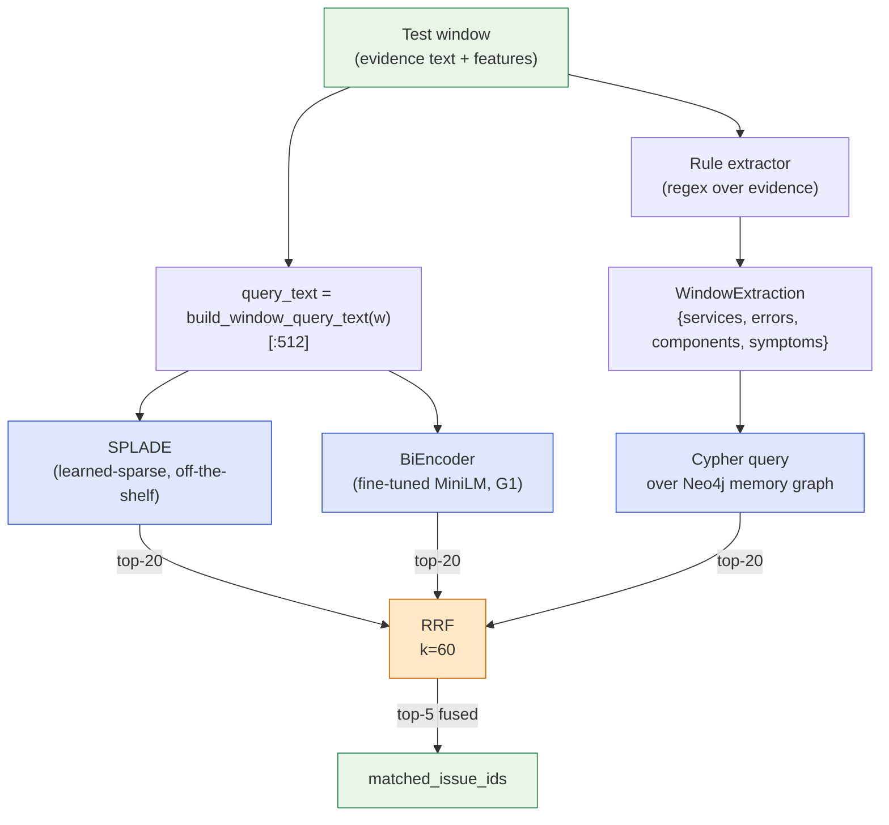
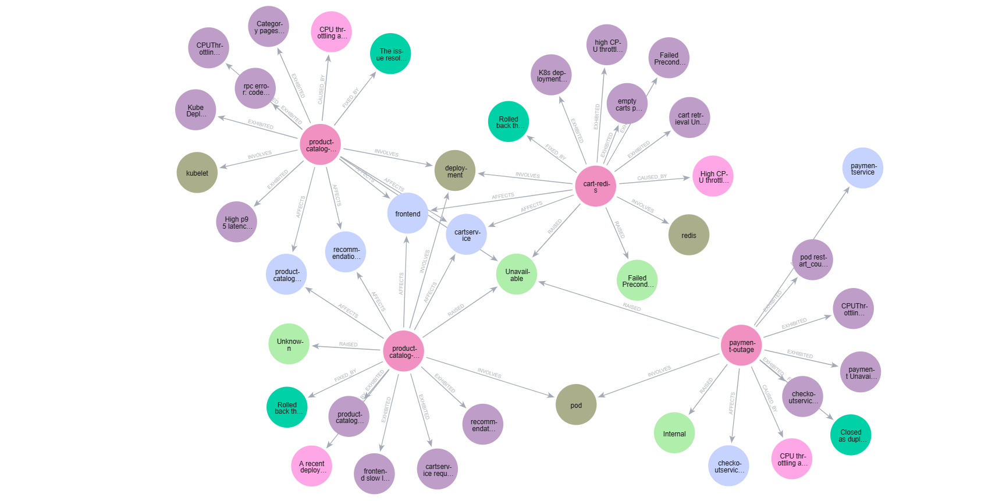

# Pipeline 3 — Hybrid-RRF (Rule Graph): SPLADE + BiEncoder + Rule-Extracted Graph

**Role in TCH.** The cascade's **best single retriever for Hit@5** (standalone 0.798) and a **voter in the L2 position-1 overlap rerank**. Hybrid-RRF (rule) fuses three structurally-different retrievers — a learned-sparse SPLADE retriever, a fine-tuned dense bi-encoder, and a knowledge-graph entity-overlap retriever — using Reciprocal Rank Fusion. The "rule" variant extracts the *window-side* entities via regex; the [`pipeline-4-HybridRRF-LLM`](pipeline-4-HybridRRF-LLM.md) sibling uses the LLM for that same step.

**Companion documents.** [`X_FINAL_TCH_CASCADE.md`](X_FINAL_TCH_CASCADE.md) for L2 integration; [`pipeline-2-BiEncoder`](pipeline-2-BiEncoder.md) for the dense sub-retriever; [`pipeline-6-KGRetrieval`](pipeline-6-KGRetrieval.md) for the graph sub-retriever in detail.

---

## Table of contents

1. [The 30-second version](#1-the-30-second-version)
2. [Why fuse three retrievers](#2-why-fuse-three-retrievers)
3. [Architecture](#3-architecture)
4. [The three sub-retrievers](#4-the-three-sub-retrievers)
   - [SPLADE — learned sparse](#41-splade--learned-sparse)
   - [BiEncoder — fine-tuned dense](#42-biencoder--fine-tuned-dense)
   - [Graph — Cypher entity overlap (rule-extracted)](#43-graph--cypher-entity-overlap-rule-extracted)
5. [Reciprocal Rank Fusion](#5-reciprocal-rank-fusion)
6. [What goes in, what comes out](#6-what-goes-in-what-comes-out)
7. [The triage head](#7-the-triage-head)
8. [Hyperparameters](#8-hyperparameters)
9. [Inference cost](#9-inference-cost)
10. [Standalone metrics](#10-standalone-metrics)
11. [What the cascade consumes](#11-what-the-cascade-consumes)
12. [Why the rule variant and the LLM variant differ](#12-why-the-rule-variant-and-the-llm-variant-differ)
13. [Known limitations](#13-known-limitations)
14. [Source files](#14-source-files)

---

## 1. The 30-second version

Hybrid-RRF runs **three retrievers per query window** — SPLADE (learned sparse), fine-tuned BiEncoder (dense), and Cypher graph traversal over Neo4j (entity overlap) — and combines their top-20 ranked lists via **Reciprocal Rank Fusion with k=60**. The "rule" variant extracts the window's entities (services, errors, components, symptoms) at query time using **hand-written regular expressions**; the memory side's entities were extracted once by the LLM and cached in Neo4j. Standalone Hit@5 is **0.798** — the best of any single pipeline in the panel. The cascade consumes its top-3 as an L2 overlap-rerank voter and its top-10 as one of four L2 RRF retrievers for positions 2–5.

---

## 2. Why fuse three retrievers

A single retriever has a *dominant* failure mode:

| Retriever | Strong on | Weak on |
|---|---|---|
| **Sparse (BM25/SPLADE)** | Verbatim vocabulary overlap | Paraphrase, synonyms, abstract terminology |
| **Dense (bi-encoder)** | Semantic similarity, paraphrase | Specific named entities, rare error codes |
| **Graph (entity overlap)** | Structural matches (same service, same error class) | Cases where the entities don't match but the meaning does |

These failure modes are **complementary**: the windows where SPLADE misses are often the windows where the dense retriever wins, and vice versa. Graph adds a third, structurally-different signal grounded in named entities, not text similarity.

**RRF works without requiring score calibration.** Each retriever's confidence is on a different scale (SPLADE produces a sparse dot product, BiEncoder produces cosine in [-1, 1], graph produces an integer-weighted entity-overlap sum). Combining them by score would require either learning weights per retriever (and the weights would not generalize across query types) or normalizing them to a common scale (and the normalization itself becomes a hyperparameter). RRF avoids both problems by combining only the *ranks*: a candidate at rank 1 contributes more than at rank 2, regardless of the underlying score scale.

---

## 3. Architecture



**The visibility rule applies after each retriever.** Each sub-retriever returns its top-20 over the visible memory subset (tickets created strictly before the window's timestamp AND from a different fault-injection run). The fusion happens only on visibility-filtered candidates, so a ticket invisible at $t$ can never appear in the fused output.

---

## 4. The three sub-retrievers

### 4.1 SPLADE — learned sparse

**Model.** `naver/splade-cocondenser-ensembledistil` — a 110-million-parameter SPLADE-v2 checkpoint. SPLADE (Formal et al., SIGIR 2021) is a *learned-sparse* retrieval model: each text is encoded into a 30,000-dimensional sparse vector over the BERT vocabulary, where each non-zero coordinate represents a learned term weight (not a raw frequency count). The model produces high values for both the document's actual terms AND semantically related terms it "expands" to.

**Why SPLADE rather than BM25?**

| | BM25 | SPLADE |
|---|---|---|
| Term weights | Frequency-based (TF × IDF) | Learned by a transformer |
| Vocabulary expansion | None — exact matches only | Yes — semantically-related terms get nonzero weight |
| Index size | Small (~MB) | Larger (~tens of MB) |
| Retrieval cost | O(doc length × number of query terms) | Sparse dot product |
| Recall@K vs BM25 | Baseline | Typically +5–15% on benchmarks |

The paper sometimes describes this slot as "BM25" for accessibility; the actual implementation uses SPLADE. The two play the same architectural role — *the sparse retriever* — and behave similarly enough that the framing carries.

**No fine-tuning.** We use SPLADE out-of-the-box. SPLADE is sensitive to fine-tuning (the learned-sparse pooling is brittle without careful KL-divergence distillation from a cross-encoder teacher); the pretrained model is strong enough as a complement to our fine-tuned BiEncoder.

**Encoding & retrieval.** For each text, encode via the MLM head: `log(1 + relu(logits))` masked by attention, then max-pooled over the sequence. Only the non-zero coordinates are kept (avg ~150 non-zeros per doc). Retrieval is a sparse dot product. Implementation lives at `src/v2_advanced/proposal_c_hybrid_retrieval/splade.py`.

### 4.2 BiEncoder — fine-tuned dense

The dense sub-retriever is a **separate instance** of `BiEncoderRetrievalPipeline` instantiated inside Hybrid-RRF. It is fine-tuned with `MultipleNegativesRankingLoss` on the same train + val data, using the same MiniLM-L6-v2 backbone.

> **Note.** The Hybrid-RRF's BiEncoder is fit *independently* and is **not the same checkpoint** as the standalone `bi_encoder_retrieval` pipeline that feeds the cascade's L1 stacker and L2 anchor pool. The Hybrid-RRF version uses `biencoder_finetune_epochs=3` (not 5) and lacks the G1 random-negative mix — it's the pre-G1 vanilla MiniLM fine-tune. Both BiEncoder instances are computed and cached separately during pipeline runs.

The BiEncoder sub-retriever's full output is precomputed during Hybrid-RRF's fit step (see `pipeline.py:152-175`); its rankings flow into RRF as `biencoder_rankings_by_window` and its triage score becomes one of the triage features.

### 4.3 Graph — Cypher entity overlap (rule-extracted)

The third sub-retriever scores memory tickets by **entity overlap with the query window** via a Cypher query against a Neo4j knowledge graph.

**The knowledge graph.** ~1,500 nodes total, populated once at build time:
- 347 `Incident` nodes (one per Jira ticket)
- 12 `Service` nodes (one per microservice)
- 27 `Component` nodes (logical components like "redis", "envoy")
- 803 `Symptom` nodes
- 343 `RootCause` nodes
- 313 `Fix` nodes
- 15 `ErrorClass` nodes (canonical error tokens like `DeadlineExceeded`, `OOMKilled`)

Edges: `Incident-AFFECTS-Service`, `Incident-INVOLVES-Component`, `Incident-RAISED-ErrorClass`, `Incident-CAUSED_BY-RootCause`, `Incident-FIXED_BY-Fix`, `Incident-EXHIBITED-Symptom`.

The graph is populated **once** by the LLM extractor (`extract_tickets_cli`) running Qwen 3.6 35B over all 347 memory tickets. This is a one-time offline step; the graph then lives in Neo4j and is queried at retrieval time. A rendering of this graph in Neo4j Browser is shown below; the full visualization and a readable zoomed-in view of four representative incidents and their one-hop neighborhoods are in [`pipeline-6-KGRetrieval.md`](pipeline-6-KGRetrieval.md#visualization).



**The rule extractor — what makes this the "rule" variant.** At *query* time, the Hybrid-RRF rule pipeline extracts entities from the *window* using `extract_from_window_rules` (`src/v2_advanced/proposal_d_knowledge_graph/rule_extractor.py`). The rule extractor is pure regex + keyword matching:

- **Services.** Match against the 12 known canonical service names (`cartservice`, `checkoutservice`, ...).
- **Components.** Match against `redis`, `envoy`, `kubelet`, `mysql`, etc.
- **Error classes.** Match against canonical error tokens (`DeadlineExceeded`, `OOMKilled`, ...).
- **Symptoms.** Match regex patterns like `r"p99 latency .* > ?\d"` → `"high p99 latency"`.

This is fast (microseconds per window) and deterministic but **coarse**: it only catches what the regexes know about.

**The Cypher scoring query.** For each window's extracted entity set, score every `Incident` by:

$$
\text{score}(I) = 2.0 \cdot |\text{svc}(I) \cap \text{svc}(w)| + 3.0 \cdot |\text{err}(I) \cap \text{err}(w)| + 1.5 \cdot |\text{comp}(I) \cap \text{comp}(w)| + 1.0 \cdot |\text{sym}(I) \cap \text{sym}(w)| + \text{bonuses}
$$

with optional bonuses for severity match and family match (each +0.5 / +1.0). Error-class match weight is highest because an exact error class is the strongest signal in SRE work.

Implementation: `src/v2_advanced/proposal_d_knowledge_graph/graph_retriever.py`. The full Cypher is reproduced in `pipeline-6-KGRetrieval.md`.

---

## 5. Reciprocal Rank Fusion

```python
RRF(c) = sum over retrievers r of  1 / (60 + rank_r(c))
```

For each candidate $c$ appearing in any of the three retrievers' top-20 lists, sum the reciprocal-rank contributions. The constant $k = 60$ is the value Cormack et al. (2009) recommend; the project's sweep over $\{30, 60, 90, 120\}$ confirmed 60 is near-optimal.

Implementation: `src/v2_advanced/proposal_c_hybrid_retrieval/rrf.py::rrf_fuse_ids`. Per-retriever weights are exposed via `retriever_weights` (default `{"splade": 1.0, "biencoder": 1.0, "graph": 1.0}`). The default config does *not* weight any retriever differently — RRF's strength is that it works without per-retriever calibration, and learning weights tends to overfit on the small training set.

**Why this specific top-N**: top-20 per retriever, fused to top-5 final.

- 20 is a sweet spot: small enough that the fusion is fast (~3 × 20 = 60 candidates total per window), large enough that a candidate placed at rank 15 by one retriever and rank 3 by another still surfaces in the fused list.
- 5 final is the cascade's output cardinality (Hit@5 metric).

---

## 6. What goes in, what comes out

### Inputs

- **Window evidence text** for SPLADE and BiEncoder queries (`build_window_query_text(w)[:512]`).
- **Rule-extracted window entities** for the graph query.
- **Memory corpus** (347 humanized tickets) — pre-encoded with SPLADE, pre-encoded with the inner BiEncoder, and pre-loaded into Neo4j.
- **Visibility set** per window — tickets created strictly before the window's timestamp from a different fault-injection run.

### Outputs (per test window)

| Field | Type | Source |
|---|---|---|
| `triage_score` | float ∈ [0, 1] | Logistic head on 3 fusion features |
| `triage_decision` | `"ticket_worthy"` / `"noise"` | Threshold tuned to FPR ≤ 5% on val |
| `matched_issue_ids` | list of top-5 fused IDs | RRF over the three retrievers |
| `is_novel` | `True` if `matched_issue_ids` is empty, else `False` | Set by the pipeline directly |

The cascade reads `triage_score` for L1 (one of six features) and `matched_issue_ids` for L2 (RRF retriever + voter set).

---

## 7. The triage head

The Hybrid-RRF triage head uses **three fusion-derived features**, not the per-retriever scores:

| Feature | Definition |
|---|---|
| `n_unique_in_fused_top_30` | Count of unique IDs appearing in the concatenated top-30 across retrievers |
| `n_shared_across_lists` | Count of IDs appearing in ≥ 2 retrievers' lists |
| `biencoder_triage_score` | The inner BiEncoder pipeline's own triage probability (carried through) |

```python
# From `pipeline.py:233-243`
def feats_from_three(rankings, be_score):
    all_ids = [d for lst in rankings.values() for d in lst]
    unique = len(set(all_ids[:30]))
    shared = sum(1 for _, v in Counter(all_ids).items() if v >= 2)
    return [float(unique), float(shared), be_score]
```

The intuition:
- `n_unique` is *narrow* when retrievers agree (good signal of a single strong match) and *wide* when they disagree (noisy).
- `n_shared` is *high* when multiple retrievers independently surface the same candidates (very strong signal that the right answer is in the list).
- `biencoder_triage_score` carries the per-window confidence inherited from the dense retriever.

The logistic head over these three features is fit on the train split, threshold tuned to FPR ≤ 5% on val.

---

## 8. Hyperparameters

| Parameter | Value | Source |
|---|---|---|
| SPLADE checkpoint | `naver/splade-cocondenser-ensembledistil` | `pipeline.py:69` |
| SPLADE max input length | 256 tokens | `splade.py:55` |
| Inner BiEncoder backbone | `sentence-transformers/all-MiniLM-L6-v2` | `pipeline.py:71` |
| Inner BiEncoder epochs | 3 (not 5 — Hybrid is faster) | `pipeline.py:72` |
| Inner BiEncoder batch size | 32 | `pipeline.py:73` |
| Inner BiEncoder LR | (sentence-transformers defaults; ~2e-5) | inherited |
| Neo4j URI | `neo4j://127.0.0.1:7687` (default; configurable) | `pipeline.py:75` |
| Graph entity extraction (window side) | Rule-based regex (in this variant) | `pipeline.py:88` (`skip_window_extraction=True`) |
| Graph entity extraction (ticket side) | LLM-extracted (Qwen 35B), pre-computed | `extractions_subdir=v2_kg_extractions` |
| RRF $k$ | 60 | `pipeline.py:82` |
| Per-retriever weights | `{splade: 1.0, biencoder: 1.0, graph: 1.0}` | `pipeline.py:104` |
| Top-K per retriever | 20 | `pipeline.py:85` |
| Top-K final | 5 | `pipeline.py:86` |
| `max_chars` (text truncation) | 512 | `pipeline.py:87` |
| `seed` | 42 | `pipeline.py:90` |

**Per-retriever scoring weights for the Cypher query** (from `graph_retriever.py:23-30`):

```
service:        2.0
error_class:    3.0   ← highest weight
component:      1.5
symptom:        1.0
severity_match: 0.5   (bonus)
family_match:   1.0   (bonus)
```

---

## 9. Inference cost

| Step | Cost |
|---|---|
| SPLADE index fit (one-time) | ~2 minutes (encode 347 memory docs) |
| Inner BiEncoder fit (one-time) | ~10 minutes (train + val pairs, 3 epochs) |
| Neo4j graph load (one-time) | ~30 seconds (idempotent — Cypher MERGE) |
| Per-window retrieval | ~10 ms (3 sub-retrievers × ~3 ms each + RRF) |
| Total fit time | ~12 minutes |
| Total predict time (1,008 windows) | ~10 seconds |

**Heaviest pipeline by fit time.** The combination of SPLADE encoding, BiEncoder fine-tuning, and Neo4j graph operations makes Hybrid-RRF the slowest pipeline to set up. Once everything is fit and indexed, however, per-window inference is fast — about the same as standalone BiEncoder.

**Per-window cost dominates by SPLADE encoding.** SPLADE encodes one query text per window through the full 110M-param model. With BiEncoder rankings already precomputed, SPLADE is the runtime bottleneck.

---

## 10. Standalone metrics

On the 1,008-window in-distribution v2 test split:

| Metric | Value |
|---|---:|
| Hit@1 | 0.583 |
| **Hit@5** | **0.798** (best single-pipeline Hit@5) |
| Hit@3 | 0.738 |
| MRR | 0.669 |
| PR-AUC strict | 0.236 |

**Hit@5 = 0.798** is the best of any single retrieval pipeline in the panel — better than BiEncoder alone (0.789), better than Hybrid-RRF LLM (0.667), and well above LogSeq2Vec or KG-Retrieval. This is the empirical evidence for fusion: the three sub-retrievers together cover more gold tickets than any single one.

Hit@1 (0.583) is lower than BiEncoder alone (0.695) because RRF intentionally rewards consensus over individual confidence. A candidate at the top of one retriever but absent from the others gets its rank-1 boost partially absorbed by the $1 / (60 + 1) = 0.0164$ contribution alone; the cascade's L2 design solves this by using BiEncoder's top-3 as the anchor and Hybrid-RRF as a *voter* for the position-1 slot.

---

## 11. What the cascade consumes

Hybrid-RRF rule feeds the cascade in three slots:

1. **L1 stacker.** Its `triage_score` is one of six features (coefficient **−0.048**, approximately zero — Hybrid-RRF rule's triage contribution is dominated by the other retrievers).
2. **L2 RRF retriever.** Its top-20 ranking joins `{BiEncoder, LogSeq2Vec, KG-Retrieval}` in the cascade's outer RRF for positions 2–5. The drop-one sweep shows removing it costs **+0.000 Hit@5** (negligible — could in principle be dropped, kept for stability).
3. **L2 overlap-rerank voter.** Its top-3 votes for which of BiEncoder's top-3 to promote to position 1. A candidate placed at rank 1 of Hybrid-RRF rule's top-3 contributes 3 points; rank 2 contributes 2; rank 3 contributes 1.

The cascade also pulls `hybrid_rrf_no_graph` as an L1 stacker feature in some configurations (a variant of Hybrid-RRF that drops the graph retriever — used as a sanity check). The final cascade does not include it.

---

## 12. Why the rule variant and the LLM variant differ

Hybrid-RRF rule and Hybrid-RRF LLM differ in **exactly one thing**: how the *window-side* entities are extracted at query time.

- **Rule** (this pipeline): `extract_from_window_rules` — regex + keyword matching, microseconds per window, deterministic, coarse.
- **LLM** ([`pipeline-4-HybridRRF-LLM`](pipeline-4-HybridRRF-LLM.md)): `extract_from_window` via Qwen 3.6 35B, ~30 seconds per window, paraphrase-aware, precise.

The ticket-side entities are LLM-extracted in BOTH variants — the difference is purely on the query side. The two pipelines feed different cached outputs (`v2c-hybrid/` and `v2c-hybrid-llm/` directories) that the cascade reads from at L2 composition time.

**Empirically, the rule variant has better Hit@5** (0.798 vs 0.667 for the LLM variant) because of the RRF density paradox documented in §3.6 of [`X_FINAL_TCH_CASCADE.md`](X_FINAL_TCH_CASCADE.md) — the LLM extractor's precision produces sparse top-10s that *fight* the BiEncoder consensus in fusion. The cascade therefore uses Hybrid-RRF rule in the L2 RRF retriever set and Hybrid-RRF LLM only as a voter in the overlap-rerank.

---

## 13. Known limitations

1. **Inner BiEncoder is not the G1-refined model.** The Hybrid-RRF pipeline trains its own BiEncoder with `n_hard_negs=3, n_random_negs=0` (the pre-G1 config). The standalone G1 BiEncoder is used elsewhere in the cascade. This means Hybrid-RRF's dense sub-retriever is *slightly weaker* than the standalone version.
2. **Single Neo4j dependency.** The graph sub-retriever requires a running Neo4j instance. The pipeline falls back gracefully (logs a warning, runs RRF over SPLADE + BiEncoder only) if Neo4j is unreachable.
3. **Triage head uses only fusion-derived features.** The 3-feature head is a tiny logistic regression; richer features (per-retriever similarity statistics, query-length features, etc.) might help PR-AUC but were not explored.
4. **No per-retriever weight tuning.** All three retrievers contribute equally to RRF. A learned weighting might lift Hit@5 marginally; the project has not pursued this because RRF's strength is its calibration-free property.
5. **Coverage gap on cart-redis.** The cart-redis sub-scenario family is the cascade's largest single failure mode; Hybrid-RRF rule does no better there than the cascade does globally.

---

## 14. Source files

- **Implementation.** `src/v2_advanced/proposal_c_hybrid_retrieval/pipeline.py` (`HybridRRFRetrievalPipeline`).
- **RRF.** `src/v2_advanced/proposal_c_hybrid_retrieval/rrf.py` (`rrf_fuse_ids`).
- **SPLADE sub-retriever.** `src/v2_advanced/proposal_c_hybrid_retrieval/splade.py` (`SpladeRetriever`).
- **Rule extractor (window-side).** `src/v2_advanced/proposal_d_knowledge_graph/rule_extractor.py::extract_from_window_rules`.
- **Graph retriever (Cypher).** `src/v2_advanced/proposal_d_knowledge_graph/graph_retriever.py::GraphRetriever`.
- **Schema.** `src/v2_advanced/proposal_d_knowledge_graph/schema.py` (`IncidentExtraction`, `WindowExtraction`).
- **Cached output.** `data/derived/global/2026-05-25-dataset-v5-large-global/comparison/v2c-hybrid/per-window-predictions.jsonl`.
- **Cascade integration.** `src/v2_advanced/tch/build_cascade.py:75-80` — `hybrid_rrf_retrieval_rule` is in `L2_RETRIEVERS` and `L4_STACK_FEATURES`.
- **Paper reference.** `short-technical/sections/04-pipelines.tex` §Hybrid-RRF (with rule graph).

---

*Generated 2026-06-10 from `src/v2_advanced/proposal_c_hybrid_retrieval/`, `src/v2_advanced/proposal_d_knowledge_graph/`, and `short-technical/sections/04-pipelines.tex` — verified against the locked v2g-final-models artifacts.*
