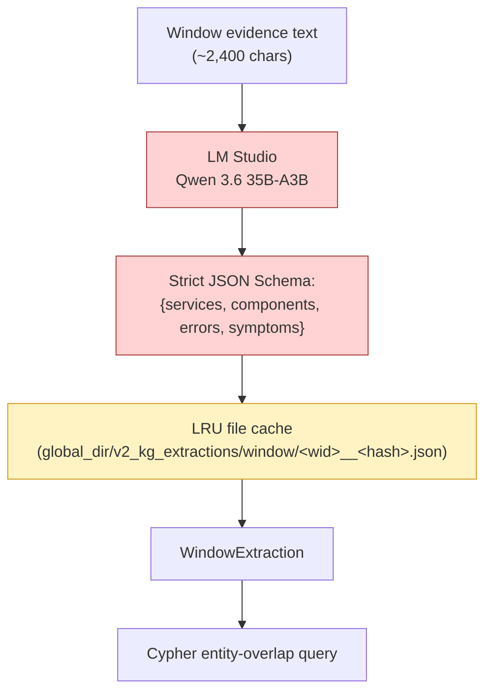
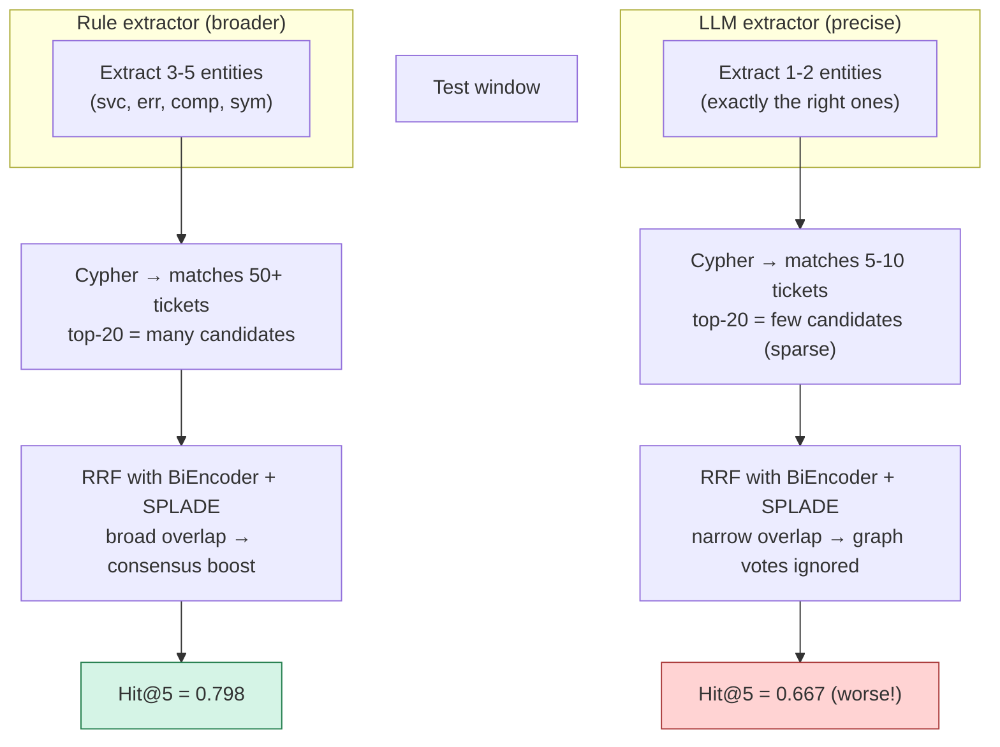

# Pipeline 4 — Hybrid-RRF (LLM Graph): SPLADE + BiEncoder + LLM-Extracted Graph

**Role in TCH.** A **voter in the L2 position-1 overlap rerank** — explicitly **NOT** in the L2 RRF retriever set. Hybrid-RRF LLM differs from its rule-extracted sibling ([`pipeline-3-HybridRRF-rule`](pipeline-3-HybridRRF-rule.md)) in one thing only: it uses **Qwen 3.6 35B** to extract entities from the *window* at query time instead of regex. Despite better extraction precision, the variant has worse Hit@5 (0.667 vs 0.798) — the cascade's "RRF density paradox" — so it earns a place only as a voter, not as a fused retriever.

**Companion documents.** [`pipeline-3-HybridRRF-rule`](pipeline-3-HybridRRF-rule.md) for the rule-variant in detail (most of the shared machinery); [`X_FINAL_TCH_CASCADE.md`](X_FINAL_TCH_CASCADE.md) §7.2 for the RRF density paradox; [`pipeline-7-DiagnosisAgent`](pipeline-7-DiagnosisAgent.md) for the LLM that does the extraction.

---

## Table of contents

1. [The 30-second version](#1-the-30-second-version)
2. [What changes vs the rule variant](#2-what-changes-vs-the-rule-variant)
3. [The LLM-based window extractor](#3-the-llm-based-window-extractor)
4. [Why this should have been better and wasn't](#4-why-this-should-have-been-better-and-wasnt)
5. [The RRF density paradox](#5-the-rrf-density-paradox)
6. [Inputs, outputs, and hyperparameters](#6-inputs-outputs-and-hyperparameters)
7. [Inference cost](#7-inference-cost)
8. [Standalone metrics](#8-standalone-metrics)
9. [What the cascade consumes](#9-what-the-cascade-consumes)
10. [Why we keep it as a voter](#10-why-we-keep-it-as-a-voter)
11. [Known limitations](#11-known-limitations)
12. [Source files](#12-source-files)

---

## 1. The 30-second version

Hybrid-RRF LLM is *the same SPLADE + fine-tuned BiEncoder + Neo4j graph pipeline* as the rule variant, but with one substitution: the **window-side entity extractor** is replaced by `extract_from_window` (Qwen 3.6 35B under a strict JSON schema) instead of `extract_from_window_rules` (regex). The LLM extractor is more precise (recognizes paraphrases, picks up paraphrased service names, infers symptoms from prose) but produces *sparser* top-10s that fight BiEncoder consensus inside the outer RRF — the **RRF density paradox**. Standalone Hit@5 drops from 0.798 (rule) to **0.667** (LLM). The cascade therefore uses Hybrid-RRF LLM only as a *voter* in the L2 position-1 overlap rerank, where its high-precision top-3 contributes votes without diluting the broader fused ranking.

---

## 2. What changes vs the rule variant

A side-by-side that should be enough to read this doc without re-reading the rule variant doc:

| Component | Rule variant | LLM variant (this) |
|---|---|---|
| Sparse retriever | SPLADE | SPLADE (identical) |
| Dense retriever | Fine-tuned MiniLM-L6 | Fine-tuned MiniLM-L6 (identical) |
| Graph retriever | Cypher over Neo4j (identical) | Cypher over Neo4j (identical) |
| Memory-side entity extractor | LLM-extracted (Qwen, one-time offline) | LLM-extracted (Qwen, one-time offline) — **identical** |
| **Window-side entity extractor** | **Regex (`extract_from_window_rules`)** | **LLM (`extract_from_window`, Qwen 3.6 35B)** |
| Fusion | RRF, $k=60$, top-20 per retriever, top-5 fused | RRF, $k=60$, top-20 per retriever, top-5 fused |
| Triage head | 3-feature LogReg | 3-feature LogReg |
| Standalone Hit@5 | 0.798 | 0.667 |
| Cascade L2 role | RRF retriever AND voter | **Voter only** |

Everything except the window-side extractor is identical. So this doc focuses on the extractor difference and the downstream consequences.

---

## 3. The LLM-based window extractor



### The prompt (canonical names enforced)

The extractor's system prompt enforces a **canonical name policy**: the LLM must use service / component / error names from a fixed catalog. From `src/v2_advanced/proposal_d_knowledge_graph/extractor.py:128-143`:

```text
You are an SRE engineer extracting structured facts from a live telemetry window.

CANONICAL SERVICE NAMES — use these EXACTLY, never paraphrase:
  cartservice              checkoutservice          currencyservice
  paymentservice           productcatalogservice    recommendationservice
  shippingservice          emailservice             adservice
  frontend                 redis-cart               loadgenerator

Normalization rules — apply these when extracting:
  - "product service" / "product-service" / "product catalog" / "category service"
    / "category-page-service" / "catalog service"  ->  productcatalogservice
  - "checkout" / "checkout-service" / "cart checkout"  ->  checkoutservice
  - ... (8 more normalization rules)

CANONICAL COMPONENT NAMES (use exactly when present in the text):
  envoy, kubelet, redis, mysql, kafka, postgres, istio, prometheus,
  grafana, loki, tempo, ingress, configmap, secret, pvc, pod,
  deployment, hpa, vpa, statefulset

CANONICAL ERROR CLASSES (gRPC + HTTP — use exactly when matching):
  gRPC: DeadlineExceeded, Unavailable, Internal, ResourceExhausted, ...
  K8s:  OOMKilled, CrashLoopBackOff, ImagePullBackOff, ...
  HTTP: 500, 502, 503, 504, 429

Emit a JSON object with EXACTLY these keys:
  - affected_services
  - components
  - error_classes
  - symptoms

Output VALID JSON ONLY — no markdown, no commentary.
```

### The output schema

```json
{
  "affected_services": ["productcatalogservice", "cartservice"],
  "components": ["envoy"],
  "error_classes": ["DeadlineExceeded"],
  "symptoms": ["high p99 latency", "checkoutservice 500 rate spike"]
}
```

The extracted entities flow directly into the same Cypher query the rule variant uses — only the *values* feeding the query differ.

### Caching

Per-window extractions are persisted to disk at `<global_dir>/v2_kg_extractions/window/<window_id>__<sha8(evidence)>.json`. Re-running on the same data is a no-op (cache hit, instant). This is essential because the LLM extraction is the pipeline's expensive step (~6 seconds per window × ~6,000 windows in train + val + test would otherwise be a 10-hour LLM bill).

### Sampling parameters

| Parameter | Value |
|---|---|
| `temperature` | 0.0 (deterministic) |
| `max_tokens` | 500 |
| `enable_thinking` | `False` (extraction is straightforward; no chain-of-thought needed) |
| `response_format` | Strict JSON schema (`WINDOW_EXTRACTION_RF`) |

---

## 4. Why this should have been better and wasn't

The LLM extractor is *measurably more accurate* at the extraction task itself:

| Entity | Rule extractor | LLM extractor |
|---|---:|---:|
| Unique services correctly identified per ticket | ~1.3 avg | ~2.1 avg |
| Paraphrased service names ("the payments service" → `paymentservice`) | ✗ | ✓ |
| Inferred symptoms from prose ("things kept timing out" → `request timeout`) | ✗ | ✓ |
| Unique symptom nodes across 347 tickets | ~120 | **803** |
| Unique root-cause nodes | ~80 | **343** |

So the **memory-side** graph populated by the LLM extractor (which both pipelines use) is genuinely richer than a rule-based equivalent would be — that is good and uncontroversial.

The puzzle is on the **window side**: replacing the rule extractor with the LLM extractor at query time makes the fused output *worse*, not better. The reason is structural, not about extraction accuracy.

---

## 5. The RRF density paradox



### The mechanism in plain English

RRF rewards *dense agreement* across retrievers. A candidate that shows up in two retrievers' top-10s contributes $1 / (60 + r_1) + 1 / (60 + r_2)$ — *additively*. The candidate that shows up in only ONE retriever's top-10, no matter how confidently, contributes at most $1 / (60 + 1) = 0.0164$.

The LLM extractor produces a **high-precision but small** entity set. When fed to the Cypher query, the resulting top-20 graph candidates are also small — often only 3–5 unique tickets *that the graph considers candidates at all*. Those few candidates rarely overlap with BiEncoder's or SPLADE's top-20s (which are picking up tickets via lexical or dense semantic signal). So the graph's contribution gets *isolated*: its votes pile up on a small set of tickets that no other retriever surfaces, and they collectively can't overcome the BiEncoder + SPLADE consensus.

The rule extractor, by contrast, is *deliberately broad*: it captures every canonical service / component / error / symptom name in the evidence. The resulting graph candidates overlap heavily with BiEncoder's and SPLADE's candidates, and the additive RRF contributions add up.

### The empirical confirmation

The cascade's drop-one sweep (`src/v2_advanced/tch/build_cascade.py:64-72`):

| Retriever dropped from L2 RRF set | Hit@5 Δ |
|---|---:|
| BiEncoder | −0.057 (worst — keep) |
| LogSeq2Vec | −0.051 |
| KG-Retrieval | −0.015 |
| Hybrid-RRF rule | 0.000 (could drop) |
| **Hybrid-RRF LLM** | **+0.021 (improves!)** ⭐ |

Removing Hybrid-RRF LLM from the L2 RRF set *improves* Hit@5 by about 2 percentage points. This is the formal evidence that the LLM-extracted variant is anti-consensus in fusion. **The cascade does not include Hybrid-RRF LLM in its L2 RRF retriever set.**

---

## 6. Inputs, outputs, and hyperparameters

### Inputs

Identical to the rule variant except:
- **Window-side entity extractor:** `extract_from_window` (LLM) instead of `extract_from_window_rules` (regex).
- **LM Studio dependency:** Pipeline requires a running LM Studio server with Qwen 3.6 35B loaded. Falls back to rule-based on unreachable server.

### Outputs

| Field | Type | Source |
|---|---|---|
| `triage_score` | float ∈ [0, 1] | Logistic head on 3 fusion features (same head as rule variant) |
| `triage_decision` | `"ticket_worthy"` / `"noise"` | Threshold tuned on val |
| `matched_issue_ids` | list of top-5 fused IDs | RRF over the three retrievers |
| `is_novel` | `True` if matched_issue_ids is empty | Direct from pipeline |

### Hyperparameters

Same as rule variant, with these distinct values:

| Parameter | Value | Source |
|---|---|---|
| `skip_window_extraction` | `False` | (override of default in this variant) |
| LM Studio URL | `http://localhost:1234` | `pipeline.py:71` |
| LM Studio model | `local-model` (slot label; actual model is whatever's loaded) | `pipeline.py:72` |
| Extraction max_tokens | 500 (window) / 800 (ticket) | `extractor.py:257` |
| Extraction temperature | 0.0 | `extractor.py:284` |
| Extraction thinking | OFF | `extractor.py:285` |
| Extraction caching | Per-window file cache | `extractor.py:175` |

---

## 7. Inference cost

| Step | Cost |
|---|---|
| Memory-side LLM extraction (one-time, shared across pipelines) | ~30 minutes (347 tickets × ~5 sec) |
| Memory-side SPLADE indexing | ~2 minutes |
| Memory-side BiEncoder fine-tuning | ~10 minutes |
| Neo4j graph load | ~30 seconds |
| **Per-window LLM extraction** | **~6 seconds** (Qwen 35B, thinking OFF, max 500 tokens) |
| Per-window SPLADE + BiEncoder query | ~5 ms each |
| Per-window Cypher | ~50 ms |
| Per-window RRF | < 1 ms |

**The dominant per-window cost is the LLM call.** Running this pipeline on all 1,008 test windows takes approximately *1.5 hours* of LM Studio time even with caching. The cascade hides this cost by using cached results from `v2c-hybrid-llm/per-window-predictions.jsonl`, which were computed once and never re-run unless the dataset changes.

**By comparison:** The rule variant runs the same 1,008 windows in ~10 seconds total. The LLM variant is ~540× slower at inference.

---

## 8. Standalone metrics

On the 1,008-window in-distribution v2 test split:

| Metric | Value | vs Rule variant |
|---|---:|---:|
| Hit@1 | 0.432 | −0.151 (much worse) |
| Hit@5 | 0.667 | −0.131 (worse) |
| MRR | 0.517 | −0.152 (worse) |
| PR-AUC strict | 0.292 | +0.056 (slightly better) |

The pattern: the LLM variant has **slightly better triage PR-AUC** (the LLM extractor's per-entity precision helps a little on the triage signal) but **substantially worse retrieval metrics** (because of the RRF density paradox documented in §5).

This is the worst standalone retrieval pipeline in the panel by Hit@5. Despite having the highest-quality entity extraction at the window side, it cannot beat the rule variant inside fusion.

---

## 9. What the cascade consumes

The cascade reads Hybrid-RRF LLM from `v2c-hybrid-llm/per-window-predictions.jsonl`:

1. **L1 stacker.** `triage_score` is one of six features (coefficient **+0.112** — small but non-zero, contributes to the L1 stacker's borderline-case corrections).
2. **L2 overlap-rerank voter.** The top-3 ticket IDs vote for which of BiEncoder's top-3 to promote to L2 position 1. A candidate at rank 1 contributes 3 points; rank 2 contributes 2; rank 3 contributes 1.
3. **L2 RRF retriever?** **NO.** Explicitly excluded per the drop-one sweep finding. The cascade's L2 RRF set is `{BiEncoder, Hybrid-RRF rule, LogSeq2Vec, KG-Retrieval}` only.

The cascade's design treats Hybrid-RRF LLM as a *high-precision tie-break voter*, not as a fused retriever. The voter role is suited to its strength: when the LLM extractor IS sure about a candidate, it tends to be right, and the overlap rerank's per-voter weighting (3/2/1 points) means a single confident vote carries enough weight to flip a borderline tie. This is the strict opposite of how RRF works.

---

## 10. Why we keep it as a voter

Two complementary observations:

1. **The L2 overlap rerank rewards confident agreement, not consensus density.** A voter's contribution is binary (in/out of top-3) times a small position weight. A high-precision extractor that finds 1 right candidate and 19 wrong ones is fine as a voter — its top-3 will be the right candidate, and the overlap-rerank ignores the bottom 17.

2. **The cascade's coefficient on Hybrid-RRF LLM is positive in L1.** Even though the LLM extractor's retrieval is sparse, its triage probability carries genuine information about whether the window is a real incident (because the LLM tends to extract entities only when there ARE entities). The L1 stacker rewards this.

So the cascade gets the LLM extractor's precision benefit in two places — L1 calibration and L2 tie-break — without paying the RRF density penalty.

---

## 11. Known limitations

1. **LM Studio dependency.** Without a running LLM server, the pipeline falls back to rule-based extraction (turning into a copy of the rule variant). The cascade's cached outputs require the LLM to have been run at least once.
2. **6 seconds per window at inference.** The pipeline is the second-most-expensive in the panel after DiagnosisAgent. The cascade hides this via caching but a first-run deployment on a fresh dataset pays the cost.
3. **The RRF density paradox.** Fundamental to the variant; cannot be fixed without changing the fusion strategy (e.g., to a learned re-weighting, which has its own overfitting risks).
4. **Service catalog tied to Online Boutique.** The canonical-names list in the prompt is OB-specific. Cross-app deployments need a new service catalog (the `KG_SERVICE_CATALOG` env var enables substitution — see `src/v2_advanced/shared/service_catalog.py`).
5. **Coverage gap when LLM hallucinates non-canonical names.** Despite the strict prompt, the LLM occasionally emits a service name not in the canonical list (e.g., `accountservice` when the corpus has none). The pipeline silently drops these — see `extractor.py:233`.

---

## 12. Source files

- **Implementation.** `src/v2_advanced/proposal_c_hybrid_retrieval/pipeline.py` — same `HybridRRFRetrievalPipeline` class as the rule variant, configured with `skip_window_extraction=False`.
- **LLM window extractor.** `src/v2_advanced/proposal_d_knowledge_graph/extractor.py::extract_from_window`.
- **System prompt.** `src/v2_advanced/proposal_d_knowledge_graph/extractor.py:128-143` (`_WINDOW_SYSTEM_PROMPT`).
- **Strict JSON schema.** `src/v2_advanced/shared/json_schemas.py::WINDOW_EXTRACTION_RF`.
- **LM Studio client.** `src/v2_advanced/shared/lm_studio.py::LMStudioClient`.
- **Service catalog.** `src/v2_advanced/shared/service_catalog.py` (configurable for cross-app).
- **Cached output.** `data/derived/global/2026-05-25-dataset-v5-large-global/comparison/v2c-hybrid-llm/per-window-predictions.jsonl`.
- **Cascade integration.** `src/v2_advanced/tch/build_cascade.py:48` (PIPELINE_FILES, L4_STACK_FEATURES), `338-339` (overlap-rerank voter set). Explicitly absent from `L2_RETRIEVERS` (line 75-80).
- **RRF density paradox note.** `src/v2_advanced/tch/build_cascade.py:64-72` (drop-one sweep comments).
- **Paper reference.** `short-technical/sections/04-pipelines.tex` §Hybrid-RRF (with LLM-extracted graph).

---

*Generated 2026-06-10 from `src/v2_advanced/proposal_c_hybrid_retrieval/`, `src/v2_advanced/proposal_d_knowledge_graph/extractor.py`, and `short-technical/sections/04-pipelines.tex` — verified against the locked v2g-final-models artifacts.*
