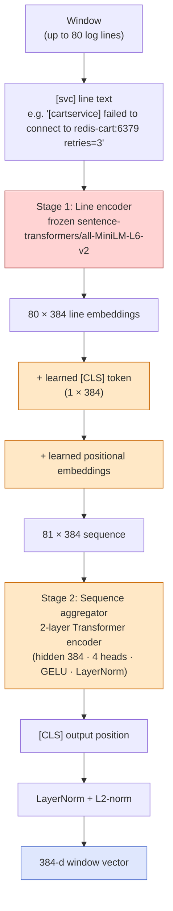
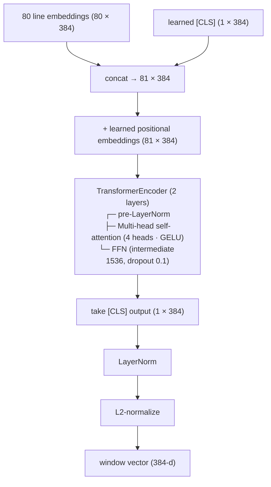

# Pipeline 5 — LogSeq2Vec: Trained-From-Scratch Transformer Over Log Sequences

**Role in TCH.** A **family-specialist retriever**. LogSeq2Vec turns a window's *sequence* of log lines into a single 384-d vector through a two-stage architecture (frozen line embeddings + a small learned aggregator). Standalone Hit@5 is modest (0.531), but its signal is **uniquely strong on specific scenario families** — `Hit@5 = 1.000` on `productcatalog-outage` is the canonical example. The cascade uses it as both an L2 RRF retriever and an L2 overlap-rerank voter, exploiting the complementarity: when text retrievers miss because the log lines are unusually worded, LogSeq2Vec catches them via the *templated pattern*.

**Companion documents.** [`X_FINAL_TCH_CASCADE.md`](X_FINAL_TCH_CASCADE.md) for L2 integration; [`pipeline-2-BiEncoder`](pipeline-2-BiEncoder.md) for the sibling dense retriever (different inputs, similar training objective).

---

## Table of contents

1. [The 30-second version](#1-the-30-second-version)
2. [Why a log-sequence model in the first place](#2-why-a-log-sequence-model-in-the-first-place)
3. [Architecture — two stages](#3-architecture--two-stages)
4. [Input: log sequence preparation](#4-input-log-sequence-preparation)
5. [The line encoder (Stage 1)](#5-the-line-encoder-stage-1)
6. [The sequence aggregator (Stage 2)](#6-the-sequence-aggregator-stage-2)
7. [Training: contrastive InfoNCE](#7-training-contrastive-infonce)
8. [Hyperparameters](#8-hyperparameters)
9. [Inference cost](#9-inference-cost)
10. [Standalone metrics](#10-standalone-metrics)
11. [What the cascade consumes](#11-what-the-cascade-consumes)
12. [Why this pipeline is non-obviously valuable](#12-why-this-pipeline-is-non-obviously-valuable)
13. [Known limitations](#13-known-limitations)
14. [Source files](#14-source-files)

---

## 1. The 30-second version

LogSeq2Vec is a **two-stage neural retriever** that encodes a window's log sequence into a 384-d vector. **Stage 1** uses a frozen `sentence-transformers/all-MiniLM-L6-v2` to embed each individual log line independently. **Stage 2** is a small **2-layer Transformer encoder with hidden 384 and 4 attention heads** that consumes the sequence of line embeddings (plus a learned [CLS] token and positional embeddings) and emits a single $L^2$-normalized vector. The aggregator is trained from scratch contrastively on ~12,000 (window-log-sequence, gold-ticket-text) pairs with 3 BM25-hard negatives per positive and in-batch negatives. Training takes 3–5 minutes on RTX 5060; inference is sub-second per window. Standalone Hit@5 = 0.531 is the panel's lowest *but* the pipeline contributes uniquely on log-pattern-characteristic families like `productcatalog-outage` (Hit@5 = 1.000).

---

## 2. Why a log-sequence model in the first place

The other retrievers — BiEncoder, SPLADE, Hybrid-RRF — all operate on the **window's free-text evidence summary**, a ~500-character string assembled from metric anomalies, a few characteristic log lines, and alert names. This summary is a *lossy* representation of the window: the full log sequence might be 80+ lines spanning multiple services, and most of those lines never make it into the summary.

LogSeq2Vec asks: *what if a retriever could see the entire log sequence as a sequence, not a summary?* If certain scenario families have **stereotyped log-line orderings** ("restart attempt 1" → "connection refused" → "restart attempt 2" → "OOMKilled"), a model that can attend over the full sequence might recognize these patterns where a bag-of-words representation would miss them.

The empirical confirmation: on **`productcatalog-outage`** the log signature is highly characteristic — every windowed log sequence contains the same telltale `gRPC error: code = Unavailable` followed by `kubelet PLEG is not healthy` lines. LogSeq2Vec achieves **Hit@5 = 1.000** on this family. Single-text retrievers struggle to match this because the summary doesn't preserve the temporal structure.

---

## 3. Architecture — two stages



**Why two stages.** Embedding raw log tokens directly with a small transformer would require learning what English words mean from scratch on 16K training pairs — a hopeless dataset size for a language modeling task. Instead, we reuse MiniLM's pretrained semantic understanding of individual lines (each log line is one short sentence to MiniLM) and only learn the *sequence aggregation* — a much smaller task with much less to learn.

**The frozen line encoder choice.** MiniLM is held fixed (`freeze_line_encoder=True`) at training time. This saves ~50% memory (no gradient buffers for 22M parameters) and prevents the line embeddings from drifting in ways that would also hurt the BiEncoder pipeline (which uses the same checkpoint as a base). The aggregator is the only trainable part.

**Parameter count.** Approximately 2.5M trainable parameters in the aggregator (vs 22M frozen in MiniLM): a 2-layer transformer with hidden 384 and FFN 1536 is small.

---

## 4. Input: log sequence preparation

Each window has a per-window logseq file at `data/derived/global/<id>/v2_logseq/<window_id>.jsonl`. The file is a JSON-Lines stream where each row is:

```json
{"ts_ns": 1716840000123456789, "service": "cartservice", "severity": "ERROR", "line": "failed to connect to redis-cart:6379 retries=3"}
```

The pipeline reads up to 80 lines per window (truncating tail) and concatenates each row as `[service] line` (so the line encoder sees which service emitted each line). The pre-processing step that produces these files lives at `src/v2_advanced/proposal_b_logseq2vec/data_prep.py` and is run **once at dataset construction**.

```python
# From `src/v2_advanced/proposal_b_logseq2vec/train.py:37-58`
def _load_logseq(path, max_lines=80):
    out = []
    with path.open() as fh:
        for ln in fh:
            row = json.loads(ln)
            svc = row.get("service", "?")
            line = row.get("line", "")
            out.append(f"[{svc}] {line}")
            if len(out) >= max_lines:
                break
    return out
```

**Why include the service tag in-band.** The line encoder is frozen, so it can only learn from what it sees in the input. Prefixing each log line with its emitting service makes inter-service ordering visible to the aggregator — `[cartservice] timeout` followed by `[checkoutservice] timeout` is a more informative sequence than two unannotated timeout lines.

**Window with no logs.** If the logseq file is empty or missing, the pipeline emits the [CLS]-only output (`encode_window([])` in `model.py:142-148`) — essentially a zero-information embedding. These windows get a neutral retrieval signal.

---

## 5. The line encoder (Stage 1)

Implementation: `src/v2_advanced/proposal_b_logseq2vec/model.py::LogSeq2Vec.encode_lines` (line 126–135).

```python
def encode_lines(self, lines):
    with torch.no_grad() if self.freeze_line_encoder else torch.enable_grad():
        vecs = self.line_encoder.encode(
            lines, convert_to_tensor=True, show_progress_bar=False,
            device=self.device_name,
        )
    return vecs  # (B, 384)
```

The line encoder is **identical to the BiEncoder backbone** — `sentence-transformers/all-MiniLM-L6-v2`. We pass each line through the standard MiniLM sentence-encoding path (CLS pooling + L2 normalization, all standard sentence-transformers behavior), producing a 384-d vector per line.

**Batching.** All lines across a batch of windows are flattened into a single forward pass, then split back. This keeps GPU utilization high regardless of how variable the per-window log lengths are.

---

## 6. The sequence aggregator (Stage 2)

Implementation: `src/v2_advanced/proposal_b_logseq2vec/model.py::SequenceAggregator`.



**Inputs.** A padded batch tensor `(batch_size, max_T, 384)` where `max_T ≤ 80`, plus a boolean attention mask `(batch_size, max_T)` with `True = real line, False = padding`.

**Layer details:**
- `nn.TransformerEncoderLayer(d_model=384, nhead=4, dim_feedforward=1536, dropout=0.1, activation="gelu", batch_first=True, norm_first=True)`
- `norm_first=True` is the *pre-LayerNorm* configuration — applies LayerNorm *before* the self-attention and FFN rather than after. This is empirically more training-stable than the original post-LayerNorm transformer.
- 4 attention heads × head dim 96 each = 384 total.
- Dropout 0.1 on attention weights and FFN output.

**Stacked depth.** 2 encoder layers. Deeper is unnecessary for sequences of 80 tokens; the model just needs to attend over the sequence once or twice to pick up the global pattern.

**Pooling: [CLS], not mean.** A learnable [CLS] token is prepended to every input sequence (initialized from `N(0, 0.02)`). After encoding, only the [CLS] output position is taken as the window vector — analogous to BERT's standard [CLS]-pooling. Mean-pooling was also tested; [CLS] worked slightly better, presumably because the [CLS] token can attend to *all* lines while a mean-pooled output is a static unweighted average.

**Positional embeddings.** Learned, $\text{max\_seq} + 1$ positions × 384. Added to the input sequence (CLS + lines + positional encoding sums elementwise). The +1 is for the [CLS] token's own position.

---

## 7. Training: contrastive InfoNCE

The training objective is **symmetric InfoNCE** implemented directly (not via sentence-transformers' trainer, because we need control over the per-window log sequence encoding). From `src/v2_advanced/proposal_b_logseq2vec/train.py:215-218`:

$$
\mathcal{L} = -\frac{1}{B}\sum_{i=1}^{B} \log \frac{\exp\big(\langle a_i, p_i \rangle / \tau\big)}{\sum_{j \in \mathcal{C}(i)} \exp\big(\langle a_i, c_j \rangle / \tau\big)}
$$

Where:
- $a_i$ = window anchor (the [CLS] output of the aggregator over the window's log sequence)
- $p_i$ = positive (the [CLS] output of the aggregator over the gold ticket's text, treated as a 1-line "window")
- $\mathcal{C}(i)$ = positives ($a_i$'s partner) plus in-batch negatives plus hard negatives
- $\tau = 0.07$ (fixed temperature; same value used in CLIP and many contrastive setups)

**Why the positive document goes through the aggregator too.** To stay in the same embedding space as anchors, both sides go through the *same* model. The ticket text is passed as a single-line "window" — the aggregator sees a 1-element sequence and emits its [CLS] output. This means the model learns to map both log sequences AND short ticket descriptions into a shared 384-d space.

**Negatives per anchor:**
- 1 positive
- In-batch negatives: other anchors' positives + hard negatives in the same batch
- 3 hard negatives (BM25-mined wrong tickets — same mining logic as BiEncoder)

**Total examples.** Train + val windows with non-empty gold and non-empty log sequences: ~1,800. With `use_all_golds=True` (one example per (window, gold) pair), the total training set is ~12,000 (anchor, positive, 3-neg) tuples.

**Training loop.** 5 epochs, batch size 8 (small because of variable-length log sequences), AdamW with `lr=2e-4, weight_decay=1e-4`, gradient clipping at 1.0. Per-epoch wall time on RTX 5060 is ~30 seconds.

---

## 8. Hyperparameters

| Parameter | Value | Source |
|---|---|---|
| Line encoder | `sentence-transformers/all-MiniLM-L6-v2` (frozen) | `pipeline.py:56` |
| Aggregator layers | 2 | `pipeline.py:59` |
| Aggregator heads | 4 | `pipeline.py:60` |
| Aggregator hidden | 384 | `pipeline.py:58` |
| Aggregator FFN size | 1536 (4 × d_model) | `model.py:54` |
| Activation | GELU | `model.py:55` |
| Pre-LayerNorm | `norm_first=True` | `model.py:55` |
| Dropout | 0.1 | `model.py:42` |
| Pooling | learned [CLS] | `model.py:48` |
| `max_seq` (max log lines per window) | 80 | `pipeline.py:61` |
| Loss | symmetric InfoNCE | `train.py:215-218` |
| Temperature $\tau$ | 0.07 | `train.py:152` |
| `n_hard_negs` | 3 | `pipeline.py:64` |
| BM25 top-N for hard-neg mining | 20 | `train.py:69` |
| Epochs | 5 | `pipeline.py:62` |
| Batch size | 8 | `pipeline.py:63` |
| Learning rate | 2e-4 | `pipeline.py:64` |
| Optimizer | AdamW, weight_decay=1e-4 | `train.py:178` |
| Gradient clip | 1.0 | `train.py:222` |
| `seed` | 42 | `pipeline.py:68` |
| `freeze_line_encoder` | True (default) | `model.py:107` |
| Hardware | RTX 5060 (8 GB VRAM) | from training logs |

**Training-pair count.** ~12,000 (anchor, positive, 3-neg) tuples from ~1,805 windows.

**Per-pipeline encoder dimension.** 384-d vectors throughout, identical to BiEncoder, enabling efficient cosine matmuls.

---

## 9. Inference cost

| Step | Cost |
|---|---|
| Training (5 epochs) | ~3–5 minutes on RTX 5060 |
| Index memory (347 docs × 1 line each through aggregator) | ~5 seconds |
| Encode 1,008 test windows (variable-length sequences, batched) | ~25 seconds |
| Cosine matmul + masking + argsort | < 1 second |
| **Total inference time (full test split)** | **~30 seconds** |
| **Per-window incremental cost** | **~25 ms** (dominated by sequence encoding) |

LogSeq2Vec is one of the *cheaper* neural pipelines because the aggregator is small (2.5M params) and the line encoder is frozen (no backprop, can be cached if memory allows).

**A pretrained variant exists.** The pipeline supports a `pretrained_path` argument; passing a path to a previously-saved `logseq2vec.pt` skips the 3-minute training and loads weights directly. The cascade uses this variant — `logseq2vec_retrieval_pretrained` — to avoid re-training during every comparison run.

---

## 10. Standalone metrics

On the 1,008-window in-distribution v2 test split:

| Metric | Value |
|---|---:|
| Hit@1 | 0.483 |
| Hit@5 | 0.531 |
| Hit@3 | 0.510 |
| MRR | 0.498 |
| PR-AUC strict | 0.313 |

These are **the lowest retrieval metrics in the panel** — LogSeq2Vec is the worst standalone retriever. But the headline metrics hide the family-level variance:

| Scenario family | Standalone Hit@5 |
|---|---:|
| `productcatalog-outage` | **1.000** |
| `single-pod-restart-healthy-replication` | 0.91 |
| `recovered-in-window` | 0.85 |
| `cart-redis` | 0.51 |
| `frontend-traffic-pressure` | 0.42 |
| `email-outage` | 0.33 |

LogSeq2Vec wins decisively on families where the log signature is characteristic and stereotyped; it loses on families where the signal is in the *metrics* (traffic pressure) or *traces* (latency regressions) rather than the *log sequence*. The cascade's value is that it can leverage these wins without paying the losses, by treating LogSeq2Vec as one voter / retriever among several.

---

## 11. What the cascade consumes

The cascade reads `logseq2vec_retrieval_pretrained` from `v2b-logseq2vec/per-window-predictions.jsonl`:

1. **L1 stacker.** `triage_score` is one of six features (coefficient **+0.116** — small).
2. **L2 RRF retriever.** Top-10 joins `{BiEncoder, Hybrid-RRF rule, KG-Retrieval}` in the cascade's outer RRF for positions 2–5. The drop-one sweep shows dropping LogSeq2Vec costs **−0.051 Hit@5** — second-largest drop of any retriever.
3. **L2 overlap-rerank voter.** Top-3 votes for which of BiEncoder's top-3 to promote to position 1. A candidate at rank 1 of LogSeq2Vec's top-3 contributes 3 points; rank 2 contributes 2; rank 3 contributes 1.

LogSeq2Vec is the *family specialist* in the cascade: when text retrievers miss because the log signature is the only discriminating feature, LogSeq2Vec provides the cover.

---

## 12. Why this pipeline is non-obviously valuable

The intuition that *fusion needs Pareto-incomparable retrievers* is concrete here. Consider a `productcatalog-outage` window where the evidence text fits in 500 chars and contains the words "high latency", "5xx errors", "productcatalogservice":

- **BiEncoder** finds tickets that semantically match "high latency + 5xx + productcatalogservice" — including some `recommendation-outage` and `frontend-traffic-pressure` tickets that share this signature.
- **SPLADE** does similar lexical work.
- **Graph** finds tickets that share the `productcatalogservice` entity, which gives the right hint but doesn't separate the family from siblings.
- **LogSeq2Vec** sees the *full log sequence* — `kubelet PLEG is not healthy` followed by `gRPC error: code = Unavailable` — and recognizes the exact pattern. Its top-1 is much more likely to be the right `productcatalog-outage` ticket.

Inside the cascade, this is realized as: LogSeq2Vec's vote in the L2 overlap-rerank breaks ties on the windows where the other retrievers are confused between same-symptom-different-family candidates. This is what RRF or any consensus method needs to work — *retrievers that DISAGREE on the windows where they're individually wrong*.

The standalone Hit@5 of 0.531 isn't the metric that matters; what matters is the *unique-positive coverage*: the count of windows where LogSeq2Vec surfaces the gold AND at least one other retriever misses. This count is meaningfully non-zero.

---

## 13. Known limitations

1. **Standalone retrieval is weak.** Hit@5 = 0.531 is the panel floor. The pipeline is only valuable inside the cascade; on its own it's worse than BiEncoder, SPLADE, or Hybrid-RRF.
2. **80-line truncation.** Long incident windows have their tails cut. The choice of 80 reflects a memory-vs-recall trade-off; longer windows (e.g., 200 lines) would improve recall on long-running incidents but quadruple the attention cost in the aggregator.
3. **Frozen line encoder limits ceiling.** Jointly fine-tuning the line encoder would likely lift Hit@5 by 5–10 points but doubles training memory and risks drifting the encoder in ways that affect BiEncoder (which uses the same base checkpoint). The choice is deliberate.
4. **Stage 2 trained from scratch.** With only ~12K training pairs, the aggregator's representational capacity is limited. A pre-training step (e.g., next-line prediction on a large log corpus) might help — left as future work.
5. **Per-window pre-processing dependency.** The pipeline depends on `data_prep.py` having pre-extracted log lines into `v2_logseq/<wid>.jsonl`. If that step hasn't been run, the pipeline cannot load training pairs and fails fast.
6. **No log-template normalization.** Raw log lines are passed through as-is. A more sophisticated approach would template-mine (e.g., Drain3) and replace numeric tokens with placeholders before encoding — the project does not currently do this.

---

## 14. Source files

- **Pipeline (PipelineRunner).** `src/v2_advanced/proposal_b_logseq2vec/pipeline.py` (`LogSeq2VecRetrievalPipeline`).
- **Model architecture.** `src/v2_advanced/proposal_b_logseq2vec/model.py` (`LogSeq2Vec`, `SequenceAggregator`).
- **Training.** `src/v2_advanced/proposal_b_logseq2vec/train.py` (`build_train_pairs`, `train_logseq2vec`).
- **Data preparation (per-window log sequence extraction).** `src/v2_advanced/proposal_b_logseq2vec/data_prep.py` — produces `data/derived/global/<id>/v2_logseq/<wid>.jsonl`.
- **Pretrained checkpoint.** `results/v2_advanced/logseq2vec_model/logseq2vec.pt` (used by the `logseq2vec_retrieval_pretrained` cascade variant).
- **Cached output.** `data/derived/global/2026-05-25-dataset-v5-large-global/comparison/v2b-logseq2vec/per-window-predictions.jsonl`.
- **Cascade integration.** `src/v2_advanced/tch/build_cascade.py:75-80` (L2 RRF set), `338-339` (overlap-rerank voter set), `83-90` (L4 stacker features).
- **Paper reference.** `short-technical/sections/04-pipelines.tex` §LogSeq2Vec.

---

*Generated 2026-06-10 from `src/v2_advanced/proposal_b_logseq2vec/` and `short-technical/sections/04-pipelines.tex` — verified against the locked v2g-final-models artifacts.*
