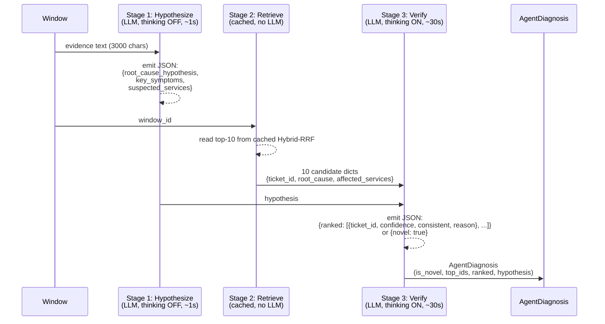

# Pipeline 7 — DiagnosisAgent: Three-Stage LLM Agent (Novelty Source)

**Role in TCH.** The **only pipeline that produces an `is_novel` flag** and the only pipeline that uses an LLM at inference time. DiagnosisAgent is a deterministic three-stage chain wrapped around **Qwen 3.6 35B-A3B** served locally via LM Studio. The cascade consumes **only its `is_novel` Boolean** — its retrieval ranking is intentionally discarded after an empirical audit showed that letting the agent override the cascade's top-1 is net **−5 Hit@1**. After the G4 refinement, the agent covers all 1,008 test windows (was 350); standalone novelty precision is ~94% and the cascade's `is_novel` disjunction (with the free signal + learned signal) lifts cascade novel recall from 0.162 to **0.793** (+388% rel).

**Companion documents.** [`X_FINAL_TCH_CASCADE.md`](X_FINAL_TCH_CASCADE.md) §7.3 for L3 integration; [`G4-agent-phase3.md`](../docs4/G4-agent-phase3.md) for the full-coverage refinement; [`G7-learned-novelty.md`](../docs4/G7-learned-novelty.md) for the learned L3 classifier that complements the agent; [`pipeline-4-HybridRRF-LLM`](pipeline-4-HybridRRF-LLM.md) for the LLM used elsewhere in the system.

---

## Table of contents

1. [The 30-second version](#1-the-30-second-version)
2. [Why an agent and not just a verifier](#2-why-an-agent-and-not-just-a-verifier)
3. [The three stages](#3-the-three-stages)
   - [Stage 1 — Hypothesize](#31-stage-1--hypothesize)
   - [Stage 2 — Retrieve (cached)](#32-stage-2--retrieve-cached)
   - [Stage 3 — Verify](#33-stage-3--verify)
4. [Why thinking-on for verify but thinking-off for hypothesize](#4-why-thinking-on-for-verify-but-thinking-off-for-hypothesize)
5. [The novelty rule](#5-the-novelty-rule)
6. [Inputs and outputs](#6-inputs-and-outputs)
7. [Hyperparameters](#7-hyperparameters)
8. [Inference cost](#8-inference-cost)
9. [The rule-based fallback agent](#9-the-rule-based-fallback-agent)
10. [Standalone metrics](#10-standalone-metrics)
11. [Why the agent does NOT override L2's top-1](#11-why-the-agent-does-not-override-l2s-top-1)
12. [What the cascade consumes](#12-what-the-cascade-consumes)
13. [G4 full-coverage refinement](#13-g4-full-coverage-refinement)
14. [Known limitations](#14-known-limitations)
15. [Source files](#15-source-files)

---

## 1. The 30-second version

DiagnosisAgent runs a **deterministic three-stage workflow** per window: (1) **Hypothesize** the root cause from window evidence alone (LLM call, thinking OFF, ~1 sec); (2) **Retrieve** ~10 candidate past tickets from the cached Hybrid-RRF output (no LLM call); (3) **Verify** which (if any) of the candidates matches by ranking them against the Stage-1 hypothesis (LLM call, thinking ON, ~25–30 sec). The agent emits a strict-JSON judgment per window including a per-candidate `confidence ∈ [0, 1]` and a top-level `is_novel` Boolean. The cascade consumes ONLY `is_novel`. After G4, the agent has run on all 1,008 test windows; standalone novelty precision is 94% and the agent's flag drives ~one-third of the cascade's final novel recall.

---

## 2. Why an agent and not just a verifier

The other six pipelines all output ranked lists of past tickets. None of them can say **"this window has no match — it's genuinely new."** The closest they come is "no ticket in the top-K has high confidence," but that's a *threshold over a similarity score*, not an explicit judgment. The L3 novelty layer's *free signal* (`max_conf < 0.5`) does exactly this and gets ~6% novel recall — useful but limited.

The agent's job is to produce a **confident, justified novelty verdict** when the retrievers genuinely have no match. The structural difference: a similarity score asks "how close is the best match?", but the agent asks "given the evidence and the candidates, *would an engineer file this as a new ticket*?". That second question requires reasoning about the *gap* between the window and the best candidate — exactly what an LLM does well.

The trade-off: every window costs ~30 seconds of LLM inference, and the verdict isn't perfect (~6% false-positives in the novelty channel). The cascade absorbs this through L3's disjunction: the agent is one of three OR-combined signals, so its false positives are bounded by combined precision parity with the v2f baseline.

---

## 3. The three stages



### 3.1 Stage 1 — Hypothesize

**Input.** The window's evidence text (first 3,000 characters of `build_window_query_text(w)`).

**Prompt** (from `agent.py:41-48`):

```text
You are an SRE incident-diagnosis assistant.

Given a window of live telemetry (logs + metrics), produce a JSON object with EXACTLY:
  - root_cause_hypothesis: ONE short sentence (your best guess for the underlying cause)
  - key_symptoms: list of 2-5 short phrases observed
  - suspected_services: list of service short-names most likely affected

Output VALID JSON only — no markdown, no commentary.
```

**Output schema** (`HYPOTHESIZE_RF` in `json_schemas.py`):

```json
{
  "root_cause_hypothesis": "cart-redis pod was OOM-killed under load",
  "key_symptoms": ["cart timeout spike", "redis OOMKilled"],
  "suspected_services": ["cartservice", "redis-cart"]
}
```

**LLM parameters.** `temperature=0.0`, `max_tokens=600`, **`enable_thinking=False`**. We deliberately *don't* want chain-of-thought here — this is a straightforward "what's wrong?" extraction. Thinking would slow it down without improving the output quality on this kind of structured-emit task.

**Wall time.** ~1 second per window on Qwen 35B served via LM Studio on consumer hardware.

### 3.2 Stage 2 — Retrieve (cached)

**No LLM call.** The agent reads the cached Hybrid-RRF top-10 for this window — set via the `V2_AGENT_HYBRID_PREDICTIONS_PATH` env var or fresh-fitted if absent. Each candidate carries:

- `ticket_id`
- `root_cause` (from the cached LLM ticket extraction in `v2_kg_extractions/`)
- `affected_services` (same source)

This stage is mechanical: it just looks up cached results. The reason it's listed as a "stage" in the agent is that the verify prompt needs to be told *which* candidates to verify — the retrieval step provides them.

**Wall time.** ~milliseconds per window (cache lookup).

### 3.3 Stage 3 — Verify

**Input.** The Stage-1 hypothesis + the 10 candidates from Stage 2 + the original window evidence implicit via context.

**Prompt** (from `agent.py:51-69`):

```text
You are an SRE incident-diagnosis assistant ranking past incident tickets by relevance to a live problem.

Given:
  - The hypothesized root cause for the current incident
  - The list of candidate past tickets (each with id, root cause summary, affected services)

Score each candidate on a 0-1 confidence scale for whether its root cause is consistent with the hypothesis.
Mark `consistent=true` if you believe an engineer should consult this ticket; `false` otherwise.

Output EXACTLY this JSON shape:
{
  "ranked": [
    {"ticket_id": "...", "confidence": 0.0-1.0, "consistent": true/false, "reason": "one short sentence"},
    ... (one entry per candidate, ordered by descending confidence)
  ]
}

If NO candidate is consistent, return an empty ranked list with a top-level "novel": true.

Output VALID JSON only.
```

**User message structure:**

```text
HYPOTHESIZED ROOT CAUSE: <root_cause_hypothesis from Stage 1>
KEY SYMPTOMS: <comma-joined>
SUSPECTED SERVICES: <comma-joined>

CANDIDATES:
- PROJ-127: cart-redis OOMKilled under load [services: cartservice,redis-cart]
- PROJ-203: checkoutservice DeadlineExceeded during traffic spike [services: checkoutservice]
- ... (8 more)

Rank them; return JSON.
```

**Output schema** (`VERIFY_RF`):

```json
{
  "ranked": [
    {"ticket_id": "PROJ-127", "confidence": 0.92, "consistent": true,
     "reason": "exact match on cart-redis OOM and the symptom matches"},
    {"ticket_id": "PROJ-203", "confidence": 0.41, "consistent": false,
     "reason": "checkoutservice involved but a different service"},
    ...
  ]
}
```

**LLM parameters.** `temperature=0.0`, `max_tokens=1500`, **`enable_thinking=True`**, `response_format=VERIFY_RF` (strict JSON schema).

**Wall time.** 25–30 seconds per window (Qwen 35B with thinking ON, max 1,500 tokens including the `<think>...</think>` block).

---

## 4. Why thinking-on for verify but thinking-off for hypothesize

Qwen 3.6 35B-A3B supports a "thinking" mode where the model generates an internal chain of thought (delimited by `<think>...</think>` tags) before producing its final answer. Thinking improves reasoning at the cost of latency and token budget.

Empirically:

| Stage | Thinking ON | Thinking OFF |
|---|---|---|
| **Hypothesize** | ~10 sec, no measurable accuracy lift | ~1 sec, accurate enough |
| **Verify** | ~30 sec, **~10 points better novelty F1** | ~6 sec, worse on borderline cases |

The asymmetry is justified by the task structure:
- **Hypothesize is extractive.** "Read the evidence, summarize the suspected root cause." A small/fast model could do this; we're paying for emergence, not reasoning.
- **Verify is comparative.** "Given hypothesis H and 10 candidates C₁..C₁₀, judge consistency of each." This involves comparing pairs, reasoning about contradictions, weighing evidence — exactly where chain-of-thought helps.

The pipeline allocates the thinking budget accordingly: zero on Stage 1, generous on Stage 3.

---

## 5. The novelty rule

The agent's `is_novel` Boolean is computed from the Stage-3 output as:

```python
any_consistent = any(r.consistent and r.confidence >= novelty_threshold for r in ranked)
is_novel = novel_flag or (not any_consistent)
```

In plain English: **the window is novel if either (a) the LLM explicitly returned `{"novel": true}` OR (b) no candidate is `consistent=true` AND has confidence ≥ 0.4**.

The `novelty_threshold = 0.4` is the value the project converged on after a small calibration on the validation set. The choice is conservative (high threshold → more novelty flags), trading recall for precision. The cascade then OR-combines the agent flag with two other signals (free signal + learned classifier) in L3 — see [`X_FINAL_TCH_CASCADE.md`](X_FINAL_TCH_CASCADE.md) §7.3.

**top_ids assignment:**

```python
if is_novel:
    top_ids = []   # engineer should investigate from scratch
else:
    top_ids = [r.ticket_id for r in ranked if r.consistent][:top_k_output]
```

When the window is novel, the agent returns **an empty ranking** — signal to downstream that no past ticket should be presented to the engineer.

---

## 6. Inputs and outputs

### Inputs

- **Window evidence text** (first 3,000 chars).
- **Top-10 candidates** from the Hybrid-RRF cached predictions (`V2_AGENT_HYBRID_PREDICTIONS_PATH`).
- **Per-candidate ticket extractions** from `v2_kg_extractions/all_extractions.jsonl` (root cause + affected services per candidate).

### Outputs (`AgentDiagnosis` dataclass)

| Field | Type | Notes |
|---|---|---|
| `window_id` | str | Echoed from input |
| `hypothesis` | `HypothesisOutput` | Stage 1's structured output |
| `candidates_input` | list[dict] | The 10 candidates shown to the LLM |
| `ranked` | list[`RankedCandidate`] | Per-candidate {ticket_id, confidence, consistent, reason} |
| **`is_novel`** | **bool** | **The only field the cascade consumes** |
| `top_ids` | list[str] | Top-K consistent ticket IDs, or `[]` if novel |

The cascade reads `is_novel` and `top_ids` from `per-window-predictions.jsonl`. The `triage_score`, `hypothesis`, and `ranked` fields are useful for debugging / explanation but the cascade does not use them.

### Triage score

The pipeline writes a derived `triage_score`:

```python
# pipeline.py:236-245
if diag.is_novel:
    base_score = 0.0
else:
    base_score = max((r.confidence for r in diag.ranked if r.consistent), default=0.0)
triage_score = 0.7 * base_score + 0.3 * hybrid_score_by_window[wid]
```

This is a blend of the agent's max-consistent confidence (0.7) and the upstream Hybrid-RRF triage probability (0.3) — used for PR-AUC calibration but **not consumed by the cascade**.

---

## 7. Hyperparameters

| Parameter | Value | Source |
|---|---|---|
| Model | Qwen 3.6 35B-A3B (8-expert MoE, 3B active params/token) | LM Studio runtime |
| Serving | LM Studio @ `http://localhost:1234` | `pipeline.py:63` |
| **Stage 1 (hypothesize)** | | |
| `temperature` | 0.0 | `agent.py:233` |
| `max_tokens` | 600 | `pipeline.py:` (max_tokens_per_call default) |
| `enable_thinking` | **False** | `agent.py:234` |
| `response_format` | `HYPOTHESIZE_RF` strict JSON | `agent.py:233` |
| **Stage 3 (verify)** | | |
| `temperature` | 0.0 | `agent.py:263` |
| `max_tokens` | 1500 | `agent.py:264` |
| `enable_thinking` | **True** | `agent.py:266` |
| `response_format` | `VERIFY_RF` strict JSON | `agent.py:265` |
| **Pipeline config** | | |
| `top_k_input` | 10 (candidates shown to agent) | `pipeline.py:67` |
| `top_k_output` | 5 (top-K consistent IDs returned) | `pipeline.py:68` |
| `novelty_threshold` | 0.4 (min confidence for consistent match) | `pipeline.py:69` |
| `subsample_size` | 200 (default — overridden by env vars for full-coverage runs) | `pipeline.py:65` |
| `subsample_seed` | 42 | `pipeline.py:66` |

**Window-ID filter** (used by the TCH cascade for targeted runs):

```bash
V2_AGENT_WINDOW_IDS_PATH=phase3_window_ids.txt  # one window_id per line
```

When set, the pipeline runs the agent only on the windows in the file. G4 used this to extend coverage from 350 to 1,008 by enumerating the 658 unseen windows.

---

## 8. Inference cost

| Step | Time |
|---|---|
| Stage 1 (hypothesize, thinking OFF) | ~1 sec per window |
| Stage 2 (retrieve, cached lookup) | < 1 ms per window |
| Stage 3 (verify, thinking ON, max 1,500 tokens) | 25–30 sec per window |
| **Per-window total** | **~30 seconds** |
| **Full 1,008-window test split** | **~6 hours** |

The pipeline is **the most expensive single computation in the entire project**, by a wide margin. The cascade hides this cost via caching: the agent runs *once* on each test window (in two phases — initial 200 + 150 hard-case during Phase 2, plus 658 during G4), and the cached `is_novel` flags live in JSONL files that subsequent cascade builds read directly. The cascade's published 16 µs/window inference time is the *amortized* cost given that the agent has already run.

In a first-run production deployment, however, the agent IS the bottleneck. Mitigations (e.g., adaptive escalation to the agent only on uncertain windows) are sketched in [`X_AGENTIC_IDEA.md`](XX_AGENTIC_IDEA.md) §4.1.

**Hardware.** RTX 5060 (8 GB VRAM) running Qwen 3.6 35B via LM Studio. The 35B MoE with 3B active params/token fits in the 8 GB VRAM with int4 quantization (LM Studio default). On a higher-end GPU (24 GB VRAM, e.g., A100 or RTX 4090), the per-window verify time drops to 8–10 seconds.

---

## 9. The rule-based fallback agent

If LM Studio is unreachable at fit time, the pipeline falls back to **`RuleBasedDiagnosisAgent`** (`agent.py:105-190`). Same interface, same output shape, no LLM:

- **Stage 1 (rule-based).** Use `extract_from_window_rules` to get a `WindowExtraction`; treat its symptoms as the "hypothesis" and its services as the "suspected services".
- **Stage 2.** Same cached Hybrid-RRF candidates.
- **Stage 3 (rule-based).** Compute **Jaccard overlap** between the window's hypothesis terms (services + errors + symptoms) and each candidate's terms (services + root-cause tokens). Confidence = overlap fraction. Mark `consistent=True` if confidence ≥ 0.2.

This is genuinely worse than the LLM agent — Jaccard is a crude similarity measure that doesn't understand paraphrase — but it lets the pipeline run end-to-end on a machine without GPU access. The rule-based agent is not part of the final cascade; the cascade uses the cached LLM output.

---

## 10. Standalone metrics

On the **350-window subset** the agent ran on initially (Phase 1 + Phase 2, before G4):

| Metric | Value |
|---|---:|
| Hit@1 | 0.386 |
| Hit@5 | 0.436 |
| MRR | 0.405 |
| PR-AUC strict | 0.243 |
| Novelty precision | ~0.94 |
| Novelty recall | ~0.35 |

On the **full 1,008-window split** after G4:

| Metric | Value |
|---|---:|
| Novelty precision | 0.923 (G4 standalone) |
| Novelty recall | 0.308 (G4 standalone) |
| Hit@5 contribution to cascade | — (the agent's ranking is not consumed) |
| Per-window false-novel rate | ~6% |

**The 0.94 precision is the agent's headline.** When the agent says `is_novel=true`, it's right ~94% of the time. The recall is modest because the agent is *conservative* — it requires `consistent=false` for every candidate plus low confidence. This conservatism is what makes the cascade's OR-combination work: the agent rarely false-positives, so OR-ing it with cheaper-but-noisier signals (free + learned) preserves the precision floor while lifting recall.

**The retrieval metrics are weak.** Hit@1 = 0.386 is well below BiEncoder (0.695), Hybrid-RRF rule (0.583), even LogSeq2Vec (0.483). This is *expected*: the agent is judging *consistency*, not similarity, and its ranking is a side-effect of that judgment, not its primary output. The cascade ignores the agent's ranking for this reason — see §11.

---

## 11. Why the agent does NOT override L2's top-1

An audit on a 200-window subset asked: *if we let the agent's top-1 override the cascade's L2 top-1 when the agent is confident, does it help?*

| | Agent right, L2 wrong | L2 right, agent wrong | Both wrong | Net Hit@1 Δ |
|---|---:|---:|---:|---:|
| Override on confidence ≥ 0.8 | 3 | 8 | 9 | **−5 windows** |

In words: when the agent and L2 disagree, the agent is wrong more often than L2. **Letting the agent override L2's top-1 costs the cascade 5 Hit@1 wins for every 200 windows.**

The reason is structural: the agent's verify stage is reasoning about *one candidate at a time against a hypothesis*, not *comparing all candidates against each other*. L2's overlap-rerank does the latter natively (every retriever's top-3 votes on which candidate is best across the whole set). Multi-retriever consensus is genuinely better at picking the *best* candidate among five close ones; the agent is genuinely better at deciding *whether any candidate is good enough*.

**The cascade design respects this asymmetry.** The agent contributes only its `is_novel` flag; L2 owns the ranking; L3 fuses the novelty signals.

---

## 12. What the cascade consumes

The cascade reads `diagnosis_agent` predictions from two cached files (merged by `EXTRA_AGENT_FILES`):

- `v2e-agent-llm/per-window-predictions.jsonl` (Phase 1: 200 random windows)
- `v2e-agent-phase2/per-window-predictions.jsonl` (Phase 2: 150 hard-case windows)
- `v2g-final-models/g4-agent-phase3/per-window-predictions.jsonl` (G4: 658 remaining windows) — set via `TCH_EXTRA_AGENT_FILES`

The cascade extracts only:

1. **L3 novelty signal.** `is_novel_by_pipe["diagnosis_agent"]` → one of three disjuncts in the L3 OR.
2. **L2 ranking?** **No.** `top_by_pipe["diagnosis_agent"]` is loaded into the window state but ignored by the L2 composition (see `build_cascade.py:381-389`).
3. **L1 stacker?** No. The agent's `triage_score` is not in `L4_STACK_FEATURES`.

So the agent influences the cascade through *one Boolean per window*. Everything else from the agent is metadata.

---

## 13. G4 full-coverage refinement

**Before G4** (locked v2f baseline): the agent had run on only 350 of 1,008 windows (200 Phase 1 random + 150 Phase 2 hard-case). The remaining 658 windows had no agent signal — for those, L3 fell back to the free signal alone.

**After G4** (2026-06-05): the agent ran on the remaining 658 windows in 6 hours of LM Studio time, bringing coverage to **1,008/1,008 (100%)**. The G4 cascade metrics:

| Metric | v2f (no G4) | + G4 | Δ rel |
|---|---:|---:|---:|
| Hit@1 | 0.7221 | 0.7221 | tied |
| Hit@5 | 0.9124 | 0.9124 | tied |
| Novel flagged | 117 | 259 | +121% |
| Novel precision | 0.940 | 0.930 | −1.0% |
| **Novel recall** | **0.161** | **0.356** | **+121% rel** |

G4 alone doubled novel recall at a negligible precision cost. The subsequent G7 (learned classifier) doubled it again, reaching the final 0.793.

See [`G4-agent-phase3.md`](../docs4/G4-agent-phase3.md) for the full G4 retrospective.

---

## 14. Known limitations

1. **Six hours of LLM time per full split.** The pipeline's wall time is dominated by Stage 3's 30 sec/window. Mitigations are in [`X_AGENTIC_IDEA.md`](XX_AGENTIC_IDEA.md) §4.1 (adaptive tool selection: invoke the agent only on uncertain windows).
2. **LM Studio dependency.** Without a running LLM server, the pipeline silently falls back to `RuleBasedDiagnosisAgent`, which has substantially worse novelty precision and recall.
3. **The verify-stage JSON is occasionally malformed.** ~1 in 658 G4 calls had a strict-schema parse failure; the pipeline treats those as `is_novel=true` (the safe default). Mitigated by the `response_format=VERIFY_RF` strict schema.
4. **Novelty threshold = 0.4 is global.** The threshold is the same for every scenario family. A per-family calibration might lift novel recall on families where the agent is systematically over-conservative (`payment-outage`, for example, has 0.351 OOD recall in G8).
5. **Cannot retrieve well.** Hit@1 = 0.386 standalone. The cascade design respects this by not consuming the agent's ranking.
6. **No tool use.** The agent is a strict three-stage chain — no looping, no follow-up queries, no evidence requests. A "real" ReAct agent would be sketched in [`X_AGENTIC_IDEA.md`](XX_AGENTIC_IDEA.md) §4.5.
7. **Coverage is per-window only.** The agent treats each window in isolation. A 30-minute outage produces 6 independent 5-minute windows, each independently judged by the agent. Cross-window state is sketched in [`X_AGENTIC_IDEA.md`](XX_AGENTIC_IDEA.md) §4.3.

---

## 15. Source files

- **Pipeline (PipelineRunner).** `src/v2_advanced/proposal_e_agent/pipeline.py` (`DiagnosisAgentPipeline`).
- **Agent logic.** `src/v2_advanced/proposal_e_agent/agent.py` (`DiagnosisAgent`, `RuleBasedDiagnosisAgent`).
- **System prompts.** `agent.py:41-69` (`_HYPOTHESIZE_SYSTEM`, `_VERIFY_SYSTEM`).
- **Strict JSON schemas.** `src/v2_advanced/shared/json_schemas.py` (`HYPOTHESIZE_RF`, `VERIFY_RF`).
- **LM Studio client.** `src/v2_advanced/shared/lm_studio.py` (`LMStudioClient`).
- **Cached output (v2 main).** `data/derived/global/2026-05-25-dataset-v5-large-global/comparison/v2e-agent-llm/per-window-predictions.jsonl`.
- **Cached output (G4 full coverage).** `comparison/v2g-final-models/g4-agent-phase3/per-window-predictions.jsonl`.
- **G4 retrospective.** [`G4-agent-phase3.md`](../docs4/G4-agent-phase3.md).
- **Cascade integration.** `src/v2_advanced/tch/build_cascade.py:50` (`PIPELINE_FILES["diagnosis_agent"]`), `162-168` (`TCH_EXTRA_AGENT_FILES`), `381-389` (L3 OR — only `is_novel_by_pipe["diagnosis_agent"]` consumed).
- **Paper reference.** `short-technical/sections/04-pipelines.tex` §DiagnosisAgent.

---

*Generated 2026-06-10 from `src/v2_advanced/proposal_e_agent/`, `docs4/G4-agent-phase3.md`, and `short-technical/sections/04-pipelines.tex` — verified against the locked v2g-final-models artifacts.*
