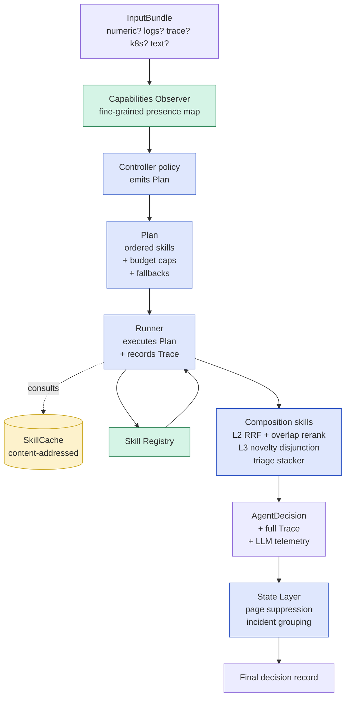

# Agentic Incident Triage — System Plan v2

**Status.** Plan v2 — 2026-06-12. Builds on the v1 draft (same day) after a review of [`DOCS/docs6/XX_AGENTIC_IDEA.md`](../docs6/XX_AGENTIC_IDEA.md). v2 adds first-class abstractions for **Plan / Budget / Trace / Capabilities / SkillCache** so the deferred upgrade paths from `XX_AGENTIC_IDEA.md` (ReAct loop, self-critique, learned controller) can be added later as *config changes + new Skill registrations*, never as architecture rewrites.

**Paper framing.** The **agentic system is the contribution**. The TCH cascade is used internally to inform the design but the paper presents only the agentic framing. The cascade does not appear in tables, figures, or claim statements.

**Source tree.** New code lives at `src/agent/` (top-level under `src/`). Old `v2_advanced/proposal_*/` modules remain — their classes get wrapped as Skills.

**Companion docs.**
- [`DOCS/docs6/XX_AGENTIC_IDEA.md`](../docs6/XX_AGENTIC_IDEA.md) — 5 upgrade paths (4.1 adaptive selection, 4.2 reformulation, 4.3 cross-window state, 4.4 self-critique, 4.5 ReAct loop); v2 implements 4.1, 4.2, 4.3 and **reserves clean extension points** for 4.4 + 4.5.
- [`DOCS/docs7/RESEARCH-QUESTIONS.md`](RESEARCH-QUESTIONS.md) — RQs the agent answers; this doc closes A4 / A5 / A6 / A8 + enables C5 (skill ablation).
- [`DOCS/docs7/IMPROVEMENTS.md`](IMPROVEMENTS.md) — §4–§7 are realised here; §1–§3 deferred per user directive (cluster + industry surface stay env-var-swappable).
- [`DOCS/docs6/X_FINAL_TCH_CASCADE.md`](../docs6/X_FINAL_TCH_CASCADE.md) — locked cascade end-state. **Internal reference only.**

---

## Table of contents

1. [The system in one paragraph](#1-the-system-in-one-paragraph)
2. [Scope and non-goals](#2-scope-and-non-goals)
3. [Architecture overview](#3-architecture-overview)
4. [Core abstractions](#4-core-abstractions)
5. [Skill registry](#5-skill-registry)
6. [The controller — pluggable policy](#6-the-controller--pluggable-policy)
7. [Cross-window state](#7-cross-window-state)
8. [Adaptive modality — capabilities, not datasets](#8-adaptive-modality--capabilities-not-datasets)
9. [Ablation as a first-class experiment type](#9-ablation-as-a-first-class-experiment-type)
10. [LLM Provider abstraction (multi-provider, BYO-key)](#10-llm-provider-abstraction-multi-provider-byo-key)
11. [LLM telemetry and cost tracking](#11-llm-telemetry-and-cost-tracking)
12. [Apples-to-apples evaluation protocol](#12-apples-to-apples-evaluation-protocol)
13. [Closing the RQ caveats](#13-closing-the-rq-caveats)
14. [WoL framing inside the agent](#14-wol-framing-inside-the-agent)
15. [Configuration layer (env-var-swappable)](#15-configuration-layer-env-var-swappable)
16. [Extension points reserved for v2+](#16-extension-points-reserved-for-v2)
17. [Phased implementation plan](#17-phased-implementation-plan)
18. [What v1 does NOT do (with extension hooks)](#18-what-v1-does-not-do-with-extension-hooks)
19. [Cross-references](#19-cross-references)

---

## 1. The system in one paragraph

The **Agentic Incident Triage System (AITS)** takes a stream of incident-shaped **input bundles** — each bundle carrying *whatever evidence is available* (numeric telemetry / ordered logs / unordered log quotes / trace summary / k8s events / Jira-text-only) — and emits per bundle an `AgentDecision` containing a triage class, a ranked top-5 of candidate past Jira tickets, a novelty flag, and a full *Trace* of which skills were invoked with what budget. Internally, AITS owns a **Skill Registry** (each cascade-era pipeline + future ReAct tools wrapped behind a uniform interface), a **Capabilities Observer** that inspects what's in the bundle, a **Controller** that emits a **Plan** (skill invocation sequence + budget caps), a **Runner** that executes the plan while populating the Trace, and a **State Layer** that suppresses duplicate paging across windows. Every LLM call is instrumented; every skill output is cacheable; every decision is replayable.

The contribution is the *capability-adaptive, cost-aware, replayable* policy over heterogeneous diagnostic skills.

---

## 2. Scope and non-goals

### In scope (v1)

- **Skill Registry** with the cascade-derived retrievers + composition skills + reformulation, all behind a uniform interface with **versioning** and **caching**.
- **Capabilities Observer** that produces a rich per-bundle capability set (not a binary dataset flag).
- **Rule-based Controller** that emits Plans; the `Controller` interface is **pluggable** so a learned controller is a v2 swap.
- **Plan / Budget / Trace** as first-class data types — every decision is inspectable and replayable.
- **SkillCache** — content-addressed cache keyed by `(skill, version, window_hash, memory_hash)` so ablations are fast.
- **Cross-window state**: per-service rolling memory + page suppression.
- **LLM telemetry**: every model call instrumented; per-experiment summaries with monetary equivalents.
- **Apples-to-apples evaluation harness**: the six rules from `IMPROVEMENTS.md` §5 enforced at runtime.
- **Ablation as a config change** — `agent-config.yaml` disables any skill or capability subset for an experiment without code edits.
- **Config layer**: local Neo4j + LM Studio defaults; env-var seams for Aura + Ollama/vLLM later.

### Out of scope (v1; reserved hooks in §15)

- ReAct loop (active evidence gathering) — `XX_AGENTIC_IDEA.md` §4.5. Reserved as the `EvidenceRequestSkill` interface (§15.1).
- Self-critique with `needs_review` triage class — §4.4. Triage enum already includes `needs_review` (§4.4); only the controller's emission logic is deferred.
- Learned controller — §4.1 open question. `Controller` interface is pluggable (§6.4).
- Multi-dataset Neo4j (tagged-node multi-tenancy) — `IMPROVEMENTS.md` §1.1 option B. Reserved env var `NEO4J_DATASET_TAG` (§14).
- Industry-grade integration surface — `IMPROVEMENTS.md` §3. Out of scope; agent is a Python library only.
- Cluster deployment — local-only for v1; env-var swap when ready.

### Non-claims (binding from `RESEARCH-CHARTER.md` §14)

Memory does not improve anomaly detection. Not production-ready. No comparison to commercial AIOps tools. Does not solve cold-start.

---

## 3. Architecture overview



Six layers, each with a clean interface:

| Layer | Role | Pluggable? |
|---|---|---|
| **L0 — Capabilities Observer** | Inspect the InputBundle. What evidence is present, at what richness? | New capabilities = new constants in `agent/capabilities.py` |
| **L1 — Controller** | Read capabilities + history, emit a Plan. | Yes — `RuleController` (v1), `LearnedController` (v2 swap) |
| **L2 — Plan** | An ordered list of `SkillInvocation`s with per-skill and per-window budgets + fallback chains. Inspectable + replayable. | Plans can be loaded from disk for replay/ablation |
| **L3 — Runner** | Executes the Plan, populates the Trace, consults the SkillCache, enforces budgets. | Single implementation; behavior driven by Plan |
| **L4 — Skill Registry** | Uniform `Skill` interface; each cascade pipeline + future ReAct tool is a registered Skill. | Yes — register new skills in `agent/skills/`; old ones stay |
| **L5 — State Layer** | Cross-window per-service rolling memory + page-suppression. | Rule-based v1; learnable v2 |

The diagram **explicitly does not show** the cheap-first / escalate logic — that's *encoded in the Plan the controller emits*, not hardcoded in the runner. This is the key structural change vs v1: the runner doesn't know about "cheap path" or "escalate", it just executes Plans.

---

## 4. Core abstractions

These are the data types the agent code is built around. Each gets a small, frozen public API.

### 4.1 `InputBundle`

The raw evidence for one window. **All fields are optional** except `window_id`.

```python
@dataclass(frozen=True)
class InputBundle:
    window_id: str
    dataset: str                                    # "online_boutique" | "otel_demo" | "wol"
    text_evidence: str | None = None                # natural-language window summary
    numeric_features: dict[str, float] | None = None       # 94 OB cols (None for WoL)
    log_lines: list[LogLine] | None = None          # ordered if available
    log_lines_ordered: bool = False                 # WoL has lines but unordered
    trace_summary: TraceSummary | None = None       # if available
    k8s_events: list[K8sEvent] | None = None
    metric_snapshots: dict[str, list[float]] | None = None
    scenario_family: str | None = None              # used for state binding, never for retrieval
    service_name: str | None = None
    window_type: str | None = None                  # pre_fault_baseline / active_fault / recovery_window
    extra: dict = field(default_factory=dict)       # forward-compatible extension slot
```

### 4.2 `Capabilities`

Output of the Capabilities Observer. Not boolean flags — a structured map. New entries are additive; old code keeps working.

```python
@dataclass(frozen=True)
class Capabilities:
    flags: frozenset[str]                           # primary presence flags
    richness: dict[str, dict]                       # secondary detail per flag

    # standard flag names (constants in agent/capabilities.py)
    # NUMERIC_FEATURES, ORDERED_LOGS, UNORDERED_LOGS, TRACE_SUMMARY,
    # K8S_EVENTS, METRIC_SNAPSHOTS, TEXT_EVIDENCE, MEMORY_TEXT,
    # KG_GRAPH_MEMORY, KG_GRAPH_WINDOW, VERIFIER_KNOWN_HELPFUL
```

Richness example: `capabilities.richness["ORDERED_LOGS"] = {"n_lines": 47, "max_span_seconds": 312}` — lets the controller decide "47 lines is enough for LogSeq2Vec" vs "5 lines isn't worth the call".

### 4.3 `Skill`

The uniform interface every diagnostic primitive obeys.

```python
class Skill(ABC):
    name: str                                       # registry key, e.g. "retrieve_dense"
    version: str                                    # semver — recorded in Trace, used by SkillCache
    required_flags: frozenset[str]                  # capabilities required to invoke
    cost_class: Literal["cheap", "medium", "expensive_llm"]
    failure_modes: list[FailureMode]                # OOD warnings, with citations to MODE3 doc etc.

    @abstractmethod
    def can_invoke(self, capabilities: Capabilities) -> bool: ...

    @abstractmethod
    def invoke(self, bundle: InputBundle, memory: MemoryView,
               budget: Budget, ctx: AgentContext) -> SkillOutput: ...

    def cache_key(self, bundle: InputBundle, memory: MemoryView) -> str:
        """Default: hash(name, version, bundle.window_id, memory.signature).
        Skills that depend on additional inputs (e.g. retry_count) override."""
```

### 4.4 `SkillOutput`

```python
@dataclass(frozen=True)
class SkillOutput:
    skill: str
    skill_version: str
    triage_score: float | None
    triage_decision: Literal["noise", "ticket_worthy", "needs_review", None] = None
    # Note: "needs_review" reserved from day 1 even though v1 controller never emits it.
    matched_issue_ids: list[str] = field(default_factory=list)
    is_novel: bool | None = None
    confidence: float = 0.0
    evidence_used: list[str] = field(default_factory=list)    # capability flags actually read
    cost: SkillCallCost = field(default_factory=SkillCallCost.zero)
    extra: dict = field(default_factory=dict)        # skill-specific debug info
```

### 4.5 `Budget`

Tracked per window, deducted per skill call. Hard ceilings, soft warnings.

```python
@dataclass
class Budget:
    max_llm_tokens: int = 100_000                   # per window
    max_wall_seconds: float = 90.0
    max_usd_equivalent: float = 0.50
    max_skill_calls: int = 12

    spent_tokens: int = 0
    spent_seconds: float = 0.0
    spent_usd: float = 0.0
    spent_calls: int = 0

    def can_afford(self, cost: SkillCallCost) -> bool: ...
    def deduct(self, cost: SkillCallCost) -> None: ...
    def remaining(self) -> dict: ...
```

When a Budget is exhausted, the Runner *fails fast* on the next skill invocation and the Trace records "budget_exceeded". This makes ReAct (§15.1) a natural extension — request_more_evidence skills get the same budget treatment without redesign.

### 4.6 `Plan`

What the controller emits. Inspectable, serialisable, replayable.

```python
@dataclass(frozen=True)
class Plan:
    plan_id: str                                    # stable hash of contents
    invocations: tuple[SkillInvocation, ...]        # ordered
    global_budget: Budget
    fallback_chains: dict[str, list[str]]           # "if skill_X fails, try [Y, Z]"

@dataclass(frozen=True)
class SkillInvocation:
    skill_name: str
    skill_version: str
    inputs: dict                                    # binding to bundle fields
    per_call_budget: Budget                         # subset of global; the runner enforces
    on_failure: Literal["abort", "fallback", "continue"] = "fallback"
    gate: Callable[[Trace, Budget], bool] | None = None
    # Optional gate function — invocation is skipped unless gate(current trace, budget) -> True.
    # Encodes "only run skill X if skill Y said low confidence".
```

### 4.7 `Trace`

What the Runner populates as it executes. Substrate for debugging, ablation, learned-controller training data.

```python
@dataclass
class Trace:
    bundle_id: str
    plan_id: str
    events: list[TraceEvent] = field(default_factory=list)
    final_decision: AgentDecision | None = None
    total_budget: Budget = field(default_factory=Budget)

    def to_jsonl(self) -> str: ...

@dataclass(frozen=True)
class TraceEvent:
    ts: datetime
    kind: Literal["plan_start", "skill_start", "skill_end",
                  "cache_hit", "budget_check", "fallback", "plan_end"]
    skill: str | None
    skill_version: str | None
    duration_ms: float | None
    output: SkillOutput | None
    error: str | None
    notes: dict
```

Every trace gets written to `data/agent_traces/<experiment>/<window_id>.json`. Together with the `agent-config.yaml` snapshot, this makes any decision **bit-replayable**.

### 4.8 `SkillCache`

Content-addressed cache. Speeds up ablations dramatically (running 6 ablations on 1,000 windows without cache = 6 × the LLM cost; with cache, the second run is near-free for un-ablated skills).

```python
class SkillCache:
    def get(self, key: str) -> SkillOutput | None: ...
    def put(self, key: str, output: SkillOutput) -> None: ...

# Default key: f"{skill.name}@{skill.version}::{bundle.cache_key}::{memory.signature}"
```

Backed by JSONL on disk under `data/skill_cache/`, gitignored. Cache invalidation = bump the skill version.

### 4.9 `AgentDecision`

Final output per bundle. Carries the decision **and** its provenance.

```python
@dataclass(frozen=True)
class AgentDecision:
    bundle_id: str
    triage_decision: Literal["noise", "ticket_worthy", "needs_review"]
    triage_score: float
    matched_issue_ids: list[str]
    is_novel: bool
    confidence: float
    evaluation_mode: Literal["telemetry_diagnosis", "text_retrieval_generalisation"]
    # WoL gets "text_retrieval_generalisation"; OB / OTel Demo get "telemetry_diagnosis".
    # The eval harness uses this to refuse illegal mixed-mode comparisons.
    plan_id: str                                    # which plan produced this
    skills_invoked: list[str]                       # for skill-ablation analysis
    cost: BudgetSnapshot
    trace_path: str                                 # pointer to the JSON trace
```

---

## 5. Skill registry

Every cascade-era retriever is wrapped as a Skill. New skills (ReAct evidence tools, self-critic, learned-judge) are *registered without touching the runner*.

### 5.1 Registered skills (v1)

| Skill | Wraps | Required flags | Cost class | Notes |
|---|---|---|---|---|
| `triage_numeric` | HGB (`comparison/pipelines.py`) | `NUMERIC_FEATURES` | cheap | Skipped automatically on WoL |
| `retrieve_dense` | BiEncoder (`neural_models/bi_encoder.py`) | `TEXT_EVIDENCE`, `MEMORY_TEXT` | cheap | Workhorse retriever |
| `retrieve_log_sequence` | LogSeq2Vec (`v2_advanced/proposal_b_logseq2vec/`) | `ORDERED_LOGS` | medium | Skipped on WoL (no order); controller can also down-weight when `richness["ORDERED_LOGS"]["n_lines"] < 8` |
| `retrieve_hybrid_fusion` | Hybrid-RRF (`v2_advanced/proposal_c_hybrid_retrieval/`) | `TEXT_EVIDENCE`, `MEMORY_TEXT` | medium | Uses `KG_GRAPH_MEMORY` if present (richer); falls back gracefully |
| `retrieve_knowledge_graph` | KG-Retrieval (`v2_advanced/proposal_d_knowledge_graph/`) | `KG_GRAPH_MEMORY` | medium | `KG_GRAPH_WINDOW` makes it dramatically better (closes RQ-A6) |
| `verify_with_llm` | DiagnosisAgent (`v2_advanced/proposal_e_agent/`) | `VERIFIER_KNOWN_HELPFUL`, `TEXT_EVIDENCE` | **expensive_llm** | Required flag prevents WoL invocation per Mode 3 §3.9 (closes RQ-A8) |
| `extract_entities_llm` | KG extractor (`v2_advanced/proposal_d_knowledge_graph/extractor.py`) | `TEXT_EVIDENCE` | **expensive_llm** | Used **at indexing time only**; produces `KG_GRAPH_MEMORY`/`KG_GRAPH_WINDOW` capability |
| `reformulate_query` | New (closes `XX_AGENTIC_IDEA` §4.2) | `TEXT_EVIDENCE` | **expensive_llm** | Bounded action space: `drop_token / add_service / substitute_synonym` |
| `compose_l2` | Cascade L2 logic (`v2_advanced/tch/build_cascade.py`) | (composition only) | cheap | RRF + overlap rerank |
| `compose_triage` | Cascade L1 stacker | (composition only) | cheap | Class-balanced logistic over invoked-skill triage_scores |
| `compose_novelty` | Cascade L3 disjunction | (composition only) | cheap | `agent_novel ∨ free_signal ∨ learned_signal` (closes RQ-A5) |

### 5.2 Skill failure handling

Each skill declares known failure modes (e.g. `verify_with_llm` documents the WoL −0.272 Hit@5 degradation). If a skill raises mid-invocation, the runner consults the Plan's `fallback_chains[skill_name]` and tries each fallback in order. If all fail, the runner emits an `AgentDecision` with `triage_decision="needs_review"` and `confidence=0.0` (degrading gracefully rather than crashing).

### 5.3 Skill caching policy

Cheap skills (`triage_numeric`, `compose_*`): no caching needed — they're sub-millisecond.

Medium skills (`retrieve_*`): cached. Key = `(skill, version, bundle.window_id, memory.signature, capabilities_subset)`. A re-run with the same config produces a cache hit; an ablation with the same skill enabled also produces a hit.

Expensive LLM skills (`verify_with_llm`, `reformulate_query`, `extract_entities_llm`): always cached. Cache key includes the prompt hash and the model name + version. A skill version bump invalidates the cache.

---

## 6. The controller — pluggable policy

### 6.1 The contract

```python
class Controller(ABC):
    @abstractmethod
    def plan(self, bundle: InputBundle, capabilities: Capabilities,
             state: WindowState, config: AgentConfig) -> Plan: ...
```

Two implementations ship in v1:

### 6.2 `RuleController` — v1 default

Implements the cheap-first / escalate / reformulate policy from `XX_AGENTIC_IDEA.md` §5. Reads thresholds from `agent-config.yaml`. Approx 200 LOC. Hand-tuned thresholds:

```yaml
controller:
  type: rule
  cheap_path:
    triage_high_confidence: 0.90
    require_top1_consensus: true
  escalation:
    max_reformulation_retries: 2
    consensus_voters_required: 2
  verifier:
    enabled_when_flag: VERIFIER_KNOWN_HELPFUL
```

### 6.3 `LearnedController` — v2 (interface ready in v1)

Subclass of `Controller`. Takes the same inputs; emits the same `Plan` shape. Internally consumes a small LogReg / MLP trained on `(capabilities + cheap-skill outputs) → P(escalate is worthwhile)`.

**Training data is free** — every v1 run produces Traces. Once we have N=1000+ traces with ground-truth labels, train the LearnedController offline, swap via config:

```yaml
controller:
  type: learned
  model_path: artifacts/controllers/learned_v1.pkl
```

No agent code change. This is the v1-to-v2 migration story: literally one config edit.

### 6.4 Why "controller emits Plan" matters

Three benefits:

1. **Ablation is a config change.** Disable `verify_with_llm` for an ablation? `agent-config.yaml: skills: { verify_with_llm: { enabled: false } }`. The controller respects the disable when emitting plans. Runner never sees the skill.

2. **Dry-run mode.** `agent --dry-run` prints the Plan but doesn't execute it. Cheap cost-estimation before a 10-hour run.

3. **Replay.** Load an existing Trace, extract its Plan, re-execute against current code. Verifies bit-equivalence; catches regressions.

---

## 7. Cross-window state

Implements `XX_AGENTIC_IDEA.md` §4.3.

### 7.1 Data structure

Per-`service_name` (or per-cluster) ring buffer of size `N=12` (default; configurable in YAML):

```python
@dataclass
class WindowState:
    timestamp: datetime
    triage_decision: Literal["noise", "ticket_worthy", "needs_review", "borderline"]
    top1_match: str | None
    is_novel: bool
    incident_id: str | None
```

The state buffer is dual-purpose: the **Controller reads it** when emitting Plans (e.g. "we've been in active_fault for this service for 5 windows, don't re-invoke the expensive verifier — we have high confidence already"); the **State Layer writes it** after each decision.

### 7.2 Page-suppression rule (conservative)

Same as `XX_AGENTIC_IDEA.md` §4.3:
- Same `top1_match` as one of the last 3 contiguous windows.
- AND same `scenario_family`.
- AND no `recovery_window` has intervened.

→ downgrade `ticket_worthy` → `borderline`, attach to existing `incident_id`.

### 7.3 Stateful policy hints to the controller

The Controller's `plan()` method receives the current `WindowState`. v1 uses it to:
- Skip `retrieve_log_sequence` when state shows the same incident has been retrieved-and-matched 3+ windows in a row (the answer isn't changing).
- Force `extract_entities_llm` on never-seen-before scenario_families even when cheap-path is confident (so the KG grows over time).

### 7.4 New metric

`pages_per_incident` — target ≤ 1.5 vs cascade's ~6.

---

## 8. Adaptive modality — capabilities, not datasets

**The key v2 design move.** v1 thought in terms of datasets ("OB has telemetry, WoL doesn't"). v2 thinks in terms of **capability sets**. This unlocks:

1. **Datasets are just typical capability profiles.** OB usually has the full set; WoL has only text. But an OB window with corrupted trace data should also lack `TRACE_SUMMARY` and the agent handles it the same way it handles WoL.

2. **Ablation is just running the agent with a synthetic capability mask.** "What if OB didn't have numeric features?" → strip `NUMERIC_FEATURES` from the Capabilities at runtime, run normally. The Plan adapts.

3. **Real-world deployments rarely have everything.** A company that has logs but no Tempo traces is just one capability mask. The agent runs.

### 8.1 Standard capability flags

| Flag | Source | Typical for OB | Typical for OTel Demo | Typical for WoL |
|---|---|:---:|:---:|:---:|
| `NUMERIC_FEATURES` | 94 `triage_feature_*` cols | ✓ | ✓ | ✗ |
| `TEXT_EVIDENCE` | `triage_evidence_text` field | ✓ | ✓ | ✓ |
| `ORDERED_LOGS` | Loki-style timestamped sequence | ✓ | ✓ | ✗ |
| `UNORDERED_LOGS` | `log_quotes` list, no time order | ✗ | ✗ | ✓ |
| `TRACE_SUMMARY` | Tempo anomaly summary | ✓ | ✓ | ✗ |
| `K8S_EVENTS` | Pod / restart events | ✓ | ✓ | ✗ |
| `METRIC_SNAPSHOTS` | Prometheus time-series snapshots | ✓ | ✓ | ✗ |
| `MEMORY_TEXT` | Per-ticket `memory_text` populated | ✓ | ✓ | ✓ |
| `KG_GRAPH_MEMORY` | Neo4j has incident nodes for memory | configurable | configurable | configurable |
| `KG_GRAPH_WINDOW` | Per-window LLM-extracted entities exist | indexing-time choice | indexing-time choice | RQ-A6 fix |
| `VERIFIER_KNOWN_HELPFUL` | Dataset is in verifier calibration table | ✓ | tbd via RQ-B1 | ✗ (per Mode 3 §3.9) |

### 8.2 Skills' required-flags wiring

Already documented in §5.1. The key property: every skill declares what it needs; the runner *automatically skips* skills whose `required_flags` aren't in the current `Capabilities.flags`. No dataset-specific code paths anywhere.

### 8.3 Richness for soft decisions

`Capabilities.richness` holds secondary detail. Example: `ORDERED_LOGS` is present, but `richness["ORDERED_LOGS"]["n_lines"] = 5` — the controller's RuleController policy can decide "5 lines isn't enough; skip LogSeq2Vec anyway".

This lets us encode lessons from Mode 3 (where WoL had 1–19 lines but no temporal order, and LogSeq2Vec underperformed) as soft thresholds rather than hard dataset rules.

---

## 9. Ablation as a first-class experiment type

Closes RQ-C5 (skill ablation). The user explicitly asked for this.

### 9.1 The ablation declaration

In `agent-config.yaml`:

```yaml
experiment:
  name: ob-skill-ablation-2026-06-15
  baseline: agent-config.full.yaml
  ablations:
    - name: no_verifier
      disable_skills: [verify_with_llm]
    - name: no_kg
      disable_skills: [retrieve_knowledge_graph, retrieve_hybrid_fusion]
    - name: no_telemetry_features
      mask_capabilities: [NUMERIC_FEATURES, TRACE_SUMMARY, K8S_EVENTS]
    - name: no_logs
      mask_capabilities: [ORDERED_LOGS, UNORDERED_LOGS]
    - name: dense_only
      enable_skills_exact: [retrieve_dense, compose_l2, compose_triage, compose_novelty]
```

### 9.2 The harness

```
python -m agent.eval_ablation --config agent-config.yaml \
  --global-dir data/derived/global/2026-05-25-dataset-v5-large-global
```

For each ablation:
1. Apply the mask / disable to the config.
2. Re-run the agent over the test split — **most skills hit cache** so total compute is dominated by un-cached LLM calls.
3. Aggregate Hit@1, Hit@5, MRR, novel-recall, $cost, latency per ablation.
4. Emit one table row per ablation.

### 9.3 Why this matters

For the paper: every ablation is structurally enforced to follow the apples-to-apples rules (§11). For the research: skill ablations on WoL Mode 3 directly answer "how much of the agent's WoL Hit@5 = 0.787 came from Hybrid-RRF vs from BiEncoder vs from KG?". For the agentic claim: ablations are the cleanest way to argue "the closed-loop system is more than the sum of its parts."

### 9.4 The non-obvious win

Because every skill output is cached by content, an ablation that disables `verify_with_llm` (the slowest skill) **doesn't re-run anything else**. The runner just skips the verifier and re-composes. 10× speed-up on the ablation grid.

---

## 10. LLM Provider abstraction (multi-provider, BYO-key)

The system must work with **any OpenAI-compatible-ish LLM** so a user can plug in their preferred provider with their own API key. Our research uses local LM Studio for development; the same code paths work against OpenAI, Anthropic, Ollama, vLLM, or any future provider.

### 10.1 Design goals

1. **Provider-agnostic skill code.** No skill ever imports `openai`, `anthropic`, or `requests` directly. Skills call `ctx.llm.chat_json(...)` and don't care which provider is behind it.
2. **One env-var to switch providers.** Setting `LLM_PROVIDER=openai` flips the entire system; no other code changes.
3. **API keys via env / `.env`, never YAML.** Tracked config carries the provider *name* and *model name*; never the secret.
4. **Graceful degradation.** If a provider is unreachable / unauthorised / over-quota, the runner records `provider_error` in the Trace and the skill's `on_failure` policy kicks in (fallback or abort). The system doesn't crash mid-experiment.
5. **Cost-aware budgeting.** Per-provider cost tables are loaded from a config file; the `Budget` enforces a dollar cap that respects whichever provider is selected.
6. **Structured output preserved across providers.** Each provider's quirks for JSON-schema-constrained output (different request keys, different validation behaviour) are hidden inside the provider adapter.

### 10.2 The `LLMProvider` interface

```python
class LLMProvider(ABC):
    name: str                                       # "lm_studio" | "openai" | "anthropic" | "ollama" | "vllm" | <custom>
    model: str                                      # the model id sent in requests
    supports_structured_output: bool                # JSON-schema-constrained generation
    supports_tool_use: bool                         # for future ReAct skills (§15.1)
    cost_per_M_tokens: CostTable                    # for telemetry monetary equivalent

    @abstractmethod
    def is_available(self) -> ProviderHealth: ...
        # Returns (reachable, authenticated, model_loaded). Used at startup
        # to fail fast if misconfigured.

    @abstractmethod
    def chat_json(self, system: str, user: str,
                  *, schema: dict | None = None,
                  temperature: float = 0.0,
                  max_tokens: int = 1024,
                  thinking: bool | None = None) -> ChatResponse:
        # Returns parsed JSON dict (if schema) or text.
        # Records (prompt_tokens, completion_tokens, latency_ms, success)
        # in the per-call telemetry log automatically.

    def count_tokens(self, text: str) -> int:
        # Optional — providers that expose a tokenizer override this.
        # Used for budget pre-flight when the call may exceed the cap.

    def streaming_chat(self, ...) -> Iterator[str]:
        # Optional — only providers supporting SSE override.
        # Reserved for future agent UX (live progress display).
```

### 10.3 Concrete providers shipped in v1

| Provider | Class | Auth | Structured output | Default `LLM_BASE_URL` | Notes |
|---|---|---|---|---|---|
| **LM Studio** (default for our dev) | `LMStudioProvider` | none (localhost) | `response_format` + JSON schema | `http://localhost:1234` | Our default; matches current cascade dev workflow |
| **OpenAI** | `OpenAIProvider` | `OPENAI_API_KEY` | `response_format` + JSON schema (gpt-4o, gpt-4o-mini, o-series) | `https://api.openai.com` | BYO key for industry users |
| **Anthropic** | `AnthropicProvider` | `ANTHROPIC_API_KEY` | tool_use API with `input_schema` (Claude 3.5+) | `https://api.anthropic.com` | Different request shape — adapter hides it |
| **Ollama** | `OllamaProvider` | none (typical local) or `OLLAMA_API_KEY` | `format: <json_schema>` (Ollama 0.5+) ; `format: "json"` fallback | `http://localhost:11434` | Cluster-friendly |
| **vLLM** | `VLLMProvider` | optional `VLLM_API_KEY` | `extra_body: {guided_json: <schema>}` | `http://localhost:8000` | Highest-throughput cluster option; OpenAI-compatible API |
| **Custom OpenAI-compat** | `GenericOpenAIProvider` | env-configurable | `response_format` | env-configurable | Catch-all for self-hosted or future providers |

Adding a 7th provider = one new file under `src/agent/llm/providers/` implementing the ABC + one row in the cost table. **No agent-core changes.**

### 10.4 Provider selection and config

In `agent-config.yaml` (no secrets):

```yaml
llm:
  provider: lm_studio                              # default for our research runs
  model: qwen/qwen3.6-35b-a3b
  temperature: 0.0
  max_tokens_per_call: 1024
  budget:
    max_usd_per_window: 0.50                       # enforced by Budget; provider-aware
  retry:
    max_attempts: 3
    backoff_s: [1, 4, 16]
```

In `.env` (gitignored):

```
# Default research config — local LM Studio
LLM_PROVIDER=lm_studio
LLM_BASE_URL=http://localhost:1234
LLM_MODEL=qwen/qwen3.6-35b-a3b

# Switch to OpenAI for a BYO-key run:
# LLM_PROVIDER=openai
# OPENAI_API_KEY=sk-...
# LLM_MODEL=gpt-4o-mini

# Or Anthropic:
# LLM_PROVIDER=anthropic
# ANTHROPIC_API_KEY=sk-ant-...
# LLM_MODEL=claude-3-5-haiku-latest

# Or cluster Ollama:
# LLM_PROVIDER=ollama
# LLM_BASE_URL=http://cedar-gpu-42:11434
# LLM_MODEL=qwen2.5:35b
```

### 10.5 Cost tables (per-provider, per-model)

A small data file `src/agent/llm/cost_table.yaml` carries `(provider, model) → (input_per_M_usd, output_per_M_usd)` so the Budget can compute dollar spend per call and the telemetry summary can report monetary equivalents at request time. Self-hosted providers (LM Studio, Ollama, vLLM on our hardware) get `cost = 0` with a note that the amortized GPU-hour cost belongs in the paper appendix, not the per-call telemetry.

Example entries:

```yaml
- provider: openai
  model: gpt-4o
  input_per_M_usd: 2.50
  output_per_M_usd: 10.00
- provider: openai
  model: gpt-4o-mini
  input_per_M_usd: 0.15
  output_per_M_usd: 0.60
- provider: anthropic
  model: claude-3-5-haiku-latest
  input_per_M_usd: 0.80
  output_per_M_usd: 4.00
- provider: anthropic
  model: claude-opus-4-7
  input_per_M_usd: 15.00
  output_per_M_usd: 75.00
- provider: lm_studio
  model: '*'
  input_per_M_usd: 0.0
  output_per_M_usd: 0.0
  note: 'self-hosted; amortized GPU-hour cost reported separately'
```

### 10.6 Best-practice details (the AI/ML hygiene)

- **Deterministic generation.** Default `temperature=0.0` for any structured-output call. Skill outputs are reproducible.
- **Retries with exponential backoff.** Configurable via `agent-config.yaml > llm.retry`. Each retry logs a separate telemetry record so we know real cost.
- **Pre-flight token budget check.** `provider.count_tokens(prompt) + max_tokens_per_call > model_context_limit` → skip with a `context_overflow` telemetry record instead of getting an HTTP 400 mid-experiment. Closes the "11 oversized tickets failed silently" Mode 3 KG-extraction failure mode.
- **Per-skill provider override.** If a future skill works better on a smaller / cheaper model, `agent-config.yaml > skills.<name>.llm_override` can pin it. Defaults to the global provider.
- **Health check at startup.** `AgentRunner.__init__` calls `provider.is_available()` and refuses to start if unreachable. Saves a 12-hour run failing on call 1.
- **Structured-output validation.** Schema-constrained responses are validated against the schema in Python before being returned to the skill. A schema-violation triggers a single re-prompt; if that also fails, the call counts as a skill failure and the fallback chain runs.
- **PII / secret scrubbing hook.** A `provider.scrub_outgoing(text) -> text` middleware slot lets users register a redactor for prompts sent to external providers. Empty default; users can plug in their own.
- **No leakage of provider-specific concepts upward.** The `Skill` API never sees `response_format`, `tool_use`, `guided_json`, etc. — those live inside the provider adapter.

### 10.7 Why this matters

- **For our research:** zero friction — keep using LM Studio locally; cluster swap is one env-var change.
- **For industry users:** they choose their LLM. Their data never leaves their network when using a local/self-hosted provider. They control their token spend through the same Budget machinery we use.
- **For the paper:** we can report "the system runs equivalently on LM Studio (local) / OpenAI (BYO key) / Anthropic (BYO key) / Ollama (cluster) / vLLM (cluster)" — a real industry-grade story without us building a SaaS.

---

## 11. LLM telemetry and cost tracking

(IMPROVEMENTS §6, unchanged from v1; restated for self-containment.)

### 10.1 Per-call record

Every LLM call (via `llm_client.py`) writes one JSONL line to `data/llm_telemetry/<experiment>.jsonl`:

```json
{
  "ts": "2026-06-12T14:23:45.123Z",
  "experiment": "ob-skill-ablation-2026-06-15",
  "ablation": "full",
  "skill": "verify_with_llm",
  "skill_version": "1.0.0",
  "bundle_id": "ob-r07-active_fault-w42",
  "model": "qwen/qwen3.6-35b-a3b",
  "backend": "lm_studio",
  "prompt_tokens": 1842,
  "completion_tokens": 127,
  "total_tokens": 1969,
  "latency_ms": 15400,
  "success": true,
  "cache_hit": false
}
```

Note: the new `ablation` field — directly tells you which ablation a call belongs to.

### 10.2 Per-experiment summary

`scripts/research-lab/summarise_llm_telemetry.py <experiment>` produces a JSON summary with per-skill totals + monetary equivalents (GPT-4o, GPT-4o-mini, Claude 3.5 Haiku).

### 10.3 Paper integration

"Compute resources" subsection: tokens, wall time, monetary equivalents per experiment. Required by IMPROVEMENTS §6.

---

## 12. Apples-to-apples evaluation protocol

(IMPROVEMENTS §5, unchanged; restated.)

Six rules enforced by `src/agent/eval_harness.py`:

1. Same dataset + same split.
2. Same gold relation (coarse vs strong).
3. Same memory pool (size + composition, including distractors).
4. Same metric formula (Hit@K with `len(gold) >= 1` filter, documented).
5. Same statistical envelope (1,000-resample paired bootstrap, seed=42).
6. For agent-vs-baseline comparisons: same upstream prediction inputs; only the composition rule differs.

The eval harness emits an `EvaluationReport` with all six populated as fields. Rendering refuses to draw a cross-dataset row without an explicit annotation.

The `evaluation_mode` field on every `AgentDecision` (set to `text_retrieval_generalisation` for WoL vs `telemetry_diagnosis` for OB/OTel Demo) means mixed-mode comparisons are caught at runtime.

---

## 13. Closing the RQ caveats

(IMPROVEMENTS §7.)

| RQ | How the agent closes it |
|---|---|
| **A4** distractor robustness — identity-agnostic simulation | The agent's distractor sweep at `src/agent/eval_distractor_sweep.py` implements the similarity-weighted simulation (TF-IDF cosine to window text, replace top-K with highest-similarity distractors first). |
| **A5** novelty lower-bound | The `compose_novelty` skill implements the full L3 disjunction; the agent's WoL novelty eval runs all three signals OR-combined. |
| **A6** WoL window-side LLM extraction | `extract_entities_llm` is registered as a skill. Running it once at indexing time on WoL windows populates `KG_GRAPH_WINDOW`; `retrieve_knowledge_graph` and `retrieve_hybrid_fusion` then have symmetric LLM-extracted entities. |
| **A8** verifier OOD-failure | `verify_with_llm.required_flags` includes `VERIFIER_KNOWN_HELPFUL`. WoL doesn't carry that flag, so the runner *structurally skips* the verifier. The −0.272 Hit@5 degradation can't happen. |
| **B2** depth-scaling on real data | Pure analysis pass on cached `retrieve_dense` traces. The cache makes it free. |
| **C5** skill ablation | First-class config-driven experiment type (§9). The ablation harness produces the result table. |

---

## 14. WoL framing inside the agent

(IMPROVEMENTS §4.)

Every `AgentDecision` produced on WoL carries `evaluation_mode = "text_retrieval_generalisation"`. The eval harness refuses to:
- Mix WoL decisions into a "diagnosis" table without an explicit cross-mode column.
- Draw a single Hit@K row labelled "WoL diagnosis" — that's not what we evaluated.

Paper sections describing WoL Mode 3 results always read **"WoL Mode 3 — text-retrieval generalisation"** in tables and prose. Section 8 (threats / honest framing) explicitly states what WoL does and does not test.

---

## 15. Configuration layer (env-var-swappable)

### 14.1 Config sources

- **`.env`** (gitignored) — credentials, backend URLs.
- **`agent-config.yaml`** (tracked example: `agent-config.yaml.example`) — runtime knobs.

### 14.2 Required env vars

```
# LLM serving — local LM Studio by default
LLM_BACKEND=lm_studio                  # or "ollama" | "vllm"
LLM_BASE_URL=http://localhost:1234
LLM_API_KEY=                           # empty for unauthenticated localhost
LLM_MODEL=qwen/qwen3.6-35b-a3b

# Neo4j — local by default
NEO4J_URI=neo4j://127.0.0.1:7687
NEO4J_USERNAME=neo4j
NEO4J_PASSWORD=                        # in .env
NEO4J_DATABASE=neo4j
NEO4J_DATASET_TAG=                     # reserved for the multi-tenant v2 refactor

# Agent telemetry + cache
AGENT_EXPERIMENT=                      # e.g. "wol-mode3-baseline"; goes in every telemetry record
AGENT_TRACE_DIR=data/agent_traces
AGENT_CACHE_DIR=data/skill_cache
AGENT_LLM_TELEMETRY_DIR=data/llm_telemetry
```

### 14.3 The cluster-swap story

When we move to Compute Canada / Aura, we edit `.env`:

```
LLM_BACKEND=vllm
LLM_BASE_URL=http://cedar-gpu-42:8000
NEO4J_URI=neo4j+s://ba1e0503.databases.neo4j.io
NEO4J_PASSWORD=<from password manager>
```

**No agent code changes.** The backend-switching happens inside `llm_client.py` (request-format key differs across LM Studio / Ollama / vLLM, hidden behind a single `chat_json()` method).

---

## 16. Extension points reserved for v2+

Every deferred upgrade path from `XX_AGENTIC_IDEA.md` has a documented hook in v1 so we never refactor the core.

### 15.1 `EvidenceRequestSkill` — for the ReAct loop (§4.5)

A subclass family of `Skill` whose outputs *mutate the InputBundle* by adding new evidence. Sketch:

```python
class EvidenceRequestSkill(Skill):
    """Skill that requests additional evidence and re-injects it into the
    bundle, allowing subsequent skills to read it. Cost tracked normally."""
    cost_class = "expensive_llm"

    def invoke(self, bundle, memory, budget, ctx) -> SkillOutput:
        new_evidence = self.fetch_evidence(...)
        ctx.augmented_bundle = bundle.replace(extra={**bundle.extra, self.evidence_kind: new_evidence})
        # The runner re-runs the capabilities observer; new capabilities may unlock new skills
        return SkillOutput(skill=self.name, ..., extra={"evidence_kind": self.evidence_kind})
```

Concrete v3 skills:
- `RequestExtendedTraceWindow` (5 min → 30 min)
- `RequestDebugLogs` (info → debug)
- `RequestPodMetrics` (one pod's full snapshot)
- `RequestDependencyGraphSnapshot`
- `RequestSimilarIncidentWindow`

No runner change needed — they're just skills.

### 15.2 `NeedsReviewController` — for self-critique (§4.4)

A subclass of `RuleController` (or `LearnedController`) that *can emit* `triage_decision = "needs_review"`. The Plan adds a final-stage `verify_with_llm` invocation whose output, when consistency-flagged, triggers the third triage class. The `triage_decision` enum already supports `needs_review`; we just don't emit it in v1.

### 15.3 `LearnedController` — for adaptive selection (§4.1)

Already specced in §6.3. Training data = Traces from v1 runs. Migration path: collect 1000+ traces, train offline, swap config to `controller.type: learned`.

### 15.4 New capability flags

Adding a new evidence modality means: (a) extend `InputBundle` with a new optional field, (b) add a constant to `agent/capabilities.py`, (c) update existing skills' `required_flags` if they want to use it. **No agent core change.**

### 15.5 Multi-tenant Neo4j (option B from IMPROVEMENTS §1.1) — RESERVED, NOT RESEARCH-VALID

`NEO4J_DATASET_TAG` is read by the Neo4j client. **Reserved for future production multi-tenancy; explicitly forbidden during research evaluation** per the locked decision in [`IMPROVEMENTS.md`](IMPROVEMENTS.md) §1.1. The OB ↔ OTel Demo lexical overlap means a single missing `WHERE n.dataset = $ds` clause in any Cypher query silently contaminates results — unacceptable for a research claim. Research runs use Option A (single dataset per instance, reload between experiments) enforced by a `GraphMetadata` fingerprint check at agent startup; the agent refuses to run if the loaded graph doesn't match the dataset being evaluated.

---

## 17. Phased implementation plan

### Phase 1 — Foundation (1–2 weeks)

| Step | File | Output |
|---|---|---|
| 1.1 | `.env.example` + `agent-config.yaml.example` | Config layer ready |
| 1.2 | `src/v2_advanced/shared/llm_client.py` (refactor of `lm_studio.py`) | Backend-switchable LLM client |
| 1.3 | `src/v2_advanced/shared/llm_telemetry.py` — `TokenLogger` | Per-call JSONL telemetry |
| 1.4 | `src/agent/dataclasses.py` — `InputBundle`, `Capabilities`, `Budget`, `Plan`, `Trace`, `AgentDecision`, `SkillOutput` | Core abstractions |
| 1.5 | `src/agent/capabilities.py` — observer + flag constants | Modality layer |
| 1.6 | `src/agent/skills/base.py` — `Skill` ABC + `SkillCache` | Skill interface + cache |
| 1.7 | `src/agent/skills/{triage_numeric, retrieve_dense, retrieve_log_sequence, retrieve_hybrid_fusion, retrieve_knowledge_graph, verify_with_llm, extract_entities_llm}.py` | Wrap cascade pipelines as skills |
| 1.8 | `src/agent/skills/compose_*.py` — composition skills | L2/L3 + triage stacker |
| 1.9 | `src/agent/controller/rule.py` — `RuleController` | Cheap-first/escalate policy |
| 1.10 | `src/agent/controller/base.py` — `Controller` ABC | Pluggable interface |
| 1.11 | `src/agent/runner.py` — `AgentRunner` | Plan executor |
| 1.12 | `src/agent/state.py` — `WindowState` ring buffer + suppression | Cross-window state |
| 1.13 | `src/agent/eval_harness.py` — six-rule enforcement | Apples-to-apples |
| 1.14 | Patch `proposal_d_knowledge_graph.reload_neo4j` to write the `GraphMetadata` fingerprint node + add the startup `assert_loaded_dataset(expected)` check called by `AgentRunner.__init__` | Dataset-isolation safeguard (no silent KG contamination across OB / OTel Demo / WoL) |
| 1.15 | Smoke test on OB | First agent number |

**Phase 1 deliverable:** the agent runs end-to-end on OB with full telemetry, caching, and a Trace per decision.

### Phase 2 — WoL adaptation + reformulation + ablation harness (1–2 weeks)

| Step | Output |
|---|---|
| 2.1 | `src/agent/skills/reformulate_query.py` | Reformulation skill |
| 2.2 | Verifier OOD-policy in `RuleController` | RQ-A8 closed via skip |
| 2.3 | Run agent on WoL Mode 3 | First WoL agent number |
| 2.4 | Run agent on OTel Demo (RQ-B1 zero-shot transfer) | First OTel Demo number |
| 2.5 | `src/agent/eval_ablation.py` — declarative ablation runner | Ablation harness (closes RQ-C5) |
| 2.6 | First skill-ablation grid on OB | Ablation table for paper |

### Phase 3 — RQ closeouts + paper integration (1 week)

| Step | Output |
|---|---|
| 3.1 | Run `extract_entities_llm` on WoL windows (~6 h LM Studio) | RQ-A6 closed |
| 3.2 | Re-run WoL agent with `KG_GRAPH_WINDOW` capability | Updated WoL numbers |
| 3.3 | Run full-L3 novelty on WoL OOD queries | RQ-A5 closed |
| 3.4 | Run similarity-weighted distractor sweep | RQ-A4 closed |
| 3.5 | Bootstrap CIs on every headline | RQ-C1 closed |
| 3.6 | Paper §5.X draft from agent outputs only | Paper draft ready |

### Phase 4 — extensions (separate research arc; not v1)

| Path | Hook |
|---|---|
| Learned controller | Swap `controller.type` in YAML |
| Self-critique + `needs_review` | Subclass `RuleController`; triage enum already supports it |
| ReAct loop | Register `EvidenceRequestSkill` subclasses |
| Multi-tenant Neo4j | Set `NEO4J_DATASET_TAG` |
| Cluster deployment | Edit `.env` |
| Industry surface (REST / Docker / SDK) | New package wrapping `AgentRunner` |

---

## 18. What v1 does NOT do (with extension hooks)

Honest deferral list. Every item has a clear path to add later.

| Deferred | Hook in v1 | Effort to add later |
|---|---|---|
| Learned controller | `Controller` ABC; v1 ships `RuleController` only | Train offline from Traces, set `controller.type: learned` |
| `needs_review` triage class emission | enum + composition logic ready; controller doesn't emit it | New `NeedsReviewController` subclass; ~50 LOC |
| ReAct active evidence gathering | `EvidenceRequestSkill` ABC sketched | Implement concrete skills; runner already supports bundle augmentation |
| Cluster deployment (Aura + vLLM) | env-var swap | `.env` edit; `llm_client.py` already supports `LLM_BACKEND=vllm` |
| Multi-tenant Neo4j (tagged-node) | `NEO4J_DATASET_TAG` reserved env var | Add tag write to loader + filter clause to retrievers (~30 LOC) |
| Industry surface (FastAPI / Docker / SDK) | `AgentRunner` already takes `InputBundle` from any source | Wrap in `agent_api/` |

---

## 19. Cross-references

- **The RQs this answers:** [`DOCS/docs7/RESEARCH-QUESTIONS.md`](RESEARCH-QUESTIONS.md) (closes Bucket A + B1 + C1 + C5).
- **The improvements this implements:** [`DOCS/docs7/IMPROVEMENTS.md`](IMPROVEMENTS.md) §4 + §5 + §6 + §7.
- **The cascade we draw skills from (internal-only):** [`DOCS/docs6/X_FINAL_TCH_CASCADE.md`](../docs6/X_FINAL_TCH_CASCADE.md).
- **The agentic proposal this builds on:** [`DOCS/docs6/XX_AGENTIC_IDEA.md`](../docs6/XX_AGENTIC_IDEA.md).
- **Mode 3 evidence motivating the verifier OOD-policy:** [`DOCS/docs7/MODE3-TCH-LITE-WoL-RESULTS.md`](MODE3-TCH-LITE-WoL-RESULTS.md) §3.9.
- **Data layout the agent consumes:** [`data/README.md`](../../data/README.md).

---

*Generated 2026-06-12. Plan v2. Phase 1 implementation can start from this document without further design decisions; deferred upgrade paths in §15 have explicit hooks so they require config + skill registration, not architectural changes.*
