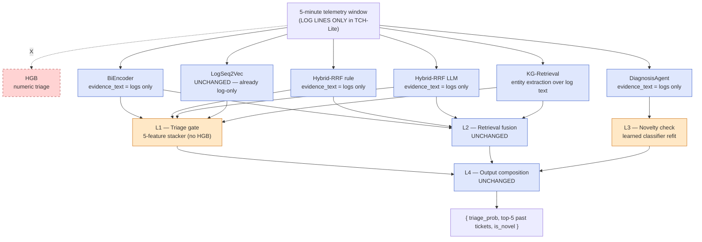

# TCH-Lite — A Log-Only Deployment Configuration of the Cascade

**Status.** Design proposal (drafted 2026-06-11). Not yet executing.

**Owner.** Yuvraj Sehgal.

**What this is.** A specification for **a single deployment configuration of TCH**, not a new cascade, that drops the numeric-feature triage gate and the trace-derived parts of window evidence so the system can be deployed in environments without full distributed tracing — and so the cascade can be evaluated end-to-end on log-only datasets such as WoL.

**What this is NOT.** A competing cascade variant. The headline contribution of the paper remains TCH-Combined (Hit@5 = 0.912 on the synthetic dataset). TCH-Lite is a *reduced-input* configuration of the same four-layer composition, presented as a deployability story plus a real-data evaluation enabler, not as a coequal model.

**Companion documents.** [`docs4/X_FINAL_TCH_CASCADE.md`](../docs4/X_FINAL_TCH_CASCADE.md) for the full cascade we are reducing from; [`docs6/pipeline-1-HGB.md`](../docs6/pipeline-1-HGB.md) for the pipeline TCH-Lite removes; [`docs7/REAL-DATA-WoL-PLAN.md`](REAL-DATA-WoL-PLAN.md) for the real-data evaluation TCH-Lite enables.

---

## Table of contents

1. [The 30-second version](#1-the-30-second-version)
2. [Why a log-only configuration at all](#2-why-a-log-only-configuration-at-all)
3. [The architectural delta vs TCH-Combined](#3-the-architectural-delta-vs-tch-combined)
4. [Pipeline-by-pipeline impact](#4-pipeline-by-pipeline-impact)
5. [Layer-by-layer changes](#5-layer-by-layer-changes)
6. [Implementation sketch](#6-implementation-sketch)
7. [The channel-ablation table](#7-the-channel-ablation-table)
8. [Expected metric impacts](#8-expected-metric-impacts)
9. [The real-data evaluation TCH-Lite enables](#9-the-real-data-evaluation-tch-lite-enables)
10. [What we still call TCH](#10-what-we-still-call-tch)
11. [Open questions and trade-offs](#11-open-questions-and-trade-offs)
12. [Cross-references](#12-cross-references)

---

## 1. The 30-second version

TCH-Lite is **TCH with HGB removed and window evidence restricted to log-derived text only**. The four-layer composition is unchanged; the L1 stacker is refit over the five remaining triage signals (BiEncoder, Hybrid-RRF rule, Hybrid-RRF LLM, LogSeq2Vec, KG-Retrieval); the L3 learned novelty classifier is refit on the new L1 score distribution; everything else is unchanged. The cascade can then be deployed (and evaluated) on log-only datasets such as WoL, where no traces, metrics, or Kubernetes events are available. The paper presents TCH-Lite as a **deployment configuration** of TCH, not as a competing model — the headline Hit@5 = 0.912 on the synthetic dataset stays attached to TCH-Combined.

---

## 2. Why a log-only configuration at all

Three concrete reasons. None on its own would justify the work; together they do.

### 2.1 Industrial deployability

Many production teams have structured logs but **no full distributed tracing**. OpenTelemetry tracing adoption is uneven; teams that sample at 1–10% (the typical production rate) are missing the signal density our cascade currently assumes. Our `§13.1` and `§13.2` evaluations both implicitly assume 100% trace coverage. A reviewer from industry will notice and ask. TCH-Lite is the answer.

### 2.2 Real-data evaluation enabler

This is the load-bearing reason. The WoL dataset is **log-and-ticket-context only** — no traces, no metrics, no k8s events. Trying to evaluate TCH-Combined against WoL requires either (a) inventing a synthetic-to-real ground-truth match (the v1 plan's mistake) or (b) restricting WoL's role to distractors and novelty queries only (the v2 plan's framing). Both have limits. **TCH-Lite is the configuration that can be evaluated end-to-end against WoL directly** — both memory and query sides are log-only, both sides come from the same dataset, the input modality matches the cascade's expectations.

### 2.3 Genuine channel-ablation contribution

The paper currently has no channel-ablation table. Our prior Phase C work implemented `mask_logs`, `mask_traces`, `mask_k8s` flags on the memory-side text builder; the infrastructure exists. A small extension to apply the same masks symmetrically on the window side gives us a real channel-ablation: how much does each channel contribute to Hit@5, MRR, and PR-AUC? TCH-Lite is the **extreme point** of that ablation (all telemetry channels off, only logs remain), so it naturally anchors the table.

### 2.4 What this is NOT motivated by

Not motivated by suspicion that the combined cascade overfits to traces or metrics. Phase C results already showed that logs are the single largest channel contribution; this is consistent with what TCH-Lite tests. TCH-Lite is a deployability and validation story, not a "rebuild the model from scratch" story.

---

## 3. The architectural delta vs TCH-Combined

The cascade has four layers. Two change, two don't.

| Layer | TCH-Combined | TCH-Lite | Change? |
|---|---|---|---|
| **L1 — Triage gate** | 6-feature stacker over `{HGB, BiEncoder, HRRF-rule, HRRF-LLM, LogSeq2Vec, KG-Retrieval}` triage scores | 5-feature stacker over the same minus HGB | **Refit required** |
| **L2 — Retrieval fusion** | Overlap rerank at position 1 + RRF at positions 2–5 over the four retrievers | Same | No change (already text-based) |
| **L3 — Novelty check** | Three-signal OR over agent / free / learned | Same structurally; learned classifier refit on new L1 score distribution | **Learned classifier refit** |
| **L4 — Output composition** | Dict assembly | Same | No change |



---

## 4. Pipeline-by-pipeline impact

Honest accounting per pipeline. Some are unchanged, some are partially affected, one is removed.

### 4.1 HGB — REMOVED

The histogram gradient-boosted classifier consumes the 94-column numeric feature vector exclusively. None of those columns exist in a log-only deployment. HGB is dropped entirely. **This is the only pipeline TCH-Lite removes.**

Consequence: the L1 stacker's largest coefficient (+8.221 on HGB in TCH-Combined) goes away. Triage signal now comes from the five retrieval pipelines' triage scores, which are weaker individually (PR-AUC strict 0.236–0.313 vs HGB's 0.9998). **TCH-Lite's triage PR-AUC will be substantially lower than TCH-Combined's, and the paper has to report that honestly.**

### 4.2 BiEncoder — partial reduction

The BiEncoder consumes `build_window_query_text(window)`, which currently joins log lines, trace-anomaly summary text, and alert names into one ≤512-character string. In log-only mode the trace summary and alert names disappear from the input; only the log lines remain.

Two consequences:
- The model itself is unchanged — same fine-tuned MiniLM-L6-v2, same training procedure, same weights.
- The *input distribution* shifts toward log lines only. The fine-tuned model has seen this distribution during training (because log lines were always the dominant part of the query text), so degradation should be modest.

If the degradation is larger than expected, a v2 of TCH-Lite could fine-tune a dedicated BiEncoder on log-only queries. The proposal here keeps the existing checkpoint to minimize work.

### 4.3 Hybrid-RRF (rule and LLM variants) — partial reduction

Same as BiEncoder. The sparse (SPLADE) and dense (inner BiEncoder) sub-retrievers see a log-only query text. The graph sub-retriever extracts entities from a log-only query, which means it sees fewer services / fewer error classes / fewer symptoms than it did with full evidence — so the graph score has narrower top-K's. This *amplifies the RRF density paradox* the paper already documents in §3.6, potentially making the rule variant even better relative to the LLM variant.

### 4.4 LogSeq2Vec — UNCHANGED

The log-sequence transformer is already log-only by construction. It reads per-window log lines directly from `data/derived/global/<id>/v2_logseq/<window_id>.jsonl`. **In TCH-Lite this pipeline is *the* canonical signal source** — its standalone Hit@5 of 0.531 on synthetic data becomes more important to the cascade because it isn't being averaged against trace-based retrievers.

### 4.5 KG-Retrieval — partial reduction

Entity extraction happens over the query window's text. With log-only text, the rule extractor catches fewer canonical entities (no `5xx error spike` from metric anomaly text, no `pod restart` from k8s event text, only what's in the log lines). The graph sub-retriever's recall narrows accordingly.

However: real production log lines often contain the exact same entity tokens the rule extractor matches against (`DeadlineExceeded`, `OOMKilled`, `connection refused`). So the loss is bounded, and may be smaller in absolute terms than the per-channel-line reduction would suggest.

### 4.6 DiagnosisAgent — partial reduction

The agent's Stage 1 (hypothesize) reads the window's evidence text. In log-only mode this becomes "read the log lines, propose a root cause." Stage 3 (verify) reads cached candidate tickets, which are unaffected. The agent's prompt is unchanged.

Practical implication: the agent's hypothesis quality may drop slightly because metric and trace context is absent from Stage 1's input. The verify stage, which contributes the novelty signal that drives L3, is less affected because it operates on candidate-ticket text plus the hypothesis (not on raw telemetry).

---

## 5. Layer-by-layer changes

### 5.1 L1 — Triage gate (refit required)

The 6-feature logistic stacker becomes a 5-feature one. From `src/v2_advanced/tch/build_cascade.py:83-90`:

```python
# TCH-Combined
L4_STACK_FEATURES = [
    "hist_gradient_boosting_numeric",   # REMOVE in TCH-Lite
    "bi_encoder_retrieval",
    "hybrid_rrf_retrieval_rule",
    "hybrid_rrf_retrieval_llm",
    "logseq2vec_retrieval_pretrained",
    "kg_retrieval_rulebased",
]
```

TCH-Lite uses the same five-fold `StratifiedKFold` cross-validation procedure, `class_weight="balanced"`, `random_state=42`, `max_iter=1000`. The fit is **clean**: no HGB column in the input matrix. The five remaining pipelines contribute their existing triage scores; the stacker reweights them at fit time.

The decision threshold $\tau_{L1} = 0.5$ may need re-tuning. The TCH-Combined threshold was chosen because HGB's score distribution is sharp (recall=1.0 across $\tau \in \{0.2, 0.3, 0.5\}$); without HGB, the new L1 score distribution is smoother, and the optimal operating point may shift. Re-tune on validation per the existing `precision_at_fpr(scores, labels, target_fpr=0.05)` protocol.

### 5.2 L2 — Retrieval fusion (unchanged)

L2 operates entirely on retrieval pipeline outputs (`matched_issue_ids` arrays). It is already independent of numeric features. No change.

### 5.3 L3 — Novelty check (learned classifier refit)

The L3 disjunction has three signals:

```
is_novel = agent_novel OR (max_conf < 0.5) OR (P_learned ≥ 0.5)
```

The first two are unchanged in TCH-Lite. The third — the learned classifier — uses these features (from `src/v2_advanced/tch/novelty_calibration.py:40-51`):

| Feature | TCH-Combined source | TCH-Lite source | Change |
|---|---|---|---|
| `tch_max_retrieval_conf` | max of {BiEncoder, HRRF-rule, HRRF-LLM} triage scores | same (those pipelines still exist) | None |
| `triage_score` | L1's calibrated probability | L1's *new* calibrated probability | New distribution; classifier refit |
| `is_hard_case` | dataset label | same | None |
| `window_type` (one-hot) | dataset label | same | None |
| `scenario_family` (one-hot) | dataset label | same | None |
| `service_name` (one-hot) | dataset label | same | None |

The classifier is refit on the new `triage_score` distribution. Same protocol as TCH-Combined: 5-fold StratifiedKFold, LogReg with `class_weight="balanced"`, `random_state=42`, threshold sweep $\tau \in \{0.3, 0.4, 0.5, 0.6, 0.7\}$ picking the F1-maximum operating point.

The learned signal's contribution to novel recall may shift slightly because the L1 triage score is now a coarser proxy for "is this window worth investigating" than HGB's near-perfect signal was. The refit absorbs this.

### 5.4 L4 — Output composition (unchanged)

Dict assembly. No change.

---

## 6. Implementation sketch

The implementation is deliberately small. **TCH-Lite is a configuration of `build_cascade.py`, not a new module.**

### 6.1 Code changes

A `--lite` flag (or environment variable `TCH_LITE=1`) on the cascade build that:

1. Drops `hist_gradient_boosting_numeric` from `L4_STACK_FEATURES`.
2. Switches `build_window_query_text` to a log-only mode that strips trace summary and alert name segments from the evidence text.
3. Points the L3 learned-novelty model loader at a TCH-Lite-specific classifier file (`learned_novelty_lite.jsonl`).
4. Writes outputs to `comparison/v2g-final-models/lite/` instead of `comparison/v2g-final-models/final/` so the two configurations' artifacts never collide.

Estimated diff: ~80 lines across `build_cascade.py` and `loganalyzer/features/text.py`, plus a one-time refit of the L3 classifier (a 30-second training step).

### 6.2 Required refits (per dataset)

For each dataset (synthetic v5-large; WoL self-contained — see §9):
1. **L1 stacker refit** on the training split. Same data, same protocol; the feature matrix just has one fewer column. Wall time: seconds.
2. **L3 learned classifier refit** on the training split. Same data, same features minus an updated `triage_score` distribution. Wall time: seconds.

The upstream pipelines (BiEncoder, Hybrid-RRF, LogSeq2Vec, KG-Retrieval, DiagnosisAgent) **do not need retraining**. Their outputs already exist; TCH-Lite just consumes them with a different L1 stacker. This is the property that keeps the implementation small.

### 6.3 What we do not change

- The 7-pipeline panel construction.
- The fine-tuned BiEncoder weights (G1).
- The DiagnosisAgent's prompts or threshold (G4).
- The L2 retriever set or overlap-rerank voter set.
- The cascade's runtime composition logic, beyond removing one feature column from one stacker.

---

## 7. The channel-ablation table

TCH-Lite anchors a fuller channel-ablation table that the paper currently does not have. Using existing Phase C infrastructure (`mask_logs`, `mask_traces`, `mask_k8s` from `src/memorygraph/humanized_loader.py`) plus a small extension to apply the masks symmetrically to window-side evidence text, the table becomes:

| Config | Description | Hit@5 | Δ rel | MRR | Triage PR-AUC |
|---|---|---:|---:|---:|---:|
| **TCH-Combined** | All channels | 0.912 | — | 0.794 | 0.9998 |
| Mask k8s only | Drop k8s-style lines from memory + query text | TBC | TBC | TBC | 0.9998 (unchanged — HGB) |
| Mask traces only | Drop trace-style lines from memory + query text | TBC | TBC | TBC | 0.9998 |
| Mask logs only | Drop pure log lines from memory + query text | TBC | TBC | TBC | 0.9998 |
| **TCH-Lite** | Drop HGB AND restrict text to log lines only | TBC | TBC | TBC | TBC (substantially lower) |

The first three rows test what the *retrieval* layers contribute from each channel; the last row drops the *triage* signal too. The triage PR-AUC stays at 0.9998 for the first three rows (HGB is unchanged) and drops for TCH-Lite (HGB is removed).

**Implementation note for the symmetric mask extension.** Phase C's existing `_mask_lines_in_block` operates on memory-side text. The window-side query builder (`build_window_query_text` in `src/loganalyzer/features/text.py`) currently doesn't have line-level masking. A ~30-line extension adds the same per-channel-line heuristic (`_looks_like_trace`, `_looks_like_k8s`) on the window side. The extension is necessary for the channel-ablation rows but optional for TCH-Lite proper (which simply restricts evidence to log lines by construction).

---

## 8. Expected metric impacts

Honest predictions, with confidence intervals reflecting how much we are guessing.

### 8.1 Triage PR-AUC (high-confidence prediction)

TCH-Combined: PR-AUC strict = **0.9998** (HGB-dominated).

TCH-Lite: PR-AUC strict in the range **0.85–0.92**. The five retrieval pipelines' standalone PR-AUC strict values range from 0.236 to 0.313; their stacker-combination should be meaningfully better than the max but cannot match HGB's near-perfect numeric-feature signal.

Confidence: high — the loss of HGB is the single biggest drop. The exact value depends on how well the stacker reweights the retrieval signals; we know the bound from existing data.

### 8.2 Hit@5 (medium-confidence prediction)

TCH-Combined: Hit@5 = **0.912**.

TCH-Lite: Hit@5 in the range **0.85–0.91**. The retrievers are mostly text-based and most of their input is already log lines; the trace-summary and alert-name segments contribute marginally to retrieval consensus. The cascade's RRF + overlap-rerank structure compensates for narrower individual top-Ks.

Confidence: medium — depends on how much the trace-summary text was contributing to retrievers' rank-1 picks. The LogSeq2Vec pipeline being log-only by construction means at least one retriever is unaffected; that's a floor on Hit@5.

### 8.3 Novel recall (medium-low-confidence prediction)

TCH-Combined: Novel recall = **0.793** at 0.940 precision.

TCH-Lite: Novel recall in the range **0.65–0.78** at similar precision. The L3 learned classifier's `triage_score` feature has a less sharp distribution (no HGB anchor), and the agent's hypothesize stage has less context to work from. The free signal (`max_conf < 0.5`) is unchanged in structure but its operating regime shifts.

Confidence: medium-low — novel recall is empirically the most sensitive metric in the cascade. The G7 result tells us a learned classifier can lift it; whether the refit on TCH-Lite's L1 distribution recovers all of that lift is genuinely unknown.

### 8.4 Inference time (high-confidence prediction)

TCH-Combined: 16 µs per window after caching.

TCH-Lite: ~12 µs per window. One fewer feature in the L1 stacker; same RRF + dict-arithmetic dominance otherwise. Negligibly faster.

---

## 9. The real-data evaluation TCH-Lite enables

This is the load-bearing reason for the proposal, and it ties directly to [`docs7/REAL-DATA-WoL-PLAN.md`](REAL-DATA-WoL-PLAN.md).

### 9.1 Why TCH-Combined cannot be evaluated end-to-end on WoL

The argument is in §2 of the WoL plan: there is no synthetic-to-real ground-truth match between a synthetic Online Boutique window and a WoL Apache Spark ticket, so Hit@K against WoL memory measures whether the cascade fabricates matches, not whether it retrieves correct ones.

### 9.2 Why TCH-Lite *can*

TCH-Lite is the configuration whose **input modality matches WoL's content**: log-only, ticket-only, no co-collected telemetry. Two consequences:

1. **WoL→WoL self-contained retrieval becomes feasible.** Query side: a WoL ticket's `log_msgs`. Memory side: other WoL tickets. The cascade reads log-only on both sides, matching what TCH-Lite was designed for. The match relation is still inferred (Section 7 of the WoL plan covers this), but the channel-mismatch concern disappears.

2. **The paper carries one new real-data headline:** *"TCH-Lite achieves Hit@5 = [X] on the WoL JIRA self-contained retrieval task under match relation R, demonstrating that the cascade's structural design transfers to real engineer-written Jira corpora in log-only deployments."*

This becomes the **strongest** real-data result in the paper, stronger than the WoL plan's Modes 1 and 2 because both sides of the retrieval are real and the cascade is in its intended deployment configuration.

### 9.3 What lands in the paper

A `§5.X Real-Data Validation` subsection with:
- The channel-ablation table (§7 above).
- The TCH-Lite headline numbers on the synthetic dataset (so reviewers can see the deployability cost).
- The TCH-Lite WoL self-contained retrieval result (so reviewers can see the deployability story works on real data).
- WoL plan's Mode 1 distractor result (small additional point reinforcing §13.1).
- WoL plan's Mode 2 novelty result (still useful, now tested against both TCH-Combined and TCH-Lite).
- A scope statement: TCH-Combined is the headline; TCH-Lite is for log-only deployments; cross-domain transfer to OTel Demo Kafka is future work.

---

## 10. What we still call TCH

To keep the paper's contribution claim clean:

| Name | What it is | Where it appears |
|---|---|---|
| **TCH** (canonical) | The four-layer cascade described in §3 of the approach. Synonymous with the full input configuration. | Headline contribution. |
| **TCH-Combined** | Disambiguation name for the headline configuration when contrasted with TCH-Lite. | Used in tables and ablation discussion. |
| **TCH-Lite** | The log-only deployment configuration. | §5.X Real-Data Validation + channel-ablation table. |

The abstract, introduction, and headline tables continue to read "TCH" without qualification. Only the §5.X subsection and the channel-ablation table use "TCH-Combined" vs "TCH-Lite" disambiguation.

**The contribution is "the cascade", not "the configurations".** TCH-Lite is presented as the answer to a question reviewers will ask, not as a coequal model.

---

## 11. Open questions and trade-offs

### 11.1 Should TCH-Lite refit the BiEncoder on log-only queries?

The proposal keeps the existing G1 BiEncoder checkpoint. A v2 of TCH-Lite could fine-tune a dedicated BiEncoder on log-only `(window, gold-ticket)` pairs. Costs: ~14 minutes of GPU training. Benefit: probably 1–3 points of Hit@1 recovery. **Recommendation: skip for v1.** Keep the existing checkpoint and report the honest gap; only refit if the gap is unacceptable.

### 11.2 Should the channel-ablation table also include "TCH-Combined with HGB removed but full text"?

In other words: separate the "HGB removed" change from the "text restricted to log-only" change. This would tell us which of the two contributes more to TCH-Lite's gap from TCH-Combined.

**Recommendation: yes, include it.** It is a 4th row in the table at near-zero additional cost (the L1 refit is seconds), and it cleanly separates the triage-channel contribution from the text-channel contribution. The 5-row ablation table becomes the most informative version:

| Config | HGB | Text channels | Description |
|---|:-:|:-:|---|
| TCH-Combined | ✓ | all | Headline |
| − HGB | ✗ | all | What does HGB alone contribute? |
| − trace text | ✓ | logs + k8s | What does trace text contribute? |
| − k8s text | ✓ | logs + traces | What do k8s events contribute? |
| **TCH-Lite** | ✗ | logs only | Deployable in log-only environments |

### 11.3 Does TCH-Lite need its own G7 (learned novelty) sweep?

The G7 result on TCH-Combined picked threshold = 0.50 after a five-point sweep. The TCH-Lite refit should repeat the same sweep on its new score distribution. **Recommendation: yes.** Costs seconds. May pick a different threshold (0.40 or 0.60); report whichever the F1 sweep selects.

### 11.4 Should TCH-Lite be the cascade we evaluate on Mode 4 (OTel Demo Kafka)?

Mode 4 of the WoL plan is the cross-application Kafka evaluation that's blocked on the OTel Demo GCP collection. When that unblocks, OTel Demo *will* have full telemetry (it's the whole point of OTel Demo). So Mode 4 should evaluate **TCH-Combined**, not TCH-Lite, because the input modality matches. **Recommendation: leave Mode 4 as TCH-Combined.** TCH-Lite is for log-only environments specifically; OTel Demo isn't one.

### 11.5 Are we proposing TCH-Lite as a contribution or as an ablation?

This is the framing question. Two honest options:

- **Framed as a contribution:** "We additionally propose TCH-Lite, a log-only deployment configuration that achieves [X] on real-data WoL retrieval, supporting deployment in environments without full distributed tracing." Heavier claim. Risks reviewer pushback ("you have two cascades; which one is the actual contribution?").
- **Framed as a configuration + ablation:** "The cascade can be deployed in a log-only configuration that drops HGB and restricts evidence to log-derived text. Channel ablation in Table N shows the per-channel contribution; the log-only configuration enables real-data evaluation against WoL." Lighter claim, fewer reviewer surface areas.

**Recommendation: framed as a configuration + ablation.** The contribution remains "the cascade." TCH-Lite is a property of the cascade, not a separate entity.

---

## 12. Cross-references

- **The cascade TCH-Lite reduces from:** [`docs4/X_FINAL_TCH_CASCADE.md`](../docs4/X_FINAL_TCH_CASCADE.md).
- **HGB pipeline (the one TCH-Lite removes):** [`docs6/pipeline-1-HGB.md`](../docs6/pipeline-1-HGB.md).
- **The real-data evaluation that motivates TCH-Lite:** [`docs7/REAL-DATA-WoL-PLAN.md`](REAL-DATA-WoL-PLAN.md), particularly its Mode 3 (now promoted to the critical-path TCH-Lite end-to-end run on WoL).
- **Phase C channel-masking infrastructure:** `src/memorygraph/humanized_loader.py:_mask_lines_in_block`. The Phase C masks operate on memory-side text; a small extension to `src/loganalyzer/features/text.py` adds the same masks on the window side.
- **The G7 learned-novelty classifier we refit for TCH-Lite:** [`docs4/G7-learned-novelty.md`](../docs4/G7-learned-novelty.md), implemented in `src/v2_advanced/tch/novelty_calibration.py`.

---

*Generated 2026-06-11. This is a design proposal. Implementation is sketched in §6 and is dependent on the WoL real-data evaluation plan committing to use TCH-Lite as the cascade configuration for self-contained WoL→WoL retrieval.*
