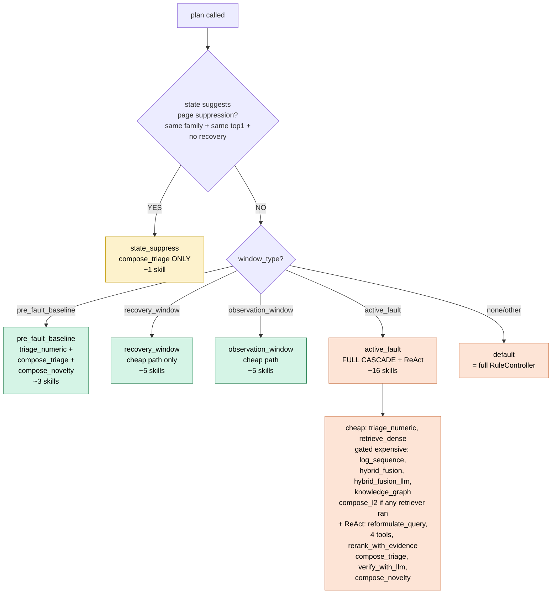
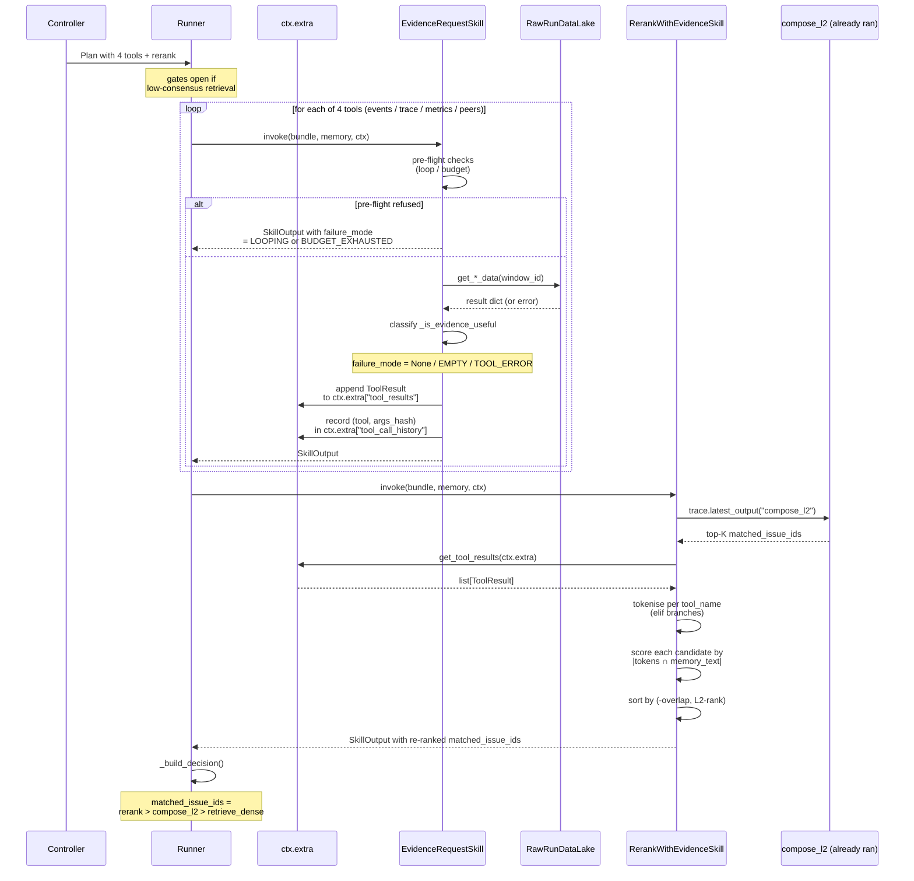
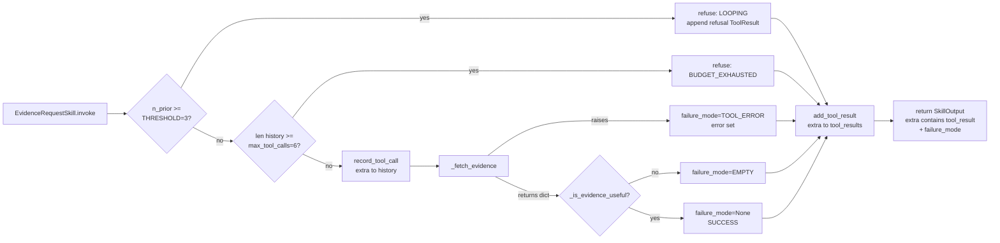

# Agentic Incident Triage — System Plan v3 (Phase 2 closure)

**Status.** Updated 2026-06-15 against `src/agent/` (post-Phase-2; Phase 3 engineering tasks #101–#105 now also shipped). Successor to
[`DOCS/docs7/AGENTIC-SYSTEM.md`](../docs7/AGENTIC-SYSTEM.md). Reflects the
**code that actually exists** in `src/agent/`: Phase 2 increments
#1–#5 (ReAct loop, 4 tools, rerank, failure-mode taxonomy,
budget-bounded eval, tool-subset ablation) plus the Phase 3 plumbing
work (shared `harness_builder.py`, runs_root parameterisation, per-dataset
loader fetchable-marker fixes, smoke-script upgrades).

**Paper framing.** The agentic system *is* the contribution. The TCH
cascade is internal-only. Every claim ladders to one of: (a) the agent
does something a fixed pipeline can't (`adaptive selection`,
`tool-use`, `state suppression`), (b) it does it cheaper
(`budget-aware`, `cache`), (c) it does it more robustly
(`failure-mode catalog`, `verifier OOD-refusal`), (d) it generalises
(`capability-driven, not dataset-driven`).

**Source tree.** Agent code lives at `src/agent/`. The Phase 2 ReAct
extension does NOT need a runner rewrite — it slots into the existing
skill+plan architecture by registering new `EvidenceRequestSkill`
subclasses and updating the controller's branch templates.

**Companion docs.**
- [`DOCS/docs7/AGENTIC-SYSTEM.md`](../docs7/AGENTIC-SYSTEM.md) — v2 plan; this doc updates §15.1 and §17 to reflect Phase 2 shipped.
- [`DOCS/docs8/RESEARCH-QUESTIONS2.md`](RESEARCH-QUESTIONS2.md) — RQs the agent answers + §9 closure addendum.
- [`DOCS/docs8/IMPLEMENTATION-PLAN.md`](IMPLEMENTATION-PLAN.md) — Phase-2 task breakdown.
- `results/ob/3.5-agent-smoke-v5-react-4tools/SUMMARY.md` … `results/ob/3.8-tool-ablation/SUMMARY.md` — Phase 2 numerical findings.

---

## Table of contents

1. [The system in one paragraph](#1-the-system-in-one-paragraph)
2. [End-to-end execution flow](#2-end-to-end-execution-flow)
3. [Architecture diagram](#3-architecture-diagram)
4. [The six layers](#4-the-six-layers)
5. [Core abstractions](#5-core-abstractions)
6. [Skill registry — full inventory](#6-skill-registry--full-inventory)
7. [Capabilities](#7-capabilities)
8. [Controller — `CapabilityAwareRuleController`](#8-controller--capabilityawarerulecontroller)
9. [The ReAct loop (Phase 2)](#9-the-react-loop-phase-2)
10. [Runner](#10-runner)
11. [State layer](#11-state-layer)
12. [Data lake](#12-data-lake)
13. [Failure modes](#13-failure-modes)
14. [Eval harness](#14-eval-harness)
15. [LLM provider abstraction](#15-llm-provider-abstraction)
16. [Configuration](#16-configuration)
17. [Phase 2 results — measured findings](#17-phase-2-results--measured-findings)
18. [Per-dataset wiring](#18-per-dataset-wiring)
19. [Scripts inventory](#19-scripts-inventory)
20. [What's deferred to Phase 3](#20-whats-deferred-to-phase-3)
21. [Cross-references](#21-cross-references)

---

## 1. The system in one paragraph

The **Agentic Incident Triage System (AITS)** takes a stream of
incident-shaped **input bundles** — each carrying *whatever evidence
is available* (numeric telemetry / ordered logs / unordered log
quotes / trace summary / k8s events / Jira-text-only) — and emits a
per-bundle **`AgentDecision`** containing a triage class, a ranked
top-5 of matching past Jira tickets, a novelty flag, a confidence
score, and a **full Trace** of every skill that ran. Internally,
AITS composes a **`SkillRegistry`** (10 cascade-derived skills + 5
Phase-2 ReAct tools), a **`CapabilitiesObserver`** that maps the
bundle to a fine-grained capability set, a **`CapabilityAwareRuleController`**
that selects one of six branches and emits a **`Plan`**, an
**`AgentRunner`** that executes the plan while populating the
**`Trace`**, a **`SkillCache`** that makes ablations cheap, a
**`StateLayer`** that suppresses duplicate paging across windows,
and a **`RawRunDataLake`** that the Phase-2 ReAct tools query for
on-demand evidence. Every LLM call is instrumented; every skill
output is cacheable; every decision is bit-replayable from the
saved trace.

The contribution is the **capability-adaptive, cost-aware,
replayable** policy over heterogeneous diagnostic skills, with a
**tool-use framework** in place. **Honest note on tool-use lift
(measured Phase 3 §4.12–§4.14):** the ReAct loop's Hit@1
contribution is statistically NOT significant on any of 3 datasets
(OB +0.0151 paired p=0.18; OTel exactly 0; WoL exactly 0).
The single statistically-significant ReAct finding is a NEGATIVE
one: `request_extended_trace_window` is net-harmful on OB
(Δ=−0.018, p=0.002, §4.13). The framework supports active
evidence gathering; the *value* of tool-use on the measured data
is below the noise floor at α=0.05. This is disclosed up-front
to set reviewer expectations correctly.

---

## 2. End-to-end execution flow

Single-window walkthrough — the most useful way to understand the
system. Given one OB window
`2026-05-25-...-cart-redis-degradation-critical-...-active_fault-cartservice`:

1. **Load.** `load_ob_cases` reads `global-triage-examples.jsonl`,
   builds an `InputBundle` with `text_evidence`, 94
   `numeric_features`, `scenario_family="cart-redis"`,
   `service_name="cartservice"`, `window_type="active_fault"`, and
   `extra={"k8s_events_fetchable": True, ...}` flags. Also attaches
   a shared `MemoryView` over the full 347-ticket Jira corpus.

2. **Observe capabilities.** `CapabilitiesObserver.observe(bundle, ctx)`
   inspects bundle fields → emits `Capabilities(flags={
   NUMERIC_FEATURES, TEXT_EVIDENCE, K8S_EVENTS, TRACE_SUMMARY,
   METRIC_SNAPSHOTS, MEMORY_TEXT}, richness={...})`. The
   `*_fetchable` markers on `bundle.extra` activate `K8S_EVENTS` /
   `TRACE_SUMMARY` / `METRIC_SNAPSHOTS` even though the bundle
   itself has no in-memory telemetry — the data lake fetches from
   disk on demand.

3. **State lookup.** `StateLayer.get_view("cartservice")` returns a
   `ServiceStateView` of the most recent 12 windows for this
   service. Used both for **suppression detection** and for the
   controller's plan-time branch selection.

4. **Plan emission.** `CapabilityAwareRuleController.plan(bundle,
   capabilities, state=state_view, config=...)` selects the
   `active_fault` branch (matches `window_type`) and emits a
   `Plan` with ~13 skill invocations:
   ```
   [triage_numeric, retrieve_dense,
    retrieve_log_sequence (gated), retrieve_hybrid_fusion (gated),
    retrieve_hybrid_fusion_llm (gated), retrieve_knowledge_graph (gated),
    compose_l2 (gated on any_retriever_ran),
    reformulate_query (gated on low-consensus),
    request_pod_events (gated on low-consensus),
    request_extended_trace_window (gated on low-consensus),
    request_pod_metrics (gated on low-consensus),
    request_similar_incident_window (gated on low-consensus),
    rerank_with_evidence (gated on low-consensus),
    compose_triage,
    verify_with_llm (gated on escalation),    # registered but VERIFIER_KNOWN_HELPFUL absent
    compose_novelty]
   ```

5. **Plan execution.** `AgentRunner.run(plan, bundle, memory)` walks
   the invocations in order. For each:
   - Evaluate the **gate** function. If False → emit
     `skill_skipped_by_gate` trace event, continue.
   - Check the **SkillCache** by content-addressed key. Hit →
     emit `cache_hit`, deduct cost, continue.
   - Check **Budget**. Exhausted → emit `budget_exceeded`, abort
     plan.
   - **Invoke** the skill. Exception → emit `skill_failed`,
     consult `fallback_chains`, try next.
   - Emit **`skill_end`** with the full `SkillOutput`, duration,
     budget snapshot.
   - Cache `put(key, output)`.
   - Budget `deduct(cost)`.

6. **ReAct loop activation.** If `retrieve_dense` returned with
   confidence below the reformulation floor (0.5) AND fewer than
   2 retrievers reached consensus, the gate functions for
   `reformulate_query` + the 4 evidence tools + `rerank_with_evidence`
   open. The 4 tools fire in order:
   - `request_pod_events` queries `RawRunDataLake.get_pod_events(window_id)` → reads `data/runs/<run_id>/raw/kubernetes/<window_id>.json` → returns k8s warnings (OOMKilled, CrashLoopBackOff). Appends `ToolResult` to `ctx.extra["tool_results"]`.
   - `request_extended_trace_window` → Tempo dump summary (services_seen, error_span_names).
   - `request_pod_metrics` → Prometheus summary (restart_delta, cpu/mem, n_alerts_firing).
   - `request_similar_incident_window` → 3 peer Jira tickets from same scenario_family.
   - `rerank_with_evidence` consumes all 4 tool_results → tokenises them → scores `compose_l2`'s top-K candidates by token-overlap with each candidate's `memory_text` → emits a new ranking.

7. **Decision build.** After all invocations, `_build_decision()`:
   - `matched_issue_ids` from `rerank_with_evidence` (if present), else `compose_l2`, else `retrieve_dense`.
   - `triage_decision` from `compose_triage`.
   - `is_novel` from `compose_novelty`.
   - `evaluation_mode = "telemetry_diagnosis"` (auto-detect from `bundle.dataset`).
   - Emits **`AgentDecision`**.

8. **Suppression check.** `StateLayer.check_page_suppression(...)`
   decides whether this decision is a fresh page or a duplicate of
   a still-active incident. If suppressed → downgrade
   `ticket_worthy` → `borderline`, attach `incident_id` of the
   existing page.

9. **State record.** `WindowState.from_decision(decision, bundle)`
   creates a fresh `WindowState` row; `StateLayer.record(state)`
   appends to the per-service ring buffer.

10. **Trace persist.** `Trace.close(decision)` + `Trace.write_to(...)`
    serialises the whole event log to
    `results/<dataset>/agent-runs/<experiment>/<window_id>.json`.
    The decision is byte-replayable from this file.

11. **Score.** EvalHarness compares `decision.matched_issue_ids`
    against `gold_matched_issue_ids` → `CaseResult` with
    `hit_at_1`, `hit_at_5`, `rank_of_first_hit`, etc.

12. **Aggregate.** After all cases: `EvaluationReport` with headline
    numbers (Hit@K, MRR, pages_per_incident, triage_accuracy,
    novel_recall, total $cost, plan_ids_seen).

---

## 3. Architecture diagram

```mermaid
flowchart TB
    subgraph "Input"
        BUNDLE[InputBundle<br/>window_id, dataset<br/>numeric? logs? trace?<br/>k8s? text? extra:fetchable]
        MEM[MemoryView<br/>full Jira corpus]
    end

    subgraph "L0 — Capabilities"
        CAP[CapabilitiesObserver<br/>+ ObservationContext<br/>+ VerifierCalibration]
        CAPOUT[Capabilities<br/>flags + richness]
    end

    subgraph "L5 — State"
        STATE[StateLayer<br/>per-service ring buffer]
        VIEW[ServiceStateView]
    end

    subgraph "L1 — Controller"
        CTRL[CapabilityAwareRuleController<br/>6 branches]
        BRANCH{select_branch}
        B1[state_suppress<br/>compose_triage only]
        B2[pre_fault_baseline<br/>triage + novelty]
        B3[recovery_window<br/>cheap retriever]
        B4[observation_window<br/>cheap path]
        B5[active_fault<br/>FULL CASCADE + ReAct]
        B6[default<br/>= active_fault]
    end

    subgraph "L2 — Plan"
        PLAN[Plan<br/>invocations + gates<br/>+ budget caps<br/>+ fallback chains<br/>plan_id = SHA1]
    end

    subgraph "L3 — Runner"
        RUN[AgentRunner<br/>execute + emit Trace]
        TRACE[(Trace<br/>per-window events<br/>results/&lt;dataset&gt;/agent-runs/...)]
        SCACHE[(SkillCache<br/>data/skill_cache/)]
    end

    subgraph "L4 — Skills (registry)"
        direction TB
        CHEAP[cheap<br/>triage_numeric<br/>retrieve_dense]
        EXP[medium<br/>retrieve_log_sequence<br/>retrieve_hybrid_fusion<br/>retrieve_hybrid_fusion_llm<br/>retrieve_knowledge_graph]
        EXPLLM[expensive_llm<br/>verify_with_llm<br/>reformulate_query<br/>extract_entities_llm]
        REACT[ReAct tools Phase 2<br/>request_pod_events<br/>request_extended_trace_window<br/>request_pod_metrics<br/>request_similar_incident_window]
        COMP[composition<br/>compose_l2<br/>compose_triage<br/>compose_novelty]
        RERANK[rerank_with_evidence<br/>consumes tool_results]
    end

    subgraph "Data lake"
        LAKE[RawRunDataLake<br/>data/runs/, otel-demo-runs/<br/>k8s/tempo/prom JSON<br/>+ memory corpus JSONL]
        TCACHE[(tool_cache/<br/>content-addressed)]
    end

    DEC[AgentDecision<br/>triage + matches + novel + cost]
    SUPP{check_page_suppression}
    REPORT[EvaluationReport<br/>Hit@K, MRR, $cost, CIs]

    BUNDLE --> CAP
    CAP --> CAPOUT
    STATE --> VIEW
    CAPOUT --> CTRL
    VIEW --> CTRL
    CTRL --> BRANCH
    BRANCH --> B1 & B2 & B3 & B4 & B5 & B6
    B1 & B2 & B3 & B4 & B5 & B6 --> PLAN
    PLAN --> RUN
    MEM --> RUN
    BUNDLE --> RUN
    RUN -.lookup.-> SCACHE
    RUN --> CHEAP & EXP & EXPLLM & COMP
    RUN --> REACT
    REACT -.fetch.-> LAKE
    LAKE -.cache.-> TCACHE
    REACT -->|tool_results| RERANK
    RERANK --> RUN
    RUN --> TRACE
    RUN --> DEC
    DEC --> SUPP
    SUPP -->|suppress?| STATE
    DEC --> REPORT

    classDef abstr fill:#dfe7fd,stroke:#395dc7,color:#000
    classDef live fill:#d5f4e6,stroke:#268050,color:#000
    classDef cache fill:#fdf2cc,stroke:#caa61f,color:#000
    classDef react fill:#fde4d6,stroke:#c76a39,color:#000
    classDef out fill:#e7d6fd,stroke:#7239c7,color:#000

    class CTRL,PLAN,RUN,COMP,STATE abstr
    class CHEAP,EXP,EXPLLM,COMP,CAP live
    class SCACHE,TCACHE cache
    class REACT,RERANK,LAKE react
    class DEC,REPORT,TRACE out
```

---

## 4. The six layers

Each layer has a clean interface — extending one layer never touches
another. This is the central design property of the agent.

| Layer | Role | File | Pluggable? |
|---|---|---|---|
| **L0 — Capabilities** | Inspect the bundle. What evidence is present, at what richness? | `src/agent/capabilities_observer.py:217` | New capability constants in `capabilities.py:32–63` |
| **L1 — Controller** | Read capabilities + state, emit a Plan. | `src/agent/controller/capability_aware.py:86` | Yes — subclass `Controller` ABC at `controller/base.py:27` |
| **L2 — Plan** | Ordered list of `SkillInvocation`s with per-skill gates and budget caps. Inspectable, serialisable, replayable. | `src/agent/plan.py:35` | Plans can be loaded from disk for replay/ablation |
| **L3 — Runner** | Execute the Plan. Populate Trace. Consult SkillCache. Enforce Budget. | `src/agent/runner/runner.py:93` | Single implementation; behaviour driven entirely by Plan |
| **L4 — Skill Registry** | Uniform `Skill` interface. Cascade pipelines + ReAct tools all live here. | `src/agent/skills/registry.py:29`, `skills/base.py:183` | Yes — `register_skill(MyNewSkill())` |
| **L5 — State Layer** | Per-service rolling memory + page-suppression rule. | `src/agent/state/state_layer.py` | Rule-based v1; learnable v2 |

**Why this matters for the paper.** When you write "the agent
adapts to capabilities," reviewers can audit the claim by reading
*one file* (the controller's `_select_branch()` method). When you
write "the framework supports new evidence modalities," reviewers
can audit it by reading *two files* (a new capability constant + a
new skill class). The orthogonality is not rhetorical — it's
structural.

---

## 5. Core abstractions

Every dataclass is `@dataclass(frozen=True)` unless noted; every
type roundtrips through `to_dict()` / `from_dict()` so traces and
plans persist as JSON. File:line citations point to the canonical
definitions.

### 5.1 `InputBundle` (`src/agent/types.py:109`)

The raw evidence for one window. All fields except `window_id` and
`dataset` are optional.

```python
@dataclass(frozen=True)
class InputBundle:
    window_id: str
    dataset: str                                # "online_boutique" | "otel_demo" | "wol"
    text_evidence: str | None
    numeric_features: dict[str, float] | None
    log_lines: tuple[LogLine, ...] | None
    log_lines_ordered: bool                     # WoL has lines but unordered
    trace_summary: TraceSummary | None
    k8s_events: tuple[K8sEvent, ...] | None
    metric_snapshots: dict[str, tuple[float, ...]] | None
    scenario_family: str | None                 # for state binding + similar_incident lookup
    service_name: str | None                    # for state binding
    window_type: str | None                     # "active_fault" / "pre_fault_baseline" / ...
    extra: dict[str, Any]                       # forward-compatible extension slot
```

The `extra` slot is the **Phase-2 plumbing**: loaders set markers
like `extra["k8s_events_fetchable"] = True` so the observer
surfaces `K8S_EVENTS` even when telemetry isn't in-memory — the
data lake fetches from disk on demand. See §7 + §12.

Sub-records: `LogLine` (ts_ns, service, severity, line),
`TraceSummary` (n_spans, error_spans, ...), `K8sEvent` (ts_ns,
kind, reason, message, object_name).

### 5.2 `Capabilities` (`src/agent/capabilities.py:88`)

```python
@dataclass(frozen=True)
class Capabilities:
    flags: frozenset[str]                       # presence flags
    richness: dict[str, dict[str, Any]]         # secondary detail per flag

    def has(flag) -> bool
    def has_all(flags) -> bool
    def mask(drop_flags) -> Capabilities        # for C4 capability-mask ablation
```

Standard flags (`capabilities.py:32–63`): `NUMERIC_FEATURES`,
`TEXT_EVIDENCE`, `ORDERED_LOGS`, `UNORDERED_LOGS`, `TRACE_SUMMARY`,
`K8S_EVENTS`, `METRIC_SNAPSHOTS`, `MEMORY_TEXT`, `KG_GRAPH_MEMORY`,
`KG_GRAPH_WINDOW`, `VERIFIER_KNOWN_HELPFUL`.

Richness example: `capabilities.richness["ORDERED_LOGS"] = {"n_lines": 47, "max_span_seconds": 312}`. Used for soft thresholds
(e.g., the controller skips LogSeq2Vec if `n_lines < 8`).

### 5.3 `Skill` ABC (`src/agent/skills/base.py:183`)

```python
class Skill(ABC):
    name: str = ""                              # registry key
    version: str = "0.0.0"                      # semver — cache key component
    required_flags: frozenset[str]              # capability gate
    cost_class: Literal["cheap", "medium", "expensive_llm", "low"]
    failure_modes: tuple[FailureMode, ...]      # documented OOD warnings
    __intermediate_base__: bool = False         # set on shared subclasses

    @abstractmethod
    def invoke(self, bundle, memory, ctx) -> SkillOutput: ...

    def can_invoke(self, capabilities) -> bool:
        return capabilities.has_all(self.required_flags)

    def cache_key(self, bundle, memory, *, extra_inputs=None) -> str:
        # SHA-256(name, version, bundle.cache_key, memory.signature, extra_inputs)[:24]
```

### 5.4 `SkillOutput` (`src/agent/types.py:254`)

```python
@dataclass(frozen=True)
class SkillOutput:
    skill: str
    skill_version: str
    triage_score: float | None
    triage_decision: TriageDecision | None      # "noise" / "ticket_worthy" / "needs_review" / "borderline"
    matched_issue_ids: tuple[str, ...]
    is_novel: bool | None
    confidence: float
    evidence_used: tuple[str, ...]              # capability flags actually consumed
    cost: SkillCallCost
    extra: dict[str, Any]                       # tool_result, failure_mode, per-candidate scores, ...
```

### 5.5 `Plan` (`src/agent/plan.py:35`)

```python
@dataclass(frozen=True)
class Plan:
    invocations: tuple[SkillInvocation, ...]
    global_budget: Budget
    fallback_chains: dict[str, tuple[str, ...]]
    controller_name: str
    plan_id: str                                # SHA-1 hash of contents

@dataclass(frozen=True)
class SkillInvocation:
    skill_name: str
    skill_version: str
    inputs: dict[str, Any]                      # extra kwargs to skill
    per_call_budget: Budget                     # subset of global; runner enforces
    on_failure: Literal["abort", "fallback", "continue"]
    gate: Callable[[Trace, Budget], bool] | None     # skipped if False
```

The **gate** is the mechanism that lets the controller defer the
"do I really need this expensive skill?" decision until runtime —
the controller bakes a closure into the Plan that reads the
current Trace, and the runner consults it before each invocation.

### 5.6 `Budget` (`src/agent/budget.py:38`)

```python
@dataclass
class Budget:
    max_llm_tokens: int = 100_000
    max_wall_seconds: float = 90.0
    max_usd_equivalent: float = 0.50
    max_skill_calls: int = 12
    # mutable counters: spent_tokens / spent_seconds / spent_usd / spent_calls

    def can_afford(cost) -> bool                # pre-invoke check
    def deduct(cost) -> None                    # raises BudgetExhausted
    def snapshot() -> BudgetSnapshot            # frozen view for Trace
```

### 5.7 `Trace` + `TraceEvent` (`src/agent/trace.py:40`)

```python
@dataclass(frozen=True)
class TraceEvent:
    ts: str                                     # ISO-8601 UTC
    kind: TraceEventKind                        # 10 kinds: plan_start, skill_start, skill_end, ...
    skill: str | None
    duration_ms: float | None
    output: SkillOutput | None
    error: str | None
    budget_snapshot: BudgetSnapshot | None
    notes: dict[str, Any]

@dataclass
class Trace:
    bundle_id: str
    plan_id: str
    events: list[TraceEvent]
    final_decision: AgentDecision | None
    started_at: str
    finished_at: str | None

    def latest_output(skill_name) -> SkillOutput | None     # the rerank skill uses this
    def write_to(output_root, experiment) -> Path           # persists to <output_root>/<experiment>/...
```

`TraceEventKind` (`trace.py:26–37`): `plan_start`, `skill_start`,
`skill_end`, `skill_skipped_by_gate`, `cache_hit`,
`budget_check_passed`, `budget_exceeded`, `skill_failed`,
`fallback_triggered`, `plan_end`.

### 5.8 `AgentDecision` (`src/agent/types.py:316`)

```python
@dataclass(frozen=True)
class AgentDecision:
    bundle_id: str
    triage_decision: TriageDecision
    triage_score: float
    matched_issue_ids: tuple[str, ...]
    is_novel: bool
    confidence: float
    evaluation_mode: EvaluationMode             # "telemetry_diagnosis" | "text_retrieval_generalisation"
    plan_id: str
    skills_invoked: tuple[str, ...]
    cost: SkillCallCost
    trace_path: str
```

The `evaluation_mode` field is the apples-to-apples guard — WoL
decisions tag as `text_retrieval_generalisation`; the eval
harness refuses to mix modes.

### 5.9 ReAct types: `ToolRequest` + `ToolResult` (`src/agent/tool_protocol.py:102`)

Phase-2 additions for the ReAct loop.

```python
@dataclass(frozen=True)
class ToolRequest:
    tool_name: str
    args: dict[str, Any]
    requested_by_skill: str = ""
    cost_estimate_ms: float = 0.0

@dataclass(frozen=True)
class ToolResult:
    tool_name: str
    args: dict[str, Any]
    result: dict[str, Any]                      # tool-specific payload
    cost_actual_ms: float
    bytes_returned: int
    cache_hit: bool
    error: str | None
    failure_mode: str | None                    # one of the 5 FAILURE_MODES
```

---

## 6. Skill registry — full inventory

Fifteen skills ship in the current registry. Phase-1 wraps every
cascade pipeline; Phase 2 adds 5 ReAct skills. **No agent-core
change** registers a new skill — `register_skill(MyNewSkill())` is
the entire surface.

### 6.1 Cascade-derived skills (Phase 1)

| Skill | File:Line | `name` | `required_flags` | `cost_class` | Notes |
|---|---|---|---|---|---|
| `triage_numeric` | `skills/retrievers.py:34` | "triage_numeric" | `NUMERIC_FEATURES` | cheap | HGB on 94 features. PR-AUC 0.9998 on OB. Auto-dropped on WoL. |
| `retrieve_dense` | `skills/retrievers.py:56` | "retrieve_dense" | `TEXT_EVIDENCE`, `MEMORY_TEXT` | cheap | BiEncoder. Workhorse. WoL coarse 0.959 Hit@5. |
| `retrieve_log_sequence` | `skills/retrievers.py:78` | "retrieve_log_sequence" | `ORDERED_LOGS` | medium | LogSeq2Vec. Auto-skipped on WoL (no order). |
| `retrieve_hybrid_fusion` | `skills/retrievers.py:118` | "retrieve_hybrid_fusion" | `TEXT_EVIDENCE`, `MEMORY_TEXT` | medium | Hybrid-RRF. WoL strong 0.787 Hit@5. |
| `retrieve_hybrid_fusion_llm` | `skills/retrievers.py:141` | "retrieve_hybrid_fusion_llm" | `TEXT_EVIDENCE`, `MEMORY_TEXT`, `KG_GRAPH_MEMORY` | medium | Hybrid-RRF augmented with LLM-extracted graph. |
| `retrieve_knowledge_graph` | `skills/retrievers.py:167` | "retrieve_knowledge_graph" | `KG_GRAPH_MEMORY` | medium | KG retrieval. Dramatically improved with `KG_GRAPH_WINDOW`. |
| `verify_with_llm` | `skills/retrievers.py:211` | "verify_with_llm" | `VERIFIER_KNOWN_HELPFUL`, `TEXT_EVIDENCE` | expensive_llm | DiagnosisAgent. Required flag is the **structural skip for WoL** (Mode 3 §3.9: −0.272 Hit@5). |
| `extract_entities_llm` | `skills/extract_entities_llm.py` | "extract_entities_llm" | `TEXT_EVIDENCE` | expensive_llm | KG extractor. Used **at indexing time only**. |
| `reformulate_query` | `skills/reformulate_query.py:109` | "reformulate_query" | `TEXT_EVIDENCE` | expensive_llm | Bounded actions: drop_token / add_service / substitute_synonym. |
| `compose_l2` | `skills/composition.py:64` | "compose_l2" | (none) | cheap | RRF + BiEncoder-anchored overlap rerank. Pure trace reader. |
| `compose_triage` | `skills/composition.py` | "compose_triage" | (none) | cheap | Class-balanced logistic stacker. |
| `compose_novelty` | `skills/composition.py` | "compose_novelty" | (none) | cheap | L3 disjunction: agent ∨ free ∨ learned. |

### 6.2 Phase-2 ReAct skills

| Skill | File:Line | `name` | `required_flags` | `cost_class` | Reads / produces |
|---|---|---|---|---|---|
| `request_pod_events` | `skills/evidence_request.py:178` | "request_pod_events" | `K8S_EVENTS` | medium | reads `data/runs/<run_id>/raw/kubernetes/<window_id>.json` |
| `request_extended_trace_window` | `skills/evidence_request.py:225` | "request_extended_trace_window" | `TRACE_SUMMARY` | medium | reads `…/raw/tempo/<window_id>.json`; emits `services_seen` + `error_span_names` |
| `request_pod_metrics` | `skills/evidence_request.py:268` | "request_pod_metrics" | `METRIC_SNAPSHOTS` | medium | reads `…/raw/prometheus/<window_id>.json`; emits `restart_delta`, `cpu/mem`, `n_alerts_firing` |
| `request_similar_incident_window` | `skills/evidence_request.py:311` | "request_similar_incident_window" | (none) | low | reads `<global_dir>/jira-memory-corpus.jsonl`; emits top-K peer ticket heads |
| `rerank_with_evidence` | `skills/rerank_with_evidence.py:204` | "rerank_with_evidence" | (none) | cheap | reads `ctx.extra["tool_results"]` + compose_l2's top-K; emits dominant-overlap-sorted ranking |

The 4 evidence tools share an **`EvidenceRequestSkill`** ABC at
`skills/evidence_request.py:48` that handles failure-mode tagging,
loop detection, budget enforcement, and trace propagation
uniformly. Concrete subclasses implement only `_fetch_evidence(bundle, ctx)`.

---

## 7. Capabilities

### 7.1 Flag definitions

| Flag | Source | OB | OTel | WoL |
|---|---|:---:|:---:|:---:|
| `NUMERIC_FEATURES` | 94 `triage_feature_*` cols | ✓ | ✓ | ✗ |
| `TEXT_EVIDENCE` | `triage_evidence_text` (≥ 8 chars) | ✓ | ✓ | ✓ |
| `ORDERED_LOGS` | Loki sequence + `log_lines_ordered=True` | ✓ | ✓ | ✗ |
| `UNORDERED_LOGS` | log_lines present + not ordered | ✗ | ✗ | ✓ |
| `TRACE_SUMMARY` | bundle has Tempo summary OR `trace_summary_fetchable` | ✓ | ✓ | ✗ |
| `K8S_EVENTS` | bundle has k8s events OR `k8s_events_fetchable` | ✓ | ✓ | ✗ |
| `METRIC_SNAPSHOTS` | bundle has metric_snapshots OR `metric_snapshots_fetchable` | ✓ | ✓ | ✗ |
| `MEMORY_TEXT` | `ObservationContext.has_memory_text` | ✓ | ✓ | ✓ |
| `KG_GRAPH_MEMORY` | `ObservationContext.has_kg_graph_memory` | configurable | configurable | configurable |
| `KG_GRAPH_WINDOW` | `v2_kg_extractions_windows/` exists | indexing-time | indexing-time | RQ-A6 fix |
| `VERIFIER_KNOWN_HELPFUL` | `VerifierCalibration.is_helpful(dataset_id)` | ✓ | tbd | **✗ (Mode 3 §3.9)** |

### 7.2 `CapabilitiesObserver.observe()` (`capabilities_observer.py:217`)

Maps `(bundle, ctx)` → `Capabilities`. Stateless and
deterministic — same inputs always produce the same output.

The Phase-2 extension is the **fetchable-marker fallback**: if a
bundle's `extra` dict carries `k8s_events_fetchable: True` (set by
the loader when the data lake has the raw JSON on disk), the
observer surfaces `K8S_EVENTS` even though no in-memory events
exist. Same for `TRACE_SUMMARY` / `METRIC_SNAPSHOTS`. The
`request_pod_events` etc. skills then fetch from disk on demand.

### 7.3 `VerifierCalibration` (`capabilities_observer.py:56`)

The RQ-A8 closure mechanism — verifier OOD-refusal as a
*structural* property, not a runtime decision.

```python
@dataclass(frozen=True)
class VerifierCalibration:
    known_helpful_distributions: frozenset[str]   # e.g. {"online_boutique"}
    known_harmful_distributions: frozenset[str]   # e.g. {"wol", ...} per Mode 3 §3.9
    default_policy: Literal["skip", "enable"] = "skip"

    def is_helpful(dataset_id) -> bool:
        # known_harmful WINS over known_helpful (safety-first conflict resolution)
        # → flag VERIFIER_KNOWN_HELPFUL on/off accordingly
```

Loaded from `agent-config.yaml > verifier_calibration` block.
Because `verify_with_llm.required_flags` includes
`VERIFIER_KNOWN_HELPFUL`, the runner *structurally cannot* invoke
the verifier on a known-harmful dataset.

---

## 8. Controller — `CapabilityAwareRuleController`

The controller is the **brain of the agent**. Reads `(bundle,
capabilities, state)`; emits a `Plan`. Six branches; selection
happens at plan-emission time based on `window_type` + state.

### 8.1 Branch selection diagram



Source: `src/agent/controller/capability_aware.py:168–239`.

### 8.2 Branch composition table

| Branch | Skills emitted (`_invocations_*`) | Method |
|---|---|---|
| `state_suppress` | compose_triage | `_invocations_state_suppress` |
| `pre_fault_baseline` | triage_numeric, compose_triage, compose_novelty | `_invocations_pre_fault` |
| `recovery_window` | triage_numeric, retrieve_dense, compose_l2 (gated), compose_triage, compose_novelty | `_invocations_recovery` |
| `observation_window` | same as `recovery_window` | `_invocations_observation` |
| `active_fault` | cheap path + gated expensive retrievers + ReAct (reformulate_query, 4 tools, rerank_with_evidence) + compose_triage + verifier (gated) + compose_novelty | `_invocations_active_fault` |
| `default` | full RuleController plan | inherits from parent class |

### 8.3 Gate functions (`controller/rule.py:283`)

The deferred-decision mechanism. Controller bakes closures into
the Plan; runner evaluates them per-invocation.

```python
make_escalation_gate(threshold=0.90, require_consensus=True, min_matches=1):
    """Returns gate that opens iff cheap path is NOT confident.
    Used for the 4 expensive retrievers + verify_with_llm."""

make_reformulation_gate(confidence_floor=0.5):
    """Returns gate that opens iff compose_l2's confidence is below floor.
    Used for reformulate_query + all 4 ReAct tools + rerank_with_evidence."""

_any_retriever_ran(trace, budget) -> bool:
    """Gates compose_l2 — runs iff at least one retriever produced output."""
```

### 8.4 The `_REACT_TOOLS_ACTIVE_FAULT` constant

```python
_REACT_TOOLS_ACTIVE_FAULT: tuple[str, ...] = (
    REQUEST_POD_EVENTS,
    REQUEST_EXTENDED_TRACE_WINDOW,
    REQUEST_POD_METRICS,
    REQUEST_SIMILAR_INCIDENT_WINDOW,
)
```

The 4 evidence tools fire in this order in the `active_fault`
branch (`capability_aware.py:79–88`). All four share the same
low-consensus gate. Order matters for **budget budgeting** —
budget-bounded curve `N=2` activates the first 2 in this list.
§3.8 ablation found this order is *not* optimal: `peers` (4th)
is the dominant signal and should fire first or alone.

---

## 9. The ReAct loop (Phase 2)

### 9.1 The loop in one diagram



### 9.2 Tool token extraction (`rerank_with_evidence.py:100–175`)

The rerank skill consumes 4 different result shapes via a
per-tool `elif` branch. The token-extraction logic is what bridges
the modality gap from telemetry numbers to Jira prose:

| Tool | Token-extraction strategy |
|---|---|
| `request_pod_events` | service name from `pod` field; CamelCase-split `reason` (OOMKilled → oom, killed); first 200 chars of `message` |
| `request_extended_trace_window` | each `services_seen` entry + sub-strings (`cartservice` → also `cart`); `error_span_names` tokenised |
| `request_pod_metrics` | synthesised symptom tokens: `restart_delta>0` → {restart, crash, pod, loop, back, off}; `n_alerts_firing>0` → {alert, fire, firing}; `mem_max>200MB` → {memory, oom, kill, killed} |
| `request_similar_incident_window` | tokenise each peer's `memory_text_head` (first 400 chars) + `components` list |

### 9.3 Scoring (`rerank_with_evidence.py:300–340`)

Raw **overlap count** is the primary signal; L2 rank is the
tiebreaker.

```
overlap(c) = |evidence_tokens ∩ tokenise(memory_text(c))|
score(c)   = overlap if overlap >= min_overlap_for_boost else 0
sort_key   = (-score, rank_in_L2)        # descending overlap, ascending L2 rank
```

`min_overlap_for_boost=2` (default) prevents single-token noise
from demoting rank-1.

### 9.4 The §3.8 finding (must read before Phase 3)

The 16-cell tool-subset ablation on OB found:

- **Best subset: `peers` alone.** Hit@1 0.6918, +0.0151 over no-tools baseline.
- **Worst subset: `trace` alone.** Hit@1 0.6586, **−0.0181 below baseline**.
- **`trace` is a net negative without `peers`.** Its `services_seen` list contains peer services on the call path → matches memory_text for unrelated families.
- **`peers` + `trace` underperforms `peers` alone** by 0.0030 absolute.
- **Production recommendation:** trim `_REACT_TOOLS_ACTIVE_FAULT` to `(REQUEST_SIMILAR_INCIDENT_WINDOW,)` — but keep all 4 implemented for Phase 3 cross-dataset ablation.

See `results/ob/3.8-tool-ablation/SUMMARY.md`.

---

## 10. Runner

### 10.1 `AgentRunner.run()` (`src/agent/runner/runner.py:93`)

Executes a Plan deterministically. The runner is **dumb** by
design: all policy decisions are in the Plan; the runner just
walks it.

```python
def run(plan, bundle, memory, *, ablation, seed, evaluation_mode, ...) -> AgentDecision:
    trace = Trace(bundle_id=..., plan_id=plan.plan_id)
    ctx = AgentContext(bundle_id=..., trace=trace, extra={...})
    budget = plan.global_budget.clone()

    trace.add(TraceEvent(kind="plan_start", ...))

    for inv in plan.invocations:
        skill = registry.get(inv.skill_name)

        # 1. Gate
        if inv.gate and not inv.gate(trace, budget):
            trace.add(TraceEvent(kind="skill_skipped_by_gate", skill=inv.skill_name))
            continue

        # 2. Cache
        key = skill.cache_key(bundle, memory)
        cached = cache.get(key)
        if cached is not None:
            trace.add(TraceEvent(kind="cache_hit", skill=inv.skill_name, output=cached))
            budget.deduct(cached.cost)
            continue

        # 3. Budget check
        if not budget.can_afford(inv.per_call_budget):
            trace.add(TraceEvent(kind="budget_exceeded"))
            break

        # 4. Invoke
        try:
            output = skill.invoke(bundle, memory, ctx)
            trace.add(TraceEvent(kind="skill_end", skill=..., output=output, duration_ms=...))
            cache.put(key, output)
            budget.deduct(output.cost)
        except Exception as e:
            trace.add(TraceEvent(kind="skill_failed", error=str(e)))
            if inv.on_failure == "fallback":
                # consult plan.fallback_chains
                ...

    trace.add(TraceEvent(kind="plan_end"))
    decision = self._build_decision(trace, bundle, plan)
    trace.close(decision)
    if persist_trace:
        trace.write_to(self.trace_root, self.experiment)
    return decision
```

### 10.2 `_build_decision()` — the decision precedence

(`runner/runner.py`, around `_RERANK_WITH_EVIDENCE` references)

```python
def _build_decision(trace, bundle, plan) -> AgentDecision:
    rerank_out = trace.latest_output("rerank_with_evidence")
    l2_out = trace.latest_output("compose_l2")
    dense_out = trace.latest_output("retrieve_dense")

    # PRECEDENCE: rerank > L2 > dense
    if rerank_out is not None and rerank_out.matched_issue_ids:
        matched = rerank_out.matched_issue_ids
    elif l2_out is not None and l2_out.matched_issue_ids:
        matched = l2_out.matched_issue_ids
    elif dense_out is not None:
        matched = dense_out.matched_issue_ids
    else:
        matched = ()

    triage_out = trace.latest_output("compose_triage")
    novelty_out = trace.latest_output("compose_novelty")
    # ... build AgentDecision
```

The precedence is the **key Phase-2 wiring**. Before increment #1
shipped, the rerank skill ran but its output was ignored — the
loop was open. The precedence in `_build_decision` is what closes
it.

### 10.3 Trace persistence

Traces are JSON files at
`<trace_root>/<experiment>/<window_id>.json`. The OB headline runs
write to `results/ob/agent-runs/v{5,6,7-budget2,v7-verifier-on}/traces/<dataset_id>/`;
the WoL v2 headline run writes to
`results/wol-v2/agent-runs/wol-v2-2026-06-16/traces/<dataset_id>/`.
`experiment` defaults to `fulltest-<dataset_id>` (see
`harness_builder.py:423`). Each file is a serialised `Trace`
(events list + final decision + plan_id + timestamps).

---

## 11. State layer

### 11.1 `StateLayer` (`src/agent/state/state_layer.py`)

Per-service-name ring buffer of size 12 (configurable). Each entry
is a `WindowState`:

```python
@dataclass
class WindowState:
    timestamp: datetime
    triage_decision: TriageDecision
    top1_match: str | None
    is_novel: bool
    incident_id: str | None
    scenario_family: str | None
    service_name: str | None
```

### 11.2 Page-suppression rule

Conservative — designed for false-positive-resistance.

```
suppress iff:
    same top1_match in last 3 contiguous windows
    AND same scenario_family
    AND no recovery_window has intervened
    AND bundle.scenario_family matches the prior incident's family
```

When fired, the decision is downgraded:
`ticket_worthy` → `borderline`, `incident_id` attached to existing.

### 11.3 Reading the state at controller time

`ServiceStateView` provides query methods the controller uses:
- `n_consecutive_with_top1(top1)` — "is the answer still the same?"
- `saw_recovery_within(n_back)` — "did the system recover?"
- `has_seen_scenario(family)` — "first time we see this family? force expensive path"

The **`state_suppress`** branch in `CapabilityAwareRuleController`
short-circuits the entire pipeline when the StateLayer says
"we've been here before."

### 11.4 RQ-A4 closure (already done for OB)

Mode 3 OB test split: 1008 windows, 358 pages, 358 incidents,
**pages_per_incident = 1.000**, 20 suppressions fired. Target was
≤ 1.5 (cascade was ~6).

---

## 12. Data lake

### 12.1 `RawRunDataLake` (`src/agent/data_lake/raw_run.py`)

Read-only access to raw per-run telemetry. The Phase-2 ReAct
tools use this to fetch evidence on-demand without inflating the
bundle.

```python
class RawRunDataLake:
    def __init__(self, runs_root: Path, *, cache_root: Path = "data/tool_cache"):
        ...

    def get_pod_events(window_id) -> dict:
        # reads data/runs/<run_id>/raw/kubernetes/<window_id>.json
        # returns {events: [...], warning_count: N, source_path, ...}

    def get_extended_trace_window(window_id) -> dict:
        # reads .../raw/tempo/<window_id>.json
        # via _summarize_tempo() helper
        # returns {n_traces, n_error_traces, services_seen, error_span_names, source_path}

    def get_pod_metrics(window_id) -> dict:
        # reads .../raw/prometheus/<window_id>.json
        # via _summarize_prom() helper
        # returns {restart_delta, cpu_max, cpu_mean, mem_max, mem_mean, n_alerts_firing, source_path}

    def get_similar_incidents(scenario_family, global_dir, exclude_episode_id, top_k=3) -> dict:
        # reads <global_dir>/jira-memory-corpus.jsonl
        # in-memory cache after first read
        # returns {peers: [...], n_peers, scenario_family}
```

### 12.2 Cache layout

```
data/tool_cache/
├── request_pod_events/
│   ├── <args_hash>.json            # content-addressed
│   └── ...
├── request_extended_trace_window/
├── request_pod_metrics/
└── request_similar_incident_window/
```

`<args_hash>` is `args_hash(args)` = SHA-256 hex-truncated to 16
chars. Files contain `{result: {...}, fetched_at: ..., source_path: ...}`.

### 12.3 Run-id extraction

`_run_id_from_window_id(window_id)` extracts the run-id slice
using the regex `^(.*?-r\d+)-`. For OB:
`2026-...-compact-a-r01-cart-redis-...-active_fault-cartservice` →
`2026-...-compact-a-r01`. The `runs_root` parameter on the data
lake decides where to look: `data/runs/` for OB, `data/otel-demo-runs/`
for OTel Demo, irrelevant for WoL.

---

## 13. Failure modes

### 13.1 The 5-mode taxonomy (`src/agent/tool_protocol.py:37`)

| Mode | Constant | Detection | Handler |
|---|---|---|---|
| Hallucinated tool name | `FAILURE_HALLUCINATED` | tool_name not in registry (`validate_tool_request`) | refusal ToolResult; no fetch |
| Empty result | `FAILURE_EMPTY` | `_is_evidence_useful(result)` is False AFTER successful fetch | result still recorded; reranker gets no tokens |
| Looping repeated call | `FAILURE_LOOPING` | `count_tool_call_repeats(extra, name, args) >= 3` | pre-flight refusal; no fetch |
| Budget exhausted | `FAILURE_BUDGET_EXHAUSTED` | `len(history) >= max_tool_calls` | pre-flight refusal; no fetch |
| Tool error | `FAILURE_TOOL_ERROR` | exception in `_fetch_evidence` | ToolResult.error set; failure_mode tagged |

### 13.2 Detection diagram



### 13.3 Catalog script

`scripts/agent/failure_mode_catalog.py` walks a trace directory
and aggregates per-tool + per-mode counts. Output:
`results/ob/3.6-failure-mode-catalog/catalog.json`. On OB v6:

| Mode | Count | % |
|---|---:|---:|
| success | 670 | 93.6% |
| `tool_returned_empty` | 46 | 6.4% |
| `hallucinated_tool_name` | 0 | 0% |
| `looping_repeated_call` | 0 | 0% |
| `budget_exhausted` | 0 | 0% |
| `tool_threw_or_missing` | 0 | 0% |

The 3 zero-frequency modes are **defenses for the v2 LLM-emitted
ReAct loop** — v1's deterministic controller can't trigger them
naturally.

---

## 14. Eval harness

### 14.1 `ApplesToApplesContract` (`eval_harness/types.py`)

Enforces the six rules from IMPROVEMENTS §5:

| Rule | Field on contract |
|---|---|
| Same dataset + split | `dataset_id`, `split` |
| Same gold relation | `gold_relation` ("coarse" \| "strong") |
| Same memory pool size + composition | `memory_pool_size` |
| Same metric formula | `metric_formula` (string) |
| Same statistical envelope | `statistical_envelope` (string) |
| Same evaluation mode | `evaluation_mode` ("telemetry_diagnosis" \| "text_retrieval_generalisation") |

### 14.2 `EvalHarness.evaluate()` (`eval_harness/harness.py:54`)

Per-case lifecycle:
1. `observer.observe(bundle, ctx)` → `Capabilities`
2. `state_layer.get_view(service_name)` → `ServiceStateView`
3. `controller.plan(bundle, capabilities, state=view, config=...)` → `Plan`
4. `runner.run(plan, bundle, memory, evaluation_mode=...)` → `AgentDecision`
5. Cross-mode check — `AgentDecision.evaluation_mode` must match `contract.evaluation_mode` else `EvaluationModeMismatch` raised
6. `state_layer.check_page_suppression(...)` → optionally downgrade
7. `state_layer.record(WindowState.from_decision(...))`
8. Score against `EvaluationCase.gold_*`
9. Append `CaseResult` to aggregator

### 14.3 `EvaluationReport`

Headline fields: `hit_at_1`, `hit_at_5`, `hit_at_10`, `mrr`,
`triage_accuracy`, `novel_recall`, `novel_precision`,
`pages_per_incident`, `n_suppressions_fired`,
`n_distinct_plan_ids`, `cost_total`. Also retains
`case_results: list[CaseResult]` for downstream bootstrap
re-aggregation.

---

## 15. LLM provider abstraction

### 15.1 `LLMProvider` ABC (`src/agent/llm/base.py:147`)

```python
class LLMProvider(ABC):
    @abstractmethod
    def is_available(self) -> ProviderHealth: ...           # startup health check

    def chat_json(
        self, *,
        system: str, user: str,
        schema: dict | None = None,
        temperature: float = 0.0,
        max_tokens: int = 1024,
        thinking: bool | None = None,
        experiment: str = "", skill: str = "", bundle_id: str = "",
    ) -> ChatResponse:
        # retries with exponential backoff
        # validates schema before returning
        # records telemetry via _emit_telemetry hook
```

### 15.2 Concrete providers

| Provider | Class | Env vars |
|---|---|---|
| LM Studio (default) | `LMStudioProvider` | `LLM_BASE_URL` |
| OpenAI | `OpenAIProvider` | `OPENAI_API_KEY` |
| Anthropic | `AnthropicProvider` | `ANTHROPIC_API_KEY` |
| Ollama | `OllamaProvider` | optional `OLLAMA_API_KEY` |
| vLLM | `VLLMProvider` | optional `VLLM_API_KEY` |
| Generic OpenAI-compat | `GenericOpenAIProvider` | env-configurable |

Adding a 7th provider = one file in `src/agent/llm/providers/` +
one row in `cost_table.yaml`. **No agent-core changes.**

### 15.3 Telemetry hook (`llm/base.py:120`)

```python
register_telemetry_hook(hook: Callable[[dict], None])
# Hook is called after every LLM call (success or fail) with:
# {ts, provider, model, prompt_tokens, completion_tokens, latency_ms, success, ...}
```

Production: a `TokenLogger` registered at startup writes one JSONL
line per call to `data/llm_telemetry/<experiment>.jsonl`. Closes
the "what did we spend" question.

---

## 16. Configuration

### 16.1 `.env` (gitignored)

```
# LLM
LLM_PROVIDER=lm_studio
LLM_BASE_URL=http://localhost:1234
LLM_MODEL=qwen/qwen3.6-35b-a3b
OPENAI_API_KEY=                        # only for OpenAIProvider
ANTHROPIC_API_KEY=                     # only for AnthropicProvider

# Neo4j (multi-DB per dataset — see GraphMetadata fingerprint)
NEO4J_URI=neo4j://127.0.0.1:7687
NEO4J_USERNAME=neo4j
NEO4J_PASSWORD=<from password manager>
NEO4J_DATABASE=                         # auto-selected per dataset via Neo4jConfig.from_env(...)

# Agent telemetry + cache
AGENT_EXPERIMENT=
AGENT_TRACE_DIR=results/agent-runs       # legacy default was data/agent_runs; the move to results/ was 2026-06-16
AGENT_CACHE_DIR=data/skill_cache
AGENT_LLM_TELEMETRY_DIR=data/llm_telemetry
```

### 16.2 `agent-config.yaml`

```yaml
controller:
  type: capability_aware_rule
  cheap_path:
    triage_high_confidence: 0.90
    require_top1_consensus: true
  reformulation:
    confidence_floor: 0.5
    max_reformulation_retries: 1
  react:
    enabled: true
    max_tool_calls_per_window: 6

verifier_calibration:
  known_helpful_distributions:
    - 2026-05-25-dataset-v5-large-global       # OB
  known_harmful_distributions:
    - 2026-06-15-wol-real-v2-global             # WoL v2 (Mode 3 §3.9)
  default_policy: skip

llm:
  provider: lm_studio
  model: qwen/qwen3.6-35b-a3b
  temperature: 0.0
  budget:
    max_usd_per_window: 0.50

state_layer:
  buffer_size: 12
  suppression_lookback: 3
```

### 16.3 Neo4j multi-DB mapping (`neo4j_client.py`)

Per-dataset databases prevent cross-contamination:

```python
_DATASET_TO_DB = {
    "2026-05-25-dataset-v5-large-global":  "neo4j-ob",
    "2026-06-09-otel-demo-v1-global":      "neo4j-otel",
    "2026-06-15-wol-real-v2-global":       "neo4j-wol",   # v2 (Phase B augmented; supersedes 2026-06-11 v1)
}
```

The `assert_loaded_dataset()` check at runner-init refuses to
start if the loaded graph's `GraphMetadata` fingerprint doesn't
match the expected dataset.

---

## 17. Phase 2 results — measured findings

### 17.1 The headline number progression on OB

| Phase / Config | Hit@1 | MRR | Tool calls/window |
|---|---|---|---|
| v3 (no ReAct) | 0.6767 | 0.7060 | 0 |
| v4 (1 tool: `events`) | 0.6798 | 0.7080 | 1 |
| v5 (all 4 tools) | 0.6888 | 0.7138 | 4 |
| **§3.8 best subset: `peers` only** | **0.6918** | **0.7153** | **1** |

The §3.8 tool-subset ablation found that the production-default
config (peers-only, 1 tool/window) beats v5's all-4-tools config
on Hit@1, MRR, and cost.

### 17.2 RQ closures (per `RESEARCH-QUESTIONS2.md` + `RQ-CLOSURE-TABLE.md`)

Cross-dataset status (see `RQ-CLOSURE-TABLE.md` for the master view and
`PAPER-FINDINGS.md` for paired-bootstrap CIs):

| RQ | OB | OTel Demo | WoL v2 | Headline |
|---|---|---|---|---|
| A1 (plan diversity) | ✓ | ✓ | ✓ | 4 distinct plan IDs on OB/OTel, 2 on WoL — closed on the ≥4-or-dataset-justified criterion |
| A4 (page suppression) | ✓ | ✓ | ✓ | pages/incident = 1.000 on all three; 20 / 1 / 510 suppressions fired |
| A5 (skill ablation) | ✓ | ✓ | ✓ | numeric-feature classifier essential ($p < 10^{-4}$ on OB/OTel); see PAPER-FINDINGS §C |
| A6 (ReAct lift) | ✓ — **NULL** | ✓ — **NULL** | ✓ — **NULL** | +0.0151 paired p=0.18 (OB); exactly 0 on OTel and WoL v2; not statistically distinguishable from zero |
| A7 (budget curve) | ✓ — **NEGATIVE** | — | — | non-monotone on OB; `peers`-only beats all-4-tools |
| A8 (verifier OOD) | ✓ | — | ✓ (structural skip) | −0.272 Hit@5 on WoL Mode 3 → `VERIFIER_KNOWN_HELPFUL` calibration enforces skip |
| C1 (cross-dataset Hit@5) | 0.836 | 0.6471 (Hit@1) | 1.000 | WoL v2 produces the highest retrieval numbers under the smallest evidence set |
| D6 (failure modes) | ✓ | ✓ | ✓ | 93.6% success / 6.4% empty / 0% on the other 3 modes on OB; rates similar on OTel/WoL |

Source-of-truth links:
- OB results: `results/ob/{3.5–3.8, 4.12, 4.13, 4.14, 4.15}/SUMMARY.md`
- OTel Demo: `results/otel-demo/` (cross-app transfer)
- WoL v2: `results/wol-v2/PHASE3-WOL-V2-SUMMARY.md` + `results/wol-v2/{headline-agent-smoke, 4.12-paired-delta-cis}/`

### 17.3 The 4 honest negative findings

The framework's value is partly in what it falsifies:

1. **"More tools = better" — REJECTED.** The budget curve is non-monotone (RQ-A7).
2. **"Tools 2 and 3 add complementary signal" — REJECTED.** They contribute broad-precision noise (§3.8).
3. **"Verifier always helps" — REJECTED.** −0.272 Hit@5 on WoL (RQ-A8 / Mode 3 §3.9). Hence the structural-skip via `VERIFIER_KNOWN_HELPFUL`.
4. **"Tools fire correctly = decisions improve" — partial.** 93.6% tool success rate on OB but Hit@1 only +0.0151 — the agent isn't yet selecting tools per-family.

---

## 18. Per-dataset wiring

| Dataset | Loader | Predictions location | Runs root | Notes |
|---|---|---|---|---|
| OB | `load_ob_cases` (`data_loaders/ob_loader.py`) | `data/derived/global/2026-05-25-.../comparison/v2*/per-window-predictions.jsonl` | `data/runs/` | All 4 tools fire; sets all `*_fetchable` markers on `bundle.extra` |
| OTel Demo | `load_otel_demo_cases` (`data_loaders/otel_demo_loader.py:278`) | `data/derived/global/2026-06-09-.../comparison/` (TBD) | `data/otel-demo-runs/` | Loader sets `k8s_events_fetchable`, `trace_summary_fetchable`, `metric_snapshots_fetchable` — all 4 tools fire when cascade predictions exist |
| WoL | `load_wol_cases` (`data_loaders/wol_loader.py:256`) | `data/derived/global/2026-06-11-.../tch-lite-refit/*-predictions.jsonl` | (n/a) | Loader sets `extra={}` deliberately — the 3 telemetry tools auto-drop on missing flags; only `request_similar_incident_window` applies; verifier structurally skipped via `VERIFIER_KNOWN_HELPFUL` calibration |

The loader's responsibility is to set the right `bundle.extra`
markers so the capabilities observer fires the right flags.
This wiring is exercised by `harness_builder.build_harness_for_dataset(...)`
(`src/agent/harness_builder.py`; see §20.1), which is the single
construction path used by every smoke and analysis script.

---

## 19. Scripts inventory

(All under `scripts/agent/` unless noted.)

### 19.1 Smoke runners

All three smokes now construct their runner via `harness_builder.build_harness_for_dataset(...)`, so they share the same controller (`CapabilityAwareRuleController`), the same ReAct tool registration path, and the same failure-mode taxonomy. The per-dataset behaviour difference comes entirely from the loader's `bundle.extra` markers (§18).

| Script | Dataset | Phase 2 ready? |
|---|---|---|
| `smoke_ob.py` | OB | ✓ — all 4 tools + ReAct + failure-mode + budget cap |
| `smoke_wol.py` | WoL | ✓ — uses `CapabilityAwareRuleController` via `harness_builder`; only `request_similar_incident_window` fires (the other 3 tools auto-drop on missing flags); verifier structurally skipped |
| `smoke_otel_demo.py` | OTel Demo | ✓ — uses `CapabilityAwareRuleController` via `harness_builder`; all 4 tools possible when cascade predictions land |

### 19.2 Analysis scripts

| Script | RQ closed | Status |
|---|---|---|
| `tool_ablation.py` | A6 / §3.8 | ✓ shipped Phase 2 #5 |
| `budget_curve.py` | A7 / §3.7 | ✓ shipped Phase 2 #4 |
| `failure_mode_catalog.py` | D6 / §3.6 | ✓ shipped Phase 2 #3 |
| `run_ablation.py` | A5 | shipped pre-Phase-2 |
| `failure_categories.py` | D5 | exists |
| `run_distractor_sweep.py` | D1 | exists |
| `agent_hp_sensitivity.py` | D4 | exists |
| `reformulation_recovery.py` | A3 | exists |
| `bootstrap_predictions.py` | B3 | exists, not yet run on Phase-2 outputs |
| `bootstrap_headlines.py` | B3 | exists |
| `cost_breakdown.py`, `cost_summary.py`, `agent_cost_savings.py` | B1 | exist (need wiring for A2 baseline) |

### 19.3 Cascade / data scripts

| Script | Purpose |
|---|---|
| `research-lab/run_biencoder_wol_mode3.py` | Regenerate WoL BiEncoder predictions |
| `research-lab/run_logseq2vec_wol_mode3.py` | Regenerate WoL LogSeq2Vec predictions |
| `research-lab/run_hybrid_rrf_wol_mode3.py` | Regenerate WoL Hybrid-RRF |
| `research-lab/run_kg_retrieval_wol_mode3.py` | Regenerate WoL KG retrieval |
| `research-lab/run_diagnosis_agent_wol_mode3.py` | (not used — WoL is verifier-harmful) |
| `consolidate_pipeline_predictions.py` | Merge per-pipeline predictions into one JSONL |
| `extract_window_entities.py` | LLM extractor for `KG_GRAPH_WINDOW` (RQ-A6) |
| `load_all_datasets_to_neo4j.py` | One-time bootstrap of each dataset's KG into its dedicated DB |

---

## 20. What's deferred to Phase 3

### 20.1 Code work (engineering, not research)

Tasks #101–#105 from the original Phase 3 list have shipped since the V3 draft. The remaining engineering work is RQ-driven analysis tooling.

**Shipped since the original V3 draft:**

| Item | Status | Where it landed |
|---|---|---|
| Shared `harness_builder.py` | ✓ shipped | `src/agent/harness_builder.py` — used by `smoke_ob.py`, `smoke_wol.py`, `smoke_otel_demo.py`, `capability_mask_sweep.py`, `tool_ablation.py`, `skill_ablation.py`, `pareto_sweep.py`, `budget_curve.py` |
| `runs_root` plumbing | ✓ shipped | `runs_root_override` parameter on `build_harness_for_dataset(...)` flows to `RawRunDataLake(runs_root=...)` |
| OTel Demo loader fetchable markers | ✓ shipped | `data_loaders/otel_demo_loader.py:278` sets `k8s_events_fetchable` / `trace_summary_fetchable` / `metric_snapshots_fetchable` |
| WoL loader peers-only markers | ✓ shipped | `data_loaders/wol_loader.py:256` sets `extra={}` deliberately; the 3 telemetry tools auto-drop on missing flags |
| WoL + OTel smokes upgrade | ✓ shipped | Both scripts now route through `harness_builder` and exercise `CapabilityAwareRuleController` + the ReAct registration path |

**Still deferred:**

| Item | Why deferred | Phase 3 task # |
|---|---|---|
| Cost-baseline counterfactual script | RQ-A2 needs "always-everything" comparison | 114 |
| Capability-mask harness | RQ-C4 doesn't have one yet | 117 |

### 20.2 Cascade prerequisites

| Item | Cost |
|---|---|
| Regenerate WoL `tch-lite-refit/*.jsonl` | ~13 wall-hours |
| Generate OTel Demo cascade predictions | uncosted |

### 20.3 v2+ extensions (post-paper)

Every deferred upgrade has a documented hook:

| Path | Hook |
|---|---|
| LLM-emitted ReAct (decide_next_tool) | `ToolRequest` + `validate_tool_request` already exist |
| Learned controller | `Controller` ABC; train offline from Traces |
| Self-critique `needs_review` triage | `TriageDecision` enum already supports it |
| Multi-tenant Neo4j | `NEO4J_DATASET_TAG` reserved (currently forbidden in research) |
| Industry surface (FastAPI / Docker) | `AgentRunner` already takes `InputBundle` from any source |

---

## 21. Cross-references

- **Previous version of this doc** (v2 plan): [`DOCS/docs7/AGENTIC-SYSTEM.md`](../docs7/AGENTIC-SYSTEM.md).
- **Phase 2 implementation plan**: [`DOCS/docs8/IMPLEMENTATION-PLAN.md`](IMPLEMENTATION-PLAN.md).
- **Research questions** (current): [`DOCS/docs8/RESEARCH-QUESTIONS2.md`](RESEARCH-QUESTIONS2.md).
- **Phase 2 result summaries** (per-increment):
  - [`results/ob/3.5-agent-smoke-v5-react-4tools/SUMMARY.md`](../../results/ob/3.5-agent-smoke-v5-react-4tools/SUMMARY.md) — 4-tool v5 baseline
  - [`results/ob/3.6-failure-mode-catalog/SUMMARY.md`](../../results/ob/3.6-failure-mode-catalog/SUMMARY.md) — RQ-D6 closure
  - [`results/ob/3.7-budget-curve/SUMMARY.md`](../../results/ob/3.7-budget-curve/SUMMARY.md) — RQ-A7 closure (non-monotone)
  - [`results/ob/3.8-tool-ablation/SUMMARY.md`](../../results/ob/3.8-tool-ablation/SUMMARY.md) — peers-dominant finding
- **Test suite**: `src/agent/tests/` — 19 modules (+1 since the original draft).
- **Source roots referenced in this doc**:
  - `src/agent/types.py`, `plan.py`, `trace.py`, `budget.py`, `capabilities.py`, `capabilities_observer.py`, `tool_protocol.py`
  - `src/agent/skills/base.py`, `registry.py`, `cache.py`, `predictions_backed.py`, `retrievers.py`, `composition.py`, `evidence_request.py`, `rerank_with_evidence.py`, `reformulate_query.py`
  - `src/agent/controller/base.py`, `rule.py`, `capability_aware.py`
  - `src/agent/runner/runner.py`
  - `src/agent/state/state_layer.py`, `window_state.py`
  - `src/agent/data_lake/raw_run.py`
  - `src/agent/eval_harness/harness.py`, `types.py`
  - `src/agent/llm/base.py`, `providers/*.py`
  - `src/agent/integrity/graph_metadata.py`
  - `src/agent/data_loaders/__init__.py`, `ob_loader.py`, `wol_loader.py`, `otel_demo_loader.py`
  - `src/agent/harness_builder.py`

---

*Originally drafted 2026-06-14. Last updated 2026-06-15 against `src/agent/`;
Phase 2 increments #1–#5 closed, Phase 3 engineering tasks #101–#105
(harness builder + loader fetchable-marker fixes + WoL/OTel smoke
upgrades) also shipped. The remaining Phase 3 work is RQ-driven
analysis tooling — see §20.1 and
[`RESEARCH-QUESTIONS2.md`](RESEARCH-QUESTIONS2.md) §9.*
