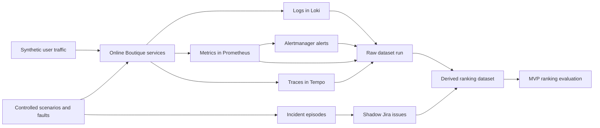

# Jira And Logs Research Lab

This repository builds a research-grade dataset and MVP evaluation pipeline for
a Jira-aware observability product.

The short version:

> We run a realistic microservices application, create controlled incidents,
> collect logs, metrics, traces, and alerts, generate Jira-like incident records,
> then test whether a ranking system can connect the right Jira issue to the
> right telemetry evidence.

The first product goal is not automatic Jira creation. The first MVP only ranks
candidate telemetry episodes for a Jira issue or incident query and explains the
evidence behind that ranking. Human approval and real Jira writing come later.

## Why This Project Exists

Modern engineering teams already collect a huge amount of telemetry:

- logs,
- metrics,
- distributed traces,
- alerts,
- Kubernetes metadata.

They also keep important operational knowledge in Jira:

- incidents,
- bugs,
- reliability tasks,
- affected services,
- priorities,
- investigation comments,
- fixes and resolution notes.

The problem is that these two worlds are usually not connected well. Telemetry
systems tell us what happened in the system. Jira tells us what engineers later
decided was important enough to track. If we can link them, Jira history becomes
useful supervision for ranking alerts, reducing noise, and speeding up triage.

The research question is:

> Can historical Jira-like issue data help us identify which telemetry patterns
> represent real operational problems?

The product question is:

> Can we build an internal/commercial application that ranks likely incident
> candidates and shows evidence in a way an engineering team can trust?

## What We Are Building

This project is building a Jira-aware observability intelligence layer.

For MVP v1, the system should:

1. Read telemetry evidence from a running application.
2. Read Jira-like issue records.
3. Build query-candidate ranking examples.
4. Rank which telemetry episode most likely matches each Jira issue.
5. Report whether the ranker found the correct episode.
6. Show enough evidence to debug why the ranker was right or wrong.

Later phases can add:

- human-approved Jira issue creation,
- suggested Jira fields,
- similar historical issue retrieval,
- engineer feedback buttons,
- production integrations with real Jira Cloud and observability systems.

## Why We Generate Our Own Dataset

The dataset is the hardest part of this project.

Public Jira datasets usually contain issue text and metadata, but they do not
include the exact logs, metrics, traces, and alerts that caused those issues.

Public log or observability datasets often contain telemetry, but they do not
include linked Jira issues written by engineers.

For this reason, we create a controlled lab dataset where both sides exist:

- the telemetry side: logs, metrics, traces, alerts, and Kubernetes state,
- the Jira side: production-shaped shadow Jira issues linked to the telemetry.

This lets us test the product idea before needing private company Jira data.

## Lab Architecture

The lab runs Google's Online Boutique microservices demo on Kubernetes.

There are two Kubernetes namespaces:

| Namespace | Purpose |
| --- | --- |
| `online-boutique-research` | Online Boutique application and load generator |
| `observability` | Prometheus, Alertmanager, Loki, Tempo, Grafana, Alloy, OpenTelemetry Collector |

The application gives us realistic service-to-service behavior. The
observability stack gives us the evidence needed for ranking and research.



## Important Terms

| Term | Meaning |
| --- | --- |
| Dataset run | One full collection pass with a stable `DATASET_RUN_ID`. |
| Scenario | A controlled behavior, such as normal traffic or a product catalog latency fault. |
| Incident episode | One labeled operational episode produced by a scenario. |
| Telemetry window | A time window around an episode, such as pre-fault, active-fault, or recovery. |
| Shadow Jira issue | A Jira-shaped JSON record generated for an incident episode. It is not written to real Jira yet. |
| Ranking example | One Jira issue paired with one candidate episode, labeled relevant or not relevant. |
| Derived dataset | ML-ready CSV/JSONL files built from the raw dataset run. |
| Aggregate evaluation | A combined evaluation across multiple derived runs. |

## Dataset Collection Flow

Dataset collection happens in five steps.

### 1. Start A Dataset Run

A run begins with a manifest under:

```text
data/runs/<DATASET_RUN_ID>/manifest.json
```

The manifest records the run id, Kubernetes namespaces, cluster context,
application metadata, scenario metadata, and timestamps.

### 2. Run Traffic And Scenarios

The current run plan uses these episodes:

- `baseline-normal-traffic`
- `productcatalog-latency-major`
- `cart-redis-degradation-critical`
- `frontend-cpu-nearmiss`
- `baseline-normal-traffic`

The baseline episodes represent normal behavior. The near-miss episode creates
noise that should not become a Jira issue. The product catalog and cart/Redis
faults are incident candidates and generate shadow Jira issues.

Current fault behavior:

| Scenario | What happens | Should create Jira issue? |
| --- | --- | --- |
| `baseline-normal-traffic` | Records normal application traffic | No |
| `productcatalog-latency-major` | Adds latency to `productcatalogservice` | Yes |
| `cart-redis-degradation-critical` | Temporarily scales `redis-cart` down | Yes |
| `frontend-cpu-nearmiss` | Raises load generator pressure | No |

That list describes the original simple workflow in `collect-dataset-run.ps1`.
The current v2 benchmark uses the JSON run plan
`deploy/research-lab/run-plans/dataset-v2-pilot.json`, which expands each run
to 10 episodes and 5 shadow Jira issues.

### 3. Create Telemetry Windows

Each scenario is split into labeled time windows.

Fault scenarios use:

- `pre_fault_baseline`,
- `active_fault`,
- `recovery_window`.

Record-only baseline scenarios use:

- `observation_window`.

Each window is written to:

```text
data/runs/<DATASET_RUN_ID>/telemetry_windows.jsonl
```

### 4. Export Raw Telemetry

The exporter collects evidence from the observability stack:

| Evidence | Source | Output |
| --- | --- | --- |
| Logs | Loki | `raw/loki/*.json` |
| Metrics | Prometheus | `raw/prometheus/*.json` |
| Traces | Tempo | `raw/tempo/*.json` |
| Alerts | Alertmanager and Prometheus `ALERTS` | `alerts.jsonl` |

The raw evidence is kept as the source of truth. Derived features can be rebuilt
later, but the raw run should be treated as immutable after validation.

### 5. Generate Shadow Jira Issues

For episodes where `jira_candidate=true`, the project creates Jira-shaped JSON
records in:

```text
data/runs/<DATASET_RUN_ID>/jira_shadow_issues.jsonl
```

These records include realistic Jira fields such as:

- summary,
- description,
- issue type,
- priority,
- components,
- labels,
- lifecycle history,
- comments/activity,
- linked telemetry windows,
- linked alerts,
- linked traces.

This gives us Jira-like supervision without needing real Jira credentials for
the first MVP.

## Raw Dataset Layout

Each collected run is stored like this:

```text
data/runs/<DATASET_RUN_ID>/
  manifest.json
  episodes.jsonl
  telemetry_windows.jsonl
  alerts.jsonl
  jira_shadow_issues.jsonl
  raw/
    loki/
    prometheus/
    kubernetes/
    tempo/
  summaries/
    run-summary.md
    validation-report.md
    validation-report.json
```

The JSON schemas live under:

```text
schemas/
```

## From Raw Data To Ranking Data

The raw data is useful for audit and reconstruction, but the MVP needs a simpler
ranking table.

The derived builder reads one raw run and creates:

```text
data/derived/<DATASET_RUN_ID>/
  episodes.csv
  windows.csv
  issues.csv
  episode_features.jsonl
  ranking_examples.jsonl
  candidate_scores.csv
  ablation-metrics.csv
  raw-telemetry-failure-analysis.csv
  baseline-ranking-report.json
  baseline-ranking-report.md
  freeze-manifest.json
```

The most important derived file is:

```text
ranking_examples.jsonl
```

It contains every Jira issue paired with every candidate episode from the same
run.

The label is simple:

```text
1 if the candidate episode is the true source episode for the Jira issue
0 otherwise
```

Example idea:

| Jira issue | Candidate episode | Label |
| --- | --- | ---: |
| Product catalog latency Jira issue | Product catalog latency episode | 1 |
| Product catalog latency Jira issue | Baseline traffic episode | 0 |
| Product catalog latency Jira issue | Cart Redis fault episode | 0 |

This is the format the MVP ranker should learn from and evaluate against.

## Ranking Baselines

The project currently exports two deterministic ranking profiles.

### `label_aware_baseline`

This profile is a dataset integrity check. It can use lab-only candidate labels
such as severity, incident type, root-cause category, scenario name, and expected
impact.

If this profile fails, the dataset links are probably broken.

It should not be used for product claims because real production telemetry will
not arrive with all of those labels.

### `raw_telemetry`

This is the production-facing baseline. It avoids lab-only candidate labels and
uses evidence closer to what the product would have:

- Jira issue text,
- service/component overlap,
- raw telemetry evidence text,
- log volume,
- alert volume,
- trace volume,
- active-fault versus pre-fault service deltas,
- restart, outage, latency, and traffic-pressure telemetry-shape signals.
- Kubernetes restart, rollout, readiness, and recovery signals when available.

This is the baseline the MVP should match or beat.

The current raw telemetry feature policy is builder `0.4.0`
(`label_aware_baseline_v0_and_raw_telemetry_v1`). It still avoids candidate
severity, candidate incident type, candidate root-cause category, scenario
title, fault type, and expected-impact labels.

The builder also exports ablation reports and raw telemetry failure analysis so
we can see which signal families are carrying the ranking and why top-1 misses
happen.

## Original MVP Dataset

The original three-run MVP dataset is documented in:

```text
docs/mvp-evaluation-dataset.md
```

It is superseded for current work by Dataset v2 production. Keep it only as
historical context for how the pipeline evolved.

The previous v2 realism history is documented in:

```text
docs/dataset-v2-realism-plan.md
```

It combines these three runs:

| Run id | Episodes | Telemetry windows | Shadow Jira issues | Validation |
| --- | ---: | ---: | ---: | --- |
| `2026-05-14-research-final-001` | 5 | 30 | 2 | 0 errors, 0 warnings |
| `2026-05-14-mvp-eval-002` | 5 | 30 | 2 | 0 errors, 0 warnings |
| `2026-05-14-mvp-eval-003` | 5 | 30 | 2 | 0 errors, 0 warnings |

Aggregate size:

| Item | Count |
| --- | ---: |
| Dataset runs | 3 |
| Episodes | 15 |
| Telemetry windows | 90 |
| Shadow Jira issues | 6 |
| Ranking examples | 30 |
| Positive examples | 6 |
| Negative examples | 24 |

The final aggregate files live under:

```text
data/derived/aggregate/mvp-final-v1/
```

The local moving pointer for MVP work is:

```text
data/derived/aggregate/current/
```

The MVP should start with:

```text
data/derived/aggregate/current/combined-ranking-examples.jsonl
```

## Current Active Dataset v2 Benchmark

Dataset v2 is the current realism benchmark. It uses the executable run plan:

```text
deploy/research-lab/run-plans/dataset-v2-pilot.json
```

The current final v2 production aggregate is:

```text
data/derived/aggregate/dataset-v2-final-production-v1/
```

The moving pointer for MVP work is:

```text
data/derived/aggregate/current/
```

Aggregate size:

| Item | Count |
| --- | ---: |
| Dataset runs | 4 |
| Episodes | 40 |
| Telemetry windows | 312 |
| Shadow Jira issues | 20 |
| Ranking examples | 200 |
| Positive examples | 20 |
| Negative examples | 180 |

Current v2 aggregate metrics:

| Profile | MRR | Recall@1 | Recall@3 | F1@1 | F1@3 | nDCG@3 |
| --- | ---: | ---: | ---: | ---: | ---: | ---: |
| `label_aware_baseline` | 1.0 | 1.0 | 1.0 | 1.0 | 0.5 | 1.0 |
| `raw_telemetry` | 0.975 | 0.95 | 1.0 | 0.95 | 0.5 | 0.981546 |

F1 is computed per Jira query with one relevant episode. A successful top-3
hit contributes `0.5` to F1@3 because Precision@3 is `1/3` and Recall@3 is `1`.

This is final for MVP v1 development. It is not yet a publication-grade final
dataset because it contains only one full-duration production-style run. The
main hard case is `2026-05-15-final-v2-production-001::OBSRV-1004`, where the
raw telemetry baseline ranks `cart-redis-degradation-critical` above the true
`redis-cart-restart-major` episode.

Current v2 run-aware holdout report:

```text
data/derived/holdout/dataset-v2-final-production-v1-holdout/
```

The moving holdout pointer is:

```text
data/derived/holdout/current/
```

The holdout check uses one held-out dataset run per fold. On the current final
v2 dataset, `raw_telemetry` has macro MRR `0.975`, macro Recall@1 `0.95`, macro
Recall@3 `1.0`, macro F1@1 `0.95`, macro F1@3 `0.5`, and macro nDCG@3
`0.981546`.

The next research stage is Dataset v2.1:

```text
docs/dataset-v2.1-realism-plan.md
deploy/research-lab/run-plans/dataset-v2.1-production.json
```

Dataset v2.1 adds Kubernetes events, pod restarts, rollout state, richer
Prometheus service queries, noisy Jira generation, ablation reports, and failure
analysis. It is not yet promoted as the MVP baseline.

The next dataset-first research stage is Dataset v3 production corpus:

```text
docs/production-corpus-dataset-plan.md
deploy/research-lab/corpora/dataset-v3-production-corpus.json
scripts/research-lab/collect-dataset-corpus.ps1
```

Dataset v3 is designed for larger ML, NLP, AI, and agent benchmarks. It expands
the lab to 40 planned production-style runs, 500+ episodes, 260+ shadow Jira
issues, service-diverse outage/restart/latency cases, and harder near misses.
It should be collected in batches and reviewed before it replaces any current
benchmark pointer.

## Original MVP Final Results

Current aggregate metrics:

| Profile | MRR | Recall@1 | Recall@3 | F1@1 | F1@3 | nDCG@3 |
| --- | ---: | ---: | ---: | ---: | ---: | ---: |
| `label_aware_baseline` | 1.0 | 1.0 | 1.0 | 1.0 | 0.5 | 1.0 |
| `raw_telemetry` | 0.777778 | 0.666667 | 1.0 | 0.666667 | 0.5 | 0.833333 |

What this means:

- The dataset links are internally consistent because the label-aware baseline
  finds the correct episode every time.
- The production-facing raw telemetry baseline always finds the correct episode
  in the top 3.
- The raw telemetry baseline misses rank 1 for the product catalog latency issue
  in two of three runs.

That miss is useful. It gives us a real improvement target for the MVP instead
of a dataset that only proves the easy case.

## What We Are Trying To Improve

The immediate product/research target is:

> Improve rank-1 accuracy while preserving top-3 recall.

Specifically, the current raw telemetry ranker overweights broad service overlap
and activity volume in the original MVP benchmark. Dataset v2 exposed harder
misses: traffic pressure sometimes outranked productcatalog latency, and Redis
outage sometimes outranked Redis restart.

The first v2 feature iteration fixed those pilot misses by adding active-window
deltas and telemetry-shape features. The next improvement should not be another
manual weight tweak on the same runs. The next step is to collect the larger
Dataset v3 production corpus, split by run id, and test whether any feature
policy or learned model generalizes across services, fault families, traffic
noise, and noisy Jira text.

Promising improvements after Dataset v3 collection:

- run train/validation/test splits by dataset run id,
- report metrics by fault family and affected service,
- add service-local latency deltas,
- add Prometheus error-rate and restart deltas,
- use trace span latency and root-service features,
- add global hard-negative candidate generation across runs,
- train a simple supervised model over the exported component features,
- later, add retrieval against historical Jira issue text.

## How To Rebuild The Lab

Start from the repository root:

```powershell
Set-Location C:\workplace\JiraAndLogs
```

Check prerequisites:

```powershell
powershell -NoProfile -ExecutionPolicy Bypass -File scripts\research-lab\check-prereqs.ps1
```

Install observability:

```powershell
powershell -NoProfile -ExecutionPolicy Bypass -File scripts\research-lab\install-observability.ps1
```

Deploy Online Boutique:

```powershell
powershell -NoProfile -ExecutionPolicy Bypass -File scripts\research-lab\render-online-boutique.ps1
powershell -NoProfile -ExecutionPolicy Bypass -File scripts\research-lab\apply-online-boutique.ps1
```

Full deployment details are in:

```text
docs/research-lab-deployment.md
```

## How To Collect A Dataset Run

Use the one-command workflow:

```powershell
powershell -NoProfile -ExecutionPolicy Bypass -File scripts\research-lab\collect-dataset-run.ps1 `
  -DatasetRunId "2026-05-14-example-run-001" `
  -Quick `
  -ForceNewRun
```

This command:

1. creates the run scaffold,
2. records baseline traffic,
3. injects controlled faults,
4. exports logs, metrics, traces, and alerts,
5. generates shadow Jira issues,
6. validates the run.

For a script-only smoke test that does not require telemetry export:

```powershell
powershell -NoProfile -ExecutionPolicy Bypass -File scripts\research-lab\collect-dataset-run.ps1 `
  -DatasetRunId "dry-run-001" `
  -RecordOnly `
  -NoTelemetryExport `
  -ScenarioDurationSeconds 1 `
  -PostWindowSeconds 0 `
  -ForceNewRun
```

## How To Collect The Large Dataset v3 Corpus

Use the corpus wrapper when the goal is a large benchmark instead of a single
run:

```powershell
powershell -NoProfile -ExecutionPolicy Bypass -File scripts\research-lab\collect-dataset-corpus.ps1 `
  -DatasetRunPrefix "2026-05-16-dataset-v3-corpus" `
  -MaxRuns 3 `
  -ForceNewRun
```

This runs the first three planned corpus runs, builds derived ranking outputs
for each run, and then builds corpus aggregate and run-aware holdout reports.

Continue in batches:

```powershell
powershell -NoProfile -ExecutionPolicy Bypass -File scripts\research-lab\collect-dataset-corpus.ps1 `
  -DatasetRunPrefix "2026-05-16-dataset-v3-corpus" `
  -StartAt 4 `
  -MaxRuns 4 `
  -ForceNewRun
```

Preview before running:

```powershell
powershell -NoProfile -ExecutionPolicy Bypass -File scripts\research-lab\collect-dataset-corpus.ps1 `
  -DatasetRunPrefix "2026-05-16-dataset-v3-corpus" `
  -MaxRuns 3 `
  -PlanOnly
```

The full runbook is:

```text
docs/production-corpus-dataset-plan.md
```

## How To Build Derived Ranking Data

After a raw run is collected and validated:

```powershell
powershell -NoProfile -ExecutionPolicy Bypass -File scripts\research-lab\build-ranking-dataset.ps1 `
  -DatasetRunId "2026-05-14-example-run-001" `
  -Force
```

This writes:

```text
data/derived/2026-05-14-example-run-001/
```

The `freeze-manifest.json` file in that folder records raw file hashes. Use it
when citing an exact dataset snapshot.

## How To Build A Cross-Run Evaluation

Build the current final MVP aggregate:

```powershell
powershell -NoProfile -ExecutionPolicy Bypass -File scripts\research-lab\build-cross-run-evaluation.ps1 `
  -AggregateId "dataset-v2-final-production-v1" `
  -DatasetRunId "2026-05-15-dataset-v2-pilot-001,2026-05-15-dataset-v2-pilot-002,2026-05-15-dataset-v2-pilot-003,2026-05-15-final-v2-production-001" `
  -Force
```

Update the moving `current` pointer:

```powershell
powershell -NoProfile -ExecutionPolicy Bypass -File scripts\research-lab\build-cross-run-evaluation.ps1 `
  -AggregateId "current" `
  -DatasetRunId "2026-05-15-dataset-v2-pilot-001,2026-05-15-dataset-v2-pilot-002,2026-05-15-dataset-v2-pilot-003,2026-05-15-final-v2-production-001" `
  -Force
```

Build a run-aware holdout evaluation:

```powershell
powershell -NoProfile -ExecutionPolicy Bypass -File scripts\research-lab\build-run-aware-holdout-evaluation.ps1 `
  -EvaluationId "dataset-v2-final-production-v1-holdout" `
  -DatasetRunId "2026-05-15-dataset-v2-pilot-001,2026-05-15-dataset-v2-pilot-002,2026-05-15-dataset-v2-pilot-003,2026-05-15-final-v2-production-001" `
  -Force
```

## Repository Map

| Path | Purpose |
| --- | --- |
| `deploy/research-lab/` | Kubernetes overlays, observability values, and scenario definitions |
| `docs/` | Project runbooks and dataset contracts |
| `schemas/` | JSON schemas for run, episode, window, alert, and Jira records |
| `scripts/research-lab/` | PowerShell and Python workflow scripts |
| `sample-jira-datasets/` | Production-style sample Jira issue shape |
| `microservices-demo-google/` | Local clone of Google's Online Boutique app |
| `data/runs/` | Raw collected dataset runs, ignored by Git |
| `data/derived/` | Derived ranking datasets and aggregate reports, ignored by Git |

## Key Scripts

| Script | Purpose |
| --- | --- |
| `check-prereqs.ps1` | Check Docker, Kubernetes, Helm, and related tools |
| `install-observability.ps1` | Install Prometheus, Loki, Tempo, Grafana, Alloy, and OpenTelemetry Collector |
| `apply-online-boutique.ps1` | Deploy the research overlay for Online Boutique |
| `collect-dataset-run.ps1` | Run the full collection workflow |
| `collect-dataset-plan.ps1` | Run a JSON-defined dataset plan such as Dataset v2 pilot |
| `collect-dataset-corpus.ps1` | Run a multi-plan, resumable production corpus collection |
| `run-scenario.ps1` | Execute one scenario and record telemetry windows |
| `export-telemetry-window.ps1` | Export logs, metrics, traces, and alerts for known windows |
| `generate-shadow-jira-issues.ps1` | Create Jira-shaped records for incident episodes |
| `validate-dataset-run.ps1` | Check raw run completeness and quality |
| `build-ranking-dataset.ps1` | Convert one raw run into ranking-ready derived data |
| `build-cross-run-evaluation.ps1` | Combine derived runs and compute aggregate ranking metrics |
| `build-run-aware-holdout-evaluation.ps1` | Build one-held-out-run-per-fold evaluation reports |

## MVP Acceptance Gates

For the first application test, the MVP should:

- load `combined-ranking-examples.jsonl` without schema errors,
- treat query ids as `<DATASET_RUN_ID>::<JIRA_ISSUE_KEY>`,
- avoid lab-only candidate labels in the production ranking path,
- match or beat the `raw_telemetry` baseline,
- preserve Recall@3 at `1.0`,
- improve original MVP Recall@1 above `0.666667`,
- preserve final v2 raw telemetry Recall@1 at or above `0.95`,
- report held-out v2 results before making a research claim.

## Current Limitations

This is a strong local MVP dataset, but it is not yet a production-scale
benchmark.

Known limitations:

- only four final v2 runs are in the current aggregate,
- all current final runs are same-day local lab runs,
- shadow Jira issues are generated, not created by real engineers,
- only a small set of fault types exists,
- some Online Boutique services have weaker trace coverage,
- the current raw ranker uses simple deterministic scoring, not a trained model.

Before making external research claims, we should add:

- more days of data,
- more traffic profiles,
- more services and fault types,
- deploy-version changes,
- noisier non-incident windows,
- real Jira Cloud replay or integration,
- stronger schema validation,
- trained ranking baselines and ablation studies.

The concrete next step is to collect the first Dataset v3 production corpus
batch, then inspect the batch before scaling to all planned runs:

```powershell
powershell -NoProfile -ExecutionPolicy Bypass -File scripts\research-lab\collect-dataset-corpus.ps1 `
  -DatasetRunPrefix "2026-05-16-dataset-v3-corpus" `
  -MaxRuns 3 `
  -ForceNewRun
```

## Where To Read More

Start here:

- `docs/research-lab-deployment.md`: rebuild the Kubernetes lab.
- `docs/dataset-acquisition-plan.md`: understand how raw runs are collected.
- `docs/jira-shadow-issue-contract.md`: understand generated Jira records.
- `docs/ranking-dataset-baseline.md`: understand derived ranking data.
- `docs/cross-run-evaluation.md`: understand aggregate and run-aware holdout metrics.
- `docs/final-dataset-v2-production.md`: understand the current final MVP dataset.
- `docs/mvp-evaluation-dataset.md`: understand the current final MVP dataset.
- `docs/dataset-v2-realism-plan.md`: understand the next credibility step.
- `docs/dataset-v2.1-realism-plan.md`: understand the current next research step.
- `docs/production-corpus-dataset-plan.md`: understand the large Dataset v3 corpus.
- `docs/instrumentation-gaps-and-next-steps.md`: understand what to improve next.

## Mental Model For New Team Members

Think of this repository as a factory with three layers:

1. Lab layer: run Online Boutique, create realistic incidents, collect telemetry.
2. Dataset layer: convert raw telemetry and shadow Jira records into stable
   ML-ready ranking examples.
3. Product layer: test whether an MVP ranker can find the right incident
   evidence for each Jira issue.

The current application goal is simple: rank correctly and explain why. The
research goal is to prove, with reproducible data and honest baselines, that
Jira-aware telemetry ranking can become better than telemetry-only heuristics.
