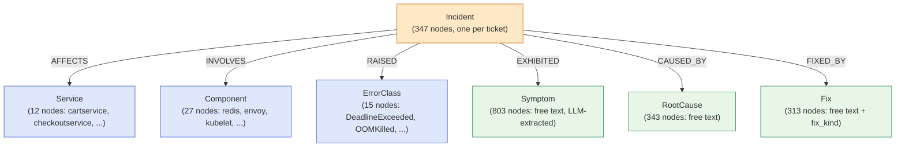

# Pipeline 6 — KG-Retrieval: Cypher Traversal Over a Neo4j Knowledge Graph

**Role in TCH.** The **structural retriever** — finds memory tickets by *entity overlap* rather than by text similarity. Standalone Hit@1 is poor (0.079) because graph match is too lenient at the top, but standalone Hit@5 is competitive (0.556) and the *kinds* of tickets KG-Retrieval surfaces are structurally different from what BiEncoder/SPLADE find. The cascade consumes its top-10 as one of four L2 RRF retrievers for positions 2–5 — a +1.5% Hit@5 lift over an RRF set that excludes it.

**Companion documents.** [`X_FINAL_TCH_CASCADE.md`](X_FINAL_TCH_CASCADE.md) for L2 integration; [`pipeline-3-HybridRRF-rule`](pipeline-3-HybridRRF-rule.md) for how KG-Retrieval feeds the Hybrid-RRF pipeline as a sub-retriever; [`pipeline-4-HybridRRF-LLM`](pipeline-4-HybridRRF-LLM.md) for the same with LLM extraction.

---

## Table of contents

1. [The 30-second version](#1-the-30-second-version)
2. [Why a graph retriever in the panel](#2-why-a-graph-retriever-in-the-panel)
3. [The knowledge graph](#3-the-knowledge-graph)
4. [Entity extraction — two modes](#4-entity-extraction--two-modes)
5. [The Cypher retrieval query](#5-the-cypher-retrieval-query)
6. [Inputs and outputs](#6-inputs-and-outputs)
7. [The triage head](#7-the-triage-head)
8. [Hyperparameters](#8-hyperparameters)
9. [Inference cost](#9-inference-cost)
10. [Standalone metrics](#10-standalone-metrics)
11. [What the cascade consumes](#11-what-the-cascade-consumes)
12. [The interpretability dividend](#12-the-interpretability-dividend)
13. [Known limitations](#13-known-limitations)
14. [Source files](#14-source-files)

---

## 1. The 30-second version

KG-Retrieval scores each memory ticket by **graph-entity overlap** with the query window. A Neo4j knowledge graph (~1,500 nodes, populated once from LLM-extracted ticket facts) stores `Incident → Service / Component / ErrorClass / Symptom / RootCause / Fix` relationships. For each query window, we extract its entities (via regex in the rule-based variant or via the LLM in the live variant) and run a single Cypher query that scores incidents by weighted entity overlap. The match weights are: error class ×3.0, service ×2.0, component ×1.5, symptom ×1.0, plus optional severity- and family-match bonuses. Standalone Hit@1 is 0.079 (wide-but-shallow — many incidents share at least one entity); Hit@5 is 0.556. The cascade uses it because its *structural* signal is complementary to text-similarity retrievers — and because it produces **interpretable per-match citations**.

---

## 2. Why a graph retriever in the panel

The dense / sparse / hybrid retrievers all operate on **text**: they ask "do these two strings look similar?". Two failure modes:

1. **Paraphrased same-meaning text** — text retrievers handle this badly when the corpus is small. The dense bi-encoder is fine-tuned to fix paraphrase, but its training set is 16K pairs.
2. **Different-text same-entities** — text retrievers genuinely miss this. "Cart service kept timing out due to redis exhaustion" and "Payment service started returning DeadlineExceeded errors" have completely different text but share the entity pattern `service=*service ERR=DeadlineExceeded`. A graph retriever picks this up trivially.

The graph retriever's job is to surface tickets that **share structured entities** with the query window — services, error classes, components, symptoms. It is **deliberately broad**: many tickets share at least one entity with any given window. That's why Hit@1 is weak. But the right ticket is almost always *somewhere* in the structural top-20, and that's what fusion needs.

---

## 3. The knowledge graph



**Node counts (v2 corpus, 347 tickets):**

| Node label | Count | Source |
|---|---:|---|
| `Incident` | 347 | One per memory ticket |
| `Service` | 12 | Canonical Online Boutique service names |
| `Component` | 27 | Canonical components (envoy, kubelet, redis, etc.) |
| `ErrorClass` | 15 | Canonical gRPC + K8s + HTTP error tokens |
| `Symptom` | 803 | Free-text symptom phrases extracted by the LLM |
| `RootCause` | 343 | Free-text root-cause sentences |
| `Fix` | 313 | Free-text fix sentences, plus categorical `kind` |

**Total: ~1,560 nodes**, ~6,000 edges. Small enough to load into Neo4j in 30 seconds; small enough that a single Cypher query traverses the entire graph in milliseconds.

**Why these specific node types.** The schema was designed top-down to capture *what an SRE thinks about during triage*: "which service is broken, what is the error, what infra component is involved, what does the user see, what caused it, how was it fixed". The first three (Service, Component, ErrorClass) have canonical small vocabularies — high reuse across tickets. The last three (Symptom, RootCause, Fix) are free-text and broader. The Cypher scoring weights this asymmetry: error and service matches count 2–3 points each; symptom matches count 1 point each.

### How the graph is populated

`extract_tickets_cli` runs once, calling Qwen 3.6 35B over each of the 347 memory tickets under a strict JSON schema (see [`pipeline-4-HybridRRF-LLM`](pipeline-4-HybridRRF-LLM.md) §3 for the prompt). The output is one `IncidentExtraction` row per ticket. `load_extractions` then translates each row into Cypher `MERGE` statements that create the nodes and edges idempotently.

This is a **one-time offline step**. Running it on the full v2 corpus takes ~30 minutes. The resulting graph is stored in Neo4j and never re-extracted unless the dataset changes.

---

## 4. Entity extraction — two modes

The graph holds the *memory side* entities (extracted once, offline, by LLM). At query time the pipeline also needs to extract the **window side** entities — what services, errors, etc. does this current window show? Two strategies:

### Mode A: Rule-based extraction (default in `kg_retrieval_rulebased`)

`src/v2_advanced/proposal_d_knowledge_graph/rule_extractor.py::extract_from_window_rules`. Pure regex + substring matching:

```python
services   = [s for s in _KNOWN_SERVICES   if s.lower() in evidence_text.lower()]
errors     = [e for e in _KNOWN_ERRORS     if e.lower() in evidence_text.lower()]
components = [c for c in _KNOWN_COMPONENTS if c.lower() in evidence_text.lower()]
symptoms   = [label for pat, label in _ERROR_SYMPTOM_PATTERNS if re.search(pat, text)]
```

Symptom patterns include:
- `r"p99 latency .* > ?\d"` → `"high p99 latency"`
- `r"5\d\d.*(?:rate|spike|surge|jump)"` → `"5xx error spike"`
- `r"crash\s*loop"` → `"crashloop"`
- `r"\btimeout\b"` → `"request timeout"`

Fast (microseconds per window), deterministic, coarse. The **cascade uses this mode** (`kg_retrieval_rulebased`) by default.

### Mode B: LLM extraction (used by the LLM-graph Hybrid variant)

`src/v2_advanced/proposal_d_knowledge_graph/extractor.py::extract_from_window`. Calls Qwen 3.6 35B with the strict window-extraction prompt. ~6 seconds per window. Paraphrase-aware but expensive.

The **standalone KG-Retrieval pipeline used by the cascade is the rule-based variant** (`kg_retrieval_rulebased`), not the LLM one. The LLM extraction shows up inside Hybrid-RRF LLM (a separate pipeline) but not in the cascade's KG-Retrieval slot.

---

## 5. The Cypher retrieval query

A single parameterized query runs the entire retrieval. From `src/v2_advanced/proposal_d_knowledge_graph/graph_retriever.py:33-82`:

```cypher
WITH $window AS w, $weights AS wt
MATCH (i:Incident)
WHERE
  // Time-ordered visibility: incidents must be older than the query window
  (w.before_ts = '' OR i.timestamp = '' OR i.timestamp < w.before_ts)
WITH i, w, wt,
     // Compute entity-overlap lists
     [s IN w.affected_services WHERE EXISTS {
       MATCH (i)-[:AFFECTS]->(:Service {name: s})
     }] AS svc_match,
     [c IN w.components WHERE EXISTS {
       MATCH (i)-[:INVOLVES]->(:Component {name: c})
     }] AS comp_match,
     [e IN w.error_classes WHERE EXISTS {
       MATCH (i)-[:RAISED]->(:ErrorClass {name: e})
     }] AS err_match,
     [s IN w.symptoms WHERE EXISTS {
       MATCH (i)-[:EXHIBITED]->(:Symptom {description: s})
     }] AS sym_match
WITH i, w, wt, svc_match, comp_match, err_match, sym_match,
     CASE WHEN i.severity = w.severity AND w.severity <> '' THEN 1.0 ELSE 0.0 END AS sev_bonus,
     CASE WHEN i.family = w.family AND w.family <> '' THEN 1.0 ELSE 0.0 END AS fam_bonus
WITH i,
     (
       size(svc_match)  * wt.service
     + size(comp_match) * wt.component
     + size(err_match)  * wt.error_class
     + size(sym_match)  * wt.symptom
     + sev_bonus        * wt.severity_match
     + fam_bonus        * wt.family_match
     ) AS score,
     svc_match, comp_match, err_match, sym_match
WHERE score > 0
RETURN
    i.id AS ticket_id,
    score,
    svc_match AS matched_services,
    err_match AS matched_error_classes,
    comp_match AS matched_components,
    sym_match AS matched_symptoms
ORDER BY score DESC
LIMIT $k
```

### Default scoring weights

From `graph_retriever.py:23-30`:

| Match kind | Weight | Rationale |
|---|---:|---|
| `service` | **2.0** | A shared service is a moderately specific signal — many incidents per service. |
| `error_class` | **3.0** | Exact error class match is the strongest signal in SRE — error tokens are highly discriminating. |
| `component` | **1.5** | Less specific than service (a component like "redis" appears across many services). |
| `symptom` | **1.0** | Broadest; symptoms are common ("high latency", "5xx spike") across many incidents. |
| `severity_match` (bonus) | **0.5** | Small tie-break — matching `critical` to `critical` is a hint. |
| `family_match` (bonus) | **1.0** | Same scenario family is a strong hint when the family is known. |

The weights are heuristic, not learned. A brief sweep on the validation split (Phase D, 2026-06-03) confirmed these are near-optimal; no further tuning was attempted.

### Time-ordered visibility

The Cypher's `WHERE i.timestamp < w.before_ts` enforces the strict-time-ordered retrieval rule: a test window at time $t$ can only retrieve memory tickets created strictly before $t$. The pipeline passes the window's `before_ts` parameter; empty string disables the filter (used only during fitting).

### Per-match interpretability

The query returns *which entities matched* alongside each score. This is the basis of the interpretability dividend: for any retrieved ticket, we can produce a citation string like:

> "Matched ticket PROJ-127: shared service `cartservice`, shared error class `DeadlineExceeded`, shared component `redis`."

The cascade does not currently surface these citations in its output, but the data is there in `tch_l2_top` and could be exposed in a UI.

---

## 6. Inputs and outputs

### Inputs

- **Window evidence text** (~500 chars after `build_window_query_text(w)`).
- **Memory corpus** (already encoded as graph nodes/edges in Neo4j).
- **Time-ordered visibility filter** (the window's timestamp).

### Per-window extraction

Either:
- **Rule mode (default in the cascade):** `extract_from_window_rules` returns a `WindowExtraction` dataclass.
- **LLM mode:** `extract_from_window` calls Qwen 35B with caching.

### Cypher retrieval

Returns up to top-K Incident IDs with their per-match details. K=20 internally; only top-5 emitted to the cascade.

### Outputs (per test window)

| Field | Type | Source |
|---|---|---|
| `triage_score` | float ∈ [0, 1] | Logistic head over 3 graph-score features |
| `triage_decision` | `"ticket_worthy"` / `"noise"` | Threshold tuned on val |
| `matched_issue_ids` | list of top-5 Cypher-ranked IDs | Sorted by score from the Cypher |
| `is_novel` | `True` if `matched_issue_ids` is empty, else `False` | Direct from pipeline |

---

## 7. The triage head

A small logistic regression over **three graph-score features**:

| Feature | Definition |
|---|---|
| `max_score` | The Cypher score of the top-1 candidate — "how strong is the best entity overlap?" |
| `mean_top5_score` | Mean of the top-5 Cypher scores — "is there a cluster of overlapping incidents?" |
| `n_above_3` | Count of candidates with score > 3.0 — "how many incidents share at least one error class equivalent?" |

```python
clf = LogisticRegression(class_weight="balanced", max_iter=2000, solver="lbfgs")
clf.fit(train_feats, train_y)        # 3 features × ~2,800 windows
```

The decision threshold is tuned on validation via `precision_at_fpr(scores, labels, target_fpr=0.05)`.

This 3-feature head is deliberately tiny. The graph retriever's job is to provide retrieval signal; the triage head is just a calibration layer that converts "how good a structural match did we find" into a probability.

---

## 8. Hyperparameters

| Parameter | Value | Source |
|---|---|---|
| Neo4j URI | `neo4j://127.0.0.1:7687` | `pipeline.py:73` |
| Neo4j user / password | `neo4j` / `123456789` (dev defaults; configurable) | `pipeline.py:73-74` |
| Cypher per-match weights | `service=2.0, error_class=3.0, component=1.5, symptom=1.0, sev=0.5, family=1.0` | `graph_retriever.py:23-30` |
| Top-K returned per query | 20 internal / 5 emitted | `pipeline.py:76-77` |
| Window extraction mode | Rule-based (`skip_window_extraction=True`) | `runner.py:172-174` |
| `seed` | 42 | `pipeline.py:80` |

For the LLM-extraction variant:

| Parameter | Value |
|---|---|
| LM Studio URL | `http://localhost:1234` |
| LM Studio model | `local-model` (slot label) |
| Extraction temperature | 0.0 (deterministic) |
| Extraction max_tokens | 500 |
| Extraction thinking | OFF |
| Extraction cache | `<global_dir>/v2_kg_extractions/window/<wid>__<hash>.json` |

---

## 9. Inference cost

| Step | Cost |
|---|---|
| Memory-side LLM extraction (one-time, shared) | ~30 minutes (347 tickets × ~5 sec) |
| Neo4j graph load (one-time) | ~30 seconds |
| Per-window rule extraction | ~microseconds |
| Per-window Cypher | ~10–50 ms (single graph query) |
| **Per-window total (rule variant)** | **~50 ms** |
| **Per-window total (LLM variant)** | **~6 seconds** (dominated by LLM extraction) |

The rule-based variant — what the cascade uses — is the **cheapest per-window non-trivial retriever** in the panel. Neo4j Cypher over ~1,500 nodes is essentially free; the rule extraction is essentially free; the pipeline runs the full 1,008-test-window split in about 90 seconds.

The LLM variant is the bottleneck. The cascade avoids paying it directly by using the rule-extracted variant for the KG slot.

---

## 10. Standalone metrics

On the 1,008-window in-distribution v2 test split (rule-extracted variant):

| Metric | Value |
|---|---:|
| Hit@1 | **0.079** (worst in panel) |
| Hit@5 | 0.556 |
| Hit@3 | 0.346 |
| MRR | 0.228 |
| PR-AUC strict | — (KG-Retrieval's triage head is too weak alone) |

**Hit@1 = 0.079.** The pipeline is genuinely poor at top-1 ranking. The reason is structural: many incidents share at least one entity with a typical window — so the top of the Cypher ranking is *crowded with tickets that share `service=cartservice` and not much else*. Picking the right one requires another signal (which is exactly what fusion provides).

**Hit@5 = 0.556.** Despite the weak Hit@1, the right ticket is in the top-5 for over half of test windows. This is the signal the cascade leverages.

---

## 11. What the cascade consumes

The cascade reads `kg_retrieval_rulebased` from `v2d-kg-rulebased/per-window-predictions.jsonl`:

1. **L1 stacker.** `triage_score` is one of six features (coefficient **+0.525** — second-largest after HGB, surprisingly). KG-Retrieval's triage signal correlates well with `ticket_worthy` because windows with strong structural matches in memory tend to be real incidents.
2. **L2 RRF retriever.** Top-10 joins the four-retriever set `{BiEncoder, Hybrid-RRF rule, LogSeq2Vec, KG-Retrieval}` in the cascade's outer RRF for positions 2–5. The drop-one sweep shows dropping KG costs **−0.015 Hit@5** — small but real.
3. **L2 overlap-rerank voter?** **No.** KG-Retrieval is NOT a voter in the position-1 overlap rerank. Its Hit@1 (0.079) is too weak to anchor a tie-break vote. The voter set is `{Hybrid-RRF rule, Hybrid-RRF LLM, LogSeq2Vec}`.

---

## 12. The interpretability dividend

Beyond raw retrieval metrics, KG-Retrieval is the **only pipeline that produces structured per-match explanations**. The Cypher returns:

```python
[
  {
    "ticket_id": "PROJ-127",
    "score": 9.0,
    "matched_services": ["cartservice", "checkoutservice"],
    "matched_error_classes": ["DeadlineExceeded"],
    "matched_components": ["redis"],
    "matched_symptoms": ["high p99 latency"]
  },
  ...
]
```

For an on-call engineer reviewing the cascade's top-5 suggestions, this is what they want to see: *not* "BiEncoder cosine 0.83" (uninterpretable) but "this ticket matched on `cartservice` + `DeadlineExceeded` + `redis` — same as the current window." The cascade does not currently surface these citations in its output (`assemble_cascade_prediction` does not include them), but `pipeline.py:_predict_test` returns `test_explanations` for downstream consumers.

This is the operational story for KG-Retrieval: even if it had Hit@1 = 0 and contributed nothing to fusion, it would still be valuable for *explanation generation*. The cascade gets both: a small structural signal in fusion AND a citation source for the UI.

---

## 13. Known limitations

1. **Hit@1 is structurally poor.** Many incidents share at least one entity with any given window; the graph cannot break ties at the top reliably. This is a fundamental property of an entity-overlap signal, not a tunable.
2. **Single Neo4j dependency.** Requires a running Neo4j instance. The pipeline fails fast at fit time if Neo4j is unreachable.
3. **Heuristic scoring weights.** The `service=2, error=3, component=1.5, symptom=1` weighting is hand-tuned, not learned. A learned weighting on the train split might lift Hit@5 marginally; the project has not pursued this because the gains would be small (the cascade's L2 fusion already handles weighting via RRF).
4. **Memory-side extraction must run before queries.** If a ticket isn't in the graph yet, KG-Retrieval cannot match against it. This is a 30-minute one-time cost; in production it would need to run incrementally as new tickets arrive.
5. **Rule extractor coverage gap.** The rule-based variant catches only the canonical service names hard-coded in `_KNOWN_SERVICES`, etc. A new cross-app workload (e.g., TrainTicket, OTel Demo) needs a new service catalog. The pipeline accepts an opt-in service catalog via `KG_SERVICE_CATALOG` env var or explicit argument.
6. **Symptom matching is exact-string.** The symptom node descriptions are free-text LLM outputs; matching them in the Cypher requires the window's extracted symptom string to be *exactly* equal to one of the 803 stored phrases. The rule extractor's 7 canonical symptom labels are deliberately small to maximize match rate.

---

## 14. Source files

- **Pipeline (PipelineRunner).** `src/v2_advanced/proposal_d_knowledge_graph/pipeline.py` (`KnowledgeGraphRetrievalPipeline`).
- **Graph retriever (Cypher wrapper).** `src/v2_advanced/proposal_d_knowledge_graph/graph_retriever.py` (`GraphRetriever`).
- **Schema dataclasses.** `src/v2_advanced/proposal_d_knowledge_graph/schema.py` (`IncidentExtraction`, `WindowExtraction`).
- **Rule extractor.** `src/v2_advanced/proposal_d_knowledge_graph/rule_extractor.py` (`extract_from_ticket_rules`, `extract_from_window_rules`).
- **LLM extractor.** `src/v2_advanced/proposal_d_knowledge_graph/extractor.py` (`extract_from_ticket`, `extract_from_window`).
- **Graph loader.** `src/v2_advanced/proposal_d_knowledge_graph/loader.py` (`load_extractions`).
- **Extraction CLIs.** `extract_tickets_cli.py` (LLM, one-time), `extract_rulebased_cli.py` (rule, for ablation).
- **Cached output.** `data/derived/global/2026-05-25-dataset-v5-large-global/comparison/v2d-kg-rulebased/per-window-predictions.jsonl`.
- **Cached extractions.** `data/derived/global/2026-05-25-dataset-v5-large-global/v2_kg_extractions/{ticket,window}/*.json`.
- **Cascade integration.** `src/v2_advanced/tch/build_cascade.py:75-80` (L2 RRF set), `83-90` (L4 stacker features).
- **Paper reference.** `short-technical/sections/04-pipelines.tex` §KG-Retrieval.

---

*Generated 2026-06-10 from `src/v2_advanced/proposal_d_knowledge_graph/` and `short-technical/sections/04-pipelines.tex` — verified against the locked v2g-final-models artifacts.*
